<!-- Generated by dev-tools/build_teacher_guide.cjs. Edit docs/teacher-guide/guide.json and docs/teacher-guide/chapters/*.md instead. -->

# AlloFlow Teacher Guide

> Practical, classroom-centered guidance for planning, teaching, accessibility, live lessons, and responsible use.
>
> Guide version **2026.08** · Content verified **2026-08-20**

This consolidated Markdown edition is generated for repository browsing, review, and export. The polished searchable edition is in [guide/](guide/index.html), and the canonical chapter sources are in [docs/teacher-guide/chapters/](docs/teacher-guide/chapters/).

## Contents

1. [Start here: prepare your first student-ready resource](#start-here-prepare-your-first-student-ready-resource) · Choose an entry route and prepare a first student-ready resource.
2. [The workspace, part by part](#the-workspace-part-by-part) · The mechanical tour: every region of the screen, the header, finding tools, and the three ways to generate (one resource, full pack, Blueprint Mode).
3. [Settings, help, and finding your way](#settings-help-and-finding-your-way) · Universal Settings versus app settings, the AI connection, interface language, and the three ways to get help: Help Mode, the tour, and the command palette.
4. [Saving, loading, and managing storage](#saving-loading-and-managing-storage) · Where on-device work lives, Save Project and Load Project, exporting, storage presets, on-device speech models, and recovering a lost session.
5. [Quick reference: the one page to keep nearby](#quick-reference-the-one-page-to-keep-nearby) · The printable one-pager: the fifteen-minute flow, the three keys, talking to AlloBot, and where things live.
6. [Prepare a purposeful, differentiated lesson](#prepare-a-purposeful-differentiated-lesson) · Turn source material into a purposeful, differentiated lesson package.
7. [Universal Settings: set it once, not per tool](#universal-settings-set-it-once-not-per-tool) · Set grade level, language, translations, and other shared defaults once for the whole lesson.
8. [Run a live lesson safely and calmly](#run-a-live-lesson-safely-and-calmly) · Prepare, run, differentiate, and close a live lesson safely.
9. [Adventure Mode: a story your lesson can carry](#adventure-mode-a-story-your-lesson-can-carry) · When students see Adventure Mode, lesson-scoped resume, and the assignment switch.
10. [Family mode: AlloFlow for a parent at home](#family-mode-alloflow-for-a-parent-at-home) · What a parent authoring at home can reach, what stays school-only, and how teachers hand off cleanly.
11. [Accessibility and UDL: verify the learner experience](#accessibility-and-udl-verify-the-learner-experience) · Check the real learner experience and remove barriers before sharing.
12. [Review evidence and plan next steps](#review-evidence-and-plan-next-steps) · Interpret classroom evidence carefully and plan useful follow-up.
13. [Classroom workflows](#classroom-workflows) · Use practical recipes for common middle-school teaching needs.
14. [Privacy and responsible AI](#privacy-and-responsible-ai) · Use student data and generated materials with appropriate judgment.
15. [AlloBot: the assistant that talks with you](#allobot-the-assistant-that-talks-with-you) · Talking with the assistant: conversation first, offers before actions, and what the microphone states mean.
16. [Documents and printing: from resource to handout](#documents-and-printing-from-resource-to-handout) · The four export formats, the handout reading tools, annotations that stay put, and printing that always comes out light.
17. [Make a document accessible: the remediation workflow](#make-a-document-accessible-the-remediation-workflow) · Turning an inherited document into an accessible version: what you can upload, the audit, Make Accessible, the human review, the evidence report, the local connector, and the no-egress option.
18. [Troubleshooting](#troubleshooting) · Recover work and diagnose common classroom problems.
19. [Math Fluency: timed practice and CBM probes](#math-fluency-timed-practice-and-cbm-probes) · Where timed math practice and CBM probes live, and the fastest way to open them.
20. [Specialist and product reference](#specialist-and-product-reference) · Find specialist surfaces, keyboard help, and product terminology.
21. [School rollout and coaching](#school-rollout-and-coaching) · Introduce AlloFlow as an instructional routine with shared guardrails and coaching.
22. [For your IT department: the one-page technical brief](#for-your-it-department-the-one-page-technical-brief) · The technical brief: static app, no accounts, on-device data, the three AI backend options, and what to verify.
23. [For school leaders: the Leadership Hub](#for-school-leaders-the-leadership-hub) · The nine Leadership Hub tools: visits and coaching, equity and student-services analytics, meeting documentation, multilingual family communication, and backing the whole suite up.
24. [The STEAM Lab: 142 tools, and how to find the one you need](#the-steam-lab-142-tools-and-how-to-find-the-one-you-need) · The 142-tool STEAM Lab: how to find a tool, how to put one in front of students with its own link, what to expect from any of them, and three ways teachers actually use them.

---

## Start here: prepare your first student-ready resource

AlloFlow is most useful when it helps you remove a specific barrier without changing the learning goal. Begin with one lesson you already teach, one trustworthy source, and one decision about what students need in order to participate. The platform can help create options; the teacher remains responsible for the content, rigor, accessibility, and way it is used.

For a first attempt, use **Guided Mode** and make one strong resource rather than exploring every tool. The process below usually fits into a planning period once you have your source ready.

### Choose the right entry route

The Launch Pad offers several starting points. The wording can vary slightly by deployment or interface language.

The complete-workspace card is labeled **Full AlloFlow** in the Launch Pad. Some interface text and older deployments still call the same route **Full Platform**; **Guided Setup** is another label you may see for the guided route.

*Interface reference captured August 16, 2026 from the public AlloFlow deployment. Labels and available destinations can vary by deployment.*

| Entry route | Use it when | Good first task |
| --- | --- | --- |
| **Guided Mode** | You want a recommended sequence with prompts and checkpoints. | Prepare and deliver one differentiated lesson package. |
| **Full AlloFlow** | You already know the workspace or need to move among several tools. | Revise an existing project or build a custom workflow. |
| **Learning Tools** | You want to open a focused student-facing experience. | Explore a reading, writing, STEM, research, or SEL activity. |
| **Educator Tools** | You need a teacher, specialist, accessibility, reporting, or leadership workflow. | Review evidence, improve a document, or prepare professional materials. |

If the teacher role is protected in your deployment, use the school-provided access method. Do not share a teacher access code with students. You can change routes later, so the first choice is not permanent.

### Before you open AlloFlow

Have these four items ready:

- A clear learning goal written in student-friendly language.
- A short, trustworthy source such as an excerpt, directions, notes, or a teacher-created model.
- The barrier you want to reduce, such as decoding load, unfamiliar vocabulary, language demands, organization, or limited response options.
- A quick way to check whether students met the goal.

Use the same source you would be comfortable projecting or handing to students. Remove names, student IDs, grades, disability information, behavior notes, health information, and other personally identifying details before pasting or uploading anything. See [Privacy and responsible AI](#privacy-and-responsible-ai) before using sensitive material.

### Build it before class, not during it

Everything in the next section belongs in your planning time. By the time the first student sees anything, the resources should already exist, already be reviewed, and already be saved. Plan to open AlloFlow during class only to deliver what is finished.

Three reasons this matters more than it looks:

- **Generation is neither instant nor guaranteed.** Creating a resource calls an AI service that can be slow, rate-limited, or briefly unavailable. That is a minor annoyance during planning and an expensive one at 10:05 with a full class waiting.
- **The review gate needs unhurried judgment.** Checking facts, translations, examples, calculations, and answer keys is the step most easily skipped under time pressure, and it is exactly the step that catches a confident-sounding mistake before students meet it.
- **The live tools assume the content already exists.** A Live Session paces, checks understanding, and routes students through material you built beforehand. It is not a place to author it.

Finished before class starts:

- The source, trimmed and verified.
- Every resource you intend to use, generated and reviewed.
- Any translation, audio, or accessible export a student will need.
- The student route, previewed at least once from the student side.
- A saved project file, and a fallback that still works if the network does not.

Reasonable to do live: choosing which existing pathway a student gets, adjusting pacing, revealing an answer key you already checked, and opening a single tool link. If you find yourself generating new material while class is running, use the fallback instead and rebuild afterwards.

A practical habit: build the lesson at least a day ahead, then reopen it cold the morning of class. Loading your own project the way a student will meet it catches a surprising amount, and it costs two minutes.

### A first lesson in about fifteen minutes

#### 1. Open Guided Mode

From the Launch Pad, choose **Guided Mode**, then select the teacher role if prompted. Guided Mode organizes the work into a focused path that includes **Source Material**, **Assignment Directions & Goals**, **Preview/Package/Deliver**, and **Review/Finish**. Your deployment may offer additional optional steps.

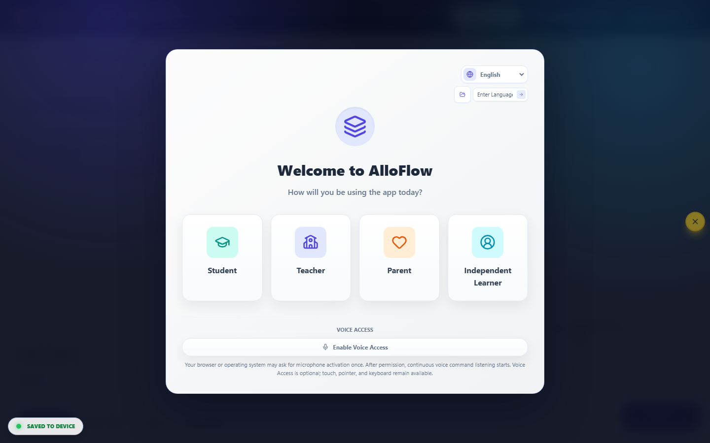

If you lose your place, turn on **Help Mode** from the header or press the question-mark key. Help Mode explains supported controls and may show keyboard shortcuts. Press Escape to close an open dialog before trying another route.

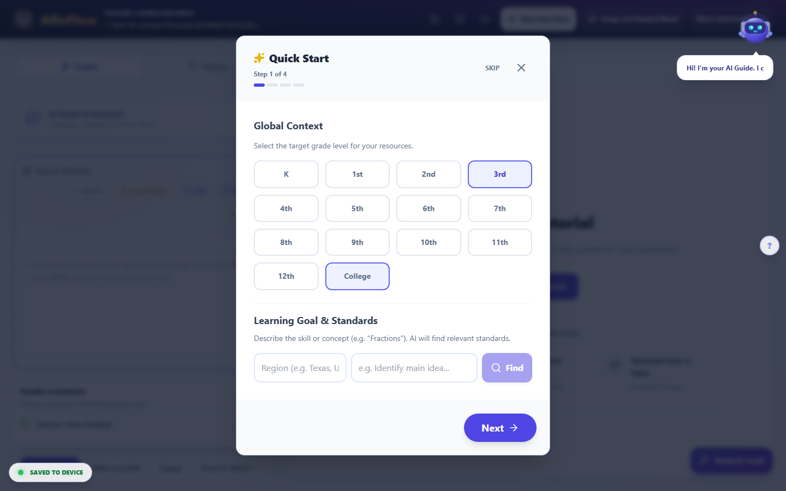

#### 2. Add Source Material

Open **Source Material** and choose the route that fits what you have. Current workspaces may offer options such as opening a reading catalog, writing or pasting text, finding a resource online, generating from a topic, or importing a supported file.

Treat the source as the instructional ground truth for this lesson:

- Include only the portion students need.
- Preserve important headings, labels, examples, equations, and citations.
- Add context that would otherwise be supplied orally.
- Verify information before using it to generate student materials.
- Respect copyright and school rules for licensed content.

If you begin from a topic rather than a source, fact-check the resulting source before creating anything else from it. Generated material can sound confident while still being incomplete or wrong.

#### 3. State the goal and important constraints

In **Assignment Directions & Goals** and the available setup controls, identify:

- What students should know or be able to do.
- The grade band and subject context.
- Language or vocabulary support that is instructionally appropriate.
- The expected depth of thinking, standard, or success criteria when relevant.
- Any format students must use for the final response.

Describe barriers and supports, not diagnoses. For example, write “provide a short glossary and sentence starters” rather than including a student's name or disability label. Keep the intellectual target intact: simplifying access to a text is different from simplifying the idea students must understand.

#### 4. Create one anchor resource

Choose one output that directly serves the learning goal. Useful first choices include an adapted text, glossary, visual organizer, structured directions, short quiz, sentence frames, or another focused support.

Ask:

- Will students use this before, during, or after the core task?
- Does it help them understand the same important idea as their peers?
- Is it short enough to use during real class time?
- What will I learn from the way students respond?

Do not create five versions simply because the platform can. A smaller set of purposeful options is easier for students to navigate and easier for you to verify.

#### 5. Review before you share

Read every student-facing part. Check names, dates, links, calculations, answer choices, examples, translations, cultural references, and reading level. Confirm that the answer key, if present, matches the questions and is not visible in the student version.

Then check the experience:

- Headings and directions are clear.
- Images have useful text alternatives or are marked decorative.
- Color is not the only way information is communicated.
- Keyboard focus moves in a sensible order.
- Read-aloud pronunciation is understandable.
- Language support preserves the intended meaning.
- Interactive controls work at the device size students will use.

Use the accessibility process in [Accessibility and UDL](#accessibility-and-udl-verify-the-learner-experience) for a fuller check.

#### 6. Preview the student route

Preview the actual delivery format whenever possible, not only the teacher workspace. In Guided Mode, continue to **Preview/Package/Deliver**. If you create a homework link, use **Test latest student link** before distributing its QR code or URL. For a live lesson, test the join path on a second browser profile or student device if your school setup allows it.

The preview should answer three questions:

1. Can a student tell what to do first?
2. Can the student reach the content and submit or save the expected work?
3. Is any teacher-only information visible?

If a feature depends on a microphone, audio output, AI provider, cloud service, or school filter, test it on the school network and device type students will use. Availability and persistence differ among hosted, desktop, embedded, and locally configured deployments.

#### 7. Deliver and save

Choose the delivery method that matches the lesson:

- Use a **Live Session** when you need teacher pacing, in-the-moment checks, or targeted routing.
- Use **Create Homework QR** or another assignment link for independent access when that route is configured.
- Use an accessible document or print export when students need a stable handout.
- Use your school's approved learning-management workflow when a supported package or export is available.

Before closing, use **Save Project** to download the project file when that option is available. Store it in an approved location with a useful name such as “ecosystems-food-webs-2026-08-13.” A project file is the safest way to resume in deployments where browser work does not persist after a tab closes. Reopen it through **Load Project** and confirm that the important resources return before relying on it for class.

### The teacher review gate

Do not distribute a generated resource until you can answer yes to each item:

- The learning goal is accurate and visible.
- The source is trustworthy and appropriate to share.
- Student information has been removed.
- Instructions match the task students will actually complete.
- The level of thinking has not been unintentionally reduced.
- Facts, translations, examples, calculations, and answer keys were checked.
- The student route was previewed.
- An accessible alternative exists for any feature a student cannot use.
- You know what evidence you will collect and how you will respond to it.
- The project or final export was saved in an approved location.

Generated content is a draft, even when it looks polished. Teacher approval is an instructional step, not an optional cleanup.

### What students should experience

A strong AlloFlow lesson should feel like one coherent class task with useful choices, not a collection of unrelated apps. Students should know:

- The shared learning goal.
- Which resource or pathway is theirs.
- Whether they may choose another support.
- How to ask for help without disclosing private information.
- What they will create, answer, discuss, or submit.
- What happens when they finish.

Avoid labeling pathways as “low,” “easy,” or “special.” Use neutral names tied to purpose, such as “audio and glossary,” “visual overview,” “practice with examples,” or “extension.” When possible, offer supports to the whole class while privately directing students to the options most likely to help.

### The smallest possible start: one tool, one link

You do not have to begin with a lesson at all. Every interactive STEAM Lab tool has its own direct web address that opens just that tool, with no sign-in for you or your students. Pasting one such link into whatever you already use (your LMS, a slide, a message home) is the lowest-commitment way to try AlloFlow, share it with a colleague, or give a family one good activity. When you are ready for more than one tool, come back to the fifteen-minute lesson above.

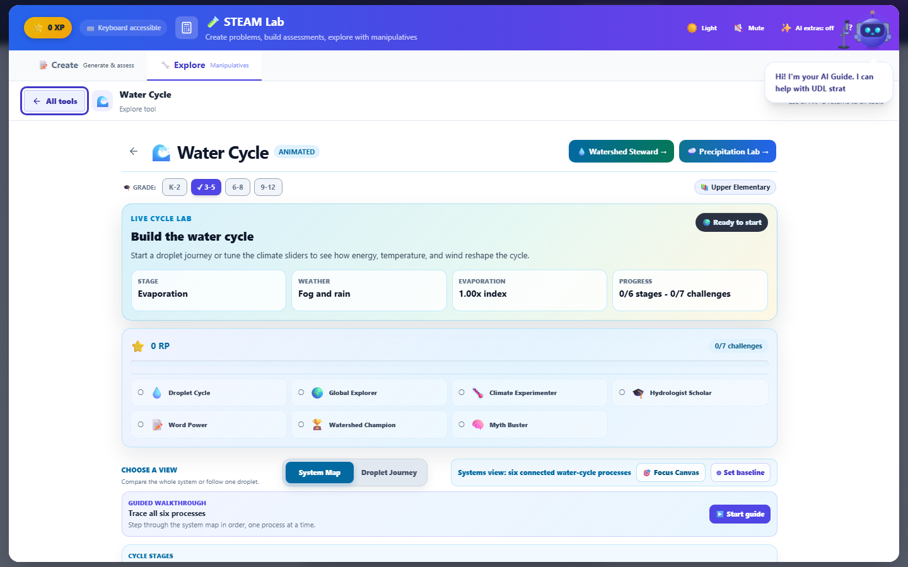

*A direct tool link, captured August 16, 2026. The "AI extras: off" note in the header means no AI backend is set up on that device; the tool itself is fully usable either way. See [Troubleshooting](#troubleshooting).*

### If something does not work

Protect instructional time first. Keep a stable fallback ready: the original source, a downloadable handout, or a simple discussion prompt. If a module is still loading, wait briefly, use its retry control if shown, or return to the previous view. If generation fails, preserve your source and directions before refreshing.

For a systematic recovery sequence, see [Troubleshooting](#troubleshooting). For planning a fuller package, continue to [Prepare a lesson](#prepare-a-purposeful-differentiated-lesson). To teach it synchronously, continue to [Live sessions](#run-a-live-lesson-safely-and-calmly).

---

## The workspace, part by part

This is the mechanical tour. Other chapters explain what to make and why; this one explains where everything is, which control does what, and how the three ways of generating work differ. If you have ever opened AlloFlow and not been sure what you were looking at, start here and read straight through with the app open beside you.

### Getting in: the Launch Pad

The first screen asks how you want to begin. It is not a settings page you have to get right, and nothing here is permanent.

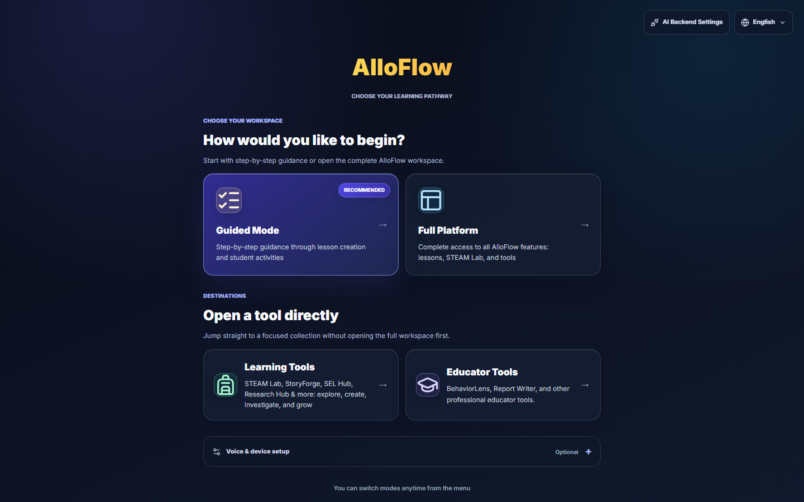

**Choose your workspace** offers two doors into the same product:

- **Guided Mode** walks you through lesson creation one step at a time. It is marked *Recommended* because it is the shortest route to a finished resource on your first day.
- **Full Platform** opens the complete workspace at once: every tool, every setting, nothing hidden. The rest of this chapter describes this view, because it is the one with all the parts in it.

**Open a tool directly** skips the workspace entirely:

- **Learning Tools** goes straight to the STEAM Lab, StoryForge, SEL Hub, Research Hub and the rest.
- **Educator Tools** goes to the professional tools such as BehaviorLens and Report Writer, and to the Leadership Hub.

Two more things live on this screen. **Voice and device setup** is optional and can be left alone. Top right, **AI Backend Settings** is where an AI connection is configured, and the globe control sets the language. The footer says it plainly: you can switch modes any time from the menu, so a wrong first choice costs you nothing.

### The two questions AlloFlow asks first

Choosing Full Platform brings up two short gates. Both are one-time, and the second is skippable.

**Who is using this device?** Student, Teacher, Parent, or Independent Learner. This is what decides whether you see teacher controls at all, so pick Teacher on your own machine.

**Quick Start** then offers four steps of global context, beginning with grade level. Every step has a **SKIP** control, and skipping is a legitimate choice: everything Quick Start sets can be set later in Universal Settings. If you are exploring rather than building, skip it and look around first.

### The screen, in four regions

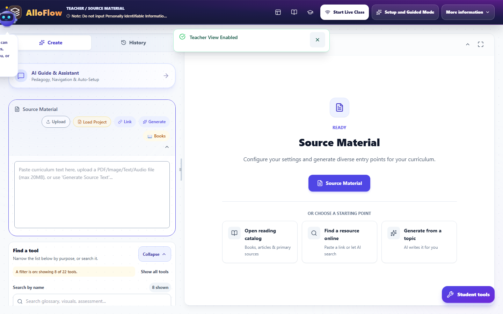

Once you are in, the screen is always the same four regions:

1. **The header strip** across the top: where you are, and the things that apply to the whole session.
2. **The left column**: source material, Universal Settings, the tool finder, and the list of tools. This is where you choose what to make.
3. **The centre**: what you have generated, and the starting points when you have not generated anything yet.
4. **The AlloBot panel** on the right, which opens when you ask for it.

Nothing moves between these regions. When a chapter tells you to "open Universal Settings", it means the left column, every time.

The left column has two tabs at the top, **Create** and **History**. Create is where you work; History is what you have already made this session. And at the bottom right of the screen sits **Student tools**, which is how you look at the same work the way a student would.

### The header, control by control

Left to right:

- **The AlloFlow mark**, and beside it a breadcrumb reading something like **TEACHER / SOURCE MATERIAL**. That is your role and the part of the workspace you are in, which is the fastest way to confirm you are not accidentally in a student view.
- **A standing note not to enter personally identifiable information.** It is deliberately always visible rather than a dialog you dismiss once. Treat it as the rule it is.
- **Icon buttons** for the Documents menu, the reading catalog, Learning Tools, and Educator Tools. These are shortcuts to the same places the Launch Pad offers.
- **Start Live Class** for running a session with students in the room.
- **Setup and Guided Mode** to switch into the step-by-step flow without losing what you have.
- **More information**, which holds the rest. Opening it reveals a second bank of controls: **Text**, **Voice**, **Translate**, **Documents**, **Assessment Center**, **AI**, and the **Tools**, **Learn** and **Bridge** groups. Export, model diagnostics, **Jump to Lesson Plan**, **Copy Link for Students** and the Cloud Sync toggle all live in here. If you cannot find a control anywhere else, open this menu.

**The header has two states, and this catches people out.** What is described above is the collapsed header. Expand it and a second, much larger bank appears: the **App Language** selector, **Text** and **Voice** controls, **Translate**, **Documents**, **Assessment Center**, and the **AI**, **Tools**, **Learn** and **Bridge** groups.

It also carries a row of icon buttons that are easy to overlook and worth learning, because three of them are the fastest routes to help: the **lightbulb** holds messages you may have missed, **?** turns on Help Mode, the **map** starts the guided tour, the **sparkles** reopens setup and Guided Mode, and the **cloud** toggles Cloud Sync. The tour and setup icons appear in teacher mode only.

So if a control is missing from the header, it is almost certainly in the expanded state rather than gone. **Collapse** returns you to the compact strip and reclaims vertical space on a small laptop, and **Maximize View** gives the centre column the whole window.

### Changing the language, and the setting people mix up

There are two different language settings, they do different jobs, and confusing them is the single most common source of "why is this in the wrong language".

**App Language** is in the header. It changes the interface: buttons, menus, labels. Open it and you get a searchable list, your current language, and a **Custom** option if your language is not listed. Changing it may offer to regenerate the content you already have so it matches, and it warns you first, because unsaved changes to the current text can be lost in that regeneration.

**Output and translation languages** live in **Universal Settings**, not the header. These decide what language the resources you generate come out in, and which translations get attached. A glossary panel will tell you directly when none are set, with a line reading that no translation languages are set and pointing you to Universal Settings.

So: header for the language *you* read the app in, Universal Settings for the language *students* receive.

### The left column: settings, then tools

#### Universal Settings

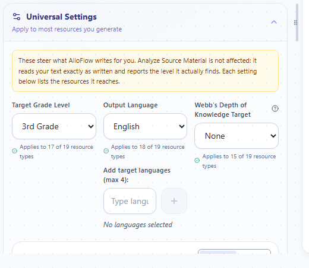

The header line reads **Apply to most resources you generate**, and the collapsed state summarises itself, for example *3rd Grade · English*. That summary is worth glancing at before every generation.

Two ways to fill it in:

- **AI Match** infers settings from your source material and goal.
- **Manual** lets you set each one yourself.

Inside are grade level, output language and translations, whether to use emoji for visual support, a **Differentiation Set** (for instance *Target Level Only*), and a default **Image Style** used by Visuals, Glossary, Timeline and Concept Sort unless a tool sets its own.

The detail that makes this panel trustworthy is the small coverage note under many settings, reading something like *Applies to 12 of 19 resource types*. AlloFlow is telling you exactly how far a setting reaches rather than implying it governs everything.

**These apply to new work only.** Set them before you generate, not after.

#### Find a tool

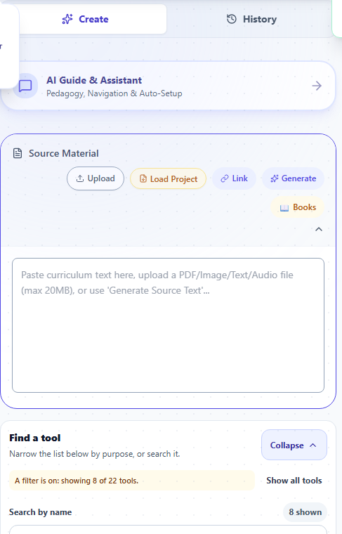

Below the settings is the tool finder, and it has three ways to narrow a long list:

- **Search by name** in the search box, which prompts with examples such as *glossary, visuals, assessment*.
- **Filter by purpose** with the row of buttons: **Recommended**, **Make accessible**, **Engage**, **Assess and deliver**, **All tools**. When a filter is active the panel says so in words, reading something like *A filter is on: showing 8 of 22 tools*, with a count of how many are shown. This matters: if a tool you expected is missing, a filter is the usual reason, and the panel tells you rather than leaving you to guess.
- **Show all tools** clears the filter, and **Expand All** and **Collapse** open or close every tool panel at once.

The list underneath holds the resource tools: Analyze Source Material, Glossary, Text Adaptation, Word Sounds, Visual Organizer, Note-Taking Templates, Anchor Chart, Lesson Images, FAQ Generator, Writing Scaffolds, Activities, Interview Mode, Sequence Builder, Concept Sort, Document Analysis, Assess, Lesson Plan, Assignment Directions, and the entry points to the STEAM Lab and Adventure Mode.

### Starting from a source

The centre column begins at **Source Material**, because most resources are generated *from* something. There are three routes, offered as cards:

- **Open reading catalog** for books, articles and primary sources.
- **Find a resource online** to paste a link or let AI search.
- **Generate from a topic** to have AI write the source text for you.

The same routes exist as a row of buttons on the Source Material card in the left column: **Upload**, **Load Project**, **Link**, **Generate**, and **Books**. Under them is a paste box that accepts curriculum text directly, or a PDF, image, text or audio file up to 20MB.

Once a source is in, **Analyze Source Material** reads it back to you, so you can check the AI understood it before you build eight resources on top of a misreading.

You do not always need a source. Some tools invent their own material. But when a tool warns that a step produced nothing, a missing source is the usual reason.

### Making one resource

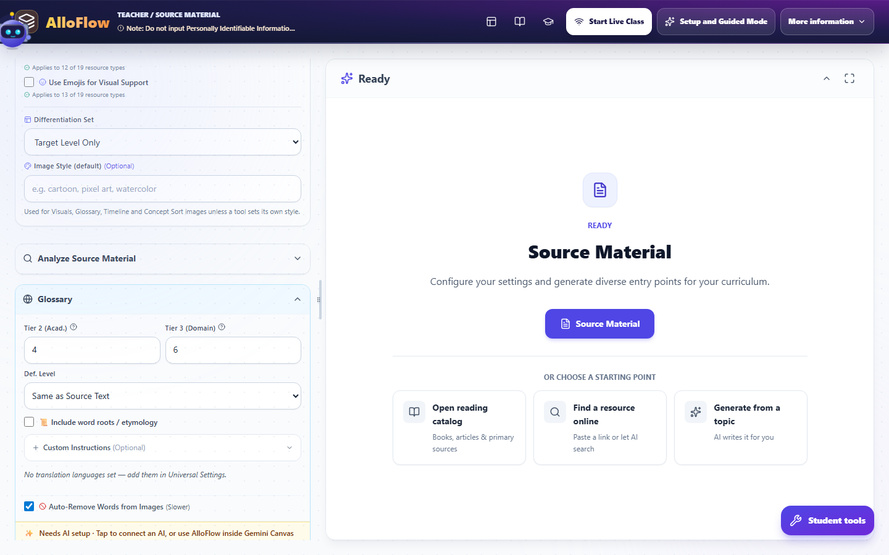

Click a tool in the left column and its panel expands in place. Every tool panel has the same shape:

1. **Options specific to that tool.** The Glossary, for example, asks how many Tier 2 academic and Tier 3 domain words to pull, what reading level the definitions should sit at, and whether to include word roots and etymology.
2. **Custom Instructions (Optional)**, a free-text box for anything the options do not cover.
3. **Per-generation overrides** where offered: Writing Tone, Content Length, Reading Level, and Webb's Depth of Knowledge. These override Universal Settings for this one resource without changing your defaults.
4. **The Generate button**, always named for the tool: *Generate Glossary*.

**Change tool** swaps the open panel without collapsing everything and starting again.

### Making a whole lesson at once: the full pack

The full pack is the "do it all" path. It generates a coordinated set of resources from one source in a single run.

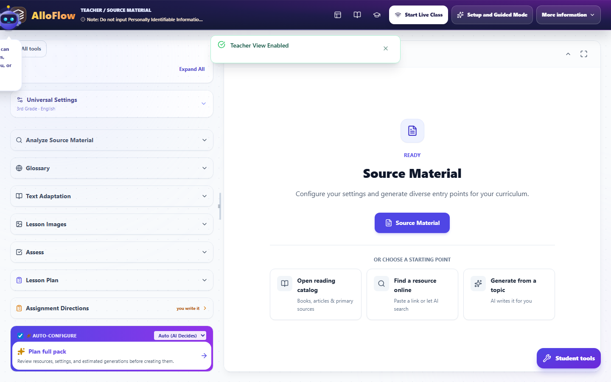

It lives at the very bottom of the tool list, under an **Auto-Configure** card, which is easy to scroll past.

- **The size selector** on that card controls how much gets made. **Auto (AI Decides)** is the default, or choose **Short (5)**, **Standard (8)**, **Deep (12)**, or **All Tools**.
- **Auto-Configure** itself fills in the per-tool settings for you rather than making you set each one.
- **Plan full pack** is the control to press first. It says what it does: review resources, settings, and estimated generations *before* creating them. Read the estimate, because that number is your AI usage for the run.
- **Generate Full Resource Pack** then runs it. The helper text names the shape of what you get: analysis, text, glossary, visuals, quiz and more.

The full pack is the fastest route from one text to a usable lesson set. It is also the easiest way to spend a lot of generations at once, which is exactly why the planner shows the estimate first.

### Blueprint Mode: describe the lesson, approve the plan, then build

This is the most powerful path in the app and the least discoverable, because it lives inside AlloBot rather than on a button of its own.

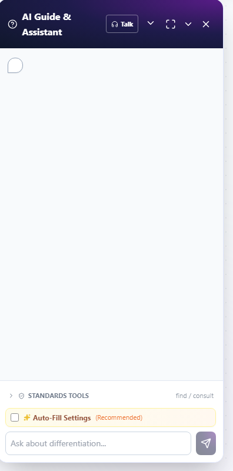

**How to turn it on.** Open **AI Guide and Assistant** from the header to bring up the AlloBot panel on the right. Near the bottom, tick **Auto-Fill Settings**, marked *Recommended*. That toggle is what puts AlloBot into Blueprint Mode. Then describe what you are teaching in ordinary language.

**What happens next.** AlloBot tells you it is analysing context and designing a lesson blueprint, and it says up front that you will be able to review and change the plan before anything is generated. It then presents a **Lesson Blueprint**: an ordered list of the resources it proposes to build.

**Reviewing and changing the plan.** Nothing is generated yet, and this is the point of the whole feature.

- **Type changes in plain language**: "Add a quiz", "Change grade to 5th". AlloBot confirms with *Blueprint updated* and you can keep going.
- **Edit Plan** opens direct editing, with **Add Resource Step** to insert one and **Done Editing** to finish.
- **Reorder** by dragging, or use **Move up** and **Move down**, which exist so reordering does not require a mouse.
- **What does this resource do?** explains any step you do not recognise.
- Ask a question without touching the plan and it answers, leaving the blueprint unchanged.

**Building it.** **Generate Plan** starts the run. A progress line reads *Building, N of M steps finished*. If you need to stop, **Stop after this step** finishes the step in progress and then halts: everything already finished is kept, and the remaining steps show a **Rebuild** control so you can run them one at a time later.

**Two things worth knowing before you start.** If there is no source text yet, AlloFlow warns that some resources may not generate and suggests adding or generating a source first. And previous plans are archived rather than discarded, so an earlier blueprint can be restored, though not while a plan is still generating.

### The command palette and Help Mode

Two shortcuts do more work than anything else in this chapter.

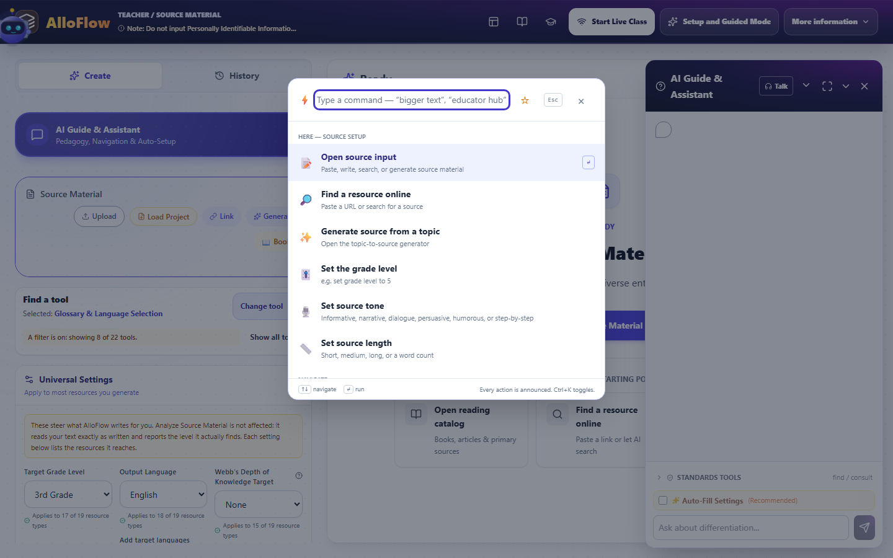

**Ctrl+K** (Cmd+K on a Mac, or Ctrl+Shift+P) opens the command palette. Type what you want in ordinary words and it takes you there. It reports how many commands match, you can star the ones you use constantly, and **Esc** closes it.

**?** turns on **Help Mode**. With it on, click any button, panel or tool and AlloFlow explains that specific element in plain language. This is the fastest way to answer "what is this control" without leaving the screen you are on, and pressing **Esc** turns it back off.

### Saving your work, and getting it out

Work lives on the device, so saving is something you do deliberately.

- **Save Project** writes the whole session to a file. You give it a name and AlloFlow adds the `.json` extension. This is your backup and the way to move a lesson to another machine.
- **Load Project** sits in the Source Material button row and reopens one you saved earlier.
- **Export** offers the output formats, including a finished copy to print or save as PDF, a blank worksheet version, and a teacher copy that includes answer keys and analyses.
- **Copy Link for Students** gives you the student route to what you have built.

If a lesson matters, save the project. Browser data clearing removes on-device work, and the project file is what survives it. [Saving, loading, and managing storage](#saving-loading-and-managing-storage) covers the whole picture, including the recovery key and how to stop AlloFlow running out of room.

### When no AI is connected

You will sometimes see a line on a tool panel reading *Needs AI setup*, offering to connect an AI or to use AlloFlow inside Gemini Canvas. Nothing is broken. AlloFlow separates the things that need a model from the things that do not.

Generation needs AI. Browsing tools, the STEAM Lab simulations, Universal Settings, saving and exporting, and everything you have already generated all keep working without it. If you are evaluating AlloFlow before your district has chosen a model, you can still see most of the product.

For the three ways to connect one, see [Troubleshooting](#troubleshooting); for what leaves the device when you do, see [Privacy and responsible AI](#privacy-and-responsible-ai).

### Where to go next

Now that the screen makes sense, [Prepare a lesson](#prepare-a-purposeful-differentiated-lesson) shows how to use it well, [Universal Settings](#universal-settings-set-it-once-not-per-tool) goes deeper on the settings panel, and [AlloBot](#allobot-the-assistant-that-talks-with-you) covers talking to the assistant beyond Blueprint Mode. Keep [Quick reference](#quick-reference-the-one-page-to-keep-nearby) beside you until the shortcuts are habit.

---

## Settings, help, and finding your way

AlloFlow has more settings than any one teacher needs, which is a problem only if nobody tells you which ones matter. This chapter sorts them into the two kinds that behave differently, then covers the three ways to get help without leaving the screen you are on.

### The two kinds of settings

The distinction that prevents most confusion:

- **Universal Settings** shape *what gets generated*: grade, language, differentiation, image style. They live in the left column and apply to new work only.
- **App settings** shape *the app itself*: interface language, which AI is connected, voice, storage, and who the device thinks you are. They live in the header and the Launch Pad.

If output came out wrong, look at Universal Settings. If the app itself is behaving unexpectedly, look at app settings.

### Universal Settings

Open it from the top of the left column. Collapsed, it summarises itself, for example *3rd Grade · English*, and that one line is worth reading before every generation.

**Two ways to fill it in.** **AI Match** infers the settings from your source material and goal. **Manual** puts you in control of each one. AI Match is a good starting point; Manual is what you want once you know your class.

**What is inside:**

- **Grade level**, which drives vocabulary, sentence length, and complexity everywhere.
- **Output language and translations**, which decide what language students receive. This is *not* the same as the interface language.
- **Use emoji for visual support**, on or off.
- **Differentiation Set**, for example *Target Level Only*, which decides whether you get one version or a range.
- **Image Style**, the lesson-wide default for new Visuals, Glossary, Timeline, Concept Sort and Word Sounds images. Adventure can choose it too.

Visuals, Glossary and Word Sounds start on **Use Universal style**. Choose **Override for this resource** only when one resource genuinely needs a different look; its preset or custom-style field then appears. Timeline and Concept Sort use the Universal style directly, so there is no duplicate style field to reconcile. Adventure keeps its story-specific presets and adds **Use Universal style** when visual continuity matters. Style changes affect new or regenerated images, not images that already exist.

**The coverage notes are the important detail.** Under many settings sits a small line reading something like *Applies to 12 of 19 resource types*. AlloFlow is telling you exactly how far that setting reaches instead of implying it governs everything. When a setting seems not to have worked, check whether the tool you used is inside its coverage.

**They apply to new work only.** Changing grade level does not rewrite what you already made. Set them first, then generate. [Universal Settings](#universal-settings-set-it-once-not-per-tool) goes further on using them well.

### App settings

#### The AI connection

**AI Backend Settings** is on the Launch Pad, top right, and again under **AI** in the header's More information menu, which also holds model diagnostics and a usage meter.

Until an AI is connected, tool panels show a line reading *Needs AI setup*, offering to connect one or to use AlloFlow inside Gemini Canvas. Nothing else is broken by this: browsing, the STEAM Lab, settings, saving and exporting all work. Only generation waits.

The usage meter is worth knowing about before you run a full pack, because a pack is the fastest way to spend a daily quota.

#### Interface language

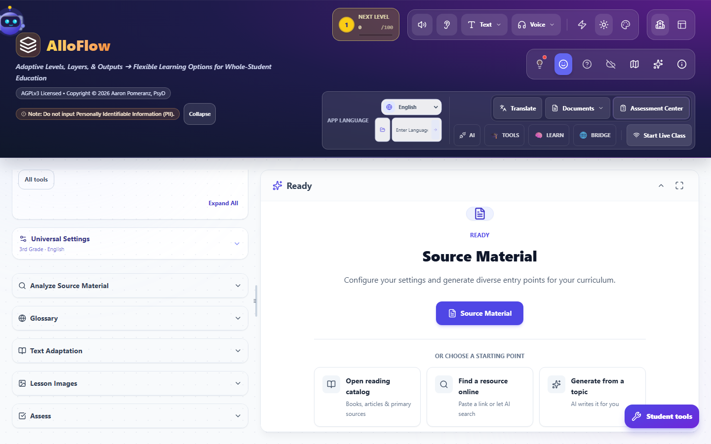

**App Language** changes the buttons, menus and labels. It sits in the expanded header under its own **APP LANGUAGE** label, with a dropdown for the listed languages and an **Enter Language** box beside it for one that is not listed.

Changing it may offer to regenerate the content you already have so it matches, and it warns you first, because unsaved changes to the current text can be lost in that regeneration. Say no if you have unsaved work you care about, then change it again once you have saved.

Remember the pairing: **App Language** for the language you read the interface in, **Universal Settings** for the language students receive. Setting one does not set the other.

#### Voice and device setup

Offered on the Launch Pad as **Voice and device setup**, and marked *Optional* because it is. This is where microphone and voice output get configured for AlloBot's Talk mode and read-aloud.

The models that power it are downloaded once and kept on the device, so speech works without sending audio anywhere. They are also the largest thing AlloFlow stores. [Saving, loading, and managing storage](#saving-loading-and-managing-storage) covers the size and how to reclaim it.

#### Who the device thinks you are

On first run AlloFlow asks whether this is a Student, Teacher, Parent, or Independent Learner. That answer decides whether teacher controls appear at all.

The header breadcrumb always shows the current answer, reading something like **TEACHER / SOURCE MATERIAL**, so a glance confirms you are not accidentally in a student view. **Student tools**, at the bottom right, is the deliberate way to look at your work as a student would.

You can also move between **Guided Mode** and **Full Platform** whenever you like. The Launch Pad says so directly: you can switch modes any time from the menu.

#### Cloud Sync

A toggle in the More information menu. Off by default, which is consistent with the rest of the product: work stays on the device unless you choose otherwise.

#### Storage

How much of the device AlloFlow may use, which models are downloaded, and how to recover a previous session. All of it is in [Saving, loading, and managing storage](#saving-loading-and-managing-storage).

### Three ways to get help without leaving the screen

#### Help Mode: point at anything and ask

**Help Mode** is the one to learn first. Turn it on and click any button, panel or tool, and AlloFlow explains that specific element in plain language. Turn it off and everything returns to normal, dismissing the tooltips and spotlights.

Two ways in:

- Press **?**, which is the fast route and what the onboarding hint points at.
- Or open the command palette and choose **Toggle help mode**, described there as *click anything to learn what it does*.

**Esc** turns it off. This is the fastest possible answer to "what is this control", because it never takes you away from the thing you were doing.

#### The tour: a guided walk through the whole workspace

The tour spotlights each part of the interface in turn, with an explanation of what it is for: the input panel, the accessibility upload, the AI Guide, the tool finder, Universal Settings, source analysis, and then each tool in the list.

**How to start it.** Three routes, and the first is the one to remember:

- **The map icon in the header.** Its tooltip reads *Start Tour*. It appears in the header's icon row alongside the cloud-sync toggle and the setup control. It only shows in teacher mode, which is one more reason to answer Teacher when AlloFlow asks who is using the device.
- **The command palette**: press **Ctrl+K** and choose **Show me around the app**, described there as *a guided tour of the main features*.
- **Ask AlloBot** to show you around, in those words.

One deliberate touch worth knowing: **while the tour is running, every tool is shown**, with your purpose filters set aside, so you see the whole set rather than whatever subset was filtered when you started.

The remediation pipeline has a tour of its own, reached the same way from inside that tool.

#### The command palette: type what you want

**Ctrl+K** (Cmd+K, or Ctrl+Shift+P) opens it. Type in ordinary words and it finds the command.

Three things make it more useful than a search box:

- **It is grouped by intent.** A section for where you are right now, a **Navigate** group for moving between the four workspaces, and a **Create from this content** group for acting on what you have.
- **It is context aware.** Commands that do not apply where you are standing say so, rather than failing quietly when you pick them.
- **You can star the ones you use constantly**, which floats them to the top next time.

**Esc** closes it. Between the palette, Help Mode, and the tour, you should rarely need to hunt through menus.

### A sensible first-day setup

1. Choose **Teacher** when asked who is using the device.
2. Skip Quick Start if you are exploring; you can set everything later.
3. Run **Show me around the app** once, all the way through.
4. Connect an AI in **AI Backend Settings**, or note that generation waits until your district does.
5. Set **Universal Settings**: grade, output language, and translations for your class.
6. Set the storage preset to **Automatic**.
7. Learn two keys: **Ctrl+K** and **?**.

That is the whole configuration surface that matters on day one. Everything else can wait until you meet it.

---

## Saving, loading, and managing storage

AlloFlow keeps your work on the device rather than in an account. That is what makes it usable without sign-in, rostering, or a district contract, and it is also the thing most likely to lose you a lesson if nobody explains it. This chapter explains where your work actually lives, how to save and reload it, and how to keep the device from filling up.

Read [Privacy and responsible AI](#privacy-and-responsible-ai) for why the design is this way. This chapter is the operating manual.

### Where your work lives

Everything you generate is held in the browser's own storage on the machine you are using. Nothing is uploaded, which has three practical consequences worth stating plainly:

- **Your work does not follow you to another device.** A lesson built on the classroom desktop is not on your laptop at home.
- **Clearing browsing data erases it.** "Clear cookies and site data" removes AlloFlow's work along with everything else. On a managed fleet, a device wipe or a profile reset does the same.
- **Nobody else can see it**, including us. There is no server copy to recover from, which is the trade you are making for the privacy.

The fix for all three is the same, and it is the next section.

### Save Project: the file that survives everything

**Save Project** writes your entire session to a single file: the source material, every resource you generated, and the settings that produced them.

- You give it a filename. AlloFlow adds the `.json` extension itself.
- The file lands in your normal downloads location, so it can go to a school drive, a shared folder, or a USB stick like any other file.
- **Load Project** reads it back. The button sits in the Source Material row in the left column, next to Upload, Link and Generate.

This is the one habit worth building. If a lesson took you more than a few minutes to build, save the project. The file is device-independent, survives a browser wipe, and is how you move work between home and school.

> **In Gemini Canvas, this matters even more.** Nothing survives closing the tab except files you have downloaded. The project file *is* your save.

### Getting finished work out

Saving a project preserves your ability to keep working. Exporting produces the thing students or colleagues actually receive. They are different jobs and you usually want both.

The **Export** options include:

- A **finished copy** to print or save as PDF.
- A **worksheet** version, which is the same material with the answers removed.
- A **teacher copy**, which adds answer keys, fact checks, analyses and UDL advice. Its own header tells you to keep it separate from student packets, and that instruction is there because the two look similar once printed.
- **Copy Link for Students**, which hands over the student route rather than a file.

For the full treatment of formats, margins, and what prints well, see [Documents and printing](#documents-and-printing-from-resource-to-handout).

### Storage and recovery

AlloFlow has a **Storage and recovery** panel, and on a device used all year you will eventually want it.

#### Recovery

If the app cannot find your previous session it says so directly, reporting that no restorable workspace was found rather than opening silently empty. You can also choose to **work without device recovery**, which is the right choice on a shared or public machine where you do not want work persisting after you walk away.

Where a recovery key is offered, it is shown **once**. Write it down at the moment it appears, because it cannot be shown again.

#### Storage presets

Because browser storage is finite, AlloFlow lets you choose how much of it to use:

| Preset | What it targets |
| --- | --- |
| **Standard** | About 20 workspaces, 150MB, and 50 offline resources. This is the normal behaviour. |
| **Compact** | About 4 workspaces, 50MB, and 20 offline resources. Older unpinned draft-only work may expire. |
| **Automatic** | Uses Standard normally, and drops to Compact when the device reports storage pressure. |

**Automatic is the sensible default for a school device.** Choose Compact deliberately on a Chromebook that is short of space, and understand what you are agreeing to: unpinned drafts you have not saved as projects can be dropped. Anything you have saved as a project file is unaffected, because that file is outside the browser.

If you ever see a message that a plan could not be archived because storage may be full, this panel is where you go.

#### On-device speech models

Voice features download their models once and then keep them on the device, so speech works without sending audio anywhere.

- **Speech recognition (Whisper)** understands what you say.
- **Natural voice (Kokoro)** reads text aloud in a natural voice.

The panel shows each model's download size, whether it is already on this device, and the total model cache. These are the largest single thing AlloFlow stores, so if you need space back and you do not use voice features, this is the first place to look.

#### Cached remediation work

If you have run a document through the accessibility remediation pipeline, the result is held on the device so you can reopen and review it. The panel offers to open those results directly. See [Make a document accessible](#make-a-document-accessible-the-remediation-workflow) for that workflow.

### A storage routine that prevents the common losses

1. **Save Project whenever a lesson matters**, and name it something you will recognise in a downloads folder six weeks later.
2. **Export the student-facing copy** as soon as it is right, so the deliverable exists independently of the app.
3. **Set the storage preset to Automatic** and forget about it.
4. **Before a device refresh, an OS update, or handing back a loaner**, save your projects. IT will not know your work was in there.
5. **On a shared machine**, use "work without device recovery" and take your project file with you.

### If work has gone missing

Check these in order:

1. **Is it a different device or a different browser profile?** On-device means exactly that, and a different Chrome profile is a different device as far as storage is concerned.
2. **Was browsing data cleared?** By you, by an IT policy, or by a "clean up this device" tool.
3. **Is there a project file?** Load Project is the answer whenever there is one.
4. **Does the storage panel report a restorable workspace?** If it says none was found, there is nothing on this device to recover.

If none of those apply, [Troubleshooting](#troubleshooting) covers the wider recovery sequence. And if the answer turns out to be that no project file was ever saved, that is the habit worth changing rather than a fault to chase.

---

## Quick reference: the one page to keep nearby

Everything on this page is a reminder, not a lesson. If a line raises a question, the linked chapter answers it. Print this one for pilot teachers.

### The fifteen-minute lesson, condensed

1. Open **Source Material** and paste, import, or generate a text ([Prepare a lesson](#prepare-a-purposeful-differentiated-lesson)).
2. Open **Universal Settings** once: grade, language, translations ([Universal Settings](#universal-settings-set-it-once-not-per-tool)).
3. Generate two or three resources; review each before students see it.
4. **Preview, Package, Deliver**, then test the student link yourself.

### Keys worth knowing

| Press | What happens |
| --- | --- |
| **Ctrl+K** (or Cmd+K) | The command palette: type what you want ("open the glossary", "math minute") and it takes you there. Ctrl+Shift+P does the same. |
| **?** | Help Mode on or off: click anything highlighted for a plain-language explanation. |
| **Esc** | Closes the palette, leaves Help Mode, backs out of most dialogs. |

### Talking to AlloBot, condensed

- Just talk. Ordinary speech gets a conversational answer; nothing you say is "wrong."
- Anything that would change the screen is **offered** first; say yes to do it, or keep talking and the offer fades.
- Say **"command"** before a phrase to skip the offer and act immediately.
- "Stop reading" and the read-aloud controls always act instantly.
- The voice indicator names its state in words: Listening, Paused, Thinking, Speaking. A small meter shows your voice being heard. ([AlloBot](#allobot-the-assistant-that-talks-with-you))

### Where things live

| You want | Go to |
| --- | --- |
| Narrow the tool list | **Find a tool** at the top of the sidebar (says in words when a filter is on) |
| A message that vanished | The header **lightbulb → Messages** |
| Your saved work | AI settings → **Open saved work** |
| A finished copy vs a blank copy | Export: **Print / Save as PDF** vs **Worksheet** ([Documents and printing](#documents-and-printing-from-resource-to-handout)) |
| One tool to share with anyone | Its direct link, no sign-in needed ([Start here](#start-here-prepare-your-first-student-ready-resource)) |
| Timed math practice | Math tool → Mode, or Ctrl+K then "math minute" ([Math Fluency](#math-fluency-timed-practice-and-cbm-probes)) |
| Turn Adventure off for an assignment | Project Settings → "Include Adventure in this assignment" ([Adventure Mode](#adventure-mode-a-story-your-lesson-can-carry)) |
| "AI extras: off" in the STEAM Lab | Nothing is broken; click the pill for the three ways to turn AI on ([Troubleshooting](#troubleshooting)) |
| Fix an inherited PDF | The remediation workflow: audit, Make Accessible, review, export with evidence ([Make a document accessible](#make-a-document-accessible-the-remediation-workflow)) |

### The habits that prevent the common problems

- **Review before delivery, every time.** A fluent answer can still be wrong ([Privacy and responsible AI](#privacy-and-responsible-ai)).
- **Set Universal Settings before generating**, not after: they apply to new work only.
- **Test the student link as a student** before class, and again after a meaningful revision.
- **Save Project** when a lesson matters: work lives on this device, and the project file is your backup.

---

## Prepare a purposeful, differentiated lesson

This chapter turns the quick start into a repeatable planning routine. The aim is not to generate the largest collection of resources. It is to build a small, coherent package in which each item has a clear job: establish meaning, remove a barrier, support practice, or reveal learning.

Begin with the learning goal and evidence of success. Then choose AlloFlow tools because they serve that design. If you are preparing your first resource, start with [Start here](#start-here-prepare-your-first-student-ready-resource).

### Plan from the barrier, not the tool

Write the shared target before selecting formats:

> Students will explain how energy moves through a food web and support the explanation with evidence from the source.

Next, identify where access may break down. A barrier is a feature of the task or environment, not a label attached to a student.

| Possible barrier | Planning response | Possible resource |
| --- | --- | --- |
| Dense background text | Clarify structure and foreground essential ideas. | Chunked or adapted text with preserved key concepts |
| Unfamiliar academic vocabulary | Preteach a small set of terms in context. | Glossary, examples, visuals, or word practice |
| Multi-step directions | Make sequence and completion criteria visible. | Numbered directions, checklist, or visual organizer |
| Limited background knowledge | Build a bridge without replacing the core source. | Brief overview, timeline, concept map, or worked example |
| Language demands obscure content knowledge | Support comprehension and expression. | Translation, bilingual glossary, sentence frames, or oral option |
| One response mode excludes participation | Offer another way to demonstrate the same target. | Written, spoken, visual, organized, or interactive response |
| Students are ready for greater complexity | Extend the reasoning rather than add busywork. | Competing evidence, transfer task, debate, or higher-depth prompt |

Do not assume every student needs every support. Too many choices can become a new barrier.

### Build the instructional source

#### Select a trustworthy source

Open **Source Material** in Guided Mode or the full workspace. Use a source you are permitted to share and that you can evaluate. Depending on the deployment, you may be able to paste or write text, import a supported file, open a reading catalog, use a web resource, or generate a starting text from a topic.

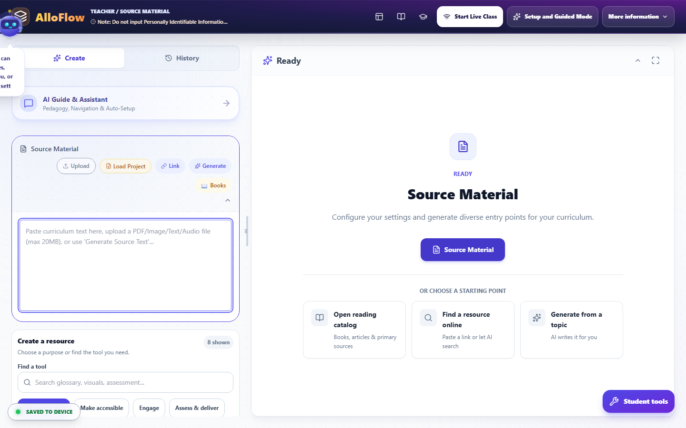

*Interface reference captured August 13, 2026 from the public AlloFlow deployment. Availability and labels vary by deployment.*

Before generation, make the source self-contained:

- Keep the title, author or organization, and publication context when relevant.
- Preserve headings, labels, tables, formulas, units, and citations.
- Include the passage students will actually use, not an entire document when only one section matters.
- Explain unfamiliar references that you would normally clarify aloud.
- Retain important nuance, uncertainty, and competing perspectives.
- Remove teacher notes, answer keys, and student information.

AlloFlow can transform a weak source into polished-looking weak material. Source quality is therefore one of the most important teacher decisions in the workflow.

#### Inspect meaning before changing readability

If an analysis or source-review step is available, use it to notice complexity, vocabulary, organization, possible misconceptions, and missing context. Treat automated analysis as a planning suggestion, not a measurement of a student's ability or a final judgment about the text.

Create a short “must preserve” list before adapting:

- Essential concepts and relationships.
- Domain vocabulary students are expected to learn.
- Evidence students must cite or interpret.
- Productive complexity that belongs to the learning goal.
- Author perspective, tone, or uncertainty that affects meaning.

This list protects rigor. A clarified version may shorten sentences or explain terms, but it should not remove the causal relationship students must reason about.

### Configure the assignment

#### Write directions that survive independent use

In **Assignment Directions & Goals**, write what a student needs when the teacher is not standing beside the screen:

1. State the learning goal.
2. Name the source or resource to use.
3. Tell students what to do in order.
4. Define the expected product.
5. Show the success criteria.
6. Explain how and where to submit, save, or finish.
7. Add an extension or stopping point when appropriate.

Use concrete verbs such as compare, explain, model, revise, justify, or solve. “Complete the activity” does not tell students what thinking matters.

#### Add only useful planning constraints

Most of these live in one place. Set the grade level, output language, translations, standards, interests, and Depth of Knowledge in [Universal Settings](#universal-settings-set-it-once-not-per-tool) before you generate, so every part of the pack agrees. Set subject and response format where the tool offers them. Do not enter a student name or confidential profile to personalize a resource. Describe a support in general terms, such as:

- “Use grade-level science vocabulary with a plain-language definition on first use.”
- “Provide a Spanish-English glossary but keep the final explanation in English.”
- “Add sentence frames for claim, evidence, and reasoning.”
- “Include one worked example and one problem students complete independently.”

Interests can increase relevance, but they should not stereotype students or distort the content. A theme is useful only if it makes the task clearer or more engaging.

### Choose formats by purpose

#### Finding the right tool

The sidebar's **Find a tool** panel narrows the tool list by purpose (Recommended, Make accessible, Engage, Assess and deliver) or by search. It filters what you see; the tool cards below it are what actually create. While a filter is on, the panel says so in words ("A filter is on: showing 8 of 22 tools"), and you can only hide the panel when no filter is active, so tools can never go missing without an explanation on screen.

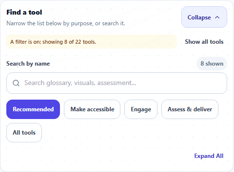

*Interface reference captured August 16, 2026 from the public AlloFlow deployment.*

#### Build a small lesson package

A practical package usually has three to five parts:

1. **Orientation:** learning goal, short overview, or activating question.
2. **Access to meaning:** the source plus a glossary, visual, audio, or clarified version as needed.
3. **Guided practice:** organizer, worked example, sequence, sort, or scaffolded discussion.
4. **Evidence of learning:** quiz, written response, model, explanation, or performance.
5. **Next step:** feedback, revision, extension, or targeted practice.

You do not need a different tool for every part. A well-designed source, clear directions, and one strong response task may be enough.

#### Match common outputs to instructional jobs

| Output | Best use | Teacher check |
| --- | --- | --- |
| Adapted text | Reduce unnecessary language load while preserving the concept. | Compare line by line for omissions, changed claims, and lost evidence. |
| Glossary or word support | Prepare students for a small set of essential terms. | Check definitions in context, pronunciation, translations, and examples. |
| Visual organizer | Show relationships, sequence, categories, or cause and effect. | Confirm reading order, labels, text alternatives, and logical connections. |
| Structured directions | Make a complex task actionable. | Test the steps without relying on verbal explanation. |
| Sentence frames or writing scaffold | Support entry into disciplinary expression. | Make frames optional or gradually removable; do not write the reasoning for students. |
| Quiz or quick check | Reveal current understanding efficiently. | Verify answer keys, distractors, wording, scoring, and alignment to the goal. |
| Concept sort or sequence | Make student thinking visible through classification or order. | Confirm that categories are defensible and ambiguity is intentional. |
| Adventure, game, or simulation | Create repeated practice, exploration, or a meaningful context. | Check that play advances the target rather than hiding it. |
| Audio or read-aloud support | Provide another route into text. | Listen for pronunciation, pacing, language, and missing content. |
| Extension prompt | Increase transfer, argument, design, or synthesis. | Extend cognitive demand instead of adding more of the same work. |

### Generate, inspect, and revise

#### Work one resource at a time

Generate the anchor resource first. Compare it to the source and learning goal before creating dependent items. A quiz made from an inaccurate adaptation will repeat the error; a translation of that quiz will spread it further.

Use a simple review loop:

1. Generate a draft.
2. Read it beside the source.
3. Mark inaccuracies, omissions, confusing language, and accessibility barriers.
4. Revise directly or regenerate with a precise instruction.
5. Preview the result.
6. Save a checkpoint.

Prefer targeted revision requests such as “restore the explanation of evaporation in paragraph three” over “make it better.” Keep the original source available for comparison.

#### Apply the accuracy check for the subject

Every teacher should check facts, attribution, age appropriateness, and alignment. Also use a subject-specific pass:

- **English language arts:** quotations, plot details, author claims, genre, and interpretation presented as fact.
- **Social studies:** dates, names, sourcing, perspective, geographic labels, and oversimplified cause and effect.
- **Science:** units, mechanisms, models, safety procedures, exceptions, and the difference between evidence and explanation.
- **Mathematics:** notation, diagrams, units, assumptions, worked steps, equivalent answers, and distractor logic.
- **Arts and electives:** technique, terminology, attribution, cultural context, equipment safety, and licensing.
- **Health and SEL:** non-stigmatizing language, local policy, crisis boundaries, and whether a classroom activity is appropriate for the topic.

Never rely on a plausible explanation without working through it yourself.

### Differentiate without separating students from the goal

#### Keep a common intellectual center

Students may use different representations or response modes while working toward the same essential understanding. For example:

- Everyone explains a food-web disruption.
- Some students use the original article; others use a clarified version with the same evidence.
- Some plan with a labeled diagram; others use a claim-evidence-reasoning organizer.
- Students may type, record, or present an explanation when each mode can show the target.

If a pathway changes the goal, say so explicitly and base that decision on the student's instructional plan and teacher judgment, not an automated recommendation.

#### Name pathways by function

Use neutral, useful labels:

- “Original source”
- “Source with glossary”
- “Read and listen”
- “Visual planning”
- “Practice with examples”
- “Extension: evaluate another case”

Avoid public labels based on perceived ability. In a live lesson, use private individual or group routing when that better protects student dignity. See [Live sessions](#run-a-live-lesson-safely-and-calmly).

#### Preserve student agency

When appropriate, let students choose a support and switch if it is not helping. Teach them to explain the choice: “I used the visual organizer because I needed to compare two causes.” This makes accessibility a normal learning skill rather than a hidden accommodation.

### Assemble and preview the package

#### Check sequence and cognitive load

Open the resources in the order students will encounter them. Verify:

- The first screen says what to do.
- Links and buttons have meaningful names.
- Required items are distinguishable from optional supports.
- Students are not asked to repeat information unnecessarily.
- Vocabulary and symbols stay consistent across resources.
- The evidence task uses material students were actually given.
- The final screen explains how to finish or submit.

For a 45-minute middle-school lesson, a realistic sequence might be:

- 3 minutes: goal and activating prompt.
- 10 minutes: source with chosen access supports.
- 8 minutes: partner organizer or model.
- 15 minutes: explanation, problem set, or investigation.
- 5 minutes: quick check and revision.
- 4 minutes: save, submit, and preview the next step.

Adjust for your class; the sequence is a planning example, not a built-in timing promise.

#### Test the real delivery format

Continue to **Preview/Package/Deliver** in Guided Mode or use the available preview and export controls in the full workspace.

- For a homework QR or link, choose **Test latest student link** and complete the first steps as a student.
- For a live lesson, join from a second device or browser profile, verify the code, and send one resource.
- For a document, inspect the exported file with keyboard navigation, zoom, and read-aloud or a screen reader when available.
- For print, use print preview and check page breaks, contrast, font size, and whether URLs or instructions still make sense on paper.

Two export formats look alike and are not: **Print / Save as PDF** produces a finished copy to read, while **Worksheet** produces a blank copy to write on, with ruled answer lines, fill-in bubbles, and a Name and Date header. The export screen explains each format under its selector.

If your lesson has both an adapted text and a glossary, the Worksheet format also offers a **fill-in-the-blank version**: glossary terms in the passage become numbered blanks with a word bank, and the teacher copy carries the answer key. It works in any lesson language.

Test again after a meaningful revision. Previewing an earlier version does not verify the final package.

### Save, name, and hand off

Use **Save Project** before leaving the workspace when that option is available, then test **Load Project** with a copy. Keep final exports separate from working files. A simple naming pattern makes team use easier:

- Project: “unit-topic-purpose-date”
- Student resource: “topic-student-action”
- Teacher key: include “teacher” or “key” clearly
- Version: add a date or short revision marker

Store files according to district policy. Do not put student responses or identifying notes in a shared curriculum folder.

For independent delivery, include a short message outside AlloFlow that states the goal, due date, expected product, accessibility contact, and fallback route. For a colleague, include the source, teacher-approved resources, answer key, intended sequence, and any deployment requirements.

### Final preparation checklist

- The source is authoritative enough for the task and legal to use.
- The shared learning goal and success criteria are visible.
- Each generated item has a clear instructional purpose.
- Essential meaning and cognitive demand were preserved.
- Facts, calculations, translations, examples, and keys were checked.
- Pathway labels are neutral and do not expose student needs.
- The actual student route works on a school device and network.
- Audio, microphone, AI, and online dependencies have a fallback.
- Teacher-only material is separate from student-facing material.
- Accessibility was checked in context, not assumed from the format.
- The project and final deliverables were saved in approved locations.
- You know what evidence the lesson will produce and what you will do next.

Continue with [Accessibility and UDL](#accessibility-and-udl-verify-the-learner-experience) for a deeper learner-experience review, [Live sessions](#run-a-live-lesson-safely-and-calmly) for synchronous delivery, or [Review evidence and plan next steps](#review-evidence-and-plan-next-steps) for using classroom evidence responsibly.

---

## Universal Settings: set it once, not per tool

Universal Settings is one card that holds the choices every generator inherits. Set the grade level once and the glossary, the quiz, and the adapted text all target that grade. Set it per tool instead and the parts of one lesson pack quietly disagree with each other.

Open it before you generate anything. That single habit prevents most of the "why does this pack feel mismatched" problems teachers report.

If you have not made a resource yet, start with [Start here](#start-here-prepare-your-first-student-ready-resource). To see how these settings fit a full planning routine, see [Prepare a lesson](#prepare-a-purposeful-differentiated-lesson).

### What the card controls

The panel gathers the settings that would otherwise repeat in every tool.

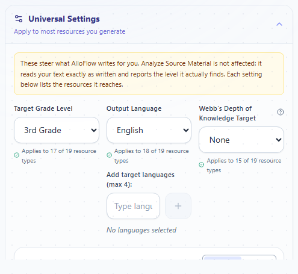

*Interface reference captured August 16, 2026 from the public AlloFlow deployment. The note at the top and the "applies to" lines under each control state exactly which resources a setting reaches.*

| Setting | What it does | Where you notice it |
| --- | --- | --- |
| **Grade level** | Sets the reading and complexity target for new resources. | Sentence length, vocabulary, and question difficulty. |
| **Output language** | Sets the language generated content is written in. | The text students read. |
| **Translations** | Decides whether a second-language version is attached. | A translation block beside the main content. |
| **Standards** | Supplies the standard or framework the content should align to. | Quiz items, objectives, and lesson plans. |
| **Student interests** | Adds a theme or context to examples. | Word problems, scenarios, and prompts. |
| **Depth of Knowledge** | Sets the level of thinking the task should demand. | Question stems and task verbs. |
| **Emoji** | Adds emoji as visual cues in generated material. | Glossary terms, headings, and directions. |
| **Image style** | Sets the lesson-wide visual default for resources that create images. | Visuals, Glossary, Timeline, Concept Sort, Word Sounds, and Adventure when it uses the Universal style. |

Each control tells you how many kinds of resource actually use it. Read that number before you spend time on a setting. Some controls reach almost everything; others reach two or three tools.

You can collapse the card once you are done. The summary line stays visible, so you can check your choices without opening the panel again.

### The rule that surprises teachers

**Universal Settings applies to new work only.**

A resource keeps the settings it was built with. If you generate a glossary at grade 3, then change the grade to grade 7, the glossary you already have is still grade 3. Nothing rewrites itself.

So if a pack looks inconsistent:

1. Check the summary line for the settings in force now.
2. Find the resource that looks wrong.
3. Regenerate that resource, or regenerate the pack, so every part shares one setting.

This is worth checking before you conclude a tool got something wrong. A mismatched pack is usually a settings history problem, not a generation problem.

### Set image style once unless a resource needs an exception

Use **Image style** in Universal Settings to keep one lesson visually coherent. Visuals, Glossary, and Word Sounds begin on **Use Universal style**; their own preset and custom-style controls appear only after you choose **Override for this resource**. Timeline and Concept Sort use the Universal style directly. Adventure keeps story-specific presets, with **Use Universal style** available when continuity matters more than a separate story look.

Choose an override for an instructional reason—for example, a simple line-drawing style for a worksheet that must photocopy clearly—not merely because the same selector is visible. Return the resource to **Use Universal style** when the exception is no longer needed. A change affects new or regenerated images; it does not restyle images that already exist.

### Choose a grade level honestly

The grade level is a target, not a guarantee. Generated text often lands above the grade you asked for, and asking for more research or more detail tends to push it higher still.

Do this before you share:

- Read a paragraph aloud and listen for sentences a student would lose track of.
- Look for words you would have to stop and define.
- Compare the result against something you know sits at the right grade.

If it reads high, ask for a lower grade than you want and check again. Set the grade for the students who need the most access, then offer the original source to students who are ready for it. Lowering the reading load is not the same as lowering the learning goal. See [Prepare a lesson](#prepare-a-purposeful-differentiated-lesson) for how to protect the intellectual target while changing the reading level.

### Set the language and decide about translations

Two separate controls do two different jobs.

**Output language** is the language the resource is written in. If your class works in Spanish, set it to Spanish and the content comes back in Spanish.

**Translations** decides whether a second version rides along with it. It offers three kinds of answer:

- **Automatic** attaches a version in the language you set the app interface to, whenever the content is in a different language. This is the default.
- **None** turns second-language versions off everywhere.
- **A named language** attaches a version in exactly that language.

A hint line under the control always says in plain words what will happen, such as "Resources in Spanish will also include an English version." You do not have to open the list to know where you stand.

The Translations control appears only when it would do something. If your interface and your output language are both English, there is nothing to translate into, so the control stays hidden. It appears as soon as the two differ.

Two cautions:

- A translation is generated text. Check it the way you would check any other generated content, especially for subject vocabulary. A word that is correct in general use can be wrong in a science or mathematics context.
- Ask a proficient speaker to read anything a family will receive. A translation that is merely understandable is not the same as one that is respectful and clear.

### Watch emoji around word activities

Emoji make headings and glossary terms easier to scan for some students. They also carry costs worth knowing about:

- Read-aloud tools may name each emoji out loud, which interrupts the sentence.
- Emoji change how a term looks in letter-based activities such as word scrambles and crosswords.
- Some fonts and older devices cannot display every emoji and show an empty box instead.

Turn emoji on when the visual cue helps and you have previewed the result. Turn them off when the same resource will be printed, read aloud, or used in a spelling or letter puzzle.

### A two-minute preflight

Before you generate the first resource for a lesson:

- Set the grade level for the students who need the most access.
- Set the output language your class will read.
- Check the Translations line and confirm it says what you expect.
- Add a standard only if you will actually use the alignment.
- Add an interest only if it makes the task clearer, not just more decorated.
- Set Depth of Knowledge to the thinking the goal requires.
- Decide about emoji based on how the resource will be used.
- Collapse the card and confirm the summary line matches your intent.

Then generate one resource and read it before making anything else. See [Accessibility and UDL](#accessibility-and-udl-verify-the-learner-experience) for the learner-experience check, and [Troubleshooting](#troubleshooting) if a setting does not seem to take effect.

---

## Run a live lesson safely and calmly

A Live Session lets a teacher pace a lesson, route resources to the class, groups, or individuals, run checks for understanding, and respond to student signals. It works best when the lesson has been prepared and previewed before students join.

Live availability, join URLs, storage, and network behavior depend on the school's deployment. Rehearse on the same network and device types students will use. Always keep a non-live fallback ready.

### Decide whether live delivery fits

Use a Live Session when you need:

- A shared sequence with teacher-controlled transitions.
- In-the-moment checks for understanding.
- Private routing of different supports.
- A way for students to send brief help signals.
- A whole-class activity with immediate facilitation.

Use a homework link, accessible document, learning-management assignment, or other asynchronous route when students need flexible timing, the connection is unreliable, or the work should not depend on everyone being online at once.

#### Choose the pacing mode

The **Live Dashboard** can toggle between two pacing approaches.

| Mode | What it supports | Teacher responsibility |
| --- | --- | --- |
| **Teacher-led** | The class follows the teacher's current resource; useful for modeling, discussion, and coordinated transitions. | Announce each change, watch delivery status, and allow enough time for assistive technology and reading. |
| **Student-paced** | Students work more independently while the teacher monitors and may route targeted resources. | Make sequence and finish criteria explicit; do not assume every student is on the same screen. |

Switch deliberately. A whole-class presentation or follow-up may require Teacher-led mode, while independent work may be less disruptive in Student-paced mode. Tell students before changing the mode so a screen transition does not feel like lost work.

### Prepare before students join

#### Build the resource set

Complete the workflow in [Prepare a lesson](#prepare-a-purposeful-differentiated-lesson). Keep the live resource set small enough to navigate while teaching. A useful sequence is:

1. Opening goal and prompt.
2. Core source or model.
3. One or two optional access supports.
4. Guided practice.
5. Quick check or response.
6. Follow-up, revision, or exit prompt.

Open every student-facing resource once. Remove teacher notes and answer keys. If the workspace marks an item as teacher-only, do not try to send it to students.

#### Import an existing lesson deck

Use **Import lesson deck** in the Source panel to bring in material from another presentation tool. A PowerPoint `.pptx` is the best choice: it opens in Page Designer as editable slides and preserves supported text, pictures, alt text, and layout. A PDF opens in the document pipeline and is better treated as visual source material.

Curipod, Nearpod, Pear Deck, and similar tools do not place their proprietary polls, response data, drawing prompts, or AI-feedback behavior inside an exported PowerPoint or PDF. After importing, review every slide and recreate the intended interactions as AlloFlow activities. For Google Slides or Keynote, export a `.pptx` first when possible.

#### Rehearse the join and delivery path

Before class:

- Start a practice session.
- Join from a student device or a separate browser profile.
- Confirm the approved student URL and session code.
- Send one resource and verify that it opens.
- Test the pacing toggle.
- Test one activity you intend to use.
- Check audio and microphone permissions only for activities that need them.
- End the practice session and reopen the saved project.

If school filters, browser privacy controls, embedded environments, or blocked real-time services interfere, use the approved deployment guidance. Do not ask students to disable device security settings.

#### Plan names and groups

Decide how students will identify themselves. Follow district policy and the purpose of the lesson:

- Use a stable teacher-issued codename when names are not needed.
- Use only the minimum identifying information needed to manage the session.
- Do not encode disability, reading level, behavior, or other sensitive information in a codename or group name.
- Name groups neutrally, such as colors, table numbers, topics, or roles.
- Keep your private roster mapping outside any projected view.

Prepare groups before the activity when possible. Grouping should serve an instructional purpose and can change during the lesson.

#### Prepare the room

Write the fallback task where students can see it. Decide whether the session code may be projected and hide any roster or teacher-only material before sharing your screen. Have headphones available for audio supports when possible, and avoid starting every student's read-aloud at the same time.

### Start the session and admit the class

#### 1. Start from the teacher workspace

Use **Teach live** in the header or delivery workflow. Choose the connection options shown in your deployment. Once a session is active, the **Live Dashboard** becomes available to the teacher.

Open the session-code or projection view and verify that it shows only information students should see. Keep the teacher workspace on a non-projected screen if possible.

#### 2. Have students join

Students open the school's approved AlloFlow student link, choose the student role if prompted, and enter the session code and approved name or codename. The precise sequence can vary by deployment.

Ask students to stop after they reach the waiting or first-resource screen. This creates a clean point for checking the roster before instruction begins.

#### 3. Confirm presence

In the **Live Dashboard**, compare the visible roster with the students who should be present. Look for duplicate or unexpected codenames. A connected indicator or recent check-in is useful operational information, but it does not prove attention or understanding.

If an unknown participant appears, pause before sharing material. Use the session controls available to remove or resolve the entry, and change the session if required by school procedure.

#### 4. Send a low-risk test

Open the first student-facing resource and send or present it. Ask students for a simple confirmation, then inspect delivery status. Resolve a failed or pending device before launching a timed activity.

### Use the Live Dashboard

The center groups the main controls under **Run**, **Guide**, and **Signals**. Labels and available activities may vary with loaded modules and deployment settings.

#### Run

Use **Run** for student interactions and the prepared lesson sequence. Current workspaces may include:

- A live lesson run panel with resources, audiences, presenter cues, and activity snapshots.
- **Check understanding** for a fast continuum such as confused to ready.
- **Word Cloud** for short contributions.
- Open response or feedback activities.
- Moderated live questions and answers when the teacher enables them.
- **Concept Pictionary** or **Sketch Response** for visual explanation.
- Live quizzes or other prepared interactions.

Launch one activity at a time. State the purpose, response expectations, time limit, and what students should do after submitting. Close or conclude an activity before moving to a different response format.

#### Guide

Use **Guide** to manage the flow around the activities. Depending on the current resource and loaded tools, it may provide:

- Presenter cues attached to a lesson step.
- A class timer or focused display.
- The Teacher-led and Student-paced toggle.
- **Groups** and audience management.
- Other session guidance configured for the lesson.

Presenter cues are private teacher reminders, not student directions. Keep anything students must know in the student-facing resource or say it aloud and provide it in another accessible form.

#### Signals

Students can use preset signals to communicate a need without interrupting the whole class. The **Signals** area shows the student's codename and selected phrase. Acknowledge the signal, respond privately when appropriate, and clear it when addressed.

A signal is a request for support, not a diagnosis or behavior score. Teach a brief routine before the lesson:

1. Choose the closest signal.
2. Continue with an available support if possible.
3. Watch for the teacher's response.
4. Use the class's urgent-help procedure when a preset signal is not enough.

Do not leave the signal panel projected, especially when only one student is signaling.

### Route resources without exposing needs

#### Send to the right audience

The live lesson run controls can route a student-facing resource to the whole class, a group, an individual student, or a selected set when those options are available.

Use whole-class delivery for the shared core. Use targeted delivery for a support, catch-up resource, alternate representation, or extension. A targeted route should not publicly announce why a student received it.

Before sending:

- Open the intended resource.
- Confirm it is student-facing.
- Confirm the selected audience.
- State whether it replaces or supplements the current task.
- Send it once, then check delivery rather than repeatedly clicking.

#### Understand delivery status

The center may show whether a learner has a target resource, whether it is loading, pending, open, or failed, and whether the device is connected or quiet. Treat these as troubleshooting signals:

- **No target:** no current assignment is being indicated for that student.
- **Assigned or pending:** the resource was targeted but has not yet been confirmed open.
- **Loading:** the student device is attempting to open it.
- **On it:** the device reports the expected resource.
- **Failed:** the resource did not load and needs a recovery path.

Status does not show whether the student read, understood, or completed the resource. Ask for evidence rather than inferring learning from a green indicator.

Individual and group targets can take precedence over the whole-class resource. If a student appears “stuck” on a different item, check for an individual or group assignment and use the available release control before sending the class resource again.

#### Change pace carefully

In Teacher-led mode, changing the current class resource can move connected student devices and may affect devices that reconnect while it remains current. Give a spoken and visible transition cue first.

In Student-paced mode, a whole-class follow pointer may not behave like a synchronized presentation. Use explicit directions and targeted sends as needed, then verify the result on the student device. If a prepared whole-class follow-up reports that Teacher-led mode is required, switch modes only after warning the class.

### Facilitate live activities

#### Check understanding

Use **Check understanding** for a decision you are prepared to make. Ask one focused question such as “How ready are you to explain the relationship?” Display what each response option means, allow a short wait, and decide in advance what will happen at each pattern of responses.

Do not use confidence as a substitute for knowledge. Pair it with a prompt, example, or subsequent evidence task when accuracy matters.

#### Word Cloud

Use **Word Cloud** for short, non-sensitive contributions: a key term, observation, prediction, or theme. Tell students not to enter names or private stories. Review or moderate responses before displaying them when the interface offers that control. A word's visual prominence represents frequency, not importance or correctness.

#### Open response and feedback

Give a bounded prompt, response length, and success criterion. If the platform can generate feedback, review the selected response and generated feedback before treating it as instructional guidance. Do not submit identifying text or confidential student work to an AI provider.

#### Concept Pictionary and Sketch Response

Use drawing to reveal relationships, models, processes, or vocabulary, not artistic talent. Provide a non-drawing response option when motor, visual, device, or cultural factors make the activity inaccessible. Remind students not to draw identifying or inappropriate content.

#### Live quiz

Verify each item and answer key before class. Start with an untimed practice item if students are new to the interface. A missing or unscored response can reflect connection trouble, not lack of knowledge; check the delivery state before drawing conclusions.

#### Moderated questions and answers

Enable live questions only when you can actively moderate them. Establish norms for relevance and privacy. Review submissions before sharing them with the class, and use the school's normal safety process for a message that indicates urgent risk.

### Read Activity Pulse and other live evidence

**Activity Pulse** and activity snapshots can help you see counts, statuses, or response patterns while teaching. Use them to choose a next move:

- Pause and model again.
- Send a support to a small group.
- Ask students to compare reasoning.
- Release a targeted resource and return to the shared task.
- Save an item for follow-up rather than extending the live lesson.

These indicators are incomplete classroom evidence. They may omit response content, depend on the connection, or represent device events rather than learning. Never turn a live status directly into a grade, diagnosis, disciplinary judgment, or high-stakes placement decision.

### Recover during class

#### A student cannot join

Check the join URL, session code, role, and codename entry. Confirm the teacher session is still active. Have the student reopen the approved link rather than using another student's page. If joining still fails, give the fallback resource and continue the lesson.

#### A resource does not arrive

Confirm the student is connected, the resource is student-facing, and the correct audience was selected. Check for a conflicting individual or group target. Use the center's delivery state or session-health control, then try a targeted resend once. If it still fails, share the fallback format.

#### The class appears out of sync

Pause transitions. State the title of the screen everyone should have. Check the pacing mode and current class resource, then inspect individual or group assignments. Release outdated targets when appropriate. Avoid creating a second session until you understand whether the original is recoverable; two active codes create more confusion.

#### An activity stalls

Close the activity panel if possible and return to the core resource. Capture the instructional question orally, on paper, or in a simple response form. Do not spend the lesson repeatedly reconnecting an optional activity.

#### The connection drops

Keep the tab and session code available while devices reconnect. Do not assume a quiet presence indicator means a student intentionally left. Move to the posted fallback if the connection is not restored quickly enough for the learning goal.

See [Troubleshooting](#troubleshooting) for a fuller diagnostic sequence.

### End the session deliberately

Do not treat closing a tab as the same as ending a class session. Use the session's **End Session** control. If an end-session preview is shown, review what will close, what evidence or follow-up is available, and whether any student is still active before confirming.

After ending:

1. Confirm students have saved or submitted the expected work.
2. Record only the evidence you need in the approved system.
3. Note connection failures or missing evidence separately from academic performance.
4. Save the teacher project with **Save Project** when available.
5. Export or retain a session summary only if district policy permits it.
6. Remove projected codes, rosters, and response views.
7. Plan the next instructional move while the lesson context is fresh.

The end-session summary is a starting point for teacher reflection, not a complete record of learning. Continue with [Review evidence and plan next steps](#review-evidence-and-plan-next-steps).

### Live lesson checklist

Before students join:

- The student route, first resource, and one activity were rehearsed.
- Resource names and audience assignments are clear.
- The join method and codename routine follow school policy.
- The projected view contains no private teacher or roster information.
- A no-network fallback is ready.

While teaching:

- Students know the goal, pacing mode, and next action.
- Delivery status is used for troubleshooting, not judging effort.
- Targeted supports are routed privately.
- Signals are acknowledged and cleared.
- Activities have a purpose, time boundary, and accessible alternative.

Before ending:

- Student work is saved or submitted.
- Missing evidence is separated from wrong answers.
- The session is ended through the interface.
- The project and appropriate follow-up notes are saved.
- No session code, roster, or student response remains projected.

For a detailed learner-experience check before the next session, see [Accessibility and UDL](#accessibility-and-udl-verify-the-learner-experience). For privacy boundaries, see [Privacy and responsible AI](#privacy-and-responsible-ai). If your lesson includes a story mode, [Adventure Mode](#adventure-mode-a-story-your-lesson-can-carry) covers when students see it and how resume stays scoped to this lesson.

---

## Adventure Mode: a story your lesson can carry

Adventure Mode turns a lesson into a short interactive story. Students make choices, answer questions drawn from your source material, and earn XP as they go. It is optional, and as of the August 2026 update it only appears when you want it to.

If you have not built a lesson yet, start with [Prepare a lesson](#prepare-a-purposeful-differentiated-lesson).

### When students see it

Two things must both be true before the Adventure panel appears for students:

| Condition | Where you control it |
| --- | --- |
| **You left Adventure on for this assignment.** | Project Settings has an "Include Adventure in this assignment" switch. Turn it off and the panel disappears from the student view entirely. |
| **There is a lesson to build a story from.** | Adventure needs source material or an analysis to work with. An empty workspace does not advertise it. |

The switch defaults to on, so lessons you shared before this update behave exactly as they did.

### Resume is tied to the lesson now

A student's saved adventure belongs to the lesson it was made from. If they open a different lesson, they are not offered "Resume Adventure" from last week's story, and choosing an old save from a different lesson politely refuses rather than pulling them out of today's work. This closes a real classroom problem: students quietly resuming a past adventure instead of attending to the current lesson.

One honest note: adventures saved before this update carry no lesson tag, so the very first resume after the update may still offer an older story. Every save made from now on is tagged.

### Language

Adventure has its own language control with three settings: the lesson language only, the lesson language with a translation, or a multilingual mix. When a translation is included, the second language now follows your Universal Settings translation choice instead of always being English. See [Universal Settings](#universal-settings-set-it-once-not-per-tool) for how that control works.

### Practical guidance

- **Graded work:** turn the assignment switch off. Adventure is practice and engagement, not assessment.
- **XP worries:** XP earned in an adventure spends in the same place as all other XP. Removing the adventure does not take away anything a student already earned.
- **Teachers in family mode** see the Adventure panel pre-expanded in the sidebar rather than the student presentation.

---

## Family mode: AlloFlow for a parent at home

Family mode is the parent-facing way to use AlloFlow: a parent or caregiver authoring support for their own child. It was reviewed and tightened in the August 2026 update, so what a parent can reach is now a decision, not an accident.

If you are a teacher sending work home instead, see [Prepare a lesson](#prepare-a-purposeful-differentiated-lesson); this chapter is about a family running AlloFlow themselves.

### What a parent gets

Family mode is the authoring experience, with home-appropriate language. A parent can build adapted texts, glossaries, quizzes, visuals, and activities for their child, use the STEAM Lab and Learning Hub tools, and manage everything saved on their own device. Several tools introduce themselves in family terms: the glossary presents as a word helper, the lesson plan as a family guide, and the alignment tools in plain language.

Two things are deliberately kept:

- **Class Analytics stays available.** A home-schooling parent tracking their own child's progress is the point of the panel. What changed in August 2026: inside it, a parent sees the practice and progress side only. Class roster import and the research-study suite are school surfaces and no longer render in family mode.
- **The Adventure panel appears pre-expanded** in the sidebar, since a family lesson often centers on it.

### What a parent cannot do

These are school-role surfaces, closed to family mode by design:

- starting a live class session (all entry points, including the one inside Guided Mode);
- class rosters, QTI and LMS exports, and the LMS integration section;
- Family Bridge sending and class-session tooling;
- the password-gated Educator Tools remain gated as everywhere else.

### Practical guidance

- **Everything lives on the family's own device.** There is no account, so there is also no recovery from another machine; families who invest real time should use Save Project and keep the file somewhere safe.
- **AI setup is the family's choice**: their own free Gemini key, running AlloFlow inside Gemini Canvas, or a local model. The setup screen walks through all three. See [Troubleshooting](#troubleshooting).
- **Teachers coordinating with families:** the cleanest handoff is still a delivered assignment or a single-tool link, not asking a family to reproduce your setup. Family mode shines when the family is driving.

---

## Accessibility and UDL: verify the learner experience

Universal Design for Learning is a planning approach, not a button or a collection of “special” versions. Start with a meaningful shared goal, anticipate barriers in the task and environment, and provide useful ways to engage with information and demonstrate learning. Then test what students will actually experience.

AlloFlow can help create accessible options, but it does not certify that a lesson, document, website, or activity meets a student's needs or a legal standard. Generated text, translations, images, audio, captions, interaction patterns, and exports require teacher review and, when appropriate, specialist testing.

### Use the UDL design cycle

#### Begin with the goal

Separate the learning target from the method used to reach it.

- If the goal is to analyze an author's argument, listening to the source may be an appropriate way to access it.
- If the goal is to read grade-level text aloud with accuracy, replacing the reading with audio would change what is being assessed.
- If the goal is to explain a scientific relationship, a labeled model, oral explanation, or written response may all work if each can show the required reasoning.

Write what must remain constant and what can vary. This prevents a support from accidentally removing the skill students are meant to practice.

#### Anticipate barriers

Ask where the lesson depends unnecessarily on one kind of perception, language, movement, memory, timing, or social participation.

| UDL dimension | Planning question | Examples of flexible support |
| --- | --- | --- |
| **Engagement** | How can students understand the purpose, enter the task, sustain effort, and ask for help? | Relevant choice, clear goal, predictable sequence, timer, progress cue, partner or independent route |
| **Representation** | How can students perceive and make meaning from the essential information? | Read-aloud, glossary, translation, visual model, captions, transcript, clarified layout, worked example |
| **Action and expression** | How can students navigate, practice, organize, and show the target? | Keyboard access, speech or typing, drawing with a text alternative, organizer, sentence frame, oral or written response |

Choice is not automatically accessible. Every offered option must work, and students need enough information to choose without becoming overwhelmed.

#### Observe and revise

After the lesson, ask which supports students selected, where they stopped, what still required teacher rescue, and whether each response mode revealed the intended learning. Use that evidence to improve the next version. Do not infer a disability, preference, or permanent “learning style” from one interaction.

### Design a clear default path

An accessible lesson should work before a student opens optional tools.

#### Make the first action obvious

The opening screen or page should state:

1. The learning goal.
2. What to open or read first.
3. What students will do with the information.
4. What successful work includes.
5. How to finish, submit, or get help.

Keep required content in the main reading and interaction order. Do not hide essential directions only in a tooltip, image, teacher speech, color cue, or optional audio.

#### Reduce navigation burden

Use a short sequence with consistent names. Mark optional supports by purpose, such as **Listen**, **Vocabulary**, **Visual overview**, or **Planning organizer**. Avoid sending students back and forth among many tools for one simple task.

When a lesson has several resources, include a checklist or numbered route. If students work asynchronously, add an explicit stopping point and a way to resume.

#### Keep language direct

Prefer short, concrete directions while preserving disciplinary vocabulary students need to learn. Define new terms in context. Break long procedures into steps and pair icons with text labels rather than relying on icons alone.

Plain language is not the same as lowered expectations. Students can reason about complex ideas through clear instructions.

### Use built-in access supports purposefully

The exact supports and labels available depend on the current view, loaded modules, browser, and deployment. Turn on **Help Mode** or press the question-mark key to inspect supported controls. Do not promise a feature to students until you test it in the delivered resource.

#### Text and display

**Text Settings** can provide controls such as text size, spacing, font, reading theme, or color support. Some views or exports may also offer light, dark, sepia, warm, cool, or high-contrast themes, a reading ruler, line focus, or reduced-animation options.

Use these controls to increase perceptibility, but remember:

- Large text must reflow without hiding controls or forcing two-direction scrolling.
- High contrast must preserve meaning, focus indicators, borders, and disabled states.
- A dyslexia-friendly or hyperlegible font may help some students and distract others.
- Reduced motion should remove nonessential animation without removing information.
- Color choices must work for students who do not perceive color in the same way.

Never encode “correct,” “group,” “urgent,” or “selected” through color alone. Add a label, symbol, pattern, or position that carries the same meaning.

#### Read-aloud and reading supports

Depending on the view, read-aloud may appear as **Read This Page**, **Read Aloud**, or an Immersive Reader-style experience. **Voice Settings** may allow voice, speed, and volume changes. Some resources may also offer highlighting, focus reading, a reading ruler, word or picture support, syllable cues, or other reading tools.

Before assigning:

- Listen to names, symbols, abbreviations, equations, and subject vocabulary.
- Confirm that reading follows a logical order.
- Check whether headings, lists, tables, and answer choices are announced clearly.
- Make sure play, pause, next, previous, stop, and close are reachable without a mouse.
- Provide the text itself; audio should not be the only route to important information.
- Tell students whether headphones are available and what to do if audio fails.

Synthetic speech can mispronounce words or flatten important expression. For fluency, poetry, world languages, music, or content where pronunciation is part of the goal, provide a teacher-reviewed model.

#### Visuals and organizers

Visual supports, concept maps, sequences, timelines, diagrams, and organizers can make relationships visible. They can also create barriers when labels are tiny, reading order is unclear, or the same idea is available only in the image.

For each meaningful visual:

- Write a concise text alternative that communicates its instructional purpose.
- Label important parts directly when possible.
- Use sufficient contrast and readable text size.
- Avoid dense decorative backgrounds.
- Provide the same essential relationship in text or a structured table.
- Check that zoom does not make labels overlap or disappear.

Mark purely decorative images as decorative in formats that support that distinction. Do not ask AI to invent a scientific, mathematical, historical, or safety-critical diagram without checking every element.

#### Vocabulary, language, and translation

A glossary, contextual definition, bilingual support, or translation can open access to the core idea. Review translations for subject meaning, tone, regional usage, names, and false cognates. Preserve key disciplinary terms when students are expected to learn them, and pair them with an explanation rather than replacing them everywhere.

Do not use home language as a public group label. Ask students and families about useful language supports through approved school practices, and treat language proficiency as developing, not as a measure of intelligence.

#### Annotation and organization

When available, the Annotation Suite may support highlights, notes, stickers, or voice notes on a resource. Use annotation for a defined cognitive job:

- Mark evidence for a claim.
- Label a confusing point.
- Add a question.
- Identify a pattern.
- Record a brief reflection.

Teach one annotation convention at a time. Too many colors or stickers can increase visual and executive-function load. Confirm that an annotation can be created, found, edited, removed, and saved with keyboard or alternative input. Provide a text-based alternative when drag-and-drop or freehand placement is not usable.

#### Voice, microphone, and alternative input

Voice Access, dictation, audio responses, and microphone-based activities can support students who prefer or require speech input. AAC or symbol-supported options may be available in some learning tools.

Before using them:

- Request only the permissions the activity needs.
- Test in the actual browser and school device.
- Explain when recording starts and stops.
- Provide a typing, selection, partner-assisted, switch, or paper route.
- Consider speech differences, background noise, privacy, and students who do not speak.
- Verify what is saved, transmitted, or shared in that deployment.

Speech recognition errors are access failures, not student errors. Do not lower a grade because recognition software misheard an answer.

### Create accessible student materials

#### Structure text and documents

Whether the final format is a webpage, shared link, word-processing file, PDF, or printout:

- Use one descriptive title.
- Organize sections with real headings in a logical hierarchy.
- Use list formatting for lists rather than typed dashes or manual numbering.
- Write descriptive link text that makes sense out of context.
- Identify document language and language changes when the format permits.
- Keep paragraphs reasonably short and left aligned for extended reading.
- Use real columns and tables rather than spaces or repeated tabs.
- Put directions before the control, blank, or response area they describe.

A document that looks organized can still be structurally inaccessible. Visual inspection is only one part of review.

#### What the exported handout already carries

The HTML handout ships with its own accessibility toolbar, so many supports travel with the document instead of depending on the student's device: adjustable text size that reflows rather than clipping, offline dyslexia-friendly and high-legibility font options, reading themes, and annotations that stay anchored to the content through those changes. Printing always comes out black on white, whatever screen theme the teacher works in. Details and the font options table are in [Documents and printing](#documents-and-printing-from-resource-to-handout).

#### Voice features announce their state

For students and staff using hands-free features, the microphone indicator names its state in text (Listening, Paused, Thinking, Speaking), not color alone, every change is announced to screen readers, and a small level meter confirms the microphone hears you. See [AlloBot](#allobot-the-assistant-that-talks-with-you).

#### Use tables carefully

Use a table for data relationships, not page layout. Give it a descriptive introduction, identify header rows and columns in formats that support them, keep the structure simple, and avoid merged cells when possible. Check that the table is understandable when read one cell at a time.

For a complex table, provide a summary or another representation. On small screens, confirm that students can reach every cell without losing row or column context.

#### Write useful alternatives for images

Alt text should communicate what the image contributes to the task, not list every visible detail. For example:

- Weak: “Image of a graph.”
- Useful: “Line graph showing temperature rising from 10 to 28 degrees as time increases from 0 to 6 minutes, then leveling off.”

If students must analyze the image independently, do not put the answer in the alt text. Describe the data and relationships they need to perceive while preserving the reasoning task.

#### Make audio and video usable

Provide accurate captions for speech and meaningful sounds, and a transcript when students may need a text route or search. Describe important visual information that is not evident from the audio. Avoid autoplay, provide playback controls, and check that keyboard focus does not become trapped in the player.

Review automated captions for names, vocabulary, punctuation, speaker changes, and timing. Generated captions are a draft.

#### Make interactions understandable

Every interactive activity should have:

- A visible label and clear instructions.
- A keyboard-operable route.
- A focus indicator.
- A way to correct or undo an accidental action when practical.
- Error messages that explain how to recover.
- Enough time, or an untimed route, unless timing is part of the learning target.
- A non-drag alternative for sorting, drawing, or spatial tasks.
- A stable fallback that captures the same evidence.

Do not use a game score, speed, streak, or animation as the only evidence of learning.

#### Handle mathematics, science, and symbols

Check equations, units, superscripts, subscripts, chemical notation, charts, and diagrams in the final delivery format. Confirm that assistive technology announces them meaningfully and that a plain-text explanation or alternate notation is available when needed.

Do not replace formal notation when the notation is itself part of the goal. Teach students how to move between the formal representation and an accessible verbal description.

### Plan supports for common barriers

#### Reading and decoding load

Keep the original source available when appropriate. Offer read-aloud, clarified layout, chunking, vocabulary, and a version that preserves essential content. If decoding or fluency is being assessed, separate access support for directions from the text students must read independently.

#### Executive-function load

Provide a visible goal, numbered steps, estimated work segments, a model, a checklist, and a clear finish state. Use timers as optional planning aids, not public pressure. Let students resume work after interruption.

#### Attention and sensory load

Reduce nonessential animation, sound, notifications, decorative movement, and crowded side panels. Offer a focus view or quieter route. Do not assume a visually playful tool is motivating for every student.

#### Visual access

Support zoom and reflow, meaningful text alternatives, sufficient contrast, keyboard navigation, and screen-reader structure. Avoid directions such as “click the green item on the right.” Check the lesson without images to learn what meaning disappears.

#### Hearing access

Caption video, transcribe audio, and make alerts visible as well as audible. Give discussion questions in text. For live oral directions, provide a written version and face the class when speaking.

#### Motor and speech access

Avoid requiring precise dragging, rapid clicking, long handwriting, or speech as the only route. Provide selection, keyboard, switch-compatible, typed, partner-assisted, or teacher-recorded alternatives consistent with the student's plan.

#### Language and communication access

Use models, visuals, bilingual resources, wait time, sentence frames, symbols, AAC, and multiple response modes as appropriate. Do not force public speaking as the only demonstration unless speaking is the target.

### Test the actual student experience

#### Complete a keyboard-only pass

Set the mouse aside and:

1. Use Tab and Shift+Tab to move through controls.
2. Confirm focus is always visible.
3. Use Enter or Space to activate controls as expected.
4. Check radio buttons, checkboxes, lists, dialogs, media, and interactive items.
5. Press Escape to close dialogs where that behavior is offered.
6. Confirm focus returns to a sensible place after closing.
7. Check that no content or control is unreachable.

Keyboard testing does not replace switch or screen-reader testing, but it catches many serious barriers.

#### Check zoom, reflow, contrast, and motion

Zoom the browser substantially and use a narrow window similar to a student device. Confirm text does not overlap, clip, or disappear and that controls remain reachable. Test the available themes, operating-system contrast settings when relevant, and reduced-motion preferences.

Do not judge contrast by eye alone for important materials. Use an approved checker or accessibility audit, then manually verify focus, states, charts, images, and meaning.

#### Check with assistive technology

When the lesson will be used by a student who relies on a screen reader, speech input, magnification, switch access, AAC, captions, or another assistive technology, test with that technology and involve the student or appropriate specialist. A simulation or automated scanner cannot reproduce the student's full experience.

Do not change a student's established accommodations because another digital option appears convenient. Coordinate with the student's plan and support team.

#### Preview the delivered copy

Accessibility in the teacher workspace does not guarantee accessibility in an export, QR-linked assignment, embedded page, live activity, or printed copy. Test the final route:

- Open the exact student link.
- Download and reopen the actual file.
- Join the actual session type.
- Use the final device size and browser.
- Confirm the fallback is easy to find.

Repeat the relevant checks after changes.

### Use automated accessibility tools responsibly

An Accessibility Lab, PDF accessibility workflow, contrast checker, or document audit can help find issues and suggest remediation. Automated results are valuable triage, but they cannot determine whether:

- Alt text conveys the right instructional meaning.
- Heading structure matches the ideas.
- Reading order makes sense.
- link text is useful in context.
- Captions are accurate.
- A cognitive load is reasonable.
- An interaction works with a student's technology.
- The alternative preserves the learning goal.

Review every automated fix. A change that improves a score can still damage content or usability.

### Protect dignity and privacy

Accessibility information can be sensitive. Do not paste an individualized education program, accommodation plan, evaluation, medical record, behavior note, or named student profile into a general generation prompt. Describe the design requirement without identifying the learner.

Offer supports in a way that does not announce who “needs” them. Normalize the use of tools, allow private choice or routing when possible, and avoid recording support choices as deficit data. Follow [Privacy and responsible AI](#privacy-and-responsible-ai) and local policy.

### Student-experience conversation

Ask students directly, in an accessible and nonjudgmental way:

- Could you tell what to do first?
- What helped you understand the source?
- What got in the way?
- Could you use the response method you needed?
- Did any tool call unwanted attention to you?
- Was there a point where you could not recover on your own?
- What should stay the same next time?

Student feedback is evidence about the design, not a demand that the student justify an accommodation.

### Accessibility review checklist

Goal and design:

- The essential learning goal is clear, and flexible methods do not erase it.
- Barriers were described in the task or environment, not as student deficits.
- The default route is understandable without optional tools.
- Choices are purposeful, limited, and named by function.

Content:

- Headings, lists, links, tables, language, and reading order are structured.
- Images, diagrams, equations, audio, and video have usable alternatives.
- Facts, captions, translations, pronunciations, and alt text were reviewed.
- Color, position, sound, or motion is not the only carrier of meaning.

Interaction:

- The lesson works with keyboard navigation and visible focus.
- Zoom, narrow-screen reflow, themes, and reduced motion were checked.
- Timed, spoken, dragged, drawn, or microphone-based tasks have an appropriate alternative.
- Errors explain recovery, and students can save or resume as needed.

Delivery:

- The exact student link, export, printout, or live route was tested.
- Needed assistive technology was tested with the student or specialist when appropriate.
- An accessible fallback is easy to reach.
- Student dignity, privacy, and existing accommodation plans are protected.

For delivery planning, return to [Prepare a lesson](#prepare-a-purposeful-differentiated-lesson) or continue to [Live sessions](#run-a-live-lesson-safely-and-calmly). For reusable classroom patterns, see [Classroom workflows](#classroom-workflows).

---

## Review evidence and plan next steps

AlloFlow can collect useful classroom signals, but a signal is not a verdict about a student. Use the dashboard, live-session summaries, quick checks, saved work, and your own observations together. The goal is to choose a helpful next instructional move while the context is still fresh.

If you have not yet run the activity, start with [Live sessions](#run-a-live-lesson-safely-and-calmly). If a student may have encountered an access barrier, review [Accessibility and UDL](#accessibility-and-udl-verify-the-learner-experience) before interpreting the response.

### What counts as evidence

Depending on the activity and deployment, you may see:

- whether a resource was assigned, opened, started, submitted, or revised;
- response patterns from a quiz, poll, quick check, concept sort, or other live activity;
- class-level patterns, quality signals, or possible misconception clusters in Teacher Dashboard;
- an end-of-session summary with learners who have no recorded evidence, partial participation, catch-up needs, or recorded revision;
- student-created notes, annotations, writing, explanations, models, or project files;
- your observations, conferences, oral responses, and work completed outside the app.

These sources answer different questions. An “opened” status is evidence of access, not understanding. A correct selected response may reflect understanding, a guess, or support from a peer. No recorded response may reflect absence, a connection problem, an inaccessible interaction, a different response mode, or a decision not to submit.

### Use a six-step review routine

#### 1. Restate the learning target

Write the target in student-observable language before looking at the dashboard. For example: “Students can support a claim with two relevant details,” not “Students completed the activity.”

This prevents completion data from quietly replacing the learning goal.

#### 2. Check whether the evidence is complete enough to use

Ask:

- Did every learner receive the intended resource?
- Did students have enough time?
- Was the prompt clear?
- Did language, reading, motor, sensory, communication, or technology barriers affect participation?
- Were responses collected in the app, on paper, orally, through AAC, or in another approved form?
- Did a live-session interruption create missing records?

Treat “no evidence” as a cue to investigate access first. Do not convert it automatically into a zero, a behavior judgment, or a mastery judgment.

#### 3. Look for a pattern, then inspect examples

Use Teacher Dashboard or the live summary to locate a possible class, group, or individual pattern. Then open several actual responses or work samples.

For a possible misconception, check whether students:

- misunderstood the content;
- misunderstood the directions or response format;
- used an imprecise term while showing the right underlying idea;
- need a prerequisite concept;
- encountered a translation or vocabulary barrier; or
- copied a pattern without being able to explain it.

A dashboard pattern is a prompt for teacher review, not a diagnosis.

#### 4. Triangulate

Before making a high-impact decision, use at least two kinds of evidence. Pair a selected-response result with a written explanation, conference, worked example, observation, or a second task in a different format.

If the sources disagree, gather a smaller, clearer sample instead of averaging the disagreement away.

#### 5. Form temporary instructional groups

Group students by the next support they need, not by fixed labels. Useful temporary groups include:

- access check needed;
- needs a smaller first step;
- needs vocabulary or language support;
- needs another representation;
- ready to revise with feedback;
- ready for an extension or transfer task; and
- absent or needs a catch-up path.

Change the groups when new evidence appears. A student can belong to different groups for different targets.

#### 6. Choose the smallest useful next move

Prefer a focused response over regenerating an entire lesson. You might:

- resend one resource with clearer directions;
- reduce the number of items;
- add a worked example, visual organizer, glossary, bilingual view, read-aloud option, or sentence frame;
- ask one hinge question;
- reopen an activity with more time;
- conference with a small group;
- provide an equivalent oral, typed, drawn, selected, or AAC-supported response route;
- assign a short retrieval task for the next day; or
- offer an extension that requires transfer, explanation, or comparison.

### Read common signals cautiously

| Signal | It may suggest | Check before acting |
|---|---|---|
| Resource assigned but not opened | delivery or access problem | correct target, connection, device, session mode, and student presence |
| Opened but no recorded response | unclear prompt, access barrier, time, alternate response mode, or disengagement | observe, confer, and confirm where the response was captured |
| Many students choose the same distractor | shared misconception or ambiguous item | inspect the item and ask students to explain their reasoning |
| Strong selected responses but weak explanations | recognition without transfer, or an explanation barrier | use a worked example, oral conference, or alternate expression mode |
| Partial participation | time, load, navigation, language, or confidence issue | ask which step caused the stop and reduce the next task |
| Revision recorded | productive use of feedback | compare drafts for a meaningful change and name the successful strategy |
| One group performs differently | different support, pacing, prior knowledge, or task conditions | compare conditions before attributing the difference to students |
| No class-level pattern | mixed needs or insufficient evidence | inspect individual work and use a brief common follow-up |

### Close a live lesson while the evidence is fresh

Some deployments show an end-session preview before the teacher closes the room. Use it as a final instructional checkpoint.

1. Confirm that the expected resources and activities appear in the summary.
2. Review delivery and participation states. Separate “not received” from “received but unfinished.”
3. Check any suggested evidence cohorts, such as no recorded activity, partial participation, catch-up needed, or revision growth.
4. Choose a focused follow-up resource if the session is still open.
5. Send the follow-up only to the intended learner, group, or class.
6. Record one brief teacher note: target, evidence, likely barrier, and next move.
7. End the session when delivery is complete, then follow local retention and privacy procedures.

Suggested cohorts are conveniences. Verify membership before sending anything, especially after students reconnect, change devices, or respond outside AlloFlow.

### Use Teacher Dashboard for questions, not labels

Teacher Dashboard may surface class summaries, trends, quality signals, concept patterns, or possible misconceptions. The available cards depend on which tools students used and on the deployment.

Start with a question:

- Which target needs another example?
- Who needs an access check before more practice?
- Which support appears to help students revise?
- Where does the class need a common mini-lesson?
- Which students are ready to apply the idea in a new context?

Then trace the summary back to student work. Avoid copying a dashboard label into a permanent record without checking the evidence and following school policy.

When adding teacher comments, distinguish observation from interpretation:

- Observation: “Completed two of four items and explained the first with a relevant text detail.”
- Interpretation: “May need the directions chunked before the next attempt.”
- Next move: “Provide one modeled item, then ask for an independent explanation.”

This format is more useful than “low,” “unmotivated,” or “does not understand.”

### Plan the next 24 hours

At the end of the review, make three decisions:

1. **Whole class:** What is one clarification, model, or retrieval prompt everyone needs?
2. **Temporary groups:** Which small groups need access support, reteaching, revision, catch-up, or extension?
3. **Individual follow-up:** Who needs a private check-in or an alternate way to show learning?

Keep the follow-up proportional. A two-minute hinge question may be more informative than another full worksheet.

### Preserve work safely

If you need the complete lesson state later, use Save Project to download an AlloFlow project file to an approved location. A project file may contain source text, generated resources, teacher notes, roster information, or student work depending on what you included. Give it a neutral filename and protect it like any other instructional record.

Export or download only what your school permits. Before sharing a dashboard, screenshot, CSV, PDF, annotation file, or project:

- remove names and other identifying details that are not needed;
- confirm the intended audience;
- check whether comments reveal disability, behavior, health, or other sensitive information;
- use a district-approved storage and sharing location; and
- delete extra local copies according to policy.

See [Privacy and responsible AI](#privacy-and-responsible-ai) for the full preflight.

### A reusable evidence note

Use this short structure in a planning document or approved record:

1. **Target:** What students were expected to know or do.
2. **Conditions:** Resource, supports, time, grouping, and response options.
3. **Observed evidence:** Factual description of work or participation.
4. **Access check:** Any technology, language, sensory, motor, or communication barrier.
5. **Interpretation:** A tentative instructional hypothesis.
6. **Next move:** The smallest support, reteach, revision, or extension step.
7. **Recheck:** When and how the student can show the target again.

For ready-to-use follow-up ideas, continue to [Classroom workflows](#classroom-workflows).

---

## Classroom workflows

These recipes turn common middle-school needs into short, repeatable AlloFlow workflows. They are starting points, not scripts. Keep the learning target constant while you vary access, practice, and expression.

Button names can differ slightly by deployment. If you cannot find a surface, press **?** to turn on Help Mode, use Help Search, or return to the Launch Pad and choose Guided Mode, Learning Tools, or Educator Tools.

Before students use any generated material, complete the review steps in [Prepare a lesson](#prepare-a-purposeful-differentiated-lesson) and the access checks in [Accessibility and UDL](#accessibility-and-udl-verify-the-learner-experience).

### Recipe 1: Make a complex text approachable without changing the target

**Use when:** Students need different entry points to the same article, passage, primary source, or teacher-created explanation.

**Typical preparation:** 10-20 minutes after the source is ready.

#### Build it

1. Open Guided Mode and add the source under Source Material.
2. State the common learning target. Identify any wording, quotation, or technical vocabulary students must encounter in the original.
3. Analyze the source, then use **Text Adaptation** to generate an adapted text or a smaller chunked version.
4. Add one representation support, such as a glossary, visual organizer, worked example, bilingual view, or read-aloud option.
5. Compare every version with the source. Restore missing facts, qualifiers, evidence, and discipline-specific terms.
6. Add directions that name the same thinking task for everyone.
7. Preview the student view and test the keyboard, zoom, read-aloud, and response route.

#### What students experience

Students can enter through a version or support that reduces a barrier, but they still work toward the same essential understanding. Give students a route back to the original text for quotation, evidence, or productive challenge.

#### Teacher check

Ask, “Did I reduce unnecessary language load, or did I reduce the idea?” If the central concept or evidence changed, revise before sharing.

### Recipe 2: Support a multilingual learner or newcomer

**Use when:** A student benefits from home-language access while building English vocabulary and participation.

**Typical preparation:** 10-15 minutes plus fluent review when available.

#### Build it

1. Add a short, accurate source rather than an entire unit at once.
2. Set the output language, translations, and grade level in [Universal Settings](#universal-settings-set-it-once-not-per-tool) before you generate.
3. Generate a bilingual view, glossary, sentence frames, or translated directions.
4. Keep names, formulas, quotations, cognates, and essential academic terms visible in both languages.
5. Ask a fluent colleague, interpreter, family liaison, or qualified reviewer to check high-stakes wording when possible.
6. Offer more than one response mode: selected response, labeled diagram, short writing, oral response, or AAC-supported response.
7. Pair language support with a clear content model. Do not make translation the only scaffold.

#### What students experience

The student can use the home language to access meaning while seeing and practicing the English terms needed for class participation.

#### Teacher check

Do not treat machine-translated wording as proof of language proficiency or use translation quality as part of the student’s content grade. Confer when a response appears inconsistent across languages.

### Recipe 3: Provide age-respectful word and sound practice

**Use when:** A middle-school learner needs targeted phonemic awareness, phonics, syllable, spelling, or handwriting practice without elementary-looking materials.

**Typical preparation:** 5-10 minutes.

#### Build it

1. Open Learning Tools and locate Word Sounds Studio.
2. Choose one narrow skill connected to current reading or writing, such as a sound contrast, syllable pattern, spelling pattern, or focus word set.
3. Select a short practice activity and preview every item.
4. Remove words that are culturally confusing, ambiguous, or unrelated to the learner’s instruction.
5. Turn on visual, audio, pacing, or AAC supports that the learner already uses.
6. Use a small number of trials, then finish with a word or sentence from class content.

#### What students experience

The learner receives focused practice with immediate interaction and a visible connection to grade-level work.

#### Teacher check

Use performance to plan instruction, not to diagnose a reading disorder or replace a validated assessment. Coordinate sustained intervention with the reading specialist, special educator, or other responsible team member.

### Recipe 4: Move from source annotation to evidence-based writing

**Use when:** Students can discuss a text but need support selecting evidence, organizing a claim, or explaining reasoning.

**Typical preparation:** 15-25 minutes.

#### Build it

1. Add the source and create a focused question rather than a broad “write about” prompt.
2. Use the Annotation tools to model one purposeful highlight or note. Give each annotation color a meaning only if that convention helps students.
3. Generate a visual organizer, DBQ scaffold, or writing scaffold aligned to claim, evidence, and reasoning.
4. Add sentence starters as optional supports, not required prose that every student must copy.
5. Provide a brief model and a non-example. Ask students what makes the evidence relevant.
6. Let students draft in an approved space. Use AI feedback, if enabled, as a suggestion source rather than an automatic grade.
7. Require a final source check: every quotation, paraphrase, and citation must match the source.

#### What students experience

Students move from selecting evidence to explaining why it matters. They may type, dictate, record, draw and label, or use another approved expression route when that route measures the target.

#### Teacher check

Read the final work. Generated feedback can miss nuance, reward formulaic writing, or invent a source detail. Students should be able to explain their own claim and revision.

### Recipe 5: Run a low-stakes formative check

**Use when:** You need one clear decision before moving on.

**Typical preparation:** 5-10 minutes.

#### Build it

1. Write the decision first: “If many students confuse mass and weight, I will model one comparison.”
2. Create one to three questions through Quiz, Exit Ticket, Polling, Concept Sort, or another short activity.
3. Make the distractors plausible and tied to actual misconceptions. Remove trick wording.
4. Include an explanation, example, or confidence prompt when time allows.
5. Deliver the check in a Live Session or through an approved assignment route.
6. Review the response pattern and inspect representative work.
7. Take the planned next move: clarify, regroup, extend, or collect a better sample.

#### What students experience

Students complete a short check whose purpose is to guide teaching. Tell them when it is ungraded and how you will use the result.

#### Teacher check

Do not grade a missing live response until you have ruled out delivery, access, language, device, and alternate-response issues. See [Review evidence and plan next steps](#review-evidence-and-plan-next-steps).

### Recipe 6: Build a STEM station with a common reasoning routine

**Use when:** Students will rotate through simulations, models, data, engineering, coding, or other STEM experiences.

**Typical preparation:** 15-30 minutes, including a device test.

#### Build it

1. Open Learning Tools, then STEAM Lab.
2. Choose one tool that directly serves the target. Test it on the same type of device students will use.
3. Save it as a station if that option is available in your deployment.
4. Give every station the same short reasoning frame: **notice, predict, test, explain**.
5. Add a recording method: data table, screenshot with annotation, CER response, model, or oral checkpoint.
6. State material, movement, volume, and collaboration expectations before students begin.
7. Provide a no-simulation fallback, such as a screenshot sequence, data set, or teacher demonstration.
8. Close with a common question that lets students compare evidence across stations.

#### What students experience

Students interact with a model or task while using a consistent reasoning routine. The technology supports investigation; it is not the learning target by itself.

#### Teacher check

Confirm that the simulation’s assumptions and scale are appropriate for the concept. A successful click path does not demonstrate scientific or mathematical reasoning unless students explain the result.

### Recipe 7: Facilitate a bounded SEL routine

**Use when:** The instructional goal involves reflection, self-management, collaboration, conflict practice, digital well-being, or another school-approved SEL competency.

**Typical preparation:** 10-20 minutes plus review of the school response plan.

#### Build it

1. Open Learning Tools, then SEL Hub.
2. Select a routine that matches an explicit classroom goal. Avoid opening a sensitive activity simply because it is engaging.
3. Preview every prompt and the student-facing safety disclosure.
4. Decide what students may keep private, what they may submit, and what you must act on under school policy.
5. Offer a predictable opt-out or alternate reflection that meets the same instructional goal.
6. Establish boundaries: do not name peers, disclose private histories, or use the activity for public conflict resolution.
7. Keep the activity short and finish with a concrete classroom action or support.

#### What students experience

Students practice a bounded skill without being required to reveal personal or traumatic information. They know that an app is not a confidential counselor and that a trusted adult is the route for real help.

#### Teacher check

Follow the school’s crisis, bullying, mandated-reporting, and student-support procedures. Do not rely on automated safety checks as monitoring or emergency response. Review [Privacy and responsible AI](#privacy-and-responsible-ai) before using free-text coaching.

### Recipe 8: Make a worksheet or media resource more accessible

**Use when:** You are creating or adapting a handout, flyer, slide-like visual, PDF, audio, or video resource.

**Typical preparation:** 15-30 minutes, depending on the source.

#### Build it

1. Begin with a clear purpose and a short reading order.
2. Use AlloStudio or the document-building tools to keep text as real text rather than flattening it into an image.
3. Give meaningful images concise alt text and mark decorative images as decorative.
4. Use descriptive headings, labels, sufficient contrast, readable spacing, and links whose text explains the destination.
5. For video or audio, add accurate captions or a transcript and check timing and speaker changes.
6. Run Accessibility Lab or the relevant document/PDF audit if available.
7. Fix the reported issues, then test the actual output with keyboard navigation, zoom, text selection, and a screen reader or read-aloud workflow.
8. Print one sample if students will receive paper.

#### What students experience

Students can perceive, navigate, and understand the resource through more than one route without needing a separate “special” copy for routine access.

#### Teacher check

An automated audit can find some issues; it cannot certify that the resource is usable or compliant. Human review of meaning, reading order, captions, alt text, and interaction remains necessary.

### Recipe 9: Differentiate during a live lesson without broadcasting labels

**Use when:** The class shares a target but groups need different supports, examples, pacing, or response modes.

**Typical preparation:** 15-20 minutes plus a short live-session preflight.

#### Build it

1. Prepare the core resource and two or three purposeful support variants.
2. Start the Live Session and confirm students have joined using the school-approved naming or codename approach.
3. Open Group Manager when available and create temporary, neutral group names.
4. Assign resources by need: vocabulary support, worked example, alternate representation, core practice, or extension.
5. Verify the target and delivery state before announcing that students should begin.
6. Watch the Activity Pulse or delivery indicators while circulating.
7. Move a student or resend a resource when evidence shows the first support was not a fit.
8. Bring the class back to a common synthesis question.

#### What students experience

Students receive the support intended for them without the teacher publicly announcing ability groups or sensitive accommodations.

#### Teacher check

Verify the recipient list before every targeted send. Group membership is an instructional convenience, not a permanent label. The complete run-of-show is in [Live sessions](#run-a-live-lesson-safely-and-calmly).

### Recipe 10: Create an absent-student or make-up path

**Use when:** A learner missed the live lesson or needs to finish after the session.

**Typical preparation:** 10-15 minutes.

#### Build it

1. Identify the smallest set of materials needed to reach the target. Do not recreate every live interaction.
2. Write directions with a purpose, estimated sequence, completion check, and a clear help route.
3. Package the source, one accessible representation, one practice opportunity, and one evidence task.
4. Use the approved assignment, share, QR, export, or project-delivery route in your deployment.
5. Preview the package outside the teacher view. Check that the links and files do not depend on an ended session.
6. State what the learner should submit and where.
7. Plan a brief teacher check-in after completion.

#### What students experience

The learner receives a coherent catch-up path rather than a stack of disconnected files. The work focuses on the essential target and includes a way to ask for help.

#### Teacher check

Do not assume that a generated link or code remains available after a live session ends. Test the independent delivery path before sending it.

### Recipe 11: Add an AAC-supported expression route

**Use when:** A student communicates with symbols, partner-assisted scanning, a communication board, speech output, or another AAC system.

**Typical preparation:** Plan with the student’s communication team; simple activity adaptation may take 10-20 minutes.

#### Build it

1. Start with the student’s established communication method and vocabulary. Do not replace it with a new board for convenience.
2. Open Educator Tools and locate Symbol Studio when it is part of the approved plan.
3. Build only the vocabulary needed for the activity, including core words for commenting, rejecting, asking, and repairing communication.
4. Keep symbol placement consistent and add text labels.
5. Provide adequate wait time and a way to indicate “none of these,” “go back,” or “I need help.”
6. Test partner-assisted scanning and audio before class if those features are used.
7. Accept the AAC response as the student’s response. Do not require a duplicate spoken or typed answer unless that is the actual target.

#### What students experience

The student can participate in the same thinking task through an established communication route and retain control over the message.

#### Teacher check

Coordinate durable boards, access methods, vocabulary changes, and goal tracking with the student, family, SLP, special educator, and other responsible team members. Generated symbols require human review for meaning, culture, age respect, and visual clarity.

### Turn any recipe into a repeatable routine

After using a recipe:

1. Save the source and reviewed resources as an AlloFlow project in an approved location.
2. Record which support removed a barrier and which did not.
3. Keep one student-facing direction template.
4. Remove student-specific content before reusing or sharing the project.
5. Recheck the resource after a product update or when moving to a different deployment.

For interpreting the resulting classroom signals, return to [Review evidence and plan next steps](#review-evidence-and-plan-next-steps). For safe storage, sharing, and AI use, continue to [Privacy and responsible AI](#privacy-and-responsible-ai). Keep the [Quick reference](#quick-reference-the-one-page-to-keep-nearby) nearby while a routine is still new.

---

## Privacy and responsible AI

AlloFlow is designed to support data-minimizing classroom workflows, but the app name alone does not make a use private, compliant, or instructionally sound. The result depends on the deployment, provider settings, district agreements, content entered, sharing choices, and teacher practice.

Use this chapter as an operational checklist. It is not legal advice and does not replace district policy, an approved data-protection agreement, or review by privacy, security, special education, and legal staff.

### The safest default

Use the minimum information needed for the teaching task.

For routine generation, do not enter:

- student names, initials used as identifiers, email addresses, account names, or student numbers;
- dates of birth, addresses, schedules, locations, or combinations of details that identify a learner;
- disability, diagnosis, IEP or 504 content, health, counseling, discipline, behavior, family, immigration, or child-protection information;
- assessment protocols, copyrighted secure test items, or personally identifying report excerpts;
- a recognizable student photo, face, voice, handwriting sample, or work sample unless the specific workflow is approved; or
- secrets such as passwords, API keys, live-session administrative credentials, or private links.

Replace a named student profile with an instructional description such as "a middle-school learner who benefits from shorter directions, visual examples, and a choice of typed or selected response." Remove rare combinations of details that could still identify the student.

Clinical or specialist tools do not create an exception to this rule. Only authorized staff should use identifiable records, and only in a deployment and workflow that the district has explicitly approved for that purpose.

### Ask five questions before adding content

1. **Is the information necessary?** If the task works with de-identified text or a fictional example, use that.
2. **Where will it be processed?** Confirm whether the selected AI backend is local, district-managed, or an external service.
3. **Where will it be stored?** Consider browser storage, cloud coordination, project files, exports, shared links, LMS copies, and backups.
4. **Who can receive it?** Check the live-session target, group, share permissions, and whether students can see one another’s content.
5. **How will it be removed?** Know the district retention rule and the deletion controls for that deployment before beginning.

If you cannot answer these questions, pause and use non-identifying content.

### Understand the data path

AlloFlow can run in more than one environment. Features and data handling differ.

| Workflow | What to assume until verified | Teacher action |
|---|---|---|
| AI generation | The prompt and source may be sent to the selected AI provider | Use de-identified content and confirm the provider is district-approved |
| Local or desktop generation | Processing may stay on the teacher device, but browser storage, project files, and local logs can still contain content | Use a managed device and approved storage; verify the actual backend status |
| Live Session | Session coordination, delivery, responses, or fallback data may use local peer connections or a configured backend | Use the district-approved live deployment and the approved codename or roster practice |
| Browser drafts and saved state | Work may persist on that browser or device | Do not use a shared profile for sensitive work; clear data according to policy |
| AlloFlow project file | The downloaded file can contain source material, generated resources, settings, notes, and other included state | Use a neutral filename and protect the file as an instructional record |
| Export, QR code, or share link | A new copy or access path is created outside the authoring view | Preview without teacher privileges, limit access, and remove the copy when no longer needed |
| Microphone, image, or portrait feature | Audio or images may be captured or sent to a provider depending on the feature and backend | Obtain required approval, provide a non-recording alternative, and verify the destination |
| LMS launch | Course, role, or assignment context may be supplied by the LMS | Use only the district-configured integration and follow LMS retention rules |

“Local” is not the same as “risk-free.” A lost laptop, shared Windows profile, synced Downloads folder, browser backup, or copied project file can expose local content.

### Confirm the deployment before a live lesson

The main live-session paths have different operational boundaries:

- **Desktop or local-network path:** classroom traffic may remain on the local network, but devices must be able to reach the teacher host and the school must approve the local setup.
- **District-owned web deployment:** the district can configure hosting, authentication, backend rules, retention, and monitoring. Those controls still need to be deployed and tested.
- **Provider-hosted or Canvas-style authoring environment:** the surrounding platform controls important account, processing, and retention terms. Platform assurances do not automatically cover every app data flow or live-session design.
- **LMS-integrated path:** the LMS can add course and assignment context and may create its own records and copies.

Do not infer that a feature is approved merely because it opens. Ask the district which URL, desktop package, AI backend, live-session mode, and storage location teachers should use.

For student sessions:

- use codenames or the district-approved roster approach;
- do not put a student name in a session title, group name, broadcast, or free-text prompt;
- share the session code only with the intended class;
- verify recipients before targeted delivery;
- close the session when instruction is complete; and
- follow the deployment’s documented retention and deletion procedure.

### Use a teacher review loop for every AI output

AI output is a draft. Before students see it:

1. **Compare with the source.** Check claims, quotations, dates, names, calculations, definitions, and citations.
2. **Check the target.** Make sure the resource measures or teaches the intended skill rather than a side skill such as reading speed or typing.
3. **Check difficulty.** Confirm that simplification did not remove the concept, evidence, uncertainty, or disciplinary vocabulary.
4. **Check bias and representation.** Look for stereotypes, deficit language, cultural assumptions, false balance, and missing perspectives.
5. **Check age and context.** Remove patronizing wording, unsafe scenarios, commercial persuasion, and content that is inappropriate for the class.
6. **Check answerability.** Complete each question yourself and confirm that the correct response is supported.
7. **Check accessibility.** Review headings, reading order, contrast, alt text, captions, keyboard use, timing, and response options.
8. **Edit visibly.** Make the resource your own instructional material rather than presenting an unreviewed generation as authority.
9. **Monitor use.** Watch how actual students interpret the task and stop or adjust if the resource causes harm or confusion.

Grounding or citation features can help locate sources; they do not eliminate the need to open the source and verify the claim.

### Be transparent with students

Give an age-appropriate explanation:

- what AI helped create or adapt;
- what information, if any, students are expected to enter;
- whether a teacher will see submissions;
- whether the activity is graded;
- how students should report a wrong, biased, unsafe, or inaccessible result; and
- what non-AI or non-recording alternative is available.

Do not tell students that a free-text space is private, confidential, or continuously monitored unless the school has actually established and staffed that workflow. For sensitive SEL activities, state clearly that the tool is not a counselor or emergency service and point students to trusted adults and school procedures.

### Keep human decisions human

Do not use an AI generation, dashboard pattern, or automated score as the sole basis for:

- a grade with significant consequences;
- discipline, threat assessment, or a behavior plan;
- disability identification, eligibility, placement, or service decisions;
- a mental-health or medical conclusion;
- an English-language proficiency decision;
- a standardized or diagnostic interpretation;
- a recommendation recorded as a fact in an educational record; or
- restricting a student’s access to instruction or an accommodation.

Use validated instruments, required team processes, qualified professional judgment, direct evidence, and student or family participation as applicable.

### Apply extra care to specialist surfaces

#### SEL and safety-related activities

Preview prompts, establish an opt-out, and avoid requiring personal disclosure. Automated safety checks can miss risk, misunderstand figurative language, or create false reassurance. Follow school crisis, bullying, mandated-reporting, and student-support procedures whenever a real concern appears.

#### BehaviorLens and behavior data

Record observable context and behavior rather than intent or character. Separate facts from hypotheses. Behavior data can be highly identifying and sensitive; use the authorized team workflow and approved deployment. A generated pattern is not an FBA, BIP, diagnosis, or team decision.

#### Dynamic Assessment and learning probes

Use prompts to observe strategy, response to support, and instructional next steps. Do not describe a generated activity as standardized, norm-referenced, diagnostic, or equivalent to an evaluation.

#### Report Writer and formal documents

Only authorized professionals should use student records. Verify every score, descriptor, name, date, pronoun, source, and recommendation against the original record. Never let generated prose override test manuals, professional standards, team findings, or district document controls.

#### Symbol Studio and AAC

Generated symbols, boards, schedules, and stories require review by the student and communication team. Check cultural meaning, age respect, visual clarity, vocabulary placement, motor access, and voice ownership. Do not replace an established AAC system for convenience.

#### Accessibility and PDF tools

Automated checks and remediations are evidence, not certification. Confirm reading order, semantics, text alternatives, forms, captions, keyboard operation, and usability with human testing appropriate to the audience.

### Respect copyright, attribution, and media rights

- Use material your school is permitted to copy, adapt, and distribute.
- Keep attribution and citations when adapting a source.
- Do not upload secure assessments, paid curriculum, student publications, or copyrighted media simply because a tool accepts the file.
- Verify the license and provenance of generated or retrieved images, audio, and video before publication.
- Obtain any required consent before using a recognizable student image or voice.
- Teach students to distinguish quotation, paraphrase, synthesis, and AI assistance according to the class and school policy.

### Save and share with intention

Before downloading or sharing:

1. Use a neutral filename that does not contain a student name, disability, behavior, or score.
2. Open the exported file and check that teacher notes, hidden text, annotations, answer keys, comments, metadata, and unused pages are appropriate for the recipient.
3. Store it in a district-approved location rather than a personal drive, consumer account, or unapproved synced folder.
4. Use the narrowest share permission and an expiration date when available.
5. Avoid public QR codes or links for student work or class data.
6. Remove duplicate local downloads and revoke links when the instructional need ends.

An AlloFlow project is a convenient backup, but it is also a container of the content you put into it. Treat it accordingly.

### Respond to a privacy mistake

If identifying or sensitive information is entered, sent to the wrong group, exposed in a share, or included in a bug report:

1. Stop the activity or sharing path.
2. Close or rotate the live session if necessary.
3. Remove access or delete the exposed copy when your role permits.
4. Do not spread the information further while trying to diagnose the problem.
5. Record only the minimum facts needed: time, system, type of information, recipients, and actions taken.
6. Notify the school’s designated administrator, privacy officer, security contact, or IT help desk through the approved process.
7. Follow the district incident-response and family-notification procedure.

Do not paste the sensitive content into a support ticket. Use a redacted screenshot or a fictional reproduction of the technical problem.

### A 60-second teacher preflight

Before generation or delivery, confirm:

- I am on the district-approved deployment and backend.
- My source is de-identified and permitted for this use.
- I know where drafts, responses, project files, and exports will be stored.
- I reviewed the generated content for accuracy, bias, safety, and accessibility.
- Students know the purpose, audience, data expectations, and alternative route.
- Live-session recipients and sharing permissions are correct.
- I have a non-AI or offline fallback.
- I know what to do if a student discloses a safety concern or if data is exposed.

For a practical live-room routine, return to [Live sessions](#run-a-live-lesson-safely-and-calmly). For safe interpretation of results, use [Review evidence and plan next steps](#review-evidence-and-plan-next-steps). If a deployment or connection problem occurs, continue to [Troubleshooting](#troubleshooting).

---

## AlloBot: the assistant that talks with you

AlloBot is AlloFlow's built-in assistant. You can type to it or talk to it, ask questions about your lesson, or ask it to do things in the app. As of the August 2026 update, conversation comes first: you can speak to it naturally, and it will never scold you for not using a command.

If you are new to AlloFlow, read [Start here](#start-here-prepare-your-first-student-ready-resource) first. AlloBot helps most once you have a lesson to talk about.

### How talking to it works

When hands-free mode is listening, everything you say lands in one of three buckets:

| What you said | What happens |
| --- | --- |
| Ordinary speech ("what should I add for my striving readers?") | AlloBot answers in conversation, out loud. There is no wrong thing to say. |
| Something that sounds like an action ("build a lesson", "open the glossary") | AlloBot **offers** first: it says what it could do and waits for your yes. Keep talking instead, and the offer quietly goes away. |
| A quick, harmless action ("bigger text", "stop reading") | It just does it. |

The offer step exists because a command that yanks you to a different screen mid-thought is worse than no command. Nothing that changes what is on screen runs without your yes.

**The shortcut for people who know the commands:** say "command" before a phrase ("command open the learning hub") and it acts immediately, no offer.

### Knowing the microphone's state

The voice indicator always tells you, in text as well as color, which state it is in: Listening, Paused, Thinking, or Speaking. A small level meter shows your own voice being picked up, so you are never left wondering whether the microphone hears you. All of it is announced to screen readers.

### Hiding AlloBot does not silence the app

The X on the bot and the header toggle do the same thing: they hide AlloBot and its tips. Nothing else. Read-aloud, narration, and any speech you ask for keep working with the bot hidden.

### What gets sent where

A spoken question goes to the same AI backend as everything else you generate, under the same settings. AlloBot does not listen when hands-free mode is off, and the microphone closes while it speaks or thinks (the indicator says so). If no AI backend is set up, AlloBot's AI conversation is unavailable; see [Troubleshooting](#troubleshooting) for the three ways to turn AI on.

### Practical guidance

- **Let new users just talk.** The most common mistake is treating AlloBot like a command line. It is a colleague, not a console.
- **During a lesson**, "stop reading" and the read-aloud transport always act instantly; they are deliberately exempt from the offer step.
- **In Guided Mode**, AlloBot knows which step you are on, so "where was I?" is a fair question.

---

## Documents and printing: from resource to handout

Everything AlloFlow generates can leave the app as a document a student can hold: a finished copy to read, a blank copy to write on, or a self-contained web page with its own reading tools. This chapter covers choosing between them and the details that matter once paper is involved.

For building the resources themselves, see [Prepare a lesson](#prepare-a-purposeful-differentiated-lesson).

### The four export formats, plainly

| Format | What it is | Reach for it when |
| --- | --- | --- |
| **Print / Save as PDF** | A finished copy to read. Opens your print window; print it or save as PDF there. | Reference copies, family communication, reading material. |
| **Worksheet** | A blank copy to write on: answer boxes become ruled lines, multiple choice becomes fill-in bubbles, and a Name / Date / Score header appears. | Paper practice and anything handed in physically. |
| **HTML handout** | One self-contained file with its own reading toolbar. Works offline once downloaded; nothing phones home. | Sending work home, devices without AlloFlow, screen-reader use. |
| **Slides** | A presentation export. | Whole-class instruction. |

The export screen explains each format under its selector, so you do not need to memorize this table.

**The worksheet has one more trick:** if your lesson has both an adapted text and a glossary, you can turn the passage into a fill-in-the-blank worksheet. Glossary terms become numbered blanks, a word bank appears below, and the teacher copy carries the answer key. It works in any lesson language.

### The HTML handout's reading tools

The exported page carries its own accessibility toolbar, independent of AlloFlow:

- **Text size** steps from 90% to 175%, with a live percentage readout. Content reflows instead of getting cut off, at every size, on every screen width.
- **Fonts:** nine faces that work with no internet at all, including a readable serif, a rounded face, and a dyslexia-friendly option. Thirteen optional web fonts span accessibility (OpenDyslexic, Atkinson Hyperlegible, Lexend, Andika), multilingual reading (Noto Sans and Noto Serif), sans-serif, serif, and monospace choices. They are behind a clearly labeled "needs internet" checkbox at export time and are off by default.
- **Reading themes**, sentence read-along where the lesson includes audio, and the annotation tools below.

### Annotations that stay put

Students and teachers can highlight, add notes and stickers, record voice notes, and draw freehand directly on the handout. Marks belong to the document: they scroll with it, stay attached through text-size and font changes, and survive reload. "Erase my marks" clears only your own annotations, tells you how many it would erase, and is disabled when there is nothing to erase.

Teacher annotations made in the app travel into the export, including drawings.

### Printing

- Screen-only controls never print; what comes out is the worksheet, not the interface.
- **Printing from dark mode produces a normal light page.** Dark themes are for screens; paper always comes out black on white, so no one empties a toner cartridge by accident.
- The crossword and other glossary printables include a separate answer-key page after a page break, so you can keep the key and hand out the rest.

### The Expert Workbench

The Document Builder's ribbon has an **Expert Workbench** tab: type a plain-language instruction ("make every heading a proper H2", "add alt text to the images") and it applies structural edits across the document. It is the same engine the PDF remediation pathway uses. The panel shows example instructions, so an empty text box never greets you.

### Practical guidance

- **Preview in the real format.** A resource that looks right in the app can break at 175% text on a phone; the reflow work makes this rare, but the habit is free.
- **For families without reliable internet**, the HTML handout with the default fonts is the safest artifact: one file, works from a download, nothing external.
- **Keep the answer-key page** before handing a stack to students; it prints last on purpose.

---

## Make a document accessible: the remediation workflow

Schools run on inherited documents: the scanned packet, the district PDF, the worksheet someone made in 2009. AlloFlow's remediation workflow turns a document like that into an accessible version, shows its evidence, and keeps you, the human, as the last step. This chapter is the teacher's view; the [white paper](https://alloflow-cdn.pages.dev/whitepaper.html) covers the same pipeline for a district evaluation.

### The shape of the workflow

1. **Upload the document.** PDFs, including scanned or image-based ones, which are routed through text recognition. Word and PowerPoint files, photos and screenshots of a page, and text-family files (markdown, plain text, CSV or TSV, and spreadsheets) also work. Anything that is not already a PDF is rebuilt as accessible HTML plus the alternate formats, rather than being forced back into a page layout it never had.
2. **Read the audit.** The tool checks the document against accessibility rules and shows what it found, before anything is changed.
3. **Run Make Accessible.** The pipeline rebuilds the document as structured, accessible content, applying safe deterministic fixes first and AI-assisted repairs only where diagnosis is needed. Improvement is bounded: each change is kept only if fresh checks show it helped, rolled back if it made things worse, and the process stops when results stop improving.
4. **Review the result against the source.** This step is yours and it is not optional. The comparison view exists so you can confirm nothing was dropped or distorted; a document can pass every automated check and still misrepresent the original.
5. **Export what you need**: accessible HTML, a tagged PDF, and alternate formats including DOCX, ODT, EPUB 3, DAISY 3, and Grade-1 braille (BRF), each with its own stated validation boundary.

### While a run is going

A thorough run on a long document takes a while, and there are three things worth knowing.

- **Leave the tab visible.** Browsers slow down background tabs on purpose, so a minimized or hidden window makes the same run take noticeably longer. The tool tells you when this is happening and welcomes you back, but the fastest run is the one you leave on screen.
- **Use "Run fresh" when you want a true re-test.** Finished runs are cached so you can reopen them instantly. That is usually what you want, but if you are checking whether a change helped, tick the fresh-run option so the document is genuinely processed again instead of replayed from cache.
- **If something looks wrong, export the diagnostic bundle** before you close the run. It captures what actually happened during processing, which is the difference between "it seemed slow" and a report someone can act on.

### Doing this without the app

If you already use Claude Desktop, there is a local connector that runs the same pipeline on your own computer. You install it once, and then you can ask in plain language: audit this document, remediate it, export it as EPUB. It reads the file from your disk, so nothing is uploaded to AlloFlow.

Two things make it worth knowing about. The deterministic tools (validation, text extraction, redaction, structure checks, exports) work with no AI key at all, and the AI-assisted repair runs on a key you supply yourself. Your IT department may prefer this path for exactly that reason: see [For your IT department](#for-your-it-department-the-one-page-technical-brief).

### What the evidence report is for

Every run produces a report bound to the exact files it describes: what was found, what was fixed, what remains, and which checkers said so at which versions. Keep it with the document. If anyone ever asks "how do you know this version is accessible," the answer is a report, not a recollection.

### Honest expectations

- **This is repair with evidence, not magic.** The pipeline claims bounded, checkable improvement with a human decision at the end. It does not claim "guaranteed compliant," and neither should you.
- **Structure is the hard part.** Reading order, table structure, and meaningful alt text are where automated tools most need your review, because correctness there depends on what the document *means*.
- **A finished run can be reopened.** The results stay available on the device; the storage manager lists cached remediations, and the return pill brings you back to one you stepped away from.

### Confidential documents

The whole workflow can run against a local AI model instead of a cloud provider, and the validation tools run locally, so a sensitive document can be processed with nothing leaving the machine. Set that up in AI Backend Settings ("Private AI on this computer"), and see [Privacy and responsible AI](#privacy-and-responsible-ai) for the handling rules that still apply to the files themselves.

### Where this connects

- Structural plain-language edits to documents you are *authoring* use the same engine via the Expert Workbench, covered in [Documents and printing](#documents-and-printing-from-resource-to-handout).
- For born-accessible materials you generate rather than inherit, see [Accessibility and UDL](#accessibility-and-udl-verify-the-learner-experience); remediation is for the documents that arrive already broken.

---

## Troubleshooting

When something breaks during class, protect student learning first and diagnose second. Move students to the prepared fallback, preserve unsaved work, and avoid turning a connection problem into a participation or behavior judgment.

If the issue involves identifying or sensitive information, stop sharing and follow the incident steps in [Privacy and responsible AI](#privacy-and-responsible-ai).

### Use the first 90 seconds well

1. **Keep the current tab open.** Do not reload until you have protected work that exists only on screen.
2. **Move students to the fallback.** Use the printed source, saved PDF, screenshot sequence, independent reading, partner explanation, or non-AI task you prepared.
3. **Name the scope.** Is the problem one student, one group, the whole class, one tool, all AI features, or the entire site?
4. **Name the stage.** Did it fail while opening, importing, generating, previewing, delivering, responding, saving, or exporting?
5. **Check visible status.** Look for offline, sync, AI backend, microphone, loading, or retry indicators. Status messages appear at the top of the screen and fade. If one disappeared before you could read it, you can replay recent messages from the hints panel.
6. **Turn on Help Mode.** Press **?** to reveal contextual help. Use the help search when it is available.
7. **Try one controlled recovery.** Repeated clicking can create duplicate jobs or make the state harder to interpret.

### Preserve work before reloading

Use the safest available option:

- Select Save Project and download the AlloFlow project file to an approved location.
- Check **Open saved work** for resource packs already stored on this device. You can restore, pin, export, or erase them from there. It is a different thing from **Test device storage** in Platform Diagnostics, which only checks whether the browser can keep data at all.
- Copy teacher-authored directions or unsaved text into an approved temporary document.
- Download an available export.
- Record the current step, resource title, and error message.
- Take a redacted screenshot that does not expose student names, responses, or sensitive content.

If Save Project is unavailable, keep the tab open while you test a second approved browser tab or device. Do not copy student data into a public chatbot, personal email, or unapproved note service.

### Identify the environment

The right fix depends on where AlloFlow is running.

| Environment | First checks | Escalate when |
|---|---|---|
| District-hosted web app | approved URL, sign-in, online indicator, browser support, district service notice | several users or features fail on the approved site |
| Desktop or local-network app | desktop runtime is open, local engine status, teacher host is reachable, devices are on the intended network | the runtime will not start or school security controls block the local host |
| Canvas-style or provider-hosted authoring | school account, platform availability, correct shared artifact, provider limits | the surrounding platform fails or student live use is not part of the approved design |
| LMS launch | course and role context, pop-up or new-tab behavior, third-party cookie restrictions, assignment link | the launch has the wrong role/course or repeatedly loses context |
| Student live-session page | correct environment, active code, approved codename, connection status | multiple students cannot join, receive, or return responses |

#### Deployment-specific recovery paths

Use one path at a time. Do not mix a browser-hosted URL, a Desktop LAN address, and a School Box address in the same class session.

##### District-hosted browser app

- Start from the district-approved URL and confirm the teacher and student roles.
- Test one harmless teacher preview before opening student access.
- If the shell opens but generation or a specialist tool fails, record the feature name and visible status; do not switch to a personal provider.
- If several users fail at once, check the district service notice and escalate with the approved URL and timestamp.

##### Gemini Canvas or LMS-launched use

- Return through the assigned Canvas/LMS link so course and role context are restored.
- Confirm that the activity or shared artifact is the current one, not an old tab or copied link.
- Treat provider availability, account eligibility, quota, and school administrator settings as separate from AlloFlow content problems.
- If live student participation is not part of the approved Canvas design, use the teacher-led or offline fallback.

##### AlloFlow Desktop and Desktop LAN

- Keep the teacher runtime open while students connect.
- Confirm that students are on the intended classroom network and that the displayed LAN address is current.
- Use the Desktop LAN / Local Network mode for a same-room session; do not substitute a cloud URL midway through class.
- If the runtime or local engine is unavailable, preserve the project and move to the prepared offline activity.

##### Optional School Box server

- Treat School Box as a separate school-owned server/appliance path, not as a synonym for Desktop LAN.
- In the Desktop Command Center, check the configured mode, address, server status, and service health before class.
- Start or prepare the optional server only when the stack is installed and the device is authorized to host it.
- If the server is missing, stopped, or unreachable, use Desktop LAN or the offline fallback rather than repeatedly changing ports during instruction.
- Ask IT to review server logs and network policy; do not expose server credentials or student data in a general support ticket.

After identifying the path, repeat the same controlled test: one teacher action, one fictional or low-risk resource, and one student/device. If that test fails, stop changing variables and escalate.
Do not change firewall, proxy, certificate, device-management, or account settings on your own. Give district IT the deployment and symptom details.

### The app or a tool will not open

#### What to check

1. Confirm that the main AlloFlow shell loaded.
2. Try Help Mode or Find a Tool to make sure you are using the current route.
3. Wait for the visible loading state to finish. Some specialist and studio surfaces load on demand.
4. Use the tool card’s Retry action if one appears.
5. Check whether other tools in the same hub open.
6. Save the project, then perform one normal browser reload.
7. Reopen the project and return to the tool.

#### What the pattern means

- **One tool fails:** likely a tool-specific loading or compatibility issue.
- **A whole hub fails:** likely a blocked or unavailable asset family.
- **Everything except the shell fails:** likely network, content-filter, CDN, or deployment configuration.
- **Only one device fails:** likely browser cache, extension, device policy, or local resource pressure.

If a content filter or network rule is suspected, report the approved site URL, the visible tool name, the time, and the error. IT can inspect the request without receiving student content.

### AI generation is unavailable, slow, or wrong

#### If you see "AI extras: off" in the STEAM Lab header

That small sparkle pill means no AI backend is set up on this device: no API key, no local model, and you are not inside Gemini Canvas. Nothing is broken. Every sim and activity works fully without AI; only the extras (AI hints, coaching) are off. Click the pill to see the three ways to turn AI on. The easiest is opening AlloFlow inside Gemini Canvas, which is free with a Google account and uses your Gemini plan's daily quota; the setup screen has a button that takes you straight there.

#### If a message disappeared before you finished reading it

Notices appear at the top center of the screen and fade after a few seconds. Nothing is lost: click the lightbulb in the header and open the **Messages** list to reread every recent notice, newest first.

#### If generation does not start

1. Check AI Backend Settings on the Launch Pad or the backend/status area in your deployment.
2. Confirm that the selected backend is approved and reports available.
3. Try a short, de-identified test prompt such as “Create three questions about the water cycle.”
4. If the test works, reduce the original source to one relevant section and retry once.
5. If the test fails, switch only to another district-approved backend or use the non-AI fallback.

Possible causes include provider availability, account or quota restrictions, local-engine status, a network interruption, an oversized or unsupported source, or a deployment configuration problem.

#### If generation finishes but is low quality

Do not solve the problem by repeatedly requesting “make it better.” Tighten the task:

- state the learning target and grade band;
- identify the exact source section;
- specify the desired output and length;
- name required vocabulary or evidence;
- provide a model or success criteria; and
- ask the system not to add facts beyond the source.

Then perform the human review in [Privacy and responsible AI](#privacy-and-responsible-ai). A fluent answer can still be inaccurate.

### A source file will not import

1. Confirm that the file type is supported by the source input shown in your deployment.
2. Give the file a simple filename and verify that it opens normally outside AlloFlow.
3. Remove passwords or encryption only if you are authorized to create a working copy.
4. If the PDF is scanned, run an approved OCR workflow and check the recognized text.
5. Split a very long file into the section needed for the lesson.
6. Copy clean, permitted text into the paste-text option in Source Material as a fallback.
7. Review tables, formulas, columns, footnotes, and image-only content after import.

Do not upload secure tests or copyrighted material that the school is not permitted to process or redistribute.

### Students cannot join a Live Session

Check in this order:

1. The teacher session is still active.
2. Teacher and students are using the intended deployment, not two look-alike URLs or a mix of web and local environments.
3. Students entered the current code without extra spaces and used the approved codename or roster flow.
4. The teacher can see the connection or roster entry.
5. The student browser is online and not stuck on an old session.
6. A second student can join from another device.

#### Deployment-specific checks

- **Desktop or local network:** verify that the teacher runtime remains open, student devices are on the intended network, and district network isolation is not preventing device-to-host traffic.
- **District-hosted live service:** check the district service status, configured authentication, backend rules, and approved URL.
- **Peer-connected live path:** school firewalls, VPNs, filtering, or network address translation can affect peer connections. Ask IT to test the approved configuration.
- **LMS launch:** have the student return through the assigned LMS link so the correct course context is restored.

If several students cannot join, stop cycling codes during instruction. Use the fallback and test a new session after class.

### Students joined but did not receive the resource

1. Confirm the teacher actually sent or activated the resource.
2. Check the target: individual, group, or whole class.
3. Check Teacher-Paced versus Student-Paced mode.
4. Look at delivery state in the live controls or Activity Pulse.
5. Ask one affected student to return to the live-session home or current activity.
6. Resend once to the correct target.
7. If one student still cannot receive it, provide the approved independent share or offline copy and document the access issue.

Do not publicly identify a support group while troubleshooting. Verify group membership privately.

### Responses or evidence are missing

Missing data is not proof that a student did not work.

1. Confirm the student received and opened the activity.
2. Ask where the student responded: live tool, paper, oral response, AAC, exported file, or another approved space.
3. Check whether the student reconnected, changed devices, or used a different codename.
4. Keep the session open long enough for a permitted retry or follow-up.
5. Capture an alternate evidence sample when the transport remains unreliable.
6. Mark the record as an access or collection issue rather than assigning a zero.

Use [Review evidence and plan next steps](#review-evidence-and-plan-next-steps) before interpreting an incomplete Activity Pulse or end-session summary.

### Audio, speech, or microphone features do not work

1. Check the **Mute All Audio** control in the header.
2. Check the browser’s site permission for microphone or audio.
3. Check the Windows or device-level input and output selection.
4. Disconnect unused Bluetooth audio devices.
5. Test with headphones to prevent feedback.
6. Reload only after saving the project.
7. Provide a typed, selected, or non-recording route.

Microphone permission does not guarantee that a recording or speech service is available. Local browser speech support, the selected voice provider, and district network policy can differ by device.

Never require a student to record a face or voice when the workflow, consent, or storage path is not approved.

### Save Project or Load Project fails

#### Save problems

- Choose a local or district-approved folder where downloads are allowed.
- Check available device storage and browser download permissions.
- Use a neutral filename.
- Keep the tab open until the download completes.
- Verify the file exists and has the expected AlloFlow project extension.

#### Load problems

1. Make a copy of the project file before troubleshooting.
2. Use Load Project rather than opening the file as a normal document.
3. Confirm that it is an AlloFlow project and was not renamed, manually edited, partially synced, or converted by another app.
4. Try the project in the same approved deployment that created it.
5. If it still fails, create a new project and re-import the original source. Do not repeatedly overwrite the only copy.

A project may contain sensitive instructional state. Do not attach it to a general support ticket. Provide a de-identified reproduction when possible.

### An export, QR code, or shared package fails

1. Preview the output outside teacher mode.
2. Test every link and media item.
3. Check whether the output depends on an active Live Session.
4. Confirm that the recipient has permission to open the destination.
5. For print or PDF, inspect page breaks, headings, reading order, contrast, answer-key visibility, and background graphics.
6. For offline use, confirm that required scripts, fonts, audio, video, or external links are actually included or have an alternative.
7. Re-export after fixing the source rather than editing several inconsistent copies.

If a public or overly broad share was created, revoke it and follow the privacy incident procedure.

### Accessibility controls are difficult to use

1. Press **Tab** to locate focus and **Shift+Tab** to move backward.
2. Press **Escape** to close the current modal or overlay when supported.
3. Press **?** for Help Mode and check the control’s accessible name.
4. Test browser zoom before using a page-specific text-size control.
5. Turn on reduced motion or the app’s motion controls when animation is a barrier.
6. Use the **Mute All Audio** control if sound is interfering.
7. Try Immersive Reader or the relevant reading support after content is loaded.
8. If keyboard focus disappears, stop and provide an alternate route rather than requiring mouse use.

Run Accessibility Lab when available, but also test the real student path. Report the exact control label and the keyboard step where the barrier occurs.

### A specialist tool shows a loading or compatibility message

Educator Tools such as BehaviorLens, Report Writer, Symbol Studio, Accessibility Lab, document pipelines, and media studios may load additional components.

1. Wait for the tool’s own loading state.
2. Use its Retry action if shown.
3. Confirm that the main app and another Educator Tool work.
4. Check whether the feature requires a configured AI, media, OCR, audio, or local service.
5. Do not begin an identifiable clinical or record-writing workflow until the approved service and storage path are confirmed.
6. Save a de-identified project or reproduce the issue with fictional content before contacting support.

### Report a useful, privacy-safe issue

Include:

- date, time, and time zone;
- deployment type and approved URL or desktop version;
- teacher or student role;
- browser and device type;
- visible feature and control labels;
- exact steps to reproduce with fictional content;
- expected result and actual result;
- the full error text;
- whether the problem affects one device, a group, or everyone; and
- a redacted screenshot if needed.

Do not include names, session rosters, live codes, student responses, project files, assessment records, disability information, API keys, or unredacted screenshots.

### Know when to stop troubleshooting

Move fully to the fallback and contact the appropriate school support when:

- multiple students are blocked from the learning target;
- a privacy, security, or safety concern is possible;
- the workaround would bypass district controls;
- a student needs an access method you cannot provide safely;
- the local runtime, backend, LMS, or district-hosted service repeatedly fails; or
- continued retries risk losing work.

After class, reproduce the issue with fictional content and one controlled variable at a time. For routes and terminology that can help you describe the problem, see [Specialist and product reference](#specialist-and-product-reference).

---

## Math Fluency: timed practice and CBM probes

AlloFlow includes a math fluency instrument: short, timed practice in the curriculum-based measurement (CBM) style, plus a Fluency Maze game. It records attempts and gives you a score history, which makes it closer to an assessment tool than to the exploratory STEAM Lab sims.

### Where it lives

Math Fluency is a mode inside the Math tool. Open the **Math** card in the sidebar, then change the **Mode** selector to **Fluency Probes** or **Fluency Maze**.

The faster door, added August 2026: press **Ctrl+K** and type any of these: "math fluency", "fluency probe", "timed math", "math minute", "CBM probe", or "math maze". The command palette takes you straight there. Because opening a timed probe changes what is on screen, the assistant confirms before it acts.

### Who sees it

The panel lives in the teacher sidebar, so students do not browse to it on their own. You administer a probe, or you deliver it as part of an assignment. Teachers, independent learners, and family mode can all reach it; the student view cannot.

### Practical guidance

- **Probes are timed.** Have the student ready before you start one; a probe started by accident still runs its clock.
- **The maze opens from a launch card** rather than starting instantly, so saying "math maze" to the assistant never drops a student into a live game unannounced.
- **Score history stays on the device**, consistent with AlloFlow's no-account posture. Export or record scores through your normal documentation routine if your team tracks CBM benchmarks centrally.

For the assessment side of the house, including probe administration from Assessment Center, see [Specialist and product reference](#specialist-and-product-reference).

---

## Specialist and product reference

AlloFlow includes a core lesson workflow and several specialist, accessibility, clinical-adjacent, creative, and technical surfaces. This chapter helps you choose an entry route and understand the boundaries. It is intentionally organized by purpose rather than by a fixed tool count, because the catalog and labels can change.

For a first lesson, begin with [Start here](#start-here-prepare-your-first-student-ready-resource). For a practical teaching need, use [Classroom workflows](#classroom-workflows).

### Choose the right Launch Pad route

| Route | Best starting point for | What to expect |
|---|---|---|
| **Guided Mode** | planning and delivering one differentiated lesson | a structured sequence from source through directions, resources, review, and delivery |
| **Learning Tools** | opening a focused student-facing literacy, STEM, SEL, study, or creative experience | hub and tool choices without building a complete lesson first |
| **Educator Tools** | teacher, specialist, document, accessibility, behavior, AAC, reporting, and professional workflows | professional surfaces that may require additional policy, training, or configuration |
| **Full AlloFlow** (sometimes called **Full Platform**) | experienced users who know the destination | the broad navigation and complete set of available surfaces |

If the app opens directly into another view, use the header or home control to return to the Launch Pad. Labels may vary slightly by deployment.

### Use Help Mode and Find a Tool

- Press **?** to toggle Help Mode. Hover or focus a supported control to see its purpose and, where available, its shortcut.
- Open the help search from the help area. **Ctrl+K** may open a command and search palette in deployments that enable that shortcut.
- Use **Find a tool** when you know the task but not the product name. It narrows the tool list; it does not create anything by itself. When a filter is on, the panel says so and how many tools are hidden. **Show all tools** clears it, and **Hide this panel** puts it away, with a slim bar to bring it back.
- Take the guided tour when you want an orientation to the current interface.
- Use the visible Retry action when a tool card reports a loading problem.

Do not rely on an old screenshot to locate a feature. Hubs and routes evolve faster than the teaching workflow.

### Find the right family

| Teaching or professional need | Start with | Use with care |
|---|---|---|
| set the grade, language, and other defaults for a whole lesson | Universal Settings | it applies to new work only, so resources you already made keep their old settings |
| adapt a source, build directions, or create a lesson package | Guided Mode, Source Material, configuration, lesson resources | verify every generated claim and preserve the common learning target |
| create a picture or diagram for the content | Lesson Images | check depictions for accuracy and stereotype, and add a text alternative |
| read, understand, or discuss text | Text Adaptation, Glossary, Visual Organizer, Immersive Reader, annotation tools | do not confuse a simpler text with a simpler learning goal |
| check understanding | Quiz, Exit Ticket, Polling, Concept Sort, live activities | use as formative evidence unless a reviewed assessment plan says otherwise |
| teach a synchronized class | Live Session, Group Manager, Teacher Signal controls, Activity Pulse | verify recipients and treat missing responses as possible access problems |
| review class patterns | Teacher Dashboard, learner progress, session summaries | trace summaries back to actual work before making decisions |
| practice sounds, spelling, or word patterns | Word Sounds Studio | use age-respectful materials and coordinate intensive intervention with specialists |
| explore mathematics, science, engineering, coding, or data | STEAM Lab and saved STEAM stations | preview simulations and require reasoning, not just successful interaction |
| teach reflection, relationships, self-management, or digital well-being | SEL Hub and saved SEL stations | do not require personal disclosure; follow school safety procedures |
| support AAC, visual communication, schedules, or social narratives | Symbol Studio | preserve the student’s established system and involve the communication team |
| collect and review observable behavior data | BehaviorLens | authorized team use only; no automatic diagnosis or plan |
| observe response to prompts and scaffolds | Dynamic Assessment | not standardized or diagnostic unless a separate validated process establishes that |
| draft or organize formal report content | Report Writer | authorized professionals must verify every fact, score, interpretation, and recommendation |
| inspect learner access | Accessibility Lab and student preview | automated checks support, but do not replace, human usability testing |
| inspect or remediate a document | PDF Accessibility and document pipeline tools | verify the final file independently; an audit is not certification |
| create accessible classroom graphics or worksheets | AlloStudio | keep real text, reading order, alt text, contrast, and source rights intact |
| create video, cinematic, story, performance, poetry, or music experiences | Video or Cinematic Studio, StoryForge, LitLab, PoetTree, Open Groove Studio | review age appropriateness, captions, flashing or motion, copyright, consent, and attribution |
| research, study, or prepare for a test | Research Hub or lanes, Learning Commons, Test Prep surfaces | verify sources and avoid secure test content |
| configure a deployment or school workflow | Admin or IT documentation and deployment controls | restricted to authorized staff; test privacy, security, retention, and accessibility settings |

### Specialist workflow boundaries

#### BehaviorLens

BehaviorLens can support structured observation, data collection, visualization, and team discussion. Use objective descriptions of what occurred, the context, and the measured dimension. Avoid labels such as “defiant,” “manipulative,” or “attention seeking” when the record does not establish function.

It does not turn a single observation, generated hypothesis, graph, or preference activity into a completed FBA, BIP, diagnosis, or placement decision. Follow district consent, team, qualification, retention, and record procedures.

#### Dynamic Assessment

Dynamic Assessment surfaces can help an educator observe how a learner responds to prompts, models, feedback, or graduated support. Record the task, support provided, response, and change.

Do not compare generated results with standardized norms unless the actual instrument and manual authorize that interpretation. Use the information to form instructional hypotheses and decide what to observe next.

#### Report Writer

Report Writer can help organize authorized evidence and draft prose. The responsible professional remains the author.

Before a report leaves draft status:

- verify every score against the source protocol;
- verify descriptors, confidence intervals, dates, names, pronouns, and citations;
- distinguish observed fact, informant report, test result, and interpretation;
- remove unsupported causal or diagnostic language;
- check internal consistency across sections;
- apply district templates and required notices; and
- complete the normal professional and team review.

Do not place identifiable records into an unapproved AI backend or deployment.

#### Symbol Studio and AAC

Symbol Studio can support communication boards, visual schedules, social narratives, symbol-based activities, and other visual supports. Generated content must be reviewed for meaning, culture, age respect, motor access, visual complexity, and consistency.

The student’s established vocabulary organization, access method, and voice take priority. Durable changes should be made with the student and the responsible AAC or communication team, including the SLP, family, and special educator as applicable.

#### Accessibility Lab and PDF Accessibility

Accessibility Lab helps teachers preview barriers and inspect the learner experience. PDF and document tools can identify and repair some structural, visual, or text-alternative issues.

No automated result proves that a resource works for every learner or satisfies a legal standard. Test the final student path: keyboard, focus order, headings, reading order, form labels, text alternatives, captions, zoom, reflow, contrast, timing, and comprehension.

#### SEL Hub

SEL Hub supports instruction and practice; it is not confidential therapy, crisis monitoring, or a substitute for a school mental-health professional. Preview prompts, define privacy expectations, provide an alternate route, and avoid forced disclosure.

If a student communicates a real safety concern, stop treating the exchange as an app activity and follow the school’s human response procedure.

#### Creative and media studios

AlloStudio, video and cinematic tools, StoryForge, LitLab, PoetTree, and Open Groove Studio support student creation and multiple forms of expression.

Before publication or performance:

- verify facts and source attribution;
- check image, music, voice, and media rights;
- obtain required consent for recognizable students;
- provide captions, transcripts, descriptions, and reduced-motion alternatives;
- review generated depictions for stereotype or bias; and
- give students a meaningful non-recording or non-public option.

#### Research and test-preparation surfaces

Research tools can help organize questions, sources, notes, and synthesis. Open every cited source and check author, date, evidence, context, and relevance. Generated citations can be incomplete or incorrect.

Test-preparation tools should teach concepts and strategies. Do not upload secure items, reproduce restricted forms, or describe a generated practice score as an official result.

### Know where work lives

| Item | What it is | Teacher implication |
|---|---|---|
| **Source Material** | the text, file, URL content, or prompt used to ground the lesson | use permitted, de-identified content and keep the authoritative original |
| **Generated resource** | a draft lesson item such as adapted text, glossary, quiz, organizer, or activity | review before students see it |
| **History** | the resource list or activity state in the current project | titles and old drafts may still expose sensitive content |
| **Browser draft or saved state** | local or synced state used to resume work | shared devices and profiles need an approved clearing routine |
| **Saved resource pack** | a generated pack kept on this device, reached through **Open saved work** | restore, pin, export, or erase it there; on a shared device, erase before handing it on |
| **AlloFlow project** | a downloadable project file containing included lesson state | store and share it like the most sensitive content inside it |
| **Live Session** | a temporary classroom connection for delivery, pacing, activities, and evidence | use the approved deployment, recipients, code practice, and close-out routine |
| **Session summary** | a record or local summary of participation and instructional signals | verify completeness and follow retention policy |
| **Export or share** | a new student-facing file, package, QR path, or link | preview access and permissions outside teacher mode |
| **Annotation file** | saved student or teacher notes, highlights, or voice-note references | review for identifying or sensitive information before exchange |
| **Dashboard** | an aggregate or per-learner view derived from available activity data | use patterns to ask questions, not to create permanent labels |

Save Project is the dependable teacher-controlled backup when available, but it is not a substitute for a district record system. See [Privacy and responsible AI](#privacy-and-responsible-ai).

### Keyboard and access quick reference

| Action | Common control |
|---|---|
| Move forward through interactive controls | **Tab** |
| Move backward | **Shift+Tab** |
| Activate a focused button or link | **Enter**; **Space** for many button-like controls |
| Close the current modal or overlay | **Escape** when supported |
| Toggle contextual Help Mode | **?** |
| Open Help Search | **Ctrl+K** where enabled |
| Move within a supported menu, tour, slider, or grid | **Arrow keys** as announced by the control |
| Silence app audio | **Mute All Audio** in the header |
| Adjust reading presentation | reading theme, text, spacing, ruler, highlighting, or Immersive Reader controls as available |

Keyboard behavior can vary inside simulations and specialized editors. Turn on Help Mode, read the on-screen instructions, and provide an alternate route if a control cannot be operated with the student’s access method.

### Product glossary

**AAC:** Augmentative and alternative communication. Methods and systems that support or replace speech, including symbols, text, gestures, partner-assisted scanning, and speech-generating devices.

**Activity Pulse:** A teacher-facing live view of activity lifecycle or response status. It helps identify delivery and follow-up needs; it is not a mastery score.

**Adapted Text:** A version of the source rewritten toward a target reading level. Produced by the Text Adaptation tool. It should change the reading load, not the learning goal.

**AI backend:** The configured service or local engine that performs generation. Provider, account, data handling, availability, and capabilities depend on deployment.

**AlloBot:** The in-app assistant. It answers questions in conversation and can offer to open a tool for you. Screen-changing actions are offered rather than performed, so you confirm before the view moves.

**AlloFlow project:** A downloadable project file used to preserve lesson state for later loading. It may contain source and generated content and should be stored accordingly.

**Assignment or package:** A reviewed collection of directions, resources, and evidence tasks delivered through an approved share, export, LMS, QR, or live route.

**Codename:** A classroom alias used to reduce the need for student names in a live workflow. A codename still requires careful handling if the teacher can link it to a student.

**Deep link:** A direct web address that opens one interactive tool by itself, with no sign-in (for example, a water cycle link a teacher can put in any assignment or message). Every STEAM Lab tool has one.

**Deployment:** The approved combination of app location, hosting, accounts, AI backend, live-session services, storage, security rules, and retention settings.

**Expert Workbench:** A Document Builder ribbon tab that applies plain-language structural instructions to a document ("make every heading a proper H2"). The same engine the PDF remediation pathway uses.

**Evidence cohort:** A temporary grouping suggested from recorded classroom signals, such as incomplete participation, catch-up need, or revision. The teacher must verify the group and its next move.

**Generated resource:** AI-assisted or tool-produced material that requires teacher review before use.

**Guided Mode:** A task sequence that leads from source and lesson intent through resources, directions, review, and delivery.

**Help Mode:** Contextual explanations attached to supported controls, toggled with **?**.

**Immersive Reader:** A reading overlay that can provide read-aloud, highlighting, spacing, focus, or other presentation supports depending on the current build.

**Lesson Images:** The image generation tool. It creates pictures and diagrams for the content, and can refine or remove text inside an image. Do not confuse it with Visual Organizer, which builds concept maps and diagrams of structure, or with the AAC visual supports used for communication boards and schedules.

**OCR:** Optical character recognition, which converts an image of text into machine-readable text. OCR output must be checked, especially for tables, formulas, columns, and poor scans.

**Source Material:** The grounding content for generation. It remains the reference for fact and quotation checks.

**Station:** A saved or assigned learning-tool experience used in a rotation, center, or independent sequence.

**Student-Paced:** A live-session mode in which students can move through assigned material with more individual control.

**Teacher-Paced:** A live-session mode in which the teacher advances or activates the shared classroom experience.

**Teacher Signal:** A live-session cue, direction, delivery, or status control used to coordinate the class. Confirm the audience before sending.

**TTS:** Text-to-speech. Voice and language availability depend on the browser, provider, device, and deployment.

**UDL:** Universal Design for Learning, a planning framework that anticipates variability through multiple routes for engagement, representation, and action or expression.

**Universal Settings:** The shared defaults every generator inherits, including grade level, output language, translations, standards, interests, Depth of Knowledge, and emoji. They apply to new work only. See [Universal Settings](#universal-settings-set-it-once-not-per-tool).

**Worksheet export:** The export format that produces a blank copy to write on: ruled answer lines, fill-in bubbles, and a Name and Date header. Contrast with Print / Save as PDF, which produces a finished copy to read. See [Documents and printing](#documents-and-printing-from-resource-to-handout).

### If you cannot find a feature

1. Return to the Launch Pad and choose the route that matches the task.
2. Press **?** for Help Mode.
3. Use the help search or Find a Tool.
4. Check whether the feature requires Teacher or Educator mode.
5. Check loading, AI backend, microphone, or network status.
6. Confirm that the district deployment includes and approves the feature.
7. Use the fallback and report the exact label and route if it remains unavailable.

For recovery steps, see [Troubleshooting](#troubleshooting). For safe interpretation of dashboard and live evidence, see [Review evidence and plan next steps](#review-evidence-and-plan-next-steps).

---

## School rollout and coaching

AlloFlow is easiest to sustain when a school adopts a small number of repeatable instructional routines rather than asking teachers to learn every tool. This chapter is for principals, instructional coaches, department leads, special educators, and teacher teams. It can be adapted into a grade-level launch plan or a short professional-learning sequence.

### Start with a shared instructional promise

Before choosing a feature, agree on what teachers and students should experience:

- a common learning goal remains visible even when access routes differ;
- teachers review generated material before students receive it;
- students can use more than one legitimate way to engage or respond;
- privacy, dignity, and accessibility are part of lesson planning;
- every digital lesson has a workable non-AI or offline fallback;
- classroom signals prompt professional judgment; they do not replace it.

Write the promise in ordinary staff language. For example:

> We will use AlloFlow to make worthwhile work more reachable, give teachers better choices for differentiation, and preserve teacher judgment about content, evidence, and student support.

Do not begin with a target such as “every teacher will use ten tools.” Feature counts are not evidence of instructional improvement.

### Run a small pilot before the rollout

A pilot answers one question: does this help our teachers with our students? Three to five volunteer teachers for four to six weeks is enough to know.

**Keep the entry cost near zero.** Every interactive tool has its own direct link (for example, a water cycle simulation a science teacher can open with one click and use that period). Start volunteers with one link that fits something they already teach; nobody has to adopt a platform to try a tool. There are no accounts to create, for staff or students, so IT setup for the pilot itself is nothing.

**Agree on defaults once.** Have the pilot group open Universal Settings together for ten minutes and settle grade level, language, and the translation setting for their context. Shared defaults make pilot artifacts comparable and prevent the most common early confusion, which is two teachers getting different-feeling output from the same tool.

**Give each role its chapter.** Volunteers get [Start here](#start-here-prepare-your-first-student-ready-resource) and [Prepare a lesson](#prepare-a-purposeful-differentiated-lesson). Whoever supports them gets [Troubleshooting](#troubleshooting). The person leading the pilot reads this chapter and [Privacy and responsible AI](#privacy-and-responsible-ai) before the first classroom use, because privacy questions arrive on day one and deserve a prepared answer.

**Close the loop weekly.** A ten-minute standing check-in beats a survey: what did you try, what held up, what got in the way. Route "it broke" items to whoever maintains your deployment and "it confused me" items into the next check-in agenda. Both kinds are pilot data.

**Decide in advance what would count as success**, and keep it instructional: a teacher reuses a tool without being asked, a student who avoided a task engages with an adapted version, a co-teacher borrows a pilot teacher's material. The measures section later in this chapter has more, but three concrete stories beat a dashboard at this scale.

### Use a 30-day rollout

#### Days 1-5: align guardrails and the first task

Leadership and the implementation team should:

1. Confirm the approved deployment, AI providers, account arrangement, storage location, and support contact.
2. Review the [privacy posture on GitHub](https://github.com/Apomera/AlloFlow/blob/main/docs/DATA_PRIVACY_POSTURE.md) and identify what teachers must never enter.
3. Choose one shared first task, such as adapting a short reading while preserving its central evidence.
4. Ask each teacher to complete [Start here](#start-here-prepare-your-first-student-ready-resource) and save one reviewed project or export.
5. Collect friction reports without rating teachers. Record what was confusing, unavailable, or slow.

The success condition for the first week is not polished production. It is that a teacher can explain the goal, source, review gate, student route, and fallback.

#### Days 6-12: add accessibility and choice

In a planning meeting:

1. Reopen the first resource through [Accessibility and UDL](#accessibility-and-udl-verify-the-learner-experience).
2. Test keyboard access, zoom/reflow, contrast, read-aloud or text alternatives, and the delivered copy.
3. Add one purposeful choice in how students receive meaning or demonstrate understanding.
4. Compare the original source with the adapted resource.
5. Share one student-facing instruction that explains the available choices without labeling students.

An implementation team should model the actual learner route, not only demonstrate the teacher workspace.

#### Days 13-20: rehearse a bounded live routine

Use [Live sessions](#run-a-live-lesson-safely-and-calmly) to rehearse a short routine:

- a check-in or Quick Check;
- one teacher explanation or source;
- one individual or group follow-up;
- a close with a visible next step.

Use fictional codenames and a small test group. Rehearse the standard live path and the school-approved alternate path. Decide who helps when a student cannot join, a resource does not arrive, or a connection fails.

Review the [live-session protocol on GitHub](https://github.com/Apomera/AlloFlow/blob/main/docs/LIVE_SESSION_PROTOCOL.md) with the staff member responsible for deployment support. Never make a live lesson depend on an untested network path.

#### Days 21-30: review evidence and refine the routine

Ask teachers to bring one example of:

- the original learning goal and source;
- the resource or route students received;
- the teacher review notes;
- an accessibility or delivery adjustment;
- one piece of evidence and the next instructional move;
- the fallback that would have been used if the tool failed.

Use [Review evidence and plan next steps](#review-evidence-and-plan-next-steps) to keep the conversation about instruction. Do not use a dashboard card, participation count, or generated quality signal as a stand-alone evaluation of a student, teacher, or program.

### Run a 15-minute PLC review

Keep the meeting short and concrete:

1. **Goal, 2 minutes:** What were students meant to understand or do?
2. **Source, 2 minutes:** What content had to remain accurate?
3. **Choice, 3 minutes:** Which access or response options were useful, and for whom?
4. **Evidence, 3 minutes:** What did students actually produce or communicate? What remains uncertain?
5. **Recovery, 2 minutes:** What happened when a student, device, or service could not use the preferred route?
6. **Next move, 3 minutes:** What is one change to make before the next lesson?

Require teachers to bring a student work sample or an anonymized description, not a screen full of private student data. A useful PLC leaves with one lesson change, not a list of features to explore.

### Use a lightweight observation rubric

An instructional coach can look for these seven indicators during a planning conference or lesson:

| Indicator | Observable evidence |
|---|---|
| Purpose | The learning goal and success evidence are visible. |
| Source fidelity | Generated or adapted material preserves important facts, qualifiers, examples, and citations. |
| Access | At least one barrier has been anticipated and a usable support or alternate route is ready. |
| Agency | Students can make a meaningful choice without being publicly sorted or labeled. |
| Review | The teacher has checked the final student-facing route. |
| Privacy | Content, codenames, sharing, and storage follow the school’s approved boundary. |
| Recovery | A human-readable fallback exists if the provider, connection, device, or module fails. |

Use the rubric for coaching questions, not compliance scoring. A teacher may deliberately use a simpler route because it best fits the lesson.

### Define roles before the first live lesson

#### Teacher

The teacher owns the learning goal, source selection, generated-content review, student directions, accessibility check, live pacing, and interpretation of evidence.

#### Instructional coach or specialist

The coach helps plan barriers, response options, accessibility checks, and follow-up questions. Specialists should not be expected to repair every technical issue during instruction.

#### IT or deployment lead

The deployment lead confirms approved URLs or desktop builds, accounts and permissions, AI-provider configuration, network requirements, browser or device support, backups, and the escalation route. Start with the [deployment guide on GitHub](https://github.com/Apomera/AlloFlow/blob/main/DEPLOY_YOUR_OWN.md) when the school owns or manages its host.

#### School leader

The principal or program lead protects planning time, sets the privacy boundary, identifies a small pilot, listens for friction, and decides which routines deserve broader support. Leadership should not request identifiable student exports merely to prove adoption.

### Choose measures that support learning

Useful early signals include:

- teachers completing a reviewed first lesson;
- teachers testing the actual student route;
- accessible alternatives and fallbacks being prepared;
- students using a choice without losing the shared goal;
- live-session recoveries becoming faster and calmer;
- PLCs producing specific next instructional moves.

Interpret cautiously:

- a login or tool-open count shows activity, not impact;
- a response count shows opportunity or participation, not mastery;
- a dashboard pattern is a question for review, not a diagnosis;
- a teacher’s non-use may reflect a sound instructional choice or a deployment barrier.

Pair any quantitative signal with teacher explanation and student work. Keep evaluation of personnel and formal assessment outside automated summaries.

### Prepare a staff-facing one-page handoff

Every teacher should be able to answer these questions without opening a feature catalog:

1. **Goal.** What are students meant to understand or be able to do in this lesson?
2. **Source.** What material is this built from, and what must remain accurate in any adapted version?
3. **Review.** Who read the student-facing version before students received it?
4. **Route.** How does the material actually reach students, and has that route been tested from a student's position?
5. **Access.** Which barrier was anticipated, and what usable alternative is ready?
6. **Privacy.** What must never be entered, where does this content live, and who may see it?
7. **Recovery.** What happens to the lesson if the provider, network, device, or module fails?

Keep the answers on a single page and write them for this school, not for AlloFlow in general. Questions 1 through 5 belong to the teacher and change with each lesson. Questions 6 and 7 are school decisions and should be filled in once by leadership, in specific terms: the approved deployment and student link, the storage location, the named support contact, the escalation route, and the boundary on what may be entered or shared.

Post the page where planning actually happens and revisit it whenever the deployment, provider, accounts, or approved routes change. A teacher who cannot answer question 6 or 7 has been handed a gap in the rollout, not a personal deficiency.

Treat the page as an orientation aid rather than a compliance form. It exists so a teacher joining mid-year, a substitute, or a specialist supporting a single student can act confidently without reading this guide first. If answering all seven questions takes more than a few minutes, the routine is probably too elaborate to sustain, and the more useful response is to narrow the routine rather than expand the page.

---

## For your IT department: the one-page technical brief

When a school pilots AlloFlow, the questions come from IT within a week. This chapter answers them in IT's own terms. It describes the public deployment; if your district self-hosts, verify each answer against your own instance, in the spirit of [Privacy and responsible AI](#privacy-and-responsible-ai): assume nothing until verified.

### What it is, architecturally

A static web application served from a CDN. There is no application server holding user data, no database of students, and no login system. The code is open source (AGPL) and publicly auditable on GitHub, so your security review can read exactly what runs.

### Accounts and authentication

None. Staff and students use it without creating accounts. This removes the usual pilot blockers (rostering, SSO integration, account lifecycle) and also means AlloFlow holds no credential or directory data at all.

### Where data lives

Work product stays in the browser's own storage on the device that created it (localStorage and equivalent browser storage). Nothing is synced to an AlloFlow server, because there is not one. The practical consequences cut both ways:

- Nothing to breach centrally, nothing to subpoena from a vendor, nothing to delete on offboarding.
- A lost or wiped device loses its local work unless the user exported a project file. Treat exported project files as instructional records under your normal file-handling policy.

#### Every place work can come to rest

Browser storage is the default, not the only destination. These are the paths an audit should account for, in rough order of how often they are used:

| Destination | Who owns the storage | What lands there |
|---|---|---|
| Browser storage on the device | The device, under your fleet policy | All working state: workspaces, drafts, settings, generated resources |
| AlloFlow project file (`Save Project`) | Wherever the user saves it | A full snapshot: source material, generated resources, settings, notes |
| Exports (PDF, print, accessible document, worksheet, teacher copy) | Wherever the user saves it | Finished copies, and the teacher copy also carries answer keys |
| QR code or student share link | No new storage; a new access path | Whatever the shared route exposes |
| Live session transport | Local peer connections, or a mailbox you deploy (below) | Session coordination and student responses |
| LMS launch | Your LMS | Course, role, and assignment context supplied by the LMS |
| Optional Apps Script services | **Your school's own Google Drive** | Only what that specific service is for (below) |
| On-device model and remediation caches | The device | Cached speech models and remediation working data |

Two consequences worth stating to a leadership team. Browser storage means a wiped device or a cleared profile destroys unexported work, so "save the project file" is an operational instruction, not a nicety. And "local" is not the same as "safe": a shared Windows profile, a synced Downloads folder, or a copied project file moves instructional content exactly as far as any other file would.

The full teacher-facing data-path table is in [Privacy and responsible AI](#privacy-and-responsible-ai); it is written to be reviewed line by line with a privacy officer. The teacher-side mechanics of saving, exporting, storage presets and recovery are in [Saving, loading, and managing storage](#saving-loading-and-managing-storage).

#### The Google Drive option: services you deploy in your own tenant

AlloFlow has no server. When a school genuinely needs shared or persistent storage, the pattern is always the same: a small Apps Script project deployed **into a school-owned Google account, never a personal one**, so the data sits in your Drive under the Workspace for Education agreement you already hold. Each is optional, and each is off until someone deploys it. The packages and their deployment READMEs are in `apps_script/`.

They do not share one security model, and the differences are the part worth your attention:

| Service | Deployed by | Identity model | Holds |
|---|---|---|---|
| Educator Evaluation repository | District administrator | Google identity, locked to your domain; the server decides each person's role | Personnel records, with a tamper-evident audit chain |
| Walkthrough Records | A principal, in their own account | `drive.file` scope only; each file is Restricted and shared with one named teacher, so Google enforces the reader's identity | Walkthrough feedback a human wrote and approved |
| Class Mailbox | A teacher, in their own account | Capability tokens, no student accounts; possession of the link stands in for identity | Live session and homework-pack traffic |
| Leadership Hub backup | A school leader, in their own account | Capability token that can only touch files the script itself created; files created Restricted | The Leadership Hub's own backup file |

The distinction that matters: **a link-possession model is appropriate for anonymous class traffic and inappropriate for anything about a named staff member.** The Class Mailbox is deliberately built the first way and the other three are not. Walkthrough Records is explicitly not a system of record and never scores anyone; if you need a district system of record with verified identity, assignments and an audit trail, that is the Educator Evaluation repository.

#### The educator evaluation portal, in one paragraph

The one service that holds **personnel** records deserves a named pointer rather than a summary here. It is optional; without it the evaluation tool keeps records in the signed-in browser profile on one device like every other tool. When a district does deploy it, an administrator installs it into a **district-owned Google account, never a personal one**, and from there it runs in your tenant, makes **no external network calls**, **fails closed** to accounts on your domain, sets its storage private and verifies that it took effect, and sends notifications that carry no ratings or evidence. The legal frame is personnel law, your collective bargaining agreement and district retention policy, not FERPA. You can verify a deployment yourself with `verifyDeploymentIdentity()`, `getPortalSetupHealth()`, `verifyAuditChain()` and `doGet?api=health`.

For the full treatment, read the [Educator Growth & Evaluation user manual](https://alloflow-cdn.pages.dev/educator-evaluation-manual), which covers setup, roles, the audit chain and the release workflow in detail, and [For school leaders](#for-school-leaders-the-leadership-hub) for how it sits beside the rest of the suite.

### The AI question, which is really three options

AI features only work when a backend is configured, and the district controls which:

| Option | What leaves the device | Fits when |
| --- | --- | --- |
| **Gemini Canvas or a Gemini API key** | Prompts and source content go to Google under the account or key used | The district already permits Google AI services |
| **A local model** (LM Studio, Ollama, LocalAI on the device or a district server) | Nothing leaves the machine or the district network | Confidential contexts, strict no-egress requirements |
| **No backend** | Nothing; AI features hide or disable themselves and everything else keeps working | Evaluation phase, or a deliberate non-AI deployment |

Teachers are instructed throughout this guide to use de-identified content with any cloud backend. The no-backend state is honest by design: the interactive tools, delivery, and documents all work without AI.

### Network requirements

- Allow the application host (for the public deployment, `alloflow-cdn.pages.dev`).
- If a cloud AI backend is chosen, allow that provider's endpoint (for Gemini, Google's API hosts).
- Exported HTML handouts are self-contained and work offline; the optional high-legibility web fonts are off by default and clearly labeled "needs internet" when a teacher opts in.

### What to verify yourself, because you should not take a guide's word for it

1. Open the app on a managed device with your standard filtering and confirm it loads and a sample tool runs.
2. Watch the network tab during generation with your chosen backend and confirm traffic goes only where this chapter says.
3. Review the repository if your process requires code review; the license permits it and the build is reproducible from source.
4. If you deploy the evaluation portal, grep its `Code.gs` for `UrlFetchApp` before you approve it. There are zero occurrences, which is the claim that nothing leaves your tenant, and it takes one search to confirm rather than trust.

### The two-sentence version for a busy director

AlloFlow is a static, open source web app with no accounts and no vendor-side data storage; work stays on the device by default, and AI runs only through the backend the district chooses, including a fully local option. Where a school does want shared storage, it deploys a small optional service into its own Google Drive, so that data stays in your tenant too. The realistic review effort is the same as approving a website plus, if you choose one, an AI provider you have likely already reviewed.

---

## For school leaders: the Leadership Hub

Principals, coaches, and student-services leaders get their own tool suite: open **Educator Tools** and choose the **Leadership Hub** 🏛️ card. Nine tools live behind it. This chapter explains what each one is for, how a first session goes, and the boundaries each tool deliberately keeps — because in this suite the boundaries are the product.

If you have not read [Privacy and responsible AI](#privacy-and-responsible-ai), read it first. Everything below assumes its ground rules.

### The covenant every tool follows

The hub states this once, and every tool holds to it:

- **Aggregate or de-identified where that is the point.** The analysis tools take counts or student codes, never rosters of names tied to outcomes. The tools that do hold names — evaluation, meeting documentation — are real working records, not previews; what a district portal adds is shared, authenticated access and a retained store, not permission to do the work.
- **Computed on this device.** Nothing you enter is sent to a server, with one exception you control: tools that offer AI drafting or translation call the AI backend your school configured, and they tell you before anything leaves. What you enter stays in your signed-in profile on that device, protected by your device sign-in rather than by encryption AlloFlow adds.
- **Descriptive, never a verdict.** Every output is framed as material *for human review*. No tool places a student in a tier, rates a teacher, decides eligibility, or certifies a translation. You do, and the exports say so.

A practical consequence worth planning around: because the data is on-device, a leadership workflow lives on the device where you started it. The hub's **Back up this hub** section covers this two ways:

- **Download backup / Restore from backup** — one file with every tool's saved data, restorable on a new device or after a wipe. Treat the file as the confidential records it may describe. Restoring only ever writes the hub tools' own data; it cannot touch anything else in AlloFlow.
- **Automatic Drive backup** — a three-minute, one-time script on your **school-managed Google Workspace for Education account** (so the stored data sits under your district's existing data-privacy agreement, not a personal account). Once connected, a dated backup is saved to a Drive folder whenever you close a hub tool or open the hub and something has changed — so finishing a walkthrough or saving a screening window is what freshens the copy, not remembering to visit a menu. The hub shows *last saved*, and the folder keeps a bounded history. The setup steps are in `apps_script/leadership_hub_backup/README.md` in the AlloFlow repository; the script can only write files it created — it cannot read the rest of your Drive and never shares anything with anyone.

Either way, the backup is working continuity, not filing. When a record needs to reach wherever your district officially stores it, download it from Drive and share it through the normal district channel yourself — that handoff stays deliberate and human.

### Classroom visits and coaching

#### UDL Walkthrough 🚪

Growth-framed classroom visits scored against UDL 3.0 look-fors, with feedback cards for teachers, a building heatmap, trends over time, and inter-rater checks.

**First session.** Open **Roster & setup** and add your classrooms — a teacher name is optional, and either way each classroom gets a code that the analytics use. Then open **Observe**, pick the classroom, and record what you see against the look-fors during a ten-minute visit. The visit lands in **Visits**, and **Building** starts filling in once you have a handful.

**Keep in mind.** The heatmap describes patterns in *your observations*, not teacher quality; two observers can calibrate with the inter-rater view before you trust a trend. Share feedback cards as conversation starters, not scores.

#### Walkthrough Copilot 📝

Turns your shorthand walkthrough notes into evidence-based coaching feedback — that you edit and approve. Every claim it drafts is cited back to a line in your own notes; anything it cannot anchor to your notes is flagged rather than trusted. It also includes practice scenarios for building the note-taking habit.

**First session.** Try a practice scenario before a real visit: it hands you sample notes so you can see how drafting, citation, and your approval step work without any real classroom involved.

**Keep in mind.** Formative coaching only. The Copilot never assigns a rating, never computes an evaluation score, and never makes an employment recommendation — by design, not by omission. If a draft sentence has no citation to your notes, that is the tool telling you it invented something; delete or rewrite it.

#### Educator Evaluation ✅

The card behaves differently depending on your district. If your district runs a connected evaluation portal, the card opens it — sign in there, and records live there. Without a portal it opens a private on-device workspace with completion and weighting views, walkthroughs, formal observations, SPM/SLO tracking, dialogue, receipts, and audit history, with framework profiles for PA Act 13, Portland (Maine) PEPG, and a general Maine PEPG profile that mirrors your district plan.

**Keep in mind.** The on-device workspace holds real working records — it is not a demo. What you enter stays in your signed-in profile on that device and is never uploaded, which on a managed 1:1 fleet means it is scoped to you and encrypted at rest by the device itself. AlloFlow adds no encryption of its own, so device sign-in and disk encryption are what protect it; that is a question for your technology director, in [For your IT department](#for-your-it-department-the-one-page-technical-brief).

Two things the on-device workspace genuinely cannot do, which is what the district portal adds: educators cannot sign in to see and acknowledge their own records, and there is no shared, retained, discoverable store for the district. Those are records-management needs, not a reason to keep real work out of the tool. Apply your district's retention rules to what you keep here, and back it up.

A note on the legal frame, since it is easy to reach for the wrong one: evaluation records are **personnel** records, so what governs is your state's personnel-records law, your collective bargaining agreement, and district retention policy — not FERPA, which covers student education records. FERPA enters only by the side door, if observation evidence names identifiable students, which is a good reason to keep written evidence focused on educator practice.

Evaluation is the one tool in this suite complex enough to have its own dedicated manual, and this chapter deliberately does not duplicate it. For the full walkthrough — choosing between workspace and portal, the evaluation cycle step by step, framework profiles, portal deployment, how released evaluations reach teachers, and its own troubleshooting — see the [Educator Growth & Evaluation user manual](https://alloflow-cdn.pages.dev/educator-evaluation-manual), which is also linked from inside the tool.

### Equity and student-services analytics

#### Disproportionality Analyzer ⚖️

Risk indexes, risk ratios, and composition from aggregate discipline or identification counts — the arithmetic your state uses, on counts you type in, computed entirely on this device.

**First session.** In **Analyze**, name the outcome (say, out-of-school suspensions), then enter at least two rows of counts: a group's enrollment and how many students in it had the outcome, unduplicated. Results appear as you type. Save the analysis and it joins **Saved** and, across years, **Trends**.

**Keep in mind.** Small groups make unstable ratios, and the tool says so rather than hiding it. When a comparison group inside the building is too small, use the alternate-comparison entry (the 34 CFR 300.647 statewide alternate risk ratio) — the tool shows the alternate ratio beneath any flagged standard one. A flagged ratio is a question to investigate, not a finding of discrimination.

#### MTSS Triage 🧮

Screening scores in, team-review flags out. You paste a screening window (student codes and scores), enter *your* benchmark and intensive cut scores, and get suggested risk bands, intervention grouping, and window-over-window movement.

**First session.** In **Screen**, describe the measure and window, set the two cut scores, and paste scores one per line as `code, score`. Save the window and the tier board builds. The **Groups** tab drafts intervention groupings you can rearrange; **Progress** compares windows once you have two.

**Keep in mind.** The tool ships **no benchmark tables** — publisher cut scores are proprietary and measure- and season-specific, so you must enter your own. "At the cut" deliberately counts as the *less* intensive band in both directions. Bands are flags for team review, never automatic placement. Progress means movement between bands, which is not the same thing as a score going up — and for measures where lower is better, the tool inverts correctly, but check the "higher is better" toggle when you set up the window.

#### SpEd Timelines ⏰

Evaluation clocks, IEP annuals, and triennials on one urgency dashboard (overdue / due in 14 / due in 30), with per-provider caseload views. Students are entered as codes only.

**First session.** Add timelines on the **Timelines** tab; the **Dashboard** sorts them into urgency bands automatically.

**Keep in mind — this one matters legally.** Due dates are *editable prefills*, not legal determinations. The evaluation clock prefills the IDEA fallback of 60 **calendar** days from consent (34 CFR 300.301(c)); many states set their own timeframes, and several count **school** days, which no calendar arithmetic can compute. Confirm every date against your state rule and district calendar — the screen and the CSV export both repeat this because it is that easy to forget. Once you hand-edit a date, the prefill stops touching it.

#### Diagnosis, Evaluation & School Eligibility 🧩

A reference and reasoning tool: compare clinical diagnosis, IDEA eligibility, and Section 504; walk the evaluation path; review federal definitions, safeguards, and timelines; explore open-question cases; and build a privacy-safe meeting-preparation guide.

**Keep in mind.** It never decides eligibility, services, or placement — it prepares the humans who will. Definitions are federal; your state adds its own layer, so treat it as the map, not the territory.

### Communication and documentation

#### Meeting Documentation 📋

Notes or a transcript in, your district's meeting format out. Six built-in formats (SST, IEP team, 504, parent/family conference, staff/PLC, evaluation planning) plus a custom-template builder — model your district's own form once and reuse it.

**First session.** Pick a format on **New record**, paste your notes, and draft. Review the result, certify it, and save; action items land in the **Action items** tracker with checkboxes.

**Keep in mind — the two integrity mechanisms.** Before any AI call, names are masked *locally* into "Person A / Person B" and restored locally afterward, so the model never sees who was in the room. And every drafted decision or action item carries a verbatim quote from your notes, mechanically verified; a claim the tool cannot find in your notes is flagged "not found in your notes" and kept visible rather than silently trusted. You certify before saving, and the export footer says a human did. There is also a fully manual no-AI mode.

#### Family Announcements 📣

One announcement, every family language: write the English master, pick your building's languages (sixteen presets including right-to-left scripts), translate with AI, review each translation, and export an accessible packet with every section properly language-tagged and direction-aware.

**First session.** Compose a short real announcement — a picture day notice is a good first run — select two or three of your building's languages, translate, and *read the translations* before saving. The language selection is remembered for next time.

**Keep in mind.** Translations are machine-assisted and you certify the final text — review with bilingual staff where you can. Every export carries a machine-translation disclosure with a contact-the-office line; do not remove it. The language tagging is not cosmetic: it is what makes the packet work in screen readers and in right-to-left scripts, which is the point of the tool.

### A year in the hub, roughly

- **August–September:** enter classrooms in UDL Walkthrough; set up SpEd Timelines from your caseload; run the fall screening window through MTSS Triage; send your first multilingual announcement.
- **October–February:** short walkthrough cycles with Copilot-drafted coaching; Meeting Documentation for SST/IEP season; winter screening window and progress comparison.
- **March–June:** spring window closes the progress picture; Disproportionality Analyzer on the year's discipline and identification counts while the data is fresh; save everything — the Trends views only pay off in year two.

### Troubleshooting and support

The hub tools are ordinary AlloFlow modules: if a card opens to a loading screen that never resolves, the recovery sequence in [Troubleshooting](#troubleshooting) applies. AI drafting and translation require a configured backend — on a keyless install those buttons explain themselves and everything non-AI keeps working, per [Privacy and responsible AI](#privacy-and-responsible-ai). For the rollout conversation with staff, pair this chapter with [School rollout and coaching](#school-rollout-and-coaching).

---

## The STEAM Lab: 142 tools, and how to find the one you need

The STEAM Lab is the largest thing in AlloFlow: **142 interactive tools** across thirteen subject areas, from a water-cycle simulation to a titration burette to a disproportionality analyzer. This chapter does not describe all 142 — that list lives in the catalog, which is always current, while a printed list would be wrong within a month. What this chapter teaches is the part that does not change: how to find the right tool, how to put it in front of students, and what to expect from any tool you open.

### What is in there

| Area | Roughly |
| --- | --- |
| Earth and space science | 27 tools |
| Computing, AI, and digital literacy | 19 |
| Ecology, environment, and animals | 14 |
| Math fundamentals | 15 |
| Life science and genetics | 12 |
| Life skills, careers, and economics | 11 |
| Engineering and design · geometry and measurement · learning and behavioral science | 7 each |
| Human body and safety · data and statistics | 5 each |
| Strategy games · sports and movement science | 4 each |

**Where the live list is.** All 142 live inside the STEAM Lab itself: open it from **Learning Tools** on the Launch Pad, or from the STEAM Lab entry in the tool list, and search or browse by area there. That is the only always-current list, which is why this chapter does not reproduce it.

Do not confuse this with [Find a tool](https://alloflow-cdn.pages.dev/tools.html) on the AlloFlow website. That page is a finder for the **lesson-building tools**, the ones that turn source material into glossaries, adaptations and quizzes, and it usefully filters by whether a tool needs a source, needs AI, or runs in Gemini Canvas. It does not list the STEAM Lab's simulations, so searching it for "titration" or "solar system" finds nothing.

### Finding a tool: three routes

**Search, if you know roughly what you want.** Open the STEAM Lab and type in its search box. It matches tool names, descriptions, topics, and hand-written aliases — so "photosynthesis" finds the tree lab even though that word is not in its title.

**Browse by area, if you are planning a unit.** The lab's own subject groupings are the fastest way to see everything available for a topic you are about to teach.

**Ask by voice or the command palette**, if your hands are busy: press Ctrl+K and type the tool name, or say it aloud with voice control on.

### Putting a tool in front of students

This is the part worth learning once, because it works for every tool.

**Every tool has its own web address.** A tool called Water Cycle is at `/water-cycle`, the coaster lab at `/coaster-lab`, and so on — one address per tool, all 142 of them. Paste that link into Google Classroom, an email, or a QR code and a student lands directly in that one tool, with no menus to navigate and nothing to install. They do not need an account.

A student who arrives this way sees a small note at the bottom of the screen explaining that this is one tool from AlloFlow and offering a way into the full app. It can be dismissed and does not follow them into the activity.

**Or share the whole lab** by sending the app link and telling students which tool to open. Use the direct link when you want them in one place; use the app link when the activity is "explore three of these."

### What to expect from any tool

**They run on the device, in the browser.** No installation, no account, and nothing uploaded. A Chromebook, an iPad, and a ten-year-old laptop all work; the 3D tools want a reasonably modern browser.

**AI is optional and clearly marked.** Most tools are simulations and instruments — they compute, they draw, they respond, and none of that needs AI. Some offer AI extras such as hints or coaching. If your school has not connected an AI backend, those extras are simply not shown, and a small "AI extras: off" note appears in the lab header explaining why and how to turn them on. The tool itself works fully either way. This matters for planning: a lesson built on a simulation is not at risk if the AI is unavailable that morning.

**They are instruments, not answer keys.** The tools show what happens; the interpretation is the lesson. A simulation that produces a surprising result is usually the most valuable moment in the class, not a bug to be fixed.

**Fullscreen and accessibility.** Most visual tools have a fullscreen control for projecting to a class. Tools are keyboard-operable, and the 3D ones expose camera controls to the keyboard rather than requiring a mouse drag.

### Three ways teachers actually use them

**As a demonstration.** Project one tool, drive it yourself, and narrate. Fastest to plan, and the fullscreen control exists for exactly this.

**As a station.** Send the direct link for one tool to a group and give them a question to answer with it. Because each tool has its own address, four groups can be in four different tools without anyone getting lost.

**As the evidence step in a lesson.** Build the lesson in AlloFlow as usual, then send students to a tool to gather the observation the lesson asks them to explain. The tools do not record student work, so decide in advance how you want them to capture what they found — a worksheet, a photo, a shared document.

### When something does not work

Almost every problem is one of three: the tool did not finish loading, the browser is too old for a 3D tool, or an AI extra is hidden because no backend is connected. The first is a reload, the second needs a different device, and the third is explained by the note in the lab header. The full recovery sequence is in [Troubleshooting](#troubleshooting).

### For leaders planning wider use

Tool links are the easiest way to hand teachers something concrete: pick three tools for a grade band and send the three addresses. There is nothing to license, provision, or roster, so a department can pilot on Monday. The privacy picture is the same as the rest of AlloFlow and is set out in [Privacy and responsible AI](#privacy-and-responsible-ai).
