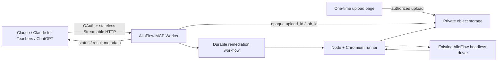

# AlloFlow MCP continuation: remote-first

**Date:** 2026-07-29  
**Predecessor:** `MCP_HANDOFF_2026-07-29.md`  
**Status:** Institution-owned remote pilot implemented and hardened locally;
no remote resources provisioned or deployed; no live Claude or ChatGPT remote
acceptance

## What was inherited and verified

Claude's handoff remains the implementation baseline. The current source has:

- 27 advertised local remediation tools;
- a generated capability inventory for the local surface; and
- MCP regression suites under `tests/mcp_*.test.js`.

The July 29 inventory snapshot recorded these gaps:

1. batch-folder functions;
2. resource/pack HTML generation;
3. preview/expert commands.

Treat those inventory values as history and regenerate the inventory before
making a current coverage claim. Likewise, run the current test commands below
instead of quoting a frozen test count.

## Local release blockers found and disposition

At audit time, `desktop/dist/mcpb/alloflow-remediation.mcpb` was a stale July 19
artifact with 9 tools and missing assets. It has now been replaced locally by a
full, official-CLI-validated 0.3.0 bundle:

- manifest schema 0.4 passes the pinned MCPB 2.1.2 validator;
- 27 tools, bundled Playwright, `zip_writer.cjs`, the view export module,
  `PRIVACY.md`, and `LICENSE` are present;
- packaged initialize, tool discovery, and capabilities pass;
- the packaged no-key remediation self-test completes all five stages;
- SHA-256:
  `1302fe23dc5cbc1dcdf1d9346c084a14732518ff04c2d95291db4ad5f6abfc0b`.

The bundle remains under the gitignored `desktop/dist/` directory and has not
been published. `a11y-audit/mcp_capability_inventory.json` has also been
regenerated from the current 27-tool source.

Additional local-release blockers found in the audit:

- `desktop/mcp/PRIVACY.md` falsely said job records vanished at shutdown even
  though the server stores arguments, paths, logs, and results locally for 30
  days. The disclosure and contradictory README paragraph are corrected in this
  continuation.
- The builder treated every official MCPB CLI error, including schema rejection,
  as "CLI unavailable" and silently emitted an unvalidated ZIP. It now pins the
  CLI and fails closed; a clearly labelled diagnostic fallback requires the
  explicit `--allow-unvalidated` flag.
- The manifest now uses schema 0.4, truthful optional Gemini configuration,
  public privacy/repository/support links, the repository's AGPL license, and a
  runtime version aligned with the bundle.
- Archive-vs-source parity, broader handler-level behavioral tests, signing, and
  a clean-machine install still need release gates before publication.

## Priority change

The predecessor suggested publishing the MCPB and then adding
`generate_resource_pack`. The product conversation has now made remote access
the first distribution priority for Claude and Claude for Teachers.

That does not replace the local MCPB:

- **Remote** is the broadly discoverable web/mobile/managed-Claude path.
- **Local MCPB** is the private-file, offline-capable, full-power companion.

This continuation therefore starts the remote transport contract while keeping
the local release blockers visible.

## The stateless MCP decision

The new MCP handler is stateless at the protocol layer. A fresh MCP server is
created for each `/mcp` HTTP request. AlloFlow does **not** need:

- a long-lived MCP connection record;
- a per-Claude-session Durable Object;
- an in-memory queue tied to one Worker isolate.

Stateless MCP does not erase application state. A 5–30 minute remediation still
needs durable, independently addressable facts:

| Concern | Where it belongs |
| --- | --- |
| MCP initialization and request transport | Fresh stateless `/mcp` request |
| Signed-in teacher/district and scopes | OAuth token / authorization store |
| Uploaded source document | Private object storage behind an opaque upload ID |
| Queue, retries, progress, cancellation | Durable workflow behind an opaque job ID |
| Chromium and the real AlloFlow pipeline | Separate Node/Chromium runner |
| Result files and retention | Private object storage plus signed/authorized retrieval |

The important simplification is that any authenticated request can ask about a
job by ID. The server does not have to remember an MCP session to do so.

## Historical Milestone 0 snapshot

`services/alloflow-remote-mcp/` is a new isolated Cloudflare Worker project.
It deliberately does not modify the existing catalog Worker.

The following records the first narrow gateway milestone. It is preserved as
history and is no longer the current feature boundary:

- current MCP SDK v2;
- `createMcpHandler()` from `agents/mcp/server`;
- stateless Streamable HTTP at `/mcp`;
- a health endpoint;
- one honest read-only `remediation_capabilities` tool;
- no document intake, storage, OAuth, job, or remediation claims;
- production-build integration tests.

That milestone's count and bundle-size observations were point-in-time
evidence. They must not be used as the current verification result.

This narrow surface was intentional. Anthropic's connector policy requires
tools to do what their names and descriptions claim. Advertising placeholder
upload or remediation tools would have created a misleading connector.

## Current remote state

Version 0.3.0 now contains eight pilot tools: capabilities, one-time upload,
start, status, privacy-safe report, result, cancel, and delete. The seven
document tools remain hidden until complete configuration and the exact manual
synthetic-acceptance version are present. That gate never authorizes real
teacher or student documents.

There is one canonical remediation engine and three wrappers:

| Surface | Wrapper responsibility |
| --- | --- |
| Ordinary AlloFlow app | Interactive preview/review/save behavior and the existing `runAutoFixLoop` |
| Local MCPB | Local filesystem/browser adapter and the broader private-file tool surface |
| Remote MCP | OAuth, opaque IDs, D1/R2/Workflow/Container isolation, quotas, wall-clock limits, and fail-closed delivery |

All three execute `doc_pipeline_source.jsx` / `doc_pipeline_module.js` and
share the canonical round policy and reducer. The base app already
auto-continues: its ordinary Auto-fix control defaults to three rounds, and its
recommended hands-off Make Accessible path may run an eight-round continuation
and resume it up to three times while progress continues. Those paths remain
plateau-, ownership-, and Stop-gated. Remote limits are deployment policy:
`standard` performs zero extra rounds and `thorough` performs at most two.

Claude's exact public callback remains accepted. ChatGPT is an optional runtime
profile: when `CHATGPT_REDIRECT_URI` is present, it must exactly equal the
HTTPS callback shown in ChatGPT app management. There is no fabricated
default, wildcard, query, fragment, userinfo, alternate host, or normalized
near-match. Protected tools advertise least-privilege OAuth scopes and return
MCP account-linking challenges for missing or insufficient authorization.
This is locally tested; no live ChatGPT staging acceptance has occurred.

D1 admission defaults are:

| Boundary | Default |
| --- | ---: |
| Open uploads per user | 3 |
| Upload attempts per user per rolling 24 hours | 20 |
| Upload attempts per institution per rolling 24 hours | 100 |
| Active jobs per user | 1 |
| Active jobs per institution | 2 |
| Jobs per user per rolling 24 hours | 10 |
| Jobs per institution per rolling 24 hours | 50 |

Every created upload remains in the rolling attempt budget even when later
rejected or when a claimed grant fails or expires. An expired pending grant
can stop occupying an open-upload slot, but it does not refund an attempt, and
a one-time claim is never reopened.

Apply all D1 migrations in order:

1. `migrations/0001_institution_pilot.sql`
2. `migrations/0002_remediation_effort_and_admission.sql`
3. `migrations/0003_upload_attempt_admission.sql`

Current verification is command-based. From
`services/alloflow-remote-mcp/`, rerun:

```sh
npm run check
npm run runner:check
npm run startup:check
```

Use `npm run types:check`, `npm run typecheck`, `npm test`, and
`npm run preflight:test` for focused diagnosis. Do not translate local green
commands into a deployment, edge-health, or live OAuth-acceptance claim.

## Remote production architecture



The runner invokes `desktop/mcp/remediation_headless_driver.cjs`; wrapper code
must not become a second remediation engine.

## Upload boundary selected for the pilot

MCP tool arguments are JSON. Clients may support document uploads in chat, but the
remote-connector contract should not assume arbitrary attachment bytes will be
forwarded to an MCP tool.

The implemented pilot flow is:

1. `create_document_upload` returns a short-lived, authenticated upload URL;
2. the teacher opens the AlloFlow upload page;
3. the page uploads directly to private storage;
4. the MCP receives only an opaque `upload_id`;
5. the object is deleted on the documented retention schedule or immediately
   on user request.

An institution may additionally allow scoped Google Drive, Microsoft 365, or
LMS source references, but that is a separate connector/privacy decision.

## Deployment profiles

The existing federated architecture says student/classroom data should not
quietly become an AlloFlow-operated central dependency. Preserve two profiles:

1. **AlloFlow public connector:** narrowly scoped, no student records, suitable
   for demonstration and directory discovery after privacy review.
2. **Institution-owned connector:** district-controlled OAuth, storage,
   provider credentials, retention, audit, and runner.

Choosing to operate a general public document-remediation service would be a
new governance and data-processing commitment, not merely a technical deploy.

## Next gates

1. Decide whether the existing account will be institutionally governed or
   use a different institution-controlled account.
2. Enable Workers Paid and provision dedicated staging KV, D1, R2, Workflow,
   Container, Worker, custom domain, and Access resources.
3. Apply all three migrations and run the complete synthetic OAuth,
   cross-tenant, upload, quota, standard/thorough, report, result, cancel,
   delete, cleanup, and privacy suite.
4. Complete live staging account linking and the synthetic end-to-end path in
   Claude.
5. Complete the same staging acceptance in ChatGPT using the exact callback
   copied from app management. This release gate has not run.
6. Build and scan the `linux/amd64` image, vendor/hash-lock runner assets, and
   complete institutional privacy, Gemini data-path, retention, and incident
   response approvals.
7. Publish privacy/security/support metadata and pursue directory distribution
   only after the relevant client-specific acceptance and governance gates pass.
