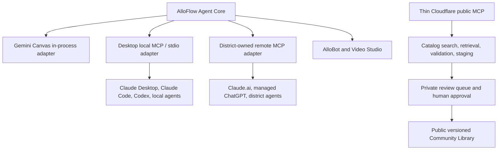

# AlloFlow Federated Agent and Interoperability Roadmap

**Date:** 2026-07-14  
**Status:** Proposed strategic source of truth for the agent/MCP direction  
**Companion:** [Claude implementation handoff](CLAUDE_HANDOFF_FEDERATED_AGENT_2026-07-14.md)

## Executive decision

AlloFlow should not try to beat Google, Anthropic, or OpenAI at foundation models, hosted inference, or general-purpose office integration. It should become the open, provider-neutral educational workflow and artifact layer that can use those systems without depending on any one of them.

The recommended architecture is local-first and federated:

- Gemini Canvas invokes the AlloFlow Agent Core in-process.
- AlloFlow Desktop exposes the same core through a private local MCP adapter.
- Districts may deploy an optional remote MCP adapter inside infrastructure they own.
- Cloudflare provides a thin public catalog, discovery, validation, and community-submission layer.
- PrismFlow remains a demo and is never a production dependency.

This is a complement strategy, not a head-on platform war:

> Create and reason with the model a user already has; structure, differentiate, validate, deliver, study, and preserve the result with AlloFlow.

## Candid competitive assessment

AlloFlow has a credible path, but success is not guaranteed. Google now offers no-cost Gemini for Education with lesson planning, differentiation, quizzes, rubrics, NotebookLM, Classroom context, administrative controls, and emerging adaptive study notebooks. Anthropic launched Claude for Teachers on 2026-07-14: verified US K-12 educators get a free year of premium Claude (sign-up through June 30, 2027) **including Claude Code and Claude Cowork**, the Learning Commons Knowledge Graph connector (CZI partnership; standards, learning components, and progressions for all 50 states, plus curricula such as OpenSciEd and Illustrative Mathematics), nine curated education connectors at launch (ASSISTments, Brisk, Canva Education, Coteach, Diffit, Eedi, MagicSchool, Snorkl, TeachFX), an open-source teaching-skills repository with published evaluation rubrics (`anthropics/k12-teacher-skills`, Apache-2.0), FERPA compliance with a K-12 Data Processing Addendum, and AI Fluency courses built with AFT and Teach for America. OpenAI (ChatGPT for Teachers) and Microsoft (Elevate for Educators) have comparable programs.

Two readings of that launch matter here. First, "standards-aligned lesson generation with teacher-level privacy" is now free and commoditized — it is not a moat. Second, the launch **validates the complement strategy**: Anthropic's education play is explicitly an ecosystem of third-party connectors and skills (MagicSchool and Diffit are listed in the directory, not displaced by it), and teachers now hold agentic clients (Claude Code, Cowork, Claude Desktop) that can call AlloFlow the day an adapter exists. The remaining differentiation is student-data locality, institution-owned deployment, the artifact layer, and specialized interfaces.

Those developments eliminate “basic AI lesson generator” as a defensible category. They do not eliminate the need for:

- Provider-neutral educational workflows.
- Local and institution-owned deployment.
- Portable, inspectable educational artifacts.
- Deep UDL, accessibility, special-education, literacy, SEL, simulation, and study workflows.
- A tool that can coordinate multiple models and local capabilities.
- An open alternative that does not require a district to commit all activity to one model vendor.

AlloFlow’s best chance is to make improvements in the large models increase AlloFlow’s value. If Claude becomes a better planner, Gemini a better grounded tutor, or OpenAI a better image generator, each should be able to produce better AlloFlow artifacts without a rewrite of the educational workflow.

### Where AlloFlow can remain differentiated

1. **Breadth joined to workflow depth.** The value is not a checklist of generators; it is the ability to turn source material into a coherent, differentiated, accessible learning system.
2. **Local-first and institution-owned operation.** Desktop and district deployments can keep inference credentials and educational data outside an AlloFlow-operated service.
3. **Provider independence.** Gemini, Claude, OpenAI-compatible services, and local models can serve different roles.
4. **Open artifact layer.** AlloPacks can remain portable, inspectable, versionable, and community-governed.
5. **Specialized educational interfaces.** Interactive simulations, reading supports, study workspaces, accessibility tooling, SEL tools, and exports are harder to replace with a chat window.
6. **Agent-accessible educational semantics.** Stable tools such as `blueprint_create` and `artifact_validate` are more durable than screen automation or model-specific prompts.

### Where the large platforms remain stronger

- Installed distribution and user trust.
- Workspace, Classroom, Drive, Forms, identity, Vault, and administrative integration.
- Model and media infrastructure.
- Product polish, support, sales, and reliability staffing.
- Institution-wide procurement relationships.

The roadmap therefore prioritizes interoperability, evidence, maintainability, and distribution over adding more isolated generators.

## Non-negotiable boundaries

1. **PrismFlow stays demo-only.** It must not become the production MCP endpoint, inference service, district data store, or community publishing authority.
2. **No required AlloFlow inference service.** Users supply a supported host subscription pathway, their own API keys, local models, or district-managed providers.
3. **No central student-data dependency.** Student and classroom data stay local or in institution-controlled infrastructure unless a separate, explicit governance decision is made.
4. **Cloudflare remains thin.** Public catalog/discovery and reviewed community contribution are in scope; general lesson inference and student analytics are not.
5. **Agents draft; humans publish.** Public Community Library publication requires validation and human approval.
6. **Semantic commands precede computer control.** API/MCP/AlloFlow commands are primary; browser or vision control is a last-mile adapter.
7. **One Agent Core, multiple transports.** Canvas, Desktop MCP, district MCP, and AlloBot must not develop separate educational logic.

## Target architecture

### Agent Core responsibilities

- Command and workflow contracts.
- Blueprint creation, revision, validation, preview, and execution.
- AlloPack schema, migration, validation, and export.
- Capability discovery for text, vision, image generation/editing, speech, search, and local models.
- Standards lookup as a routable capability: consume the free Learning Commons Knowledge Graph MCP connector (CZI/Anthropic) when available rather than building standards data; Blueprint standards fields should be groundable in it.
- Provider routing without embedding vendor credentials in artifacts.
- Job state, progress, cancellation, warnings, and resumability.
- Role, risk, confirmation, and publication rules.
- Provenance and evaluation metadata.

### Adapter responsibilities

Adapters translate transports and host state. They must not contain their own lesson-planning rules.

| Adapter | Purpose | Data/compute owner |
|---|---|---|
| Canvas in-process | Use Gemini Canvas host capabilities and current UI | User/Google environment |
| Desktop local MCP | Full local authoring and automation | User device |
| District remote MCP | Web-agent access, shared jobs, institutional controls | District/institution |
| Cloudflare public MCP | Catalog discovery and governed contribution | Community steward |
| Computer-control adapter | External systems with no semantic interface | User or district device |

## Tool surface

The external interface should be intentionally smaller and more stable than the UI.

**Naming rule:** tool names use only `[a-zA-Z0-9_-]` (underscore-separated, no dots). Claude's API rejects dotted tool names, and MCP clients already namespace tools by server (e.g. `mcp__alloflow__blueprint_create`), so the `alloflow` prefix comes from the server identity, not the tool name. **Annotation rule:** every tool ships with an MCP `title` and the applicable `readOnlyHint`/`destructiveHint` — this is a hard requirement for Anthropic's Connectors Directory and should fall directly out of the Phase 0 tool classification.

### Foundation tools (all read-only)

- `capabilities`
- `get_state_summary`
- `get_command_contracts`

### Blueprint tools

- `blueprint_create`
- `blueprint_get`
- `blueprint_revise`
- `blueprint_validate`
- `blueprint_preview`
- `blueprint_execute`

### Job tools

- `job_get`
- `job_cancel`
- `job_get_result`

### Artifact and media tools

- `artifact_validate`
- `artifact_preview`
- `artifact_export_allopack`
- `asset_generate_image`
- `asset_edit_image`
- `asset_attach`

### Public catalog tools

- `catalog_search`
- `catalog_get`
- `catalog_validate_submission`
- `catalog_stage_submission`
- `catalog_get_submission_status`

Public publishing should not initially be an agent-callable tool.

### Companion Agent Skill (not a tool — ships earlier)

Alongside (and before) the MCP surface, publish an **AlloFlow authoring skill**: a SKILL.md package teaching Claude the AlloPack/Blueprint schemas, validation rules, and pedagogy conventions. Anthropic's own teacher offering is built this way (`anthropics/k12-teacher-skills` bundles skills as a Claude plugin with eval rubrics). A skill needs no server, no transport, and no packaging beyond a repo folder; it works today in Claude Code, Claude Desktop, and Cowork — which verified US K-12 teachers now have free. The skill is the "how to think about AlloFlow artifacts" half; MCP tools are the "how to act on them" half. Skills are not a standalone directory submission type — they are bundled into a plugin when directory distribution is wanted.

## Delivery roadmap

Timing is deliberately expressed as gates rather than promises. A phase is complete only when its acceptance criteria pass.

### Phase 0: Freeze the contracts

**Goal:** Define the stable educational and safety boundary before choosing an MCP SDK.

Work:

- Inventory existing commands and Blueprint fields.
- Define versioned `CapabilityManifest`, `Blueprint`, `Job`, `Artifact`, and `Provenance` contracts.
- Classify tools as read-only, draft-writing, external-effect, destructive, or publication-related, and have that classification emit MCP `title` + `readOnlyHint`/`destructiveHint` annotations directly (a Connectors Directory hard requirement — retrofit is wasted work).
- Enforce the tool naming rule (`[a-zA-Z0-9_-]` only) in the contract schema itself.
- Define which fields may contain student or educator information.
- Specify confirmation and role requirements.
- Add an explicit deployment-mode value: `canvas`, `desktop-local`, `district-hosted`, or `demo`.

Acceptance:

- Contracts have fixtures and schema tests.
- Demo mode cannot advertise privileged production capabilities.
- Unknown contract fields are handled predictably.
- No transport-specific fields appear in educational artifacts.

### Phase 1: Extract the reusable Agent Core

**Goal:** Make current Auto-Fill Blueprint and command behavior callable without UI clicking.

Work:

- Extract Blueprint creation, revision, validation, and execution from React-bound handlers into reusable services.
- Preserve the current review-before-execution interaction.
- Reuse the implemented command contracts, plan validator, sequential executor, demo-safe metadata, and destructive-action restrictions.
- Add an adapter that maps current React state to and from the core.
- Keep AlloBot and Video Studio behavior on the same contracts.

Acceptance:

- Existing Auto-Fill behavior remains intact in the UI.
- A headless test can create, revise, validate, and dry-run a Blueprint.
- Destructive or terminal actions never run implicitly.
- Existing command-plan tests continue to pass.
- Blueprint output is deterministic in shape even when generation content varies.

### Phase 2: Ship the Desktop local MCP minimum viable connector

**Goal:** Let local agents operate AlloFlow without any AlloFlow-hosted endpoint.

Work:

- Package a small `stdio` MCP process with AlloFlow Desktop.
- Additionally package it as an **MCP Bundle (MCPB) desktop extension** — the format Claude Desktop installs with one click and the realistic directory path for a solo maintainer (desktop extensions use a separate submission form and do not require a Team/Enterprise Claude org, unlike remote-server submissions).
- Write the privacy policy now: MCPB submissions require a "Privacy Policy" README section plus `privacy_policies` HTTPS URLs in `manifest.json`; a missing policy is an immediate rejection.
- Bind all auxiliary HTTP communication to `127.0.0.1` only.
- Initially expose capabilities, Blueprint dry-run/revision/validation, artifact validation, and export.
- Add execution and media tools after the permission model is verified.
- Add human-readable install/config examples for Claude Desktop, Claude Code, and other compatible local clients.

Acceptance:

- The connector functions with the network disconnected when local providers suffice.
- No PrismFlow or Cloudflare endpoint is contacted for local generation.
- Secrets remain in the desktop secret store and are never returned through MCP.
- Every write tool produces an audit entry.
- Cancellation interrupts the next safe workflow boundary.

### Phase 3: Harden Community Library governance and add thin Cloudflare MCP

**Goal:** Make the public catalog agent-accessible without becoming an inference vendor.

Work:

- Move lesson submissions from immediate public Git history into private staging.
- Add schema, PII, licensing, provenance, source, and package-size checks.
- Require a human approval transition before public publication.
- Add a stateless authenticated Cloudflare MCP endpoint for search, retrieval, validation, and staging.
- Keep public read tools usable without privileged credentials where appropriate.
- Separate catalog artifacts from bug reports, PD submissions, and plugins.

Acceptance:

- Rejected submissions never enter public Git history.
- An MCP client can discover, retrieve, validate, and stage an AlloPack.
- No public tool can publish, access private queues, or retrieve operational secrets.
- Rate limits, content limits, audit logs, and abuse controls are tested.

### Phase 4: Publish the district self-hosting kit

**Goal:** Enable web-based agents without an AlloFlow-operated production backend.

Work:

- Provide deployment templates for an institution-owned remote MCP endpoint.
- Support OAuth 2.1, scoped tools, role mapping, and provider configuration.
- Document Firebase/Cloud Run and Cloudflare Worker patterns without requiring either.
- Provide a no-student-data authoring profile and a stricter classroom-data profile.
- Include uninstall, export, key rotation, retention, and incident-response guidance.

Acceptance:

- A district can deploy without giving the AlloFlow maintainer credentials.
- The deployment passes a documented security checklist.
- The institution can disable individual tools and revoke all access.
- All data and artifacts can be exported without AlloFlow-operated infrastructure.

### Phase 5: Client packaging and distribution

**Goal:** Make the architecture understandable and easy to try.

Work:

- Publish a Claude Desktop/Claude Code local connector package or extension (MCPB form; remote directory listings require a Team/Enterprise Claude org and OAuth 2.0 for authenticated services — plan accordingly or defer remote listing to an institutional steward).
- Publish the AlloFlow authoring skill (and, when directory distribution is wanted, bundle it in a plugin — skills are not a standalone submission type).
- Test the district remote connector with Claude and managed ChatGPT plans that permit write-capable MCP apps.
- Document Gemini Canvas as the in-process path rather than forcing MCP into it.
- Publish short demonstrations: “Claude creates an AlloPack,” “local model creates an offline pack,” and “district connector stages a reviewed library submission.”
- Provide a capability matrix that states exactly which host/provider supplies each modality.

Acceptance:

- A new technical user can connect a local agent using one documented flow.
- A teacher can understand where data and inference run before authorizing a tool.
- No marketing copy implies that subscriptions automatically include API usage.

### Phase 6: Optional computer-control adapters

**Goal:** Reach external systems that lack useful APIs or MCP tools.

Work:

- Start with deterministic browser automation and accessibility trees.
- Add Windows UI Automation only for justified desktop workflows.
- Treat screenshot/vision control as experimental fallback.
- Require explicit app/domain allowlists, visible stop controls, redaction, and action logs.

Acceptance:

- AlloFlow’s own UI is never automated when an Agent Core tool exists.
- High-impact actions require confirmation.
- Failures do not leave partially published or silently modified artifacts.

## First 90-day priority stack

| Priority | Deliverable | Why now |
|---|---|---|
| 1 | Versioned Agent Core contracts (with MCP annotations + naming rule built in) | Prevents transport and provider fragmentation |
| 2 | Headless Blueprint service with parity tests | Converts an existing strength into reusable infrastructure |
| 3 | AlloFlow authoring skill + eval rubrics in Anthropic's published format | Zero-infrastructure adapter; teachers already hold free agentic clients |
| 4 | Local Desktop MCP proof of concept (stdio + MCPB packaging) | Validates the non-vendor strategy with real agents |
| 5 | Private Community Library staging | Required before agent-assisted submission volume grows |
| 6 | Thin Cloudflare catalog MCP | Creates public interoperability without hosted inference |
| 7 | UMS/research pilot package | Adds evidence, stewardship, and external legitimacy |

Do not begin computer control, a broad remote district stack, or a public connector directory campaign before the first five items are stable.

## Evidence and adoption track

Technical breadth alone will not protect AlloFlow. Run a parallel evidence track:

- Recruit a small educator design group.
- Measure time to a usable lesson, revision burden, accessibility defects, and teacher trust.
- Compare agent-created AlloPacks with ordinary chat outputs using a published rubric — adopt or extend the eval-rubric format Anthropic published in `anthropics/k12-teacher-skills` rather than inventing one; it gives the UMS pilot an externally recognized methodology.
- Record which providers and modalities were used for each artifact.
- Test local/offline and district-controlled configurations, not only Gemini Canvas.
- Seek UMS or another institutional steward for research governance and continuity.

Suggested early success signals:

- Three educators outside the development team complete the local authoring flow.
- At least 25 reviewed AlloPacks pass the same validation pipeline.
- One external agent creates and revises a Blueprint without UI automation.
- One institution independently deploys or meaningfully evaluates the self-hosted boundary.
- A reviewer can explain provenance and reproduce the validation result for a public artifact.

These are learning targets, not claims of efficacy.

## Risks and responses

| Risk | Response |
|---|---|
| Google absorbs basic lesson and study generation | Position AlloFlow as the open workflow/artifact layer and deepen specialized interfaces |
| Claude/OpenAI become the preferred teacher agents | Let them call AlloFlow rather than treating them only as competitors |
| Solo-maintainer complexity | Stabilize contracts, narrow the first MCP surface, document ownership boundaries |
| MCP fragmentation across clients | Keep transports thin and test a small conformance matrix |
| Provider subscription confusion | Publish an explicit host/API/local capability matrix |
| Agent-generated low-quality catalog volume | Private staging, deterministic validation, provenance, and human review |
| PII or licensed content enters public history | Never auto-commit unreviewed submissions; add private quarantine and deletion policy |
| Cloudflare becomes an accidental production backend | Prohibit inference and student records in the public Worker contract |
| Computer control creates security/reliability failures | Use only after semantic tools and require explicit permissions |
| Project loses continuity | Pursue institutional co-governance and transfer-ready infrastructure |

## Explicitly deprioritized

- Building a proprietary foundation model.
- Operating a centralized AlloFlow inference service.
- Turning PrismFlow into the production application.
- Exposing every React setter as an MCP tool.
- Automatically publishing agent-generated lessons.
- Making screenshot-based computer control the primary agent pathway.
- Chasing one-to-one parity with every new Google or Anthropic feature.
- Expanding the feature count before the core workflow is easier to validate and distribute.

## Decision gates

After the local MCP proof of concept, ask:

1. Does an external agent produce a better or faster AlloPack than the current manual flow?
2. Does the shared Agent Core reduce duplication, or is it becoming another parallel system?
3. Can a teacher understand and trust the approval boundary?
4. Can local and district-owned modes function without PrismFlow?
5. Is the artifact demonstrably more useful than a document produced directly by a model?

If the answers are mostly yes, proceed to public catalog MCP and district packaging. If not, improve the Blueprint/artifact experience before expanding transports.

## Current market references

- [Google Gemini for Education](https://edu.google.com/ai/gemini-for-education/?pt_ref=ai)
- [Google’s June 2026 connected study and Classroom direction](https://blog.google/products-and-platforms/products/education/iste-students-2026/)
- [Google’s June 2026 educator and LTI direction](https://blog.google/products-and-platforms/products/education/iste-2026-educator-updates/)
- [Anthropic Claude for Teachers (launched 2026-07-14)](https://www.anthropic.com/news/claude-for-teachers)
- [Anthropic k12-teacher-skills repo (skill format + eval rubrics, Apache-2.0)](https://github.com/anthropics/k12-teacher-skills)
- [Anthropic Connectors Directory submission requirements](https://claude.com/docs/connectors/building/submission)
- [Learning Commons Knowledge Graph connector](https://claude.com/connectors/learning-commons-knowledge-graph)
- [Learning Commons Claude connector docs](https://docs.learningcommons.org/knowledge-graph/using-knowledge-graph/claude-connector)
- [Cloudflare remote MCP server guidance](https://developers.cloudflare.com/agents/model-context-protocol/guides/remote-mcp-server/)

## Bottom line

AlloFlow has a shot if it refuses the wrong contest. It is unlikely to out-distribute Google or outspend foundation-model companies. It can plausibly become the open educational layer that makes their models—and local models—produce more structured, accessible, portable, and governable learning experiences.

The strategy stays nimble because the model provider is replaceable, the deployment owner is selectable, and the educational artifact remains AlloFlow’s durable center.
