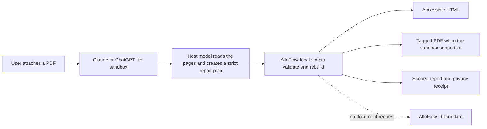

# AlloFlow portable PDF remediation

Status: implementation candidate, 2026-07-29

## The main pathway

The public AlloFlow workflow should be a portable Agent Skill, not a public
document-processing service.



The document is handled by the AI provider the user chose. It is not sent to an
AlloFlow endpoint, Cloudflare Worker, remote MCP, Gemini endpoint, analytics
service, or telemetry service by the AlloFlow scripts.

This gives users the experience we want: after installing the Skill, they can
attach a PDF and ask, “Remediate this PDF for accessibility.” The Skill invokes
automatically when its description matches the request.

## What “private” means here

The portable path removes **AlloFlow and Cloudflare** from the document data
path. It does not remove **Claude or ChatGPT** from the data path. The attachment
is still processed under the user's agreement and settings with that provider.

For public, non-sensitive, or properly de-identified files, a user can choose
their own eligible account. For identifiable education records, the responsible
institution should require its approved Claude or ChatGPT education/enterprise
workspace, applicable data agreement, access controls, retention settings, and
staff authorization. A public consumer account should not be presented as
automatically approved for FERPA records.

The privacy receipt proves only what the packaged scripts did and did not do. It
does not certify the host provider's storage, retention, training, residency, or
legal status.

## Who has responsibility

| Scenario | AlloFlow receives the document? | Institution's role |
| --- | --- | --- |
| Individual uses the portable Skill for a public PDF | No | None, unless the individual is acting for one |
| School uses the Skill in its approved AI workspace | No | The school retains its ordinary FERPA, access, retention, and vendor-governance responsibilities |
| University later provisions the Skill organization-wide | No | The university governs the provider workspace and the Skill, but does not operate an AlloFlow document service |
| Institution hosts the remote MCP for its own authorized users | Yes, in its controlled deployment | The institution governs the processing system and its subprocessors |
| Institution offers that remote MCP to unrelated schools or the general public | Yes | It may take on a much broader vendor/processor role; this is not the recommended launch model |

Institutional processing is not liability-free. The useful distinction is that
an institution processing its own authorized records is performing its existing
institutional function. Running a public service for outsiders creates a much
larger security, contracting, breach-response, retention, support, and
subprocessor surface. The portable path avoids that expansion.

This is an engineering and product boundary, not legal advice. An institution
should have its privacy/security counsel approve actual use with student
records.

## Implemented artifacts

The canonical source is
`agent_skills/alloflow-portable-remediation/`.

- `SKILL.md` defines the one-prompt workflow and explicit privacy boundaries.
- `references/repair-plan.schema.json` defines a strict, bounded repair plan.
- `scripts/alloflow_portable.py` uses the Python standard library to validate
  the plan, escape content, generate semantic HTML, audit its structure, and
  write a scoped report and privacy receipt.
- `scripts/render_tagged_pdf.cjs` is an optional local Chromium tier. It disables
  JavaScript, blocks document network requests, refuses external resources, and
  verifies that Chromium emitted tagged-PDF structural markers.
- Local veraPDF validation is used when Java and a local veraPDF CLI JAR are
  present. A nonconforming result is reported as a completed validation with
  failed rules, never as a process crash or a pass.
- The source is never overwritten, and existing output names are refused.
- Every repair plan includes the exact source PDF's SHA-256 and is rejected if
  it is accidentally paired with a different file. This binds the workflow to
  the source bytes; it does not replace human comparison of meaning.
- Forms, signed records, and legal records are blocked from automatic rebuild.

Run:

```text
node dev-tools/build_alloflow_portable_packages.cjs
```

The builder copies the canonical Skill byte-for-byte into each platform wrapper
and writes deterministic ZIPs plus SHA-256 receipts under
`dist/portable-remediation/`.

The release artifacts are a neutral Agent Skill ZIP for direct upload, an
OpenAI plugin ZIP for the shared ChatGPT/Codex submission flow, and an optional
Claude Code plugin ZIP. The `.claude-plugin` wrapper is not the Claude web
custom-Skill installer; Claude web uses the neutral Agent Skill ZIP.

## Distribution route

### ChatGPT and Codex

OpenAI now supports Agent Skills in ChatGPT and says plugins may contain only
Skills. The repository includes a skills-only public plugin wrapper at
`plugins/alloflow-pdf-remediation/`; it has no app and no MCP dependency.

For direct testing, an eligible user or workspace admin can upload the packaged
Skill. For public discovery, submit the OpenAI plugin ZIP after completing
publisher identity, listing, support, privacy, security, and final sandbox
testing requirements.

Official references:

- <https://help.openai.com/en/articles/20001066-skills-in-chatgpt/>
- <https://help.openai.com/en/articles/20001256-plugins-in-codex/>
- <https://developers.openai.com/plugins/build/skills>
- <https://developers.openai.com/plugins/deploy/submission>

### Claude

The direct Skill ZIP is immediately testable through Claude's custom Skill
upload flow, and a future Team or Enterprise owner can provision it
organization-wide. The package includes a top-level folder matching the Skill
name, as Anthropic requires.

Do not promise Anthropic Directory publication yet. Anthropic's current
Software Directory Policy says directory software must not query or extract
user-uploaded files. That conflicts with the core purpose of a public PDF
remediation Skill even though the processing stays inside Claude's sandbox.
Obtain a written Anthropic interpretation or exception before submitting it to
the public directory. Direct private upload and organization provisioning are
separate distribution routes.

Official references:

- <https://support.claude.com/en/articles/12512198-how-to-create-custom-skills>
- <https://support.claude.com/en/articles/12512180-use-skills-in-claude>
- <https://support.claude.com/en/articles/13145358-anthropic-software-directory-policy>

## Honest output levels

Semantic accessible HTML and a scoped report are the portable baseline. A
tagged PDF is produced only when the current sandbox proves that a local
renderer is available. PDF/UA validation runs only when local Java and veraPDF
are available.

Neither structural HTML checks nor veraPDF can verify that the model preserved
every word, chose the right reading order, or wrote accurate alternative text.
The `plan_internal_token_recall` metric compares the host's own extracted
`source_pages` with its output blocks; it is not an independent reading of the
PDF. The SHA-256 source binding prevents accidental file/plan swaps but cannot
establish semantic fidelity.
Every result therefore requires comparison with the source. The workflow never
claims WCAG, Section 508, PDF/UA, or legal compliance by itself.

## Remote Cloudflare pathway

Keep the existing Cloudflare/MCP design as an explicit optional tier for:

- institution-approved batch processing;
- long-running jobs that exceed a provider sandbox;
- centralized integrations and retention controls; or
- an institution that deliberately chooses to operate the service for its own
  authorized users.

Do not make it the default public route. “Stateless” does not change this
boundary: a stateless server still receives and processes every request body.
It only avoids retaining application session state between requests.

## Release gates

1. Run the focused automated tests and an actual upload test in Claude and
   ChatGPT. Hosted sandboxes may not include Chromium, Java, or veraPDF, so the
   HTML-only fallback must remain first-class.
2. Have a human compare outputs against a representative PDF corpus: born
   digital, scanned, figures, complex tables, equations, and multilingual text.
3. Replace draft publisher/support metadata with verified AlloFlow details
   before public submission.
4. Decide whether to bundle veraPDF. The current packages deliberately do not;
   redistribution requires the appropriate upstream and transitive notices.
5. Ask Anthropic for written guidance on Directory Policy section 1.F before
   submitting a file-remediation Skill to its public directory.
6. Complete an institutional privacy/security review before allowing
   identifiable student records, regardless of which provider hosts the
   sandbox.
