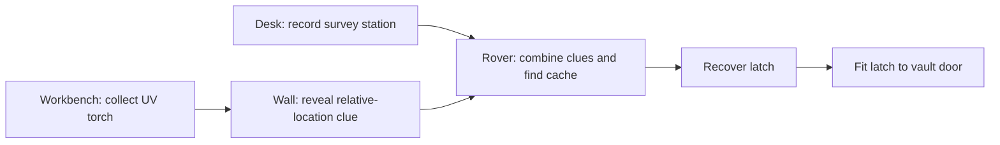

# Escape room evolution and live-session priorities

Reviewed September 8, 2026. This is a design exploration grounded in the current local implementation, with a separate playable concept. It does not replace the production escape-room engine or change live sessions.

## Recommendation

An authentic generative digital escape room is realistic within this app. Start with a small, validated library of connected puzzle structures: tools reveal evidence, discoveries change the room, and several clues must be combined to reach an exit. Keep the current quiz-based experience as a simpler Classic option.

The defining improvement is functional interdependence. A room becomes more than a decorated quiz when something discovered at one location changes what a player can see or do elsewhere. High-end graphics, free movement, and an AI inventing arbitrary game logic are unnecessary for that first step.

## What the current code actually does

| Finding | Evidence | Implication |
| --- | --- | --- |
| Generation already requests cross-puzzle clues. | `escape_room_module.js`, `generateEscapeRoom`, fields `revealsClueFor` and `revealedClue` | There is an existing narrative foundation to build on. |
| Solving stores those clues as text for another puzzle. | `handlePuzzleSolved`, `discoveredClues`; clue display in the puzzle panel | Evidence can help answer another question, but it does not currently act as a tool, prerequisite, or change to the environment. |
| Object selection primarily checks play state and whether the linked puzzle is solved. | `handleSelectObject` | Most objects remain independent quiz entry points. There is no general inventory or unlock graph. |
| The solo final door becomes available after all regular puzzles are solved. | `allSolved`, `shouldUnlockDoor` | A synthesis question provides a finale, but completion remains primarily a count of completed questions. |
| The collaborative generator requires exactly ten questions in a fixed format mix. | `validateCollaborativePuzzleMix` | That contract is designed around answer formats, not branches, evidence exchanges, or a room topology. |
| Quiz answers use a channel send result; cloud fallback records participation without answer content. | `AlloFlowANTI.txt`, `__alloQuizChannelSend`; `ui_modals_source.jsx`, `transmitQuizResponse` | A successful send is not an application-level acknowledgement that the teacher accepted the answer. |
| The presentation fallback receipt contains activity ID and question index, but not the round ID used by the peer message. | `ui_modals_source.jsx`, `transmitQuizResponse` | Replayed questions deserve a stale-receipt review when extending delivery confirmation. |

The user's description is substantially right. The existing mode is useful for varied practice and includes sequencing, matching, and synthesis; it is not limited to fluency. Its mechanics still resemble a collection of questions more than a connected escape environment.

## What makes the next version feel like an escape room

1. **Discover:** inspect an object, source document, diagram, recording transcript, or environmental detail.
2. **Infer:** connect evidence from different places to reach a conclusion.
3. **Act:** use that conclusion to operate a device, arrange an artifact, select a route, or apply a tool.
4. **Change the room:** reveal writing, restore a system, open a compartment, obtain an object, or reach another area.
5. **Synthesize:** use the consequences of earlier actions to complete the final task.

Learning should be needed to operate the environment. For example, proportion reasoning could set an irrigation mixer; document chronology could restore an archive timeline; evidence about a character's motives could identify the relevant correspondence. Arbitrary codes after unrelated questions offer less connection between the subject and the room.

Educational escape-room design research describes sequential, parallel, and combined puzzle structures, and emphasizes alignment between learning goals and puzzle actions. These are useful design principles for the proposal. They are not proof that this particular digital implementation improves learning. [Veldkamp et al., *Escape boxes*](https://bera-journals.onlinelibrary.wiley.com/doi/10.1111/bjet.12935).

## The playable concept

**The cartographer's vault** demonstrates a compact version of the idea:



The desk and the workbench can be explored in either order. The torch has a functional use. The hidden clue gives a displacement from a station recorded elsewhere. Moving the rover on the map applies coordinate reasoning; finding its cache supplies an object that actually opens the door.

The concept includes an evidence journal, persistent inventory, prerequisite checks, informative unsuccessful searches, three levels of hints, keyboard controls, deterministic replay, and a New variation action. The optional design control switches object navigation between a grid and a linear list.

This is deliberately a small mechanism demonstration. It uses a fixed authored graph and seeded coordinates, performs no AI calls, and has no network or multiplayer integration. It demonstrates connected interaction and mechanical validation; it does not demonstrate unrestricted generation or endless unique rooms. It also remains possible to search the bounded grid by trial and error after collecting the clues. A fuller lesson should include a brief explanation of how the evidence located the cache, without turning every interaction into another graded question.

## A practical generative architecture

Use AI to fill a constrained room specification; let the application own the rules.

| Layer | Responsibility |
| --- | --- |
| Learning specification | Source material, learning objectives, age/reading level, language, accessibility needs, individual/team play, target duration. |
| Blueprint selection | Choose a supported structure and puzzle families that fit those objectives. Use a recent-blueprint history to reduce repetitive rooms. |
| Solution construction | Establish valid evidence, transformations, answers, and a complete solution trace before producing the final clues. |
| AI authoring | Write source-grounded documents, scene descriptions, clue wording, graduated hints, and equivalent accessible representations within a strict schema. |
| Validation | Check references, prerequisites, reachability, answer constraints, accessible alternatives, and consistency between the generated data and the solution trace. |
| Teacher preview | Show the playable room, clue dependencies, expected reasoning, source references, and solution. Support editing and regenerating one puzzle. |
| Runtime | Execute supported actions such as inspect, reveal, arrange, configure, combine, navigate, and unlock. |

A versioned node could declare `id`, `mechanic`, `requires`, `grants`, `learningObjective`, `sourceReferences`, `parameters`, `solution`, `hints`, and `accessibleAlternative`. Store the seed and specification with the saved room so replay does not depend on another AI call. Do not execute arbitrary model-generated JavaScript.

For the first version, tools and evidence should be reusable. This avoids irreversible item-consumption mistakes and simplifies validation. If later mechanics consume items or modify prerequisites, graph reachability alone will no longer suffice: the validator must explore possible states, including resource use and alternative action orders.

Reject missing references, circular mandatory dependencies, unreachable exits, incompatible mechanic parameters, duplicate rewards, and inconsistent numeric clues. Allow a limited repair attempt, then give the teacher an actionable generation error. A graph validator can establish mechanical reachability under its assumptions; it cannot prove that a natural-language clue is accurate, unambiguous, age-appropriate, or educationally useful.

## How to keep it fresh

Vary more than the theme:

- **Evidence:** different data, documents, diagrams, viewpoints, and relevant details.
- **Mechanics:** observation, evidence comparison, ordering, configuration, transformation, routing, and combining objects.
- **Dependencies:** two parallel investigations that merge, a short sequence that opens another area, or an optional discovery that supplies a more direct route.
- **Context:** an archive restoration, environmental investigation, lost expedition, museum mystery, or laboratory recovery, where the actions make sense in that setting.
- **Support:** shorter clues, alternate representations, and hint specificity adjusted to the selected learners and objectives.

A limited set of reliable mechanics can produce substantial variety. It will still repeat patterns over time. Track recent combinations and let the teacher choose a different structure; do not promise every generated room is unprecedented.

Keep generative difficulty tied to reasoning demand and clue explicitness. Tiny hotspots, arbitrary ciphers, extra reading, and more time pressure often add friction without adding useful conceptual depth.

## Live escape rooms

The room model should serve both individual and team play. Avoid creating another independent team-specific generator and renderer with different rules.

**Shared evidence and parallel work.** Teams need one synchronized journal and inventory. Two members can investigate separate branches and bring findings together at a shared device. A role-specific clue can support discussion, but teachers must be able to reassign or reveal it if someone leaves. A missing participant must not make a room impossible.

**Authoritative actions.** Each submitted action needs a room-attempt ID, team ID, node ID, and unique action ID. Validate prerequisites against the accepted team state, apply the change once, and acknowledge the resulting revision. Repeated clicks and retransmitted messages should not duplicate rewards or overwrite another student's discovery.

**Recovery.** A reconnecting student should receive the current room specification and accepted team state. Clearly distinguish an action waiting for confirmation from a confirmed discovery. Decide separately what survives a teacher browser restart; a peer acknowledgement alone does not establish durable recovery. Preserve the app's existing separation between private answer content and shared progress.

**Teacher support.** Show which branches are available, discoveries made, hint levels requested, and recent accepted actions. Inactivity can suggest where to check in, but it should not be labeled disengagement. Provide pause/resume, a targeted hint, a rescue unlock with a recorded reason, and team reassignment.

**Accessible exploration.** Keep a keyboard-accessible object list alongside any spatial scene. Preserve readable clue text, transcripts, non-color cues, optional time limits, and a journal so memory is not the bottleneck. In an exploratory room, inspection and unsuccessful experiments should generally be safe to repeat; reserve evaluation for consequential reasoning where appropriate.

**Debrief.** After completion, connect the team's evidence and actions back to the lesson. Ask for one explanation of a key inference and surface the relevant source. A systematic review identified alignment and debriefing as relevant design considerations, while its evidence base largely concerned physical, team-based rooms and excluded entirely digital rooms. This proposal therefore needs classroom piloting rather than assuming transfer of measured outcomes. [Veldkamp et al., *Escape education*](https://www.fi.uu.nl/publicaties/literatuur/2020_veldkamp_escape_room.pdf).

## Monster Battle and shared live-session follow-ups

| Priority | Proposed improvement | Why it is worthwhile | Acceptance example |
| --- | --- | --- | --- |
| First | Extend negotiated teacher acknowledgements to quiz and Monster Battle answers. | The recent LivePolling confirmation work is a foundation, but the generic quiz path still returns a send boolean. | Disconnect after sending, reconnect, and see either the teacher-confirmed answer or a retained retryable attempt; never award twice. |
| First | Make attempt identity consistent across peer messages and fallback participation receipts. | Presentation receipts currently lack the round ID used in peer answer keys. | A delayed receipt from the previous attempt of question zero cannot count in a restarted battle. |
| Next | Add a short concept recovery phase after a difficult battle round. | The current result and explanation views are stronger after the recent pass; the next learning benefit is a chance to apply feedback. | Students revisit the missed idea with a supported parallel example. Recovery does not silently rewrite the original assessment evidence. |
| Next | Make teacher pacing and readiness clearer across live modes. | Teachers need to distinguish answering, delivery pending, review, and ready for the next round. | The teacher can wait or proceed deliberately while pending submissions are visible and the student sees the same phase. |
| Later | Add limited boss mechanics tied to concepts. | A shield that responds to evidence or a strategy choice can add variety if it supports the lesson. | One clearly explained mechanic per encounter, with an equivalent untimed/low-motion presentation and no penalty for using an accessible answer format. |
| Later | Show team contribution and reflection without public failure rankings. | A battle can acknowledge collaboration as well as correct answers. | The teacher can see participation privately, while the class sees collective progress and the ideas to revisit. |

These are recommendations, not newly implemented features. The prior Monster Battle pass already improved scoring eligibility, neutral unscored rounds, end-state explanations, restart, pacing controls, and mobile review. Those changes should be retained.

## Suggested rollout

1. **Connected-room pilot:** one subject area, three to five supported mechanics, reusable inventory, explicit prerequisites, one combined finale, graduated hints, teacher solution preview, and mechanical validation. Preserve Classic mode.
2. **Collaborative pilot:** shared journal and state, parallel branches, acknowledgement/reconnect handling, targeted teacher support, and migration/version handling for saved rooms.
3. **Broader generation:** more subject-specific mechanic families, constrained graph variation, richer scenes, and optional roles after teacher/student testing.

I would defer arbitrary generated 3D worlds, an autonomous AI game master, unrestricted free-form puzzle logic, and persistent cross-device simulation. They introduce substantially more validation, latency, recovery, and accessibility work than is necessary to improve the current experience.

## Verification of this exploration

The isolated concept was checked with 200 seeded runs, both orders of the independent early discoveries, blocked prerequisite bypasses, repeated item collection, incorrect searches, complete solutions, and deterministic replay. Six invalid graph/data cases covered cycles, missing requirements, duplicate node IDs, duplicate rewards, contradictory clues, and out-of-bounds targets.

A separate browser walkthrough used the actual controls to complete the room, use progressive hints, replay, and change variation. Layout checks covered 736, 360, and 320 CSS pixels in light and dark appearances. The final results and screenshots are in [the verification folder](escape-room-concept/verification.json). Automated accessibility checks supplement the keyboard walkthrough; they do not establish full assistive-technology compatibility.

Reproduce with:

```powershell
node dev-tools/check_connected_escape_concept.cjs "<absolute path to connected-escape-room.html>"
```

The source fragment is the inline playable concept in this conversation. No production code, backend, or deployment changed during this exploration.
