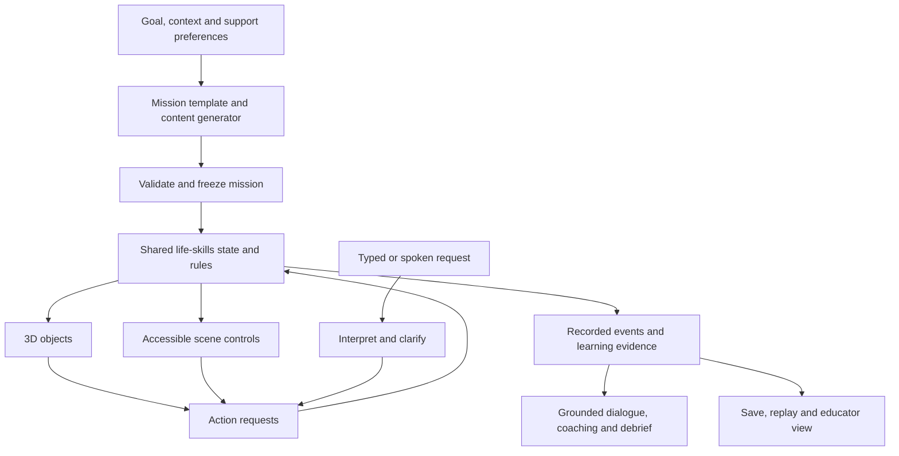

# Life Skills: generative content, Adventure reuse, and 3D scope

## Recommendation

Build a Life Skills campaign experience that combines three existing foundations:

1. **Adventure Mode:** episode structure, characters, inventory presentation, coaching, narration, media, and host/session integration.
2. **Field Journeys:** explicit simulation actions, validated state transitions, journals, replay, and an optional narration boundary.
3. **Life Skills 3D labs:** environments, object-selection patterns, accessible controls, and capstone evidence concepts.

Add a shared life-skills simulation model beneath them. It should own object states, time, inventory, money, commitments, and evidence. Both the 3D world and the accessible action interface should operate that same model.

**Generation creates variety and responsiveness. The simulation calculates outcomes.** This is the main design rule.

Audience remains mixed ages with highly varied support needs. “Adulting: Practice Mode” remains an uncleared working title for an older-learner campaign within the Life Skills Lab umbrella.

This is a source-based scope, not an implementation or a new verification run. Existing code, tests, and documentation were inspected; application code was not changed. Historical test results cited by project documents were not rerun.

## 1. What is reusable now

“Reuse” below describes existing functionality, not a promise that a component can be dropped into a new host without adaptation.

| Foundation | Verified capability | Reuse decision |
|---|---|---|
| Adventure episodes | Fixed decision counts, open-ended play, choice counts, finale transitions, teacher/student settings | Adapt to short daily missions with clear stopping points |
| Adventure cast | Protagonist/supporting characters, roles, appearance, portraits, voices, scene presence | Reuse identity and media patterns; add structured everyday preferences, locations, and commitments |
| Adventure inventory | Item grid, descriptions, artwork, permanent/consumable distinctions, add/remove updates | Adapt presentation; add quantities, household locations, condition, units, and allowed operations |
| Adventure resources | Named resource tracking, numeric bounds, educator-defined starting resources | Reuse controls and validation ideas; implement actual budget/material/time rules |
| Adventure feedback | Before/after consequence receipts, concept tags, journal history | Feed components engine-confirmed events and evidence |
| Adventure supports | Notice / Connect / Try hints, sentence starters, reading, language settings, assisted-progress metadata | Ground hints in approved task facts and current valid actions; keep support freely available |
| Adventure audio | Local procedural ambience, event sounds, gentle mode, volume controls, speech-aware behavior | Reuse via an explicit lifecycle adapter; provide quiet defaults and cleanup |
| Adventure media | Consistent-character image and portrait infrastructure | Use for recurring character portraits and optional illustrations; it is not a 3D mesh pipeline |
| Adventure sessions | Lesson/learner-scoped saves, host state, class voting/broadcast patterns | Adapt identity concepts; add a separate life-simulation run schema and state authority |
| Field Journeys | Adapter interface, valid actions, seeded replay, save validation, journals and branches | Closest existing pattern for the new simulation engine |
| Field Journeys responses | Local text matcher suggests an available action, learner reviews/confirms, stale proposals rejected | Extend with optional language-model interpretation using the same allowed-action boundary |
| Field Journeys narration | Detached scene/evidence input, bounded text output, cancellation, fallback | Reuse the boundary; a live provider is not currently wired into this pilot |
| Life Skills scenes | Six 3D environments, station controls, capstone procedures, support and outcome signals | Reuse scene content and interaction patterns; replace completion counts as the source of world state |
| Shared quest contract | Canonical progress vocabulary, formatters, distinction between self-check and device-recorded signals | Reuse reporting vocabulary; create the actual competency evaluator separately |
| Agent Core media | Provider-neutral image contracts, dry-run planner, guarded execution interfaces, cost/operation policies and asset references | Candidate for authoring-time media integration; requires capability/configuration checks |
| Blueprint service | Draft creation, AI revision, validation, capability checks, dry-run and execution planning | Adapt the educator authoring workflow; define a new mission schema and compiler |

### Source anchors

- [Adventure generation and episode rules](C:/Users/cabba/OneDrive/Desktop/UDL-Tool-Updated/adventure_handlers_source.jsx:44)
- [Inventory interface](C:/Users/cabba/OneDrive/Desktop/UDL-Tool-Updated/adventure_source.jsx:1785)
- [Resource validation](C:/Users/cabba/OneDrive/Desktop/UDL-Tool-Updated/adventure_session_handlers_source.jsx:22)
- [Consequence receipts](C:/Users/cabba/OneDrive/Desktop/UDL-Tool-Updated/adventure_session_handlers_source.jsx:66)
- [Grounded hints](C:/Users/cabba/OneDrive/Desktop/UDL-Tool-Updated/adventure_handlers_source.jsx:1715)
- [Adventure sound settings](C:/Users/cabba/OneDrive/Desktop/UDL-Tool-Updated/adventure_source.jsx:1534)
- [Field Journeys state and replay](C:/Users/cabba/OneDrive/Desktop/UDL-Tool-Updated/dev-tools/campaign-adventure-pilot/core.mjs:6)
- [Reviewed free responses](C:/Users/cabba/OneDrive/Desktop/UDL-Tool-Updated/dev-tools/campaign-adventure-pilot/responses.mjs:5)
- [Shared quest vocabulary](C:/Users/cabba/OneDrive/Desktop/UDL-Tool-Updated/allo_quest_contract_module.js:22)
- [Media contracts](C:/Users/cabba/OneDrive/Desktop/UDL-Tool-Updated/agent_core_media_contracts_module.js:1)
- [Blueprint drafting](C:/Users/cabba/OneDrive/Desktop/UDL-Tool-Updated/agent_core_blueprint_service_module.js:335)

## 2. Important distinctions in the existing infrastructure

### Core Adventure still asks AI to judge outcomes

The prompt labeled “DETERMINISTIC MODE” in Adventure means that a chance die is not being used. It still asks the model to assign quality scores, outcomes, and demonstrated concepts. Local code bounds and applies proposed changes. That does not establish a deterministic model of household tasks or validated learning assessment.

Use its story and feedback infrastructure, but give the life-skills engine ownership of observable consequences. Keep app XP, fictional household money, and skill evidence as three separate records.

Source: [Adventure outcome prompt](C:/Users/cabba/OneDrive/Desktop/UDL-Tool-Updated/adventure_handlers_source.jsx:1297).

Adventure's character consistency is based on stored descriptions and illustration references. Rigged 3D characters, animation, navigation, and world schedules remain additional work. Its current autosave uses one `allo_adventure_save` slot, with lesson/learner scoping and separate image restoration. Reuse those identity and media patterns while adding distinct per-world saves. Sources: [autosave](C:/Users/cabba/OneDrive/Desktop/UDL-Tool-Updated/AlloFlowANTI.txt:19099), [resume](C:/Users/cabba/OneDrive/Desktop/UDL-Tool-Updated/adventure_handlers_source.jsx:729).

### Field Journeys is an implemented pilot with useful limits

Its adapters expose `start`, `config`, `actions`, `step`, and `view`. Dispatch checks the current revision and rejects unavailable actions. Saves replay a versioned decision history, and branches preserve the previous attempt.

Its optional narrator gets a copied scene and evidence; it cannot call the engine. However, the actual pilot has no live AI provider configured. It is also English-only and has not integrated the full Adventure voting, translation, or broadcast systems.

The current journal stores string action IDs, caps runs at 500 commands, and rebuilds state by replaying the history. A persistent neighborhood will need versioned commands with parameters, saved content versions, and eventually snapshots. Camera movement and animation frames should remain outside the learning journal.

Sources: [campaign core](C:/Users/cabba/OneDrive/Desktop/UDL-Tool-Updated/dev-tools/campaign-adventure-pilot/core.mjs:4), [narration boundary](C:/Users/cabba/OneDrive/Desktop/UDL-Tool-Updated/dev-tools/campaign-adventure-pilot/core.mjs:99), [pilot integration limits](C:/Users/cabba/OneDrive/Desktop/UDL-Tool-Updated/docs/campaign-adventure-pilot.md).

## 3. Scope generative elements by purpose

Use three techniques together: reviewed authored content, seeded procedural variation, and language/image generation. Many useful variations can be generated cheaply and reliably through code.

| Element | Generation's role | Rules/data that remain controlled | Priority |
|---|---|---|---|
| Mission briefs | Personalize the purpose, setting, interests, characters, and wording | Selected skill objectives, age/context suitability, supported locations/actions, completion criteria | First release |
| Scenario variations | Draft plausible changes and story connections | Feasible constraints, available objects, approved event templates, attainable solutions | First release |
| NPC dialogue | Respond to questions, requests, preferences, and proposed alternatives | NPC knowledge, schedule, available offers, commitments and resource effects | First release, tightly bounded |
| Freeform actions | Interpret typed or dictated requests into candidate allowed actions | Engine preconditions, action IDs, parameters, current run/revision | First release, optional |
| Coaching | Rephrase approved cues at the requested reading/support level | Correct procedure, known facts, answer-reveal rules, support record | First release |
| Debriefs | Explain an actual event history and compare attempts | Numbers, observed actions, assistance used, claims about demonstrated skill | First release |
| Everyday documents | Draft realistic messages, requests, labels, schedules, or receipts | All assessed numbers and key facts rendered from canonical data; reviewed content for consequential topics | Second release |
| Long-term character stories | Connect completed missions and remembered agreements | Explicit recorded facts, appropriate roles and bounded memory | Second release |
| Images | Generate original portraits, decorative artwork, background illustrations | Asset review, accessibility descriptions, licensing/provenance records | Optional authoring feature |
| Room variations | Select approved objects and arrangements from a catalog | Required equipment, reachable controls, navigation space, object semantics and renderer support | Second release |
| New 3D meshes | Offline content-production assistance | Human/technical review of geometry, scale, collision, materials, performance and semantic labeling | Later production experiment |

### Mission generation

An educator or learner selects a goal and life context. The generator drafts a mission from a supported template. For example, “prepare for an outing” can become a library visit, a club meeting, or a work shift while retaining the same planning skill.

The engine or a constraint generator selects the actual items, schedule, budget, and complication. It checks that the learner can complete the task under the offered conditions. If the task intentionally presents an impossible plan, recognizing that and requesting an alternative must be an explicit valid outcome.

Freeze the validated mission once it starts. Regeneration produces a new version or branch. It must not move the goalposts during an attempt.

### NPC dialogue

Start with two recurring characters, such as a housemate/family member and a staff member at a destination. Each has a small record: identity, role, preferences, relevant knowledge, current commitments, and available conversation intents.

The model can make dialogue sound natural. A supported intent such as `request_clarification`, `ask_for_help`, `propose_alternative`, or `confirm_plan` drives any actual state change. A promise invented in free prose cannot create money, inventory, a reservation, or a completed goal.

Offer multiple valid communication styles, including brief responses, AAC choices, and direct requests. Do not grade eye contact, verbosity, conformity, inferred emotion, or personality. For communication objectives, use explicit observable criteria and permit educator review where interpretation matters.

### Freeform actions

Reuse the Field Journeys review pattern. Given “I put the clothes in and start the wash,” interpretation proposes known actions for the current scene. If the request is ambiguous or skips a required choice, show a short editable interpretation or ask a focused in-game question. Ordinary direct object/button actions should execute immediately when valid.

Return an explicit `needs_clarification` or `unsupported_action` result when the request cannot map to an available operation. Preserve the learner's wording separately from the confirmed action. Do not let the model execute arbitrary code or invent a new object capability.

### Coaching and debriefs

The existing Notice / Connect / Try scaffold is a good fit. Give the coach the current object state, relevant approved instructions, available actions, and what support has already been shown. It can vary wording and examples while leaving the target skill stable.

After a mission, compute a factual receipt first. Then generate a concise explanation: what happened, what the learner changed, and one useful next practice step. The receipt remains visible and available if narration fails. A model's praise or interpretation does not become a mastery record.

## 4. Architecture

### Four responsibilities

1. **Mission definition:** versioned template, reviewed rule references, skill targets, world bindings, parameter ranges, support variants, and generated text/assets.
2. **Simulation model:** objects, inventory, time, budgets, schedules, action preconditions, consequences, and NPC commitments.
3. **Presentation:** 3D, readable documents, structured actions, narration, and input adapters. A new view reads the current state; it does not restart the activity.
4. **Evidence and persistence:** committed events, instructional support shown, distinct attempt outcomes, content versions, journals, replay branches, and optional external observations.

The existing quest contract can format completion/progress, but it is explicitly a vocabulary rather than a competency evaluator. Time spent, XP, and text length must not substitute for demonstrated skill.

### Proposed contracts

These are design targets, not existing APIs:

- `MissionDefinition`: template/version, immutable content manifest, goals, approved rule references, initial configuration, locale, age/context, and accessibility alternatives.
- `ActionRequest`: run ID, scene ID, revision, event ID, action ID, object ID, validated arguments, and input mode.
- `ActionResult`: accepted/rejected status, new revision, state changes, factual explanation codes, and observed evidence.
- `NarrationRequest`: selected facts, relevant scene text, NPC knowledge, allowed intents, requested language/support, and request/run/revision identity.
- `EvidenceRecord`: skill, task instance, observed action, correctness/sequence where meaningful, instructional cues used, context variant, and source of evidence.
- `SavedRun`: engine/content versions, manifest, seed, committed events, snapshots when needed, dialogue actually shown where relevant, and branches.

A seed alone cannot reproduce model-generated content. Save the accepted mission, resolved parameters, content versions, and generated material used in the attempt. Reopening a save must not ask AI to reconstruct the original task.

## 5. Connecting the existing 3D labs

The current Life Skills bridge opens separate named windows, passes mode/theme and capstone focus/support, and receives progress counts and events. It is useful for launching practice and collecting summaries; it does not provide a shared household state model.

The host validates the message origin and a lab source label, but the audited handler does not bind messages to the specific popup with `event.source`. The capstone posts to `'*'`. Its storage uses one lab-wide origin-local key rather than a run/player-specific journal. Completion/XP deduplication is primarily held in memory.

For the new experience:

1. Have the host own the authoritative run, or use one equivalent controller if embedded.
2. Bind a companion window to its exact origin, window reference, run ID, and session token.
3. Receive typed action requests rather than trusting reported completion counts.
4. Validate the action and revision, commit once, then return an authoritative result.
5. Update the scene and accessible controls from that result.
6. Persist event IDs/revisions so retries or reloads cannot duplicate actions/rewards.
7. Reconnect by loading a current snapshot and versioned manifest.

A stronger origin/source/token handshake already exists in the Geometry Sandbox integration and can supply the pattern. These checks provide application consistency; client-side records should not be represented as tamper-proof certification. If consequential classroom assessment is introduced later, its authority and verification need a separate design.

The audit also found a concrete event-contract mismatch: the capstone's non-final task event includes `source: 'capstone'`, overriding the sender's canonical lab source. The host's source check rejects that event, although the separate progress snapshot still updates the passport. A shared typed event schema and contract tests should replace these inconsistent source labels before extending rewards.

Sources: [Life Skills receiver](C:/Users/cabba/OneDrive/Desktop/UDL-Tool-Updated/stem_lab/stem_tool_lifeskills.js:1962), [launch configuration](C:/Users/cabba/OneDrive/Desktop/UDL-Tool-Updated/stem_lab/stem_tool_lifeskills.js:2227), [capstone messaging](C:/Users/cabba/OneDrive/Desktop/UDL-Tool-Updated/life_skills_capstone/life_skills_capstone.html:500).

Additional anchors: [Geometry Sandbox handshake](C:/Users/cabba/OneDrive/Desktop/UDL-Tool-Updated/stem_lab/stem_tool_geosandbox.js:3813), [geometry child validation](C:/Users/cabba/OneDrive/Desktop/UDL-Tool-Updated/immersive_geometry/immersive_geometry.html:3859), [capstone event mismatch](C:/Users/cabba/OneDrive/Desktop/UDL-Tool-Updated/life_skills_capstone/life_skills_capstone.html:600).

## 6. Generative 3D and media

### First: compose from known objects

Represent a room as a validated selection of approved object templates and placement slots. A washer knows its controls, state, label, interactions, and accessible description. A generated story can select a supported washer or laundry situation; it cannot invent an operational control or change what a symbol means.

Use procedural code for layout variations, item availability, and changes in schedule or quantities. Let language generation explain the resulting situation and connect it to a meaningful goal. Where navigating space is the objective, validate route feasibility and preserve the relevant spatial information in the alternate interface.

### Use image generation where it adds value

Original portraits, room artwork, optional illustrated introductions, and character expression variants are reasonable authoring-time uses. Existing consistent-character and media infrastructure can help. Cache accepted assets and reference them by handle; keep image bytes outside the run journal.

Render prices, measurements, safety labels, schedules, and assessment-critical text as native text or validated graphics generated from data. Decorative image generation should not determine the facts a learner must read.

The Agent Core media contracts currently describe text, vision, image generation, and image editing. Their image formats and disabled-by-default execution boundary do not establish a production text-to-3D workflow. Asset generation still needs explicitly available providers and policy-compliant configuration.

There is also an existing GLB catalog/loader with primitive-recipe fallbacks. It supplies an asset-loading foundation, but the available objects do not themselves provide educational household behaviors. The managed asset-store module is an in-memory reference foundation, not a deployed persistent 3D asset service. The Adventure scene-image pipeline has more mature request ownership, duplicate-request reuse, cancellation, stale-result rejection, and bounded caching; adapt those lifecycle patterns for mission/content identity.

### Later: assisted 3D asset production

If new mesh generation is useful, treat it as a development/content-authoring pipeline. Review geometry, visual originality, license/provenance, scale, collision, device performance, labels, object interactions, and accessible alternatives before publishing an asset catalog version. Live arbitrary room/code generation would make repeatability and access much harder to guarantee.

Sources: [media modality contract](C:/Users/cabba/OneDrive/Desktop/UDL-Tool-Updated/agent_core_media_contracts_module.js:12), [dry-run media planner](C:/Users/cabba/OneDrive/Desktop/UDL-Tool-Updated/agent_core_media_planner_module.js:1), [guarded runtime](C:/Users/cabba/OneDrive/Desktop/UDL-Tool-Updated/agent_core_openai_media_runtime_module.js:20).

Additional anchors: [GLB library](C:/Users/cabba/OneDrive/Desktop/UDL-Tool-Updated/glb_library_module.js:1), [asset-store foundation](C:/Users/cabba/OneDrive/Desktop/UDL-Tool-Updated/agent_core_managed_asset_store_module.js:1), [scene-image lifecycle](C:/Users/cabba/OneDrive/Desktop/UDL-Tool-Updated/adventure_session_handlers_source.jsx:708).

## 7. Content validation and provider integration

Retain the project's provider abstraction. First inspect and adapt existing text/image/TTS wrappers and policy checks. There is no need to commit the design to one model or introduce another credential path as part of this scope.

For mission generation, validate:

- Schema, length limits, references, supported asset/action IDs, and output completeness.
- Age/context fit and language/support settings independently.
- Required objects, feasible schedules/resources, and reachable actions.
- Consistency between structured facts and visible documents/dialogue.
- Approved educational rules, assessment criteria, and equivalent accessible tasks.
- A viable completion or explicitly intended escalation/replanning path.

Schema adherence is only one layer. Structured generation can still produce substantively wrong content, so a well-formed mission needs semantic checks and evaluations. The official [OpenAI Structured Outputs guide](https://developers.openai.com/api/docs/guides/structured-outputs#handling-user-generated-input) specifically discusses hallucination when input is incompatible with the requested schema. This scope applies that caution across providers.

Use template-controlled numeric facts and rule references for assessed content. Generate dialogue around those facts, and display canonical facts separately. For safety, health, money, and legal topics, new instructional rules require content review; ordinary live dialogue within approved task boundaries should not require an educator to approve every turn.

Treat learner text, saved notes, and generated documents as data. They cannot override engine rules, expose credentials, select arbitrary network destinations, or expand the allowed action set.

### Three delivery modes

1. **Prepared:** reviewed packs, authored dialogue, local procedural variants, and available local speech/audio. Core learning remains playable without a live model.
2. **Enhanced:** prepared mission plus optional live dialogue, interpretation, and coaching through the configured provider.
3. **Authoring:** educator generates and previews mission packs, validates them, and publishes a fixed version for learners.

Full offline support additionally depends on packaging required code/assets and available speech resources. “No live model needed” is not by itself proof that every current dependency works offline.

### Suggested initial call policy

These are prototype design limits to tune, not measured costs:

- One mission-pack generation request in authoring, with at most one automatic repair attempt before falling back to a reviewed pack.
- No model request for ordinary clicks, object movement, arithmetic, or state transitions.
- A configurable small dialogue allowance, initially around six learner-requested exchanges per short mission.
- Optional coaching and a final debrief within the mission's configured allowance.
- Generate and cache images before play; no blocking image request on every action.
- Request IDs, cancellation, deadlines, stale-result checks, and usage records for every provider operation.

Price the selected provider/model after measuring actual request sizes and concurrency. Avoid estimating a dollar cost from call counts alone. Keep authored responses available immediately during outages, refusals, malformed output, and exhausted allowances.

Send only task-relevant fictional state, preferences, and learner input required for the feature. Keep sensitive real-life records, school identifiers, and unrelated conversation history out of NPC memory. Make provider use and persistence consistent with the app's existing session policies.

## 8. Recommended first playable scope

### Mission family: get ready for an outing

Use one compact home with kitchen/laundry/entry stations and a small departure/transport scene. Support two contexts: a library/club outing and a work/social commitment. These are context choices rather than inferred age or ability labels.

Include:

- Three objectives: choose relevant items, complete a short preparation sequence, and revise a plan when one condition changes.
- Approximately six to eight meaningful decisions; optional exploration does not consume the decision budget.
- Two recurring NPCs with bounded conversation intents.
- A limited catalog of meaningful objects and actions such as inspect, select, place, set, pack, ask, and confirm.
- One shared inventory and schedule.
- Three support presets with independently adjustable language and access tools.
- 3D and structured presentation with the same actions, facts, consequences, and evidence.
- One replay branch in a changed situation, plus a short factual debrief.
- A prepared pack and an optional generated variant of that same pack.

### Example of the generation boundary

The approved mission template requires preparing clothing, packing needed items, and choosing a feasible departure. A procedural variant selects an unavailable item and an alternate departure from validated data. AI writes the invitation, a housemate's request, and context-appropriate coaching.

The learner types, “Can I do the laundry after I get back?” The dialogue layer proposes rescheduling the task. The engine checks whether the needed clothing is already available and whether the outing's requirements can still be met. It commits the revised plan if valid or explains the missing condition. The NPC then responds using the confirmed result.

The same request can be made with a button or AAC-style choice. The recorded evidence concerns the planning decision, independently of how it was expressed.

## 9. Delivery stages and acceptance criteria

| Stage | Deliverable | Acceptance criterion | Relative effort |
|---|---|---|---|
| A. Shared rules and one authored mission | Versioned life-skills adapter, objects/actions, facts, journal, evidence, structured interface | Same saved configuration and actions reproduce the same outcomes; invalid/stale actions have no effect | Medium–large; foundational |
| B. 3D presentation | Reuse one scene with genuine object state changes and synchronized structured controls | Switching views preserves the attempt; both interfaces produce equivalent results; tested on target devices | Large |
| C. Generative mission and dialogue | Structured drafts, semantic checks, approved fact grounding, provider adapter, fallback | Valid variants are solvable; dialogue cannot grant rewards/change rules; absent AI does not block core play | Medium–large |
| D. Continuity and educator controls | Saved preferences/commitments, content manifest, journal export, skill observations | Resume preserves exactly what was shown; support and context are reported accurately | Medium |
| E. Expansion after pilot | Grocery/workplace missions, more object templates, cooperative planning | Adds new demonstrated skills and sustains engagement without excessive navigation/support burden | Depends on validated content |

These stages are dependencies, not calendar commitments. Phase A should establish the task model before detailed estimates for animation, content production, and device support.

### Reuse boundaries worth preserving

- Implement the new experience as a Life Skills campaign with adapters into exported Adventure services. Avoid routing household object actions through the entire narrative-turn generator.
- Promote reusable Field Journeys primitives into a supported shared module with compatibility tests, or use an isolated adapter initially. Its ecology-specific build extraction and historical preservation checks are not a general production SDK.
- Keep existing Adventure and Life Skills save formats readable. Use a new versioned run namespace and explicit imports/migrations where required.
- Make learning supports and replay available without spending Adventure currency. Existing paid Guiding Hand/rewind mechanics need different treatment here.
- Keep core simulation arithmetic and evidence independent of chance rolls. Seeded events may vary the environment when appropriate; the learner's demonstrated skill should not be randomly reassigned.

## 10. Verification and learning evaluation

### Engineering checks

- Unit tests for action preconditions, quantities, units, schedules, sequences, and supported recovery paths.
- Replay/version tests, duplicate event handling, stale provider replies, save conflict handling, and content-manifest consistency.
- Identical action-sequence outcomes through 3D, keyboard/structured controls, and confirmed text interpretation.
- Generated pack checks for missing assets, impossible plans, contradictory facts, inappropriate contexts, malformed output, and instruction-like learner text.
- Dialogue evaluations for factual consistency, multiple valid communication styles, limits of NPC knowledge, and appropriate help-seeking.
- Browser checks for focus, screen-reader announcements, motion/sound settings, scene cleanup, low-end hardware, and network/provider failure.

### Learning checks

Measure useful decisions, instructional cues needed, recovery, changed-context performance, and delayed follow-up. Separate these from enjoyment, replay preference, and completion. Keep access supports distinct from hints that supply the answer. An optional educator-observed real task adds a different source of evidence; it should remain labeled as such.

The existing tests provide useful patterns for action validation and narration failure, but do not establish educational effectiveness. Project documentation also records an unrelated historical preservation assertion failure in the campaign pilot; a future implementation should rerun and report the relevant checks precisely rather than assume the entire existing suite passes.

Sources: [campaign tests](C:/Users/cabba/OneDrive/Desktop/UDL-Tool-Updated/tests/campaign_adventure_pilot.test.js:80), [response tests](C:/Users/cabba/OneDrive/Desktop/UDL-Tool-Updated/tests/campaign_journey_responses.test.js:14).

## 11. Later scope

Classroom voting can support a group planning decision, and paired learners could take planner/operator roles. True shared 3D play introduces action ownership, reconnect conflicts, per-learner evidence, and host authority that existing story broadcasts do not automatically solve. Keep multiplayer world synchronization outside the first playable scope.

Long-running jobs, a full city, complex autonomous schedules, arbitrary crafting, and live mesh generation would substantially enlarge the project. Expand those systems only when the first mission demonstrates that the learning and interaction model works.

**Recommended next implementation target:** one authored, replayable Life Skills mission on a shared state model, rendered through both an existing 3D scene and accessible controls, with an optional generated mission introduction and one bounded NPC conversation. This demonstrates the integration before expanding content or AI autonomy.
