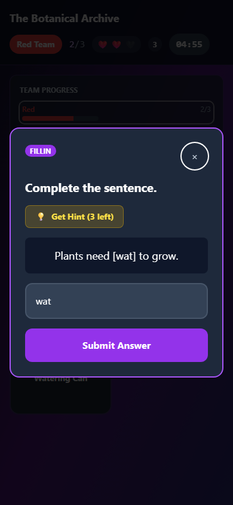
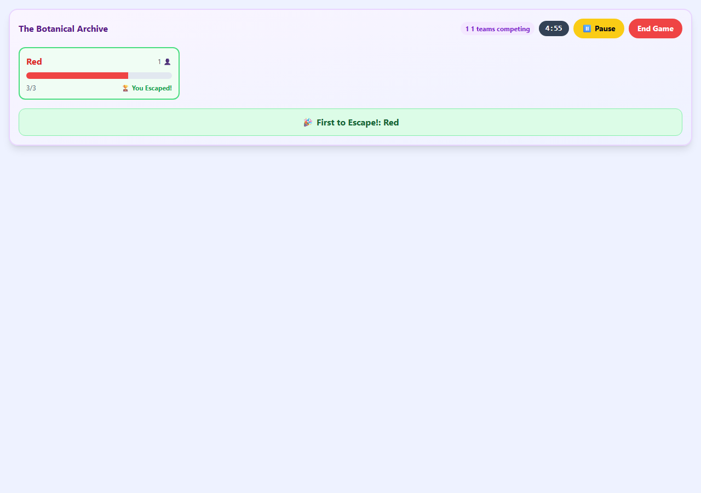
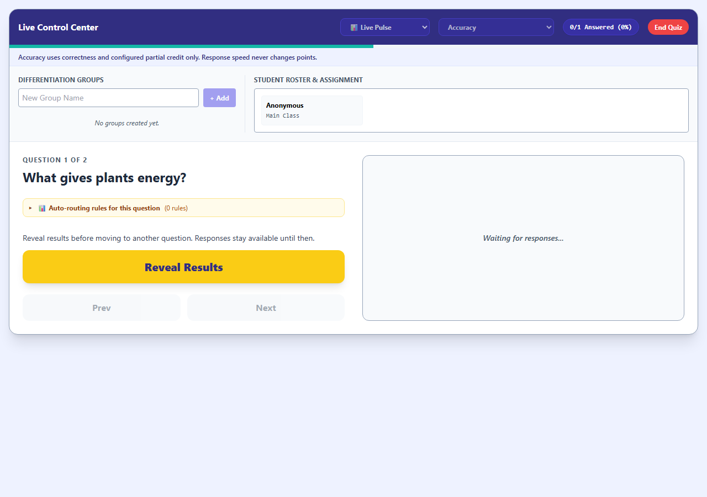

# Live escape room and quiz review — September 7, 2026

Continued the escape-room review into the live teacher/student experience and the shared controls for Live Pulse, Boss Battle, Team Showdown, advanced quiz response formats, and Concept Quest.

## Changes

| Area | Issue found | Result |
| --- | --- | --- |
| Live escape controls | Pause and End wrote to a different session path from gameplay. | Both controls update the actual active session and expose failed writes. Ending also clears terminal overlays. |
| Shared timer | The host decremented a snapshot every second; delayed/background tabs lost time and timeout unmounted results. | A shared deadline drives local countdowns, pause saves remaining seconds, resume establishes a new deadline, and timeout retains the result. A team that already escaped keeps its victory. |
| Puzzle correctness | Sequence indices appeared as labels; any full matching set was accepted; hints leaked below the puzzle. | Sequence controls display the authored text and retain stable indices. Matching validates each pair, supports removing pairs, and rejects duplicates. Hints appear only after a saved request. |
| Team progress | Teammates replaced the same solved array and life counter. | Newly launched rooms write distinct solve/miss fields, then derive combined progress, lives, hints and streaks. Existing rooms retain their legacy update format. |
| Student interaction | Answers carried between puzzles, paused dialogs could leave focus behind, failed writes were silent. | Separate puzzle drafts, protected pending submissions, retained work after failure, visible retry feedback, and focus restoration on resume. |
| Mobile live room | The fixed leaderboard obscured room objects, and emoji hearts did not visibly lose their color. | The leaderboard joins the small-screen flow; headers wrap; lost hearts fade and have an accessible life count. |
| Live quiz restarts | Restarting the same question reused its answer identity and old peer responses. | Every start creates a new round ID. Students reset their attempt; the host accepts the current round while answers are open and excludes old round responses. |
| Teacher quiz controls | Navigation and mode changes could clear open answers; failures were silent; end handling referenced an unavailable toast. | Active answers lock navigation/mode changes until reveal. Pending/error states and duplicate-action guards cover lifecycle writes. End feedback is safe. |
| Boss image rendering | Both extracted live modules referenced a style constant outside their scope, crashing when a boss image loaded. | Each view now owns the small image style it needs; image-present rendering is tested. |
| Boss settings | Difficulty was locked in the normal idle state and did not consistently update the active boss. | Pre-round difficulty changes update the actual health pool and remain locked after battle progress. |
| Submission recovery | A participation-only fallback looked like successful answer delivery; a late failure could clear the next round. | Sending/receipt feedback is explicit. Students can retry their retained answer over P2P. Async completions are scoped to their attempt. The cloud fallback still contains no answer content. |
| Concept Quest | Failed student choices were silent and a failed round save could announce success. | Persistent errors, guarded writes, pause-aware resolution, and success feedback only after a saved round. |

## Validation

- Combined regression run: **153 passed across 13 test files**; 128 unchanged translation-pack checks intentionally skipped. This includes the new mounted teacher/student tests, existing advanced response formats, scoring policies, P2P contracts, solo escape-room behavior, accessibility contracts, and Concept Quest engine tests.
- The final combined run includes successive boss difficulty changes and rendering boss images in both teacher and student views.
- Synchronized browser walkthrough: teacher and student views used the same simulated session. Completed three live puzzle types, rejected wrong matching, propagated life loss, paused/resumed a typed draft, verified focus, explained receipt-only delivery, and restarted a question successfully.
- Mobile viewport: **390 × 844**, no page or dialog horizontal overflow. Teacher viewport: **1280 × 900**. **No browser errors**.
- Canonical app and desktop App.jsx parse successfully. Five generated runtime modules match their desktop public mirrors.

The browser session used an in-memory transport exercising the application's document paths and field updates. No production classroom, Firebase, LAN, or mailbox service was connected or modified, and no deployment was performed. Legacy live sessions retain their original concurrent counter limitations until a new room is launched.

## Reproduce

- `tests/live_quiz_escape_review_runtime.test.js` — mounted React interactions and pure progress/answer/timing checks.
- `tests/live_quiz_p2p.test.js` — updated round-aware P2P and receipt contracts.
- `node dev-tools/check_live_quiz_review.cjs` — synchronized teacher/student browser walkthrough.

## Screenshots

