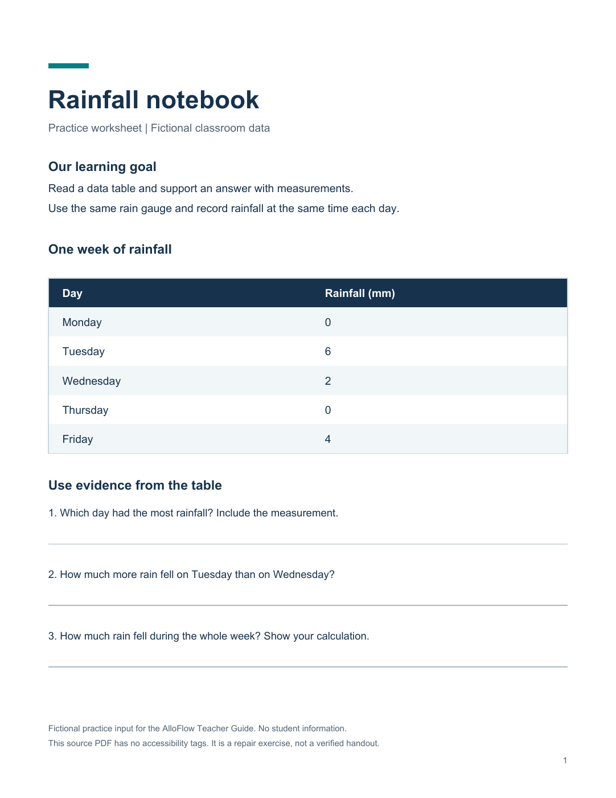
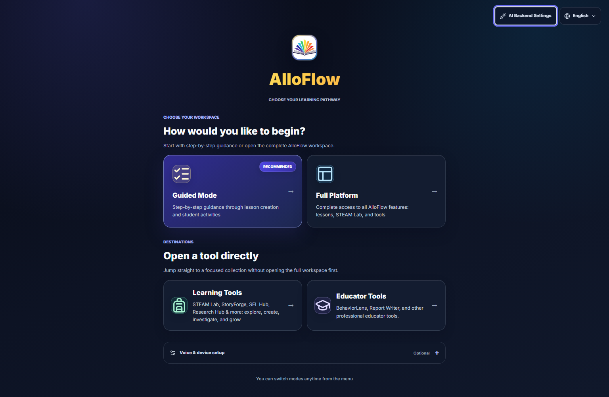
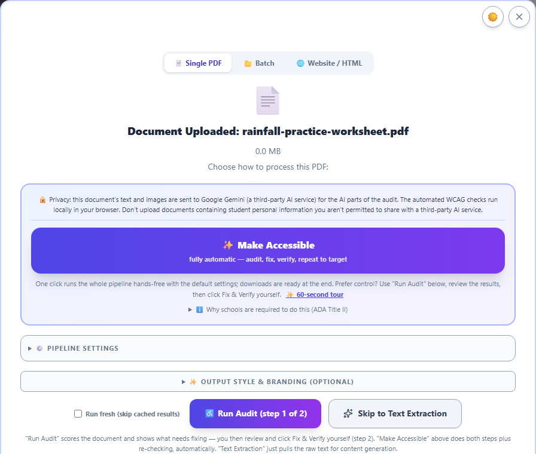

# Make a document accessible: the remediation workflow

Schools run on inherited documents: the scanned packet, the district PDF, the worksheet someone made in 2009. AlloFlow's remediation workflow turns a document like that into an accessible version, shows its evidence, and keeps you, the human, as the last step. This chapter is the teacher's view; the [white paper](https://alloflow-cdn.pages.dev/whitepaper.html) covers the same pipeline for a district evaluation.

## The shape of the workflow

1. **Upload the document.** PDFs, including scanned or image-based ones, which are routed through text recognition. Word and PowerPoint files, photos and screenshots of a page, and text-family files (markdown, plain text, CSV or TSV, and spreadsheets) also work. Anything that is not already a PDF is rebuilt as accessible HTML plus the alternate formats, rather than being forced back into a page layout it never had.
2. **Read the audit.** The tool checks the document against accessibility rules and shows what it found, before anything is changed.
3. **Run Make Accessible.** The pipeline rebuilds the document as structured, accessible content, applying safe deterministic fixes first and AI-assisted repairs only where diagnosis is needed. Improvement is bounded: each change is kept only if fresh checks show it helped, rolled back if it made things worse, and the process stops when results stop improving.
4. **Review the result against the source.** This step is yours and it is not optional. The comparison view exists so you can confirm nothing was dropped or distorted; a document can pass every automated check and still misrepresent the original.
5. **Export what you need**: accessible HTML, a tagged PDF, and alternate formats including DOCX, ODT, EPUB 3, DAISY 3, and Grade-1 braille (BRF), each with its own stated validation boundary.

## Worked example: keep the rainfall data, improve access

**Classroom goal:** students read a table and support an answer with measurements. You are changing how they access the worksheet, while keeping its data and questions intact.

[Download the fictional Rainfall notebook practice PDF](practice/rainfall-practice-worksheet.pdf). It is a one-page, text-based PDF with no accessibility tags, created for this exercise. It contains no real student information. It is the **input to repair**, not a verified accessible handout; a scanned worksheet would also require text recognition.

*Practice source, created September 4, 2026. A neat-looking page can still lack document structure. This image shows the original worksheet, not a completed repair.*

### 1. Establish what must survive

Before uploading, make a short source checklist. The worksheet says to use the same rain gauge and record rainfall at the same time each day. Its measurements are:

| Day | Rainfall (mm) |
| --- | --- |
| Monday | 0 |
| Tuesday | 6 |
| Wednesday | 2 |
| Thursday | 0 |
| Friday | 4 |

The three questions are:

1. Which day had the most rainfall? Include the measurement.
2. How much more rain fell on Tuesday than on Wednesday?
3. How much rain fell during the whole week? Show your calculation.

**Teacher checkpoint:** preserve both zeroes, all five day labels, the unit **mm**, and all three questions. Do not accept an attractive redesign that silently drops a row, changes a measurement, or fills in the answers for students.

### 2. Upload and choose the repair route

Open **Full Platform**, choose **Teacher** if the role prompt appears, and use **Source Material → Upload** to attach the practice PDF. Wait for file intake and the audit controls to finish loading before starting work.

*Local app capture, September 4, 2026. Choose Full Platform for this walkthrough. AI Backend Settings is available from the launch screen; your Canvas host may present setup differently.*

Use **Make Accessible** for the one-click workflow, or **Run Audit** if you want to inspect the opening findings first. If the app requests an AI connection, configure an approved backend before proceeding. A missing connection is a setup condition, not evidence that the document failed an accessibility check.

*Local app capture, September 4, 2026, focused on the audit choices after uploading the fictional worksheet. No audit or repair has run in this view.*

Check the filename before proceeding. **Run Audit** lets you review findings before choosing **Fix & Verify**; **Make Accessible** starts the combined workflow. **Skip to Text Extraction** supplies text for content generation and does not complete an accessibility repair. Leave the optional pipeline and output settings collapsed for this first walkthrough. Any remediation time shown by the app is an estimate, not a measured result for this example.

For this first practice run, keep the tab visible. Use **Run fresh** only when you need to repeat the processing rather than reopen cached findings. This chapter does not supply a measured audit score or a precomputed repair result for the sample; review the evidence from your own run.

### 3. Review meaning and access together

When a result is available, compare it with the original. A useful review records the specific item you checked rather than only the overall score.

| Check | What to inspect in this worksheet | Example reason to revise or hold the result |
| --- | --- | --- |
| Completeness | The title, learning goal, two collection instructions, five data rows, and three questions are present. | The Friday row or the final question is missing. |
| Data fidelity | Monday 0, Tuesday 6, Wednesday 2, Thursday 0, Friday 4; all amounts remain in millimetres. | A zero became a blank, or the unit changed to centimetres. |
| Reading order | Read the title, goal, instructions, table, and questions in a sensible sequence. | A response line or footer interrupts a question. |
| Table meaning | Day and rainfall remain associated; inspect the actual file's table headers with appropriate reading or inspection tools. | Measurements are read as an unexplained list with no day or unit. |
| Response access | The student can reach the questions and has a usable way to answer. | A paper answer line is presented as though it were a working digital input. |
| Learning demand | The worksheet still asks students to compare and total measurements. | The repaired student copy includes worked answers or rewrites the task into a different skill. |

For your own content check, the answers are **Tuesday, 6 mm**; **4 mm more**; and **12 mm in total**. Keep this check key separate from the student handout.

An example review note might read: “All five measurements and all three questions match the source. Reading order is sensible. Digital response fields still need checking.” That note describes a limited observation; it does not certify the document or stand in for testing the exported file.

### 4. Reopen the copy students will receive

Choose a format that suits the activity, then open the downloaded file outside the editor. For a web handout, check text enlargement, a narrow viewport, keyboard access, and the intended reading tools. For a tagged PDF, inspect that exported PDF's structure and reading order. If the worksheet uses plain answer lines, decide whether students will write on paper, use an approved annotation tool, or receive a separate accessible response form.

Keep the source, reviewed student copy, and available evidence report together with a clear version label. If a check is incomplete, preserve that limitation when sharing the result for further review. See [Documents and printing](15-documents-and-printing.md) for format choices and preview habits.

## While a run is going

A thorough run on a long document takes a while, and there are three things worth knowing.

- **Leave the tab visible.** Browsers slow down background tabs on purpose, so a minimized or hidden window makes the same run take noticeably longer. The tool tells you when this is happening and welcomes you back, but the fastest run is the one you leave on screen.
- **Use "Run fresh" when you want a true re-test.** Finished runs are cached so you can reopen them instantly. That is usually what you want, but if you are checking whether a change helped, tick the fresh-run option so the document is genuinely processed again instead of replayed from cache.
- **If something looks wrong, export the diagnostic bundle** before you close the run. It captures what actually happened during processing, which is the difference between "it seemed slow" and a report someone can act on.

## Doing this without the app

If you already use a compatible desktop MCP host, the optional local connector can run the pipeline on your computer. You install it once, then ask in plain language to audit a document, remediate it, or export a supported format. The connector reads the file from disk; deterministic processing does not require an AlloFlow upload, but the host, configured AI provider, logging, and export destination still need their own review.

Two things make it worth knowing about. The deterministic tools (validation, text extraction, redaction, structure checks, exports) work with no AI key at all, and the AI-assisted repair runs on a key you supply yourself. Your IT department may prefer this path for exactly that reason. See [For your IT department](17-for-your-it-department.md).

## What the evidence report is for

Every run produces a report bound to the exact files it describes: what was found, what was fixed, what remains, and which checkers said so at which versions. Keep it with the document. If anyone ever asks "how do you know this version is accessible," the answer is a report, not a recollection.

## Honest expectations

- **This is repair with evidence, not magic.** The pipeline claims bounded, checkable improvement with a human decision at the end. It does not claim "guaranteed compliant," and neither should you.
- **Structure is the hard part.** Reading order, table structure, and meaningful alt text are where automated tools most need your review, because correctness there depends on what the document *means*.
- **A finished run can be reopened.** The results stay available on the device; the storage manager lists cached remediations, and the return pill brings you back to one you stepped away from.

## Confidential documents

The workflow can use a local AI endpoint instead of a cloud provider, and its deterministic validation tools run locally. For sensitive documents, verify that the chosen endpoint is actually on the device, that the desktop host and model do not send telemetry or retain prompts, and that exports stay in an approved location before describing the route as no-egress. Set the endpoint in AI Backend Settings and see [Privacy and responsible AI](07-privacy-and-responsible-ai.md) for the handling rules that still apply to the files themselves.

## Where this connects

- Structural plain-language edits to documents you are *authoring* use the same engine via the Expert Workbench, covered in [Documents and printing](15-documents-and-printing.md).
- For born-accessible materials you generate rather than inherit, see [Accessibility and UDL](04-accessibility-and-udl.md); remediation is for the documents that arrive already broken.
