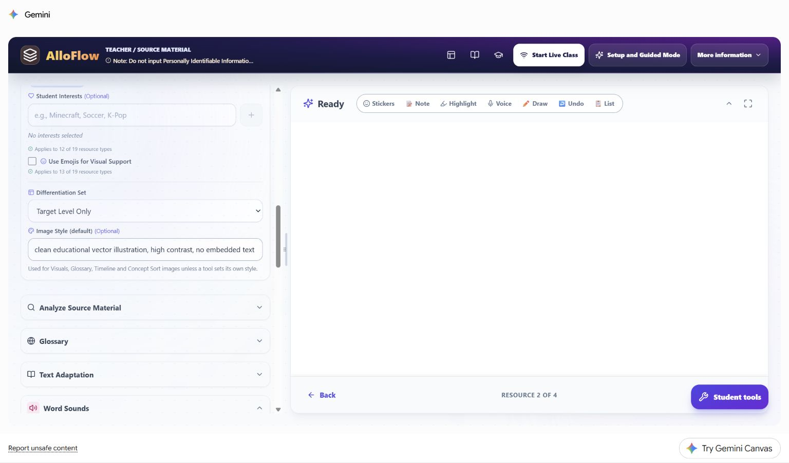
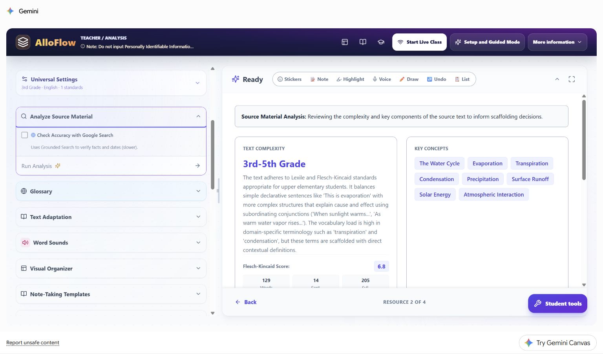
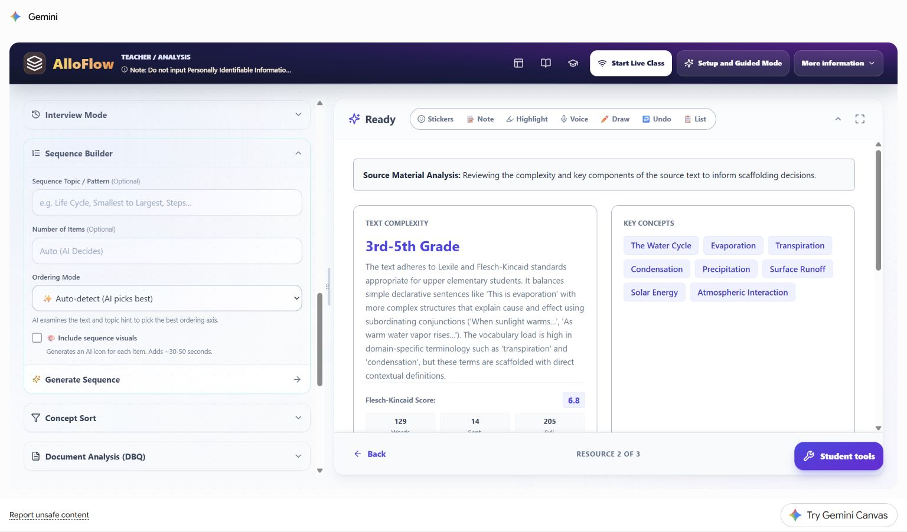

# Worked student vignette: water-cycle lesson

This chapter follows one fictional learner through a complete planning decision. It shows how a teacher can turn a broad student need into a small, reviewable AlloFlow resource set without entering a student name, disability label, assessment record, or other personal information.

The learner, classroom, and response samples are hypothetical. The live product images were captured in the signed-in Gemini Canvas release on August 20, 2026 with a synthetic third-grade water-cycle source and no student data. They demonstrate the workflow and the teacher's decisions; they are not evidence about a real child.

## Case snapshot

Ms. Rivera is preparing a third-grade science lesson about the water cycle. The shared learning target is:

> Explain how water moves through evaporation, condensation, precipitation, and collection, using sequence and cause-and-effect language.

One learner in the class, called **Sam** in this vignette, contributes accurate ideas during discussion but can lose the sequence when information is presented in a dense paragraph. Sam benefits from previewing a small number of academic terms, seeing a process laid out visually, and choosing between a short typed explanation and an oral response. The teacher wants those supports available to the whole class so Sam is not publicly singled out.

| Planning question | Decision in this case |
|---|---|
| What remains the same for everyone? | The science target, source facts, four required process terms, and expectation to explain cause and effect. |
| What barrier is the teacher addressing? | Holding the process sequence and technical vocabulary in mind while reading and explaining. |
| What supports will be offered? | A reviewed glossary, a five-step visual sequence, read-aloud, and typed or oral response. |
| What evidence will count? | An explanation that puts the stages in a defensible order and connects the Sun's energy to evaporation. |
| What is intentionally not entered in AlloFlow? | Sam's name, diagnosis, plan, test scores, family details, and prior responses. |

This is an instructional vignette, not a recommendation for an individual education program, accommodation plan, diagnosis, or placement. A real learner's supports should follow the responsible team process and the student's established access methods.

## Plan the smallest useful resource set

Ms. Rivera does not generate every available resource. She chooses four items that each have a distinct job:

1. **Analyze Source Material** to identify the text demands she must review.
2. **Glossary** to preview essential academic and domain terms.
3. **Sequence Builder** to make order and cause visible.
4. **Exit Ticket** to collect the same explanation target through more than one response route.

The teacher will package only the reviewed student-facing items. The source analysis and answer guidance remain teacher-facing.

| Resource | Teaching purpose | Teacher review gate | Next action if it does not help |
|---|---|---|---|
| Source analysis | Surface likely vocabulary, syntax, and concept demands. | Compare every claim with the actual passage and grade context. | Ignore or correct an automated estimate that does not match the source. |
| Glossary | Reduce the cost of entering the passage. | Keep only terms students need for this task; verify definitions and examples. | Replace a definition with a teacher-written one or remove the card. |
| Visual sequence | Keep the process order visible during explanation. | Verify order, arrows, labels, and the role of the Sun. | Edit the sequence or use a teacher-created diagram. |
| Exit ticket | Show whether students can explain the process, not merely recognize terms. | Check the prompt, scoring guidance, and response options. | Confer, accept another approved response mode, or reteach before scoring. |

## Step 1: enter lesson defaults, not a student profile

Ms. Rivera opens Universal Settings and enters only information that belongs to the lesson: third grade, English, the approved science target or standard, and a high-contrast educational image style. She leaves Student Interests blank because no interest theme is necessary for this task.

**Live Canvas decision shown:** the universal image style is a lesson default, not a description of Sam. A resource-level exception should be used only when the resource has a real instructional need, such as a black-line image that must photocopy clearly.

The teacher uses this planning translation:

- Private observation: "Sam loses the sequence in dense text."
- Lesson-level support: "Provide a five-step visual sequence and keep the original source available."
- Private observation: "Sam explains more fully aloud."
- Lesson-level support: "Allow a typed or oral explanation using the same success criteria."

The second statement in each pair can guide a resource without exposing who prompted the decision.

## Step 2: analyze before adapting

The source analysis identifies upper-elementary text demands and highlights terms such as *evaporation*, *condensation*, *precipitation*, *transpiration*, and *surface runoff*. Ms. Rivera treats those outputs as leads to inspect, not as a reading diagnosis or a command to simplify everything.

**Live Canvas decision shown:** the analysis places likely demands beside the source workflow. It does not decide what Sam can understand. Ms. Rivera checks the actual sentences and sees that the essential science is accessible when the process terms are previewed and the sequence remains visible. She keeps the original passage rather than replacing it automatically.

Her review questions are:

- Are the important scientific facts and qualifiers represented accurately?
- Which terms must students learn, and which can be explained in ordinary language?
- Does a numerical readability estimate hide helpful context, diagrams, or teacher modeling?
- Would adaptation remove productive science language that belongs in the target?

## Step 3: preview a small vocabulary set

The live Glossary panel can generate both Tier 2 academic words and Tier 3 domain words. The screenshot shows a broad starting configuration of four Tier 2 and six Tier 3 terms while the source analysis remains visible on the right.

**Live Canvas decision shown:** generation breadth is not the same as the final student load. Ms. Rivera generates candidates, then reduces the delivered set to five terms: *cycle*, *evaporation*, *condensation*, *precipitation*, and *collection*. She checks each definition in the context of the passage and adds one familiar example. She does not require Sam to memorize ten disconnected cards before beginning the lesson.

A privacy-safe Custom Instructions entry for this case is:

> Define only terms needed to explain the water-cycle sequence. Use one short definition and one familiar example. Preserve the scientific term. Do not add student names or ability labels.

## Step 4: make the sequence visible

Ms. Rivera opens Sequence Builder. The panel lets her specify the topic, number of items, ordering mode, and whether visuals are included. In the captured starting state, item count is still automatic and visuals are not yet selected; the prior source analysis remains visible for comparison.

**Live Canvas decision shown:** the teacher changes the automatic starting state for an instructional reason. She requests five items, selects process order, turns on visuals, and asks for arrows or connection language that makes cause and effect explicit. After generation, she verifies that evaporation follows warming, condensation follows cooling, and the sequence does not imply that the cycle has one permanent starting point.

Her Custom Instructions entry is:

> Create five age-respectful steps for a third-grade science lesson. Include the Sun's energy, evaporation, condensation, precipitation, and collection. Use concise labels and a clear visual connection between steps. Keep all science claims consistent with the source.

Students may keep this sequence open while reading, discussing, or responding. It is a support for the shared task, not an easier replacement task.

## Step 5: collect comparable evidence through two routes

Ms. Rivera creates a short exit ticket with two content prompts and one unscored reflection. The key evidence prompt is:

> Explain how the Sun helps water move through the water cycle. Use at least three of these words: evaporation, condensation, precipitation, collection. You may type three or four sentences or record a short oral explanation.

Both routes use the same criteria:

- the stages are in a scientifically defensible order;
- the explanation connects the Sun's energy to evaporation;
- at least three target terms are used meaningfully;
- the response explains a relationship rather than listing words.

AlloFlow can help draft the prompt, options, and feedback, but Ms. Rivera checks them before students see them. She does not infer that a missing typed response means missing science understanding until she has checked the delivery route, access, language, and the offered oral option.

## Step 6: let the alignment check challenge the plan

The live Curriculum Audit flags a mismatch between the water-cycle lesson and NGSS 3-ESS2-1, which addresses representing weather data. This is a useful failure: the tool has surfaced a planning problem rather than decorating the lesson with a standard label.

**Live Canvas decision shown:** Ms. Rivera does not click **Apply suggested fixes** automatically. She checks the district curriculum and makes one of two honest choices:

1. If the lesson is intended as prerequisite concept-building, she labels it that way and does not claim that it assesses 3-ESS2-1.
2. If the lesson must assess 3-ESS2-1, she replaces or extends the evidence task with weather data that students represent and interpret.

The same review applies to UDL feedback. A low audit score is a prompt to inspect barriers and options; it is not proof that a lesson is inaccessible, and a high score would not certify the real student experience.

## Step 7: preview the package as a student

After the content is corrected, Ms. Rivera opens Document Builder. The live interface provides student-document formats, appearance controls, navigation, focus mode, accessibility inspection, and a preview area.

**Live Canvas decision shown:** opening Document Builder is not the final check. Ms. Rivera confirms that the preview contains the intended student content, that teacher analysis and answer material are absent, and that the exported or linked version works outside the teacher view. She tests keyboard navigation, zoom, read-aloud, and the oral-response route on the same kind of device students will use.

The student package contains:

1. the original passage with read-aloud available;
2. the five-term reviewed glossary;
3. the five-step visual sequence;
4. the exit ticket with typed and oral response directions;
5. one plain-language help route if technology fails.

It does not contain the private vignette, an ability label, the source analysis, the alignment score, or a teacher answer key.

## Hypothetical classroom evidence and next move

Sam gives this fictional oral response:

> The Sun warms water, so some water evaporates and goes into the air. It cools and condensation makes clouds. Then precipitation falls, and water collects so the cycle can keep going.

Ms. Rivera records only the instructional evidence needed for her next move. She does not treat the wording as a standardized score or ask AlloFlow to diagnose the student.

| Evidence noticed | Reasonable interpretation | Next instructional move |
|---|---|---|
| The sequence is complete and the Sun-to-evaporation link is accurate. | The lesson target is demonstrated through the oral route. | Ask for one transfer example, such as a puddle after rain. |
| Terms are accurate but the explanation is a list. | The relationship language may need modeling. | Model one because/so sentence and ask for a revision. |
| The order is accurate with the sequence visible but incomplete without it. | The visual support is currently useful; independence is not yet established. | Keep the support available and revisit after more practice. |
| Several students reverse condensation and precipitation. | This is likely a classwide instructional signal, not an individual deficit. | Reteach with a model and collect a fresh sample. |
| The typed route is blank but the oral explanation is accurate. | The blank response does not establish missing science knowledge. | Accept the approved oral evidence and inspect the writing or delivery barrier separately. |

## Reuse the decision pattern

The durable pattern is **target, barrier, support, evidence, branch**:

1. Name the shared learning target.
2. Describe the barrier without identifying a student in the tool.
3. Generate the smallest support set that could remove that barrier.
4. Review every output against the source, target, accessibility needs, and real delivery route.
5. Collect comparable evidence through approved response options.
6. Decide the next instructional move from the evidence, not from an AI label.

For another vignette, change the subject and barrier while keeping that decision structure. A humanities case might pair a primary-source glossary with a DBQ evidence organizer. A mathematics case might pair a worked example with an alternate response format. A multilingual case might add a reviewed home-language support while preserving the shared content target.

Return to [Prepare a lesson](02-prepare-a-lesson.md) for the full planning workflow, [Classroom workflows](06-classroom-workflows.md) for more recipes, and [Privacy and responsible AI](07-privacy-and-responsible-ai.md) before entering or sharing any student-related information.
