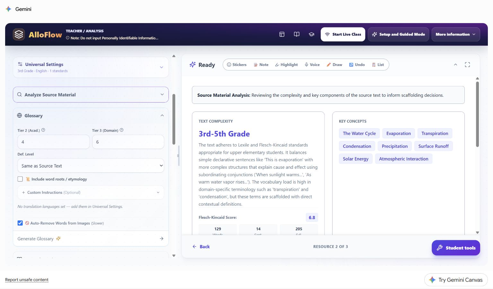
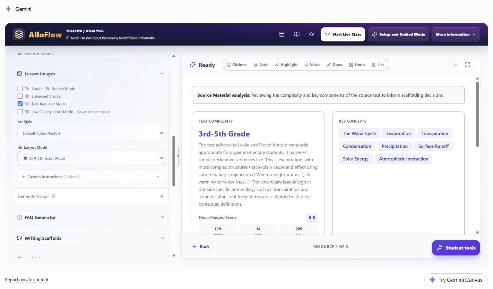
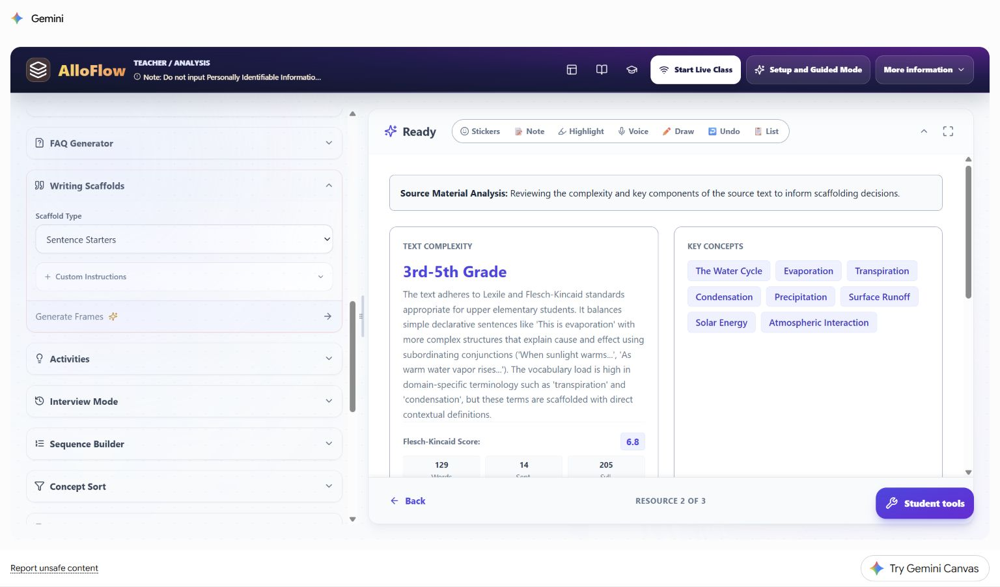
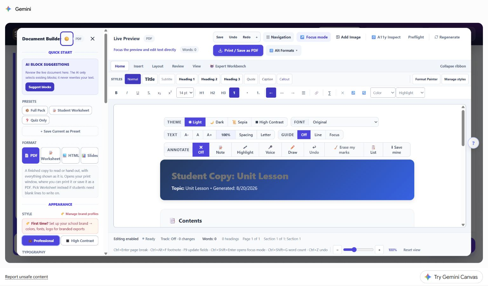

# Worked multilingual vignette: water-cycle language bridge

This fictional case shows how a teacher can add home-language access while preserving a shared science target. It uses the same synthetic third-grade water-cycle source as the first vignette so readers can compare how one lesson changes when the barrier changes.

The learner, teacher, classroom evidence, and family interaction are hypothetical. No learner profile was entered in AlloFlow. The live product images were captured in signed-in Gemini Canvas on August 20, 2026 with no student data. The manual frames the app region for readability; each untouched 1536 x 902 original remains in the maintained live-capture index in the documentation source.

## Multilingual case snapshot

Ms. Rivera is teaching the same water-cycle lesson described in the first worked case. The shared learning target remains:

> Explain how water moves through evaporation, condensation, precipitation, and collection, using sequence and cause-and-effect language.

One fictional learner, called **Lina** in this chapter, uses Arabic with family and is developing the English academic language needed for science class. Lina can show accurate water-cycle relationships in drawings and discussion, but an English-only paragraph and unfamiliar domain terms make it harder to demonstrate that understanding independently. Ms. Rivera wants home-language access to support meaning while keeping the English science terms visible for class participation.

| Planning question | Decision in this case |
|---|---|
| What is the content target? | Explain the water-cycle process and the role of the Sun. |
| What is the language demand? | Read and use English process terms and cause-and-effect language. |
| What access will be added? | Reviewed Arabic support, visuals, read-aloud, and optional English sentence frames. |
| What evidence will count? | An accurate sequence and causal explanation through an approved combination of labels, drawing, speech, or writing. |
| What will not be graded as science? | Accent, translation quality, English sentence complexity beyond the stated target, or use of the home-language support. |
| What stays out of AlloFlow? | Lina's name, immigration history, program status, test scores, family records, and prior responses. |

This vignette does not determine English-language proficiency, services, placement, or an individual plan. Those decisions require the responsible school process and multiple appropriate sources of evidence.

## Separate the science target from the language work

Ms. Rivera writes two related goals before generating anything:

- **Science goal:** explain how energy and changes in state move water through a cycle.
- **Language practice:** use the English terms *evaporation*, *condensation*, *precipitation*, and *collection* in a supported explanation.

The language practice supports participation in the science task; it does not replace the science goal. Lina may use Arabic to build meaning, plan, ask questions, or clarify a relationship. The final evidence can combine the home language with the required English science terms unless a separate language objective says otherwise.

## Plan a compact language-access set

Ms. Rivera chooses five connected resources:

1. a reviewed bilingual glossary;
2. one text-reduced process visual;
3. optional English sentence frames;
4. bilingual assignment directions and success criteria;
5. a student package tested for language direction, reading order, and read-aloud.

| Resource | Purpose | Human review |
|---|---|---|
| Bilingual glossary | Connect a few English science terms to meaning. | Verify both languages in context; keep the English term visible. |
| Process visual | Make sequence and relationships available without another dense paragraph. | Check labels, arrows, contrast, and whether the visual teaches the correct process. |
| Sentence frames | Offer an English entry point for cause and sequence. | Keep frames optional and avoid forcing every student into identical prose. |
| Directions | Make the task, choices, and success criteria understandable. | Confirm that both versions require the same thinking and deliverable. |
| Student package | Put the reviewed supports in one predictable route. | Test language tags, right-to-left behavior, keyboard order, audio, and the real student link or file. |

## Step 1: catch a missing translation setting

The live Glossary panel shows an important preflight message: **No translation languages set — add them in Universal Settings.** The teacher notices this before generating the glossary.

**Live Canvas decision shown:** Ms. Rivera returns to Universal Settings, adds Arabic to the shared language list, and keeps English as the output language. Back in Glossary, she confirms that the panel now says it will include Arabic. She does not look for a Translations selector that may be hidden when its automatic target would duplicate the English output, and she does not enter Lina's name or label the setting with a student group. The language choice describes an available lesson support.

Before continuing, she confirms:

- the selected language and regional form match the intended audience;
- the school permits the configured AI or translation route for this material;
- a bilingual staff member, interpreter, family liaison, or other qualified reviewer can check high-stakes wording when available;
- the English source remains available for quotation and class discussion.

Machine translation is a draft. A fluent review is especially important for safety language, assessment directions, family communication, culturally specific wording, and terms that have more than one common translation.

## Step 2: generate broadly, deliver narrowly

The Glossary controls can produce several Tier 2 and Tier 3 terms. Ms. Rivera uses generation to find candidates, then delivers only the five terms needed for this task: *cycle*, *evaporation*, *condensation*, *precipitation*, and *collection*.

Arabic is already selected in Universal Settings, so AlloFlow uses that setting to add the translation column. Custom Instructions refine the glossary content; they do not select or enable a language. Her privacy-safe entry is:

> Include only the five required water-cycle terms. Keep each English science term exactly as it appears in the source. Use one short, context-specific definition and one familiar example. Do not infer language proficiency or add student information.

The resulting glossary includes the translation language configured in Universal Settings. She checks that each translation communicates the meaning used in the passage, not merely the most common dictionary equivalent. She also checks line wrapping, punctuation, text direction, pronunciation support when present, and whether generated images contain stray or unreadable text.

The glossary is available to the whole class. Students can use one language, both languages, or only the visual example without being assigned a public label.

## Step 3: add a visual that carries meaning

The Lesson Images panel offers Text-Reduced Mode, art style, layout, and Custom Instructions. The live capture keeps the source analysis visible while the teacher chooses how much text the visual should contain.

**Live Canvas decision shown:** Text-Reduced Mode is a starting choice, not proof that the image is accessible. Ms. Rivera asks for one clear process diagram with arrows and short labels. She keeps the required English terms on the visual and places reviewed Arabic terms in an adjacent key rather than asking an image model to draw bilingual text inside the artwork.

Her Custom Instructions entry is:

> Show the water cycle as a continuous process with the Sun, evaporation, condensation, precipitation, and collection. Use high contrast, clear arrows, and no decorative text. Leave space for a reviewed bilingual key outside the illustration.

After generation, she checks the process order, arrow direction, state changes, label-image relationships, contrast, and alt text. If the science is wrong, she edits or replaces the image rather than trying to explain away the error during class.

## Step 4: offer English frames without scripting the answer

The Writing Scaffolds panel can generate sentence starters. Ms. Rivera keeps the source analysis visible and chooses a narrow scaffold type rather than creating a full alternate assignment.

**Live Canvas decision shown:** the scaffold supports relationship language while leaving the scientific reasoning to the student. Ms. Rivera reviews three optional frames:

- "When the Sun warms water, ..."
- "After water vapor cools, ..."
- "Because water collects, ..."

Students may use, change, combine, or ignore the frames. The teacher does not require Lina to copy a complete generated paragraph, because that would hide whether the science relationship is understood.

The Custom Instructions entry is:

> Draft three optional English sentence frames for explaining sequence and cause in the water cycle. Leave the science idea for the student to complete. Use the required terms but do not provide a finished answer.

## Step 5: write directions before asking AI to draft

The Assignment Directions dialog asks for a title, student steps, due information, goals, an optional auto-check resource, and the route into the pack. It also offers **Draft for me**, but the teacher can write the task directly.

**Live Canvas decision shown:** Ms. Rivera writes the English directions first so the learning target and response choices are explicit, then requests an Arabic draft and reviews it. Both versions say:

1. Read or listen to the source.
2. Use the glossary and process visual as needed.
3. Explain the role of the Sun and put the water-cycle stages in order.
4. Use at least three English science terms.
5. Respond with a labeled diagram plus audio, a short typed explanation, or another approved class response route.

The success criteria are identical in both languages. The translation does not add extra hints, remove the causal explanation, or turn the task into vocabulary matching.

## Step 6: test the bilingual package, not just the preview

Document Builder provides formats, appearance controls, focus mode, navigation, accessibility inspection, and a live preview. Those controls make review possible; they do not guarantee that the content is ready.

**Live Canvas decision shown:** Ms. Rivera verifies the actual exported file or student link. For the bilingual sections, she checks:

- Arabic text is marked with the correct language and displayed right to left;
- English science terms remain readable in their left-to-right form;
- punctuation, numbers, arrows, and mixed-language lines appear in the intended order;
- headings and links have a sensible keyboard and screen-reader sequence;
- read-aloud changes language or voice appropriately instead of reading both languages as English;
- the visual, glossary, directions, and response route still work on a school device;
- teacher notes, translation-review comments, and answer guidance are not in the student copy.

If the export cannot preserve direction or language tags, she uses a format that can and provides a stable fallback, such as a reviewed HTML handout or teacher-approved print copy.

## Hypothetical evidence and the next decision

In this fictional example, Lina labels the diagram with the four English process terms, rehearses the relationship in Arabic with an approved partner, and records a short explanation that uses the English terms within the response. Ms. Rivera evaluates the science relationships and the stated language practice separately.

| Evidence noticed | Reasonable interpretation | Next move |
|---|---|---|
| The process and arrows are accurate; required English terms are used meaningfully. | The science target is demonstrated with language support. | Ask for a new example, such as explaining a puddle after rain. |
| The drawing is accurate but the causal explanation is missing in both response routes. | The relationship may need more modeling or questioning. | Confer with the visual present and model one because/so connection. |
| The science is accurate in the home language but English terms are not yet stable. | Content understanding and English vocabulary practice are at different points. | Preserve the science evidence and continue targeted vocabulary practice. |
| The English response is brief but accurate. | Brevity alone does not show weak science understanding. | Use the shared criteria; do not add an unstated language-complexity penalty. |
| Several students misunderstand condensation despite using the glossary. | Translation did not remove the conceptual barrier. | Reteach the state change with a model or observation and collect new evidence. |
| The Arabic directions and English directions lead to different products. | The versions are not equivalent enough for use. | Correct and re-review the directions before assigning. |

## Protect dignity and keep human relationships central

Do not use AlloFlow to rank home languages, infer immigration history, diagnose language needs, or replace an interpreter. Do not ask a student or family member to become the unpaid quality-control step for essential school communication. A learner may volunteer helpful feedback, but the school remains responsible for providing accurate, accessible information.

Avoid public pathway names such as "English learner version" or "low-language copy." Use neutral labels tied to purpose, such as "bilingual glossary," "visual process guide," "read and listen," or "sentence-frame option."

## Reuse the language-access pattern

The repeatable sequence is:

1. Separate the content target from the language demand.
2. Add the home language as an access option, not a lower target.
3. Keep essential English academic terms visible when they belong to participation in the lesson.
4. Pair translation with a meaningful visual or model.
5. Offer comparable response routes and shared success criteria.
6. Review language, culture, accessibility, and content accuracy with qualified humans.
7. Interpret content evidence separately from developing English unless language itself is the target.

Continue with [Accessibility and UDL](04-accessibility-and-udl.md) for learner-experience checks, [Classroom workflows](06-classroom-workflows.md) for more recipes, and [Privacy and responsible AI](07-privacy-and-responsible-ai.md) before entering, translating, or sharing student-related information.
