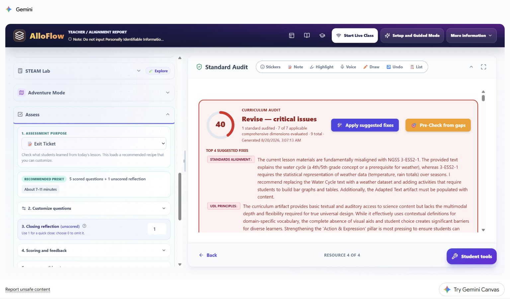
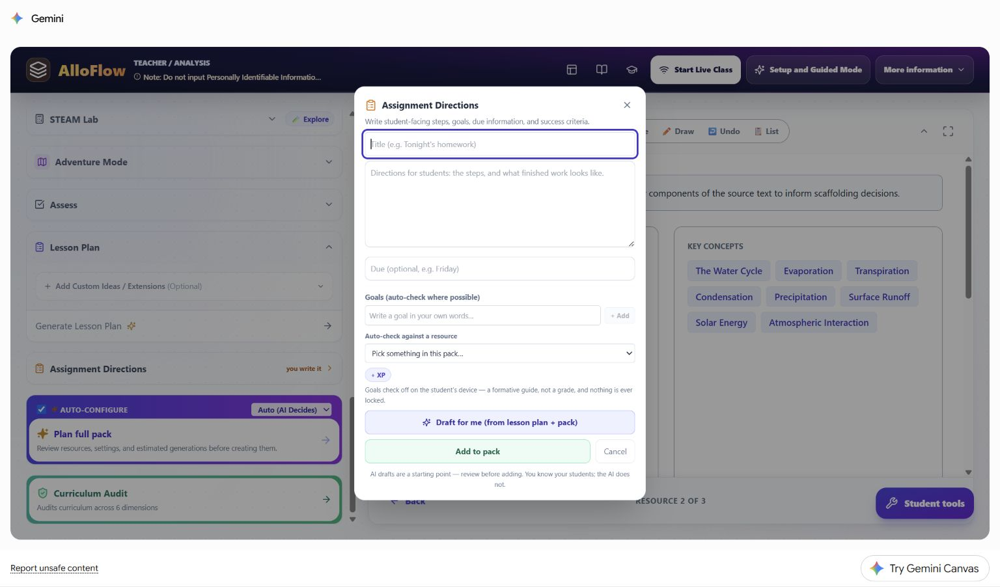
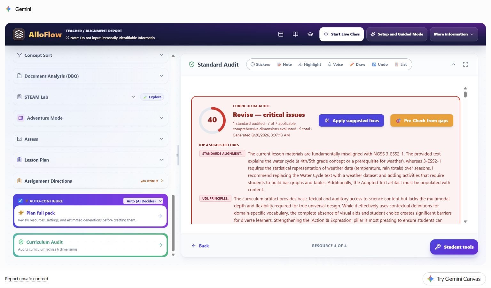
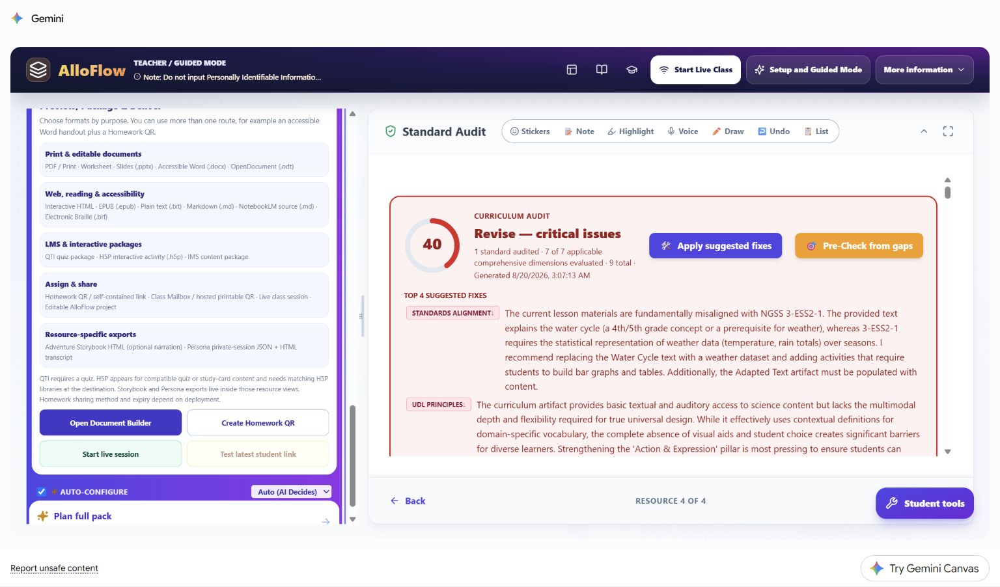

# Worked assessment-access vignette: show the science, not the writing speed

This fictional case follows a teacher who wants a short water-cycle check to measure science reasoning without accidentally turning it into a test of handwriting speed, sustained typing, or memory for a long set of directions. It uses the same synthetic third-grade lesson as the other worked cases so readers can see how one target leads to different AlloFlow decisions when the barrier changes.

The learner, classroom, work samples, and scores are hypothetical. No learner profile was entered in AlloFlow. The live product images were captured in signed-in Gemini Canvas on August 20, 2026 with no student data. The manual frames the app region for readability; each untouched 1536 x 902 original remains in the maintained live-capture index in the documentation source.

## Assessment-access case snapshot

Ms. Rivera wants to know whether students can explain how the Sun drives part of the water cycle. One fictional learner, called **Jordan** in this chapter, gives accurate explanations during partner talk and labels diagrams correctly, but produces very little during a short, text-heavy exit ticket. The teacher does not assume that the blank space represents missing science knowledge. She first inspects what the assessment actually requires.

The shared learning target is:

> Explain how the Sun's energy causes evaporation and how that change connects to the rest of the water cycle.

| Planning question | Decision in this case |
|---|---|
| What construct should the assessment measure? | Water-cycle sequence and causal science reasoning. |
| What is not part of that construct? | Handwriting speed, typing stamina, spelling, or remembering several directions at once. |
| What access will be available to everyone? | Chunked directions, optional read-aloud, a process visual, and typed, drawn-plus-labeled, or recorded response routes. |
| What remains comparable across routes? | The same prompt, science terms, success criteria, and evidence of cause and sequence. |
| What stays out of AlloFlow? | Jordan's name, diagnosis, plan, scores, work samples, and the reason any learner uses an approved support. |

This vignette is an instructional example, not a recommendation for an individual plan or a substitute for the school's assessment, accessibility, or special-education process. Required accommodations and assistive technology should follow the learner's established plan and be tested in the real delivery environment.

## Name the evidence before choosing a format

Ms. Rivera turns the target into four observable criteria before asking AlloFlow to draft anything:

1. The response identifies the Sun as an energy source.
2. It connects warming to evaporation.
3. It places evaporation in a defensible water-cycle sequence.
4. It explains at least one relationship using words, labels, arrows, or speech.

Those criteria are the anchor. A route is acceptable only if it can reveal the same evidence. A multiple-choice item may efficiently check recognition, but it cannot replace the explanation evidence by itself. A polished paragraph may include the evidence, but prose quality is not scored unless writing is also an explicit target.

| Possible route | What the learner produces | Comparable evidence to inspect | Review risk |
|---|---|---|---|
| Short typed explanation | Three or four sentences. | Cause, sequence, and meaningful science terms. | Do not add grammar or typing speed to the science score. |
| Oral explanation | A brief recording or teacher-documented conference response. | The same cause, sequence, and terms. | Confirm audio works and use the same criteria, not an easier prompt. |
| Draw, label, and explain | A process sketch with arrows, labels, and a short caption or recording. | Correct relationships and an explicit Sun-to-evaporation link. | A decorative drawing without an explanation is not enough evidence. |

## Step 1: start with a formative purpose

The live **Assess** panel shows **Exit Ticket** as the assessment purpose and describes a recommended preset of five scored questions plus one unscored reflection. It also exposes separate areas for question customization, reflection, scoring, feedback, saved setups, and Custom Instructions.

**Live Canvas decision shown:** a preset is a starting point, not a requirement. Ms. Rivera needs a quick formative signal, so she reduces the set to two scored prompts and one unscored reflection. She avoids a long quiz that would collect more fatigue than useful evidence.

Her privacy-safe Custom Instructions entry is:

> Create a two-prompt formative check for the stated water-cycle target. Include one brief recognition item and one explanation item. Word the explanation prompt and success criteria so the teacher can use them unchanged with a typed, recorded, or drawn-and-labeled response. Do not include student names, ability labels, or diagnostic language.

This instruction shapes the wording; it does **not** switch on recording, drawing, or submission tools. Ms. Rivera must enable or provide each response route separately in the delivery environment and test it before assigning.

She reviews every generated item for scientific accuracy, reading demand, answer clues, cultural assumptions, and whether the stated response routes can actually show the target.

## Step 2: separate access from a change in the target

Ms. Rivera uses a simple test: **If I remove the barrier, can the learner still show all four science criteria?**

- Read-aloud changes access to the prompt; it does not supply the science explanation.
- Breaking directions into numbered steps reduces memory load; it does not reduce the target.
- Recording an answer changes the response mode; it does not remove cause-and-effect reasoning.
- Keeping a process visual available supports recall and organization; it does not make an incorrect sequence correct.
- Replacing the explanation with only a matching item would change the evidence and is not equivalent for this target.

The teacher records the instructional decision in lesson language, not student language: **Offer three equivalent response routes and score the common science criteria.** The system does not need to know which learner prompted the design or why any learner chooses a route.

## Step 3: write directions that make the choices real

The live **Assignment Directions** dialog asks the teacher to provide a title, student-facing steps, due information, goals, and an optional resource for automatic checking. It also offers AI drafting from the lesson plan and pack, with a visible reminder that the draft must be reviewed.

**Live Canvas decision shown:** Ms. Rivera writes the essential directions herself before using any draft assistance:

1. Review the water-cycle visual and the four science words.
2. Answer the first question.
3. For the explanation, choose one route: type, record, or draw and label.
4. Show how the Sun's energy connects to evaporation.
5. Check that your response shows both cause and sequence.

She does not write “Jordan may record.” The directions present legitimate classwide choices without disclosing who needs which route. If a learner has an individually required accommodation, the teacher provides it through the established process whether or not it appears as a classwide option.

## Step 4: audit the target and the assessment claim

The live Curriculum Audit catches that the synthetic water-cycle lesson had been labeled with NGSS 3-ESS2-1, a standard about representing weather data. The report calls the mismatch critical and recommends revising the lesson evidence.

**Live Canvas decision shown:** accessibility does not repair a validity problem. Ms. Rivera corrects the standard or changes the task before interpreting any score. She does not apply suggested fixes automatically, and she does not claim that flexible response routes make a misaligned assessment valid.

Her review separates three questions:

- **Alignment:** Does the prompt elicit the knowledge or reasoning named in the target?
- **Access:** Can students perceive the prompt and use an approved way to respond?
- **Scoring:** Do the criteria reward the target rather than unrelated performance demands?

An automated audit can flag a question to inspect. It cannot certify the assessment, choose a required accommodation, or decide what a learner knows.

## Step 5: choose and test the actual delivery route

The live **Preview, Package & Deliver** panel groups print and editable documents, web and accessibility formats, LMS packages, sharing methods, and resource-specific exports. The available buttons include Document Builder, a homework QR route, a live session, and a test of the latest student link.

**Live Canvas decision shown:** a listed export format is not proof that the assessment route works. Ms. Rivera opens the same student link or file students will use and tests it on the same kind of device. She checks:

- keyboard order, focus visibility, zoom, contrast, and read-aloud;
- whether the directions and success criteria remain attached to the task;
- whether typed, recorded, and drawn responses can actually be submitted;
- whether a recording has a private, workable location and a non-audio fallback;
- whether teacher notes, answer guidance, audit reports, and private observations are absent;
- what students should do if the network, microphone, or export fails.

If one route cannot be delivered reliably that day, she uses a tested equivalent, such as a brief teacher conference documented with the same criteria. She does not make a student troubleshoot in public to earn access.

## Hypothetical responses and scoring decisions

Ms. Rivera applies the same four science criteria to these fictional samples:

| Evidence received | Science interpretation | Scoring and next move |
|---|---|---|
| Jordan records: “The Sun warms liquid water. Some becomes water vapor, so that is evaporation. Later it cools, forms clouds, and can fall back down.” | Cause and sequence are present; the key term is used accurately. | Count the target as demonstrated. Give content feedback, not a penalty for using audio. |
| A typed response says, “The Sun makes evaporation,” with no sequence. | One causal link is present, but the broader relationship is incomplete. | Ask one follow-up about what happens after water vapor rises. |
| A labeled drawing shows correct arrows but no explicit role for the Sun. | The cycle is organized, but one required causal idea is missing. | Prompt for a label, caption, or brief oral addition about energy. |
| A blank digital response follows a microphone permission failure. | No valid inference about science understanding is available. | Restore access and recollect evidence; do not score the technology failure as zero knowledge. |
| Many students choose the same attractive wrong option. | The item may contain a misconception signal or a design flaw. | Inspect the distractor and reteach before making an individual conclusion. |

Ms. Rivera keeps any student-linked evidence in the school's approved system, not in Custom Instructions or a reusable AlloFlow project. She records only what is needed for instruction and follows local retention rules.

## Use a route-equivalence check before sharing

For every response choice, Ms. Rivera asks:

1. Does this route preserve the same target?
2. Can it reveal every required criterion?
3. Is the cognitive demand comparable?
4. Does the route avoid introducing a new barrier?
5. Can the teacher review and score it consistently?
6. Has it been tested in the real student environment?

If any answer is no, the route needs revision. “Choice” is not automatically accessible, and equal-looking formats are not automatically equivalent.

## Reuse the assessment-access pattern

The durable pattern is **construct, barrier, route, criteria, test, interpret**:

1. Define what the assessment should measure.
2. Identify unrelated demands that could hide that knowledge.
3. Offer approved routes that preserve the target.
4. Apply common criteria to all routes.
5. Test the actual student experience and fallback.
6. Interpret only evidence the route validly produced.

In mathematics, the construct might require showing a strategy, so an answer-only route would not be equivalent. In history, a DBQ target may require citing evidence, so dictation can change the input method but cannot remove the citations. In writing, sentence construction may be part of the target, so the teacher must distinguish access support from generating the response itself.

Continue with [Accessibility and UDL](04-accessibility-and-udl.md) for the learner-experience review, [Review evidence and plan next steps](05-review-and-next-steps.md) for cautious interpretation, and [Privacy and responsible AI](07-privacy-and-responsible-ai.md) before entering or storing student-related information.
