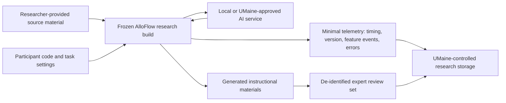

# Privacy and research-system boundary

**Purpose:** Define a conservative Stage 1 research configuration. This document supplements, but does not replace, AlloFlow's broader [data privacy posture](../DATA_PRIVACY_POSTURE.md), UMaine review, district review, IRB review, or legal advice.

## Proposed boundary

Stage 1 should not contain student data. It should use researcher-provided source material and participant codes. The research build should expose only the modules required for the differentiated-material task.

No branch should contain a student name, IEP, education record, identifiable student work, or behavioral/clinical record.

## Data inventory

| Data | Needed? | Proposed handling |
|---|---:|---|
| Participant name/contact | Yes, for study administration | Held separately by UMaine; not entered into AlloFlow logs |
| Participant study ID | Yes | Random code used in research data |
| Source material | Yes | Public, licensed, or researcher-authored material |
| Task settings | Yes | Store only instructional variables approved by the protocol |
| Prompts and outputs | Likely | Store in UMaine-controlled research space after screening for accidental identifiers |
| Active task timing | Yes | Event timestamps or calculated duration |
| Feature/error events | Yes | No IP address, advertising ID, or cross-site tracking identifier |
| Audio/video recording | Optional | Separate consent; avoid unless necessary |
| Student information | No in Stage 1 | Prohibited |

## Research-build requirements

- Disable live sessions, cloud classroom sync, student profiles, clinical modules, and unrelated tools.
- Disable analytics and external calls not required by the protocol.
- Provide a visible research-mode banner and prohibited-data notice.
- Log the build hash, model identity, model fallback, and generation timestamp.
- Do not log API keys, authentication tokens, full device fingerprints, or unrelated browser data.
- Define deletion dates and responsible data steward before collection.
- Encrypt research data in transit and at rest using UMaine-approved systems.
- Use role-based access and a study access list.
- Maintain an incident-response contact and stop-work rule.

## Model-provider decision record

Before the study, the PI and institutional reviewers should document:

1. whether inference is local or cloud-based;
2. the legal and contractual party operating the service;
3. retention and training settings;
4. region and subprocessors where relevant;
5. whether prompts/outputs are stored by the provider;
6. whether model/version pinning is possible;
7. the fallback path if the selected model is unavailable; and
8. accessibility and reliability implications.

“No student PII intended” reduces risk but does not replace this review.

## Ownership and stewardship of study data

- UMaine, through the PI and applicable agreements, should control the authoritative research dataset.
- Aaron should receive only the de-identified technical data needed to reproduce defects, unless the approved protocol provides otherwise.
- AlloFlow governance should have no veto over publication.
- Public release should contain only data approved for sharing under the consent, IRB determination, agreements, and institutional policy.

## Stage 2 expansion gate

No student-facing phase should inherit Stage 1 assumptions automatically. Before Stage 2, complete a fresh data-flow inventory covering consent/assent, FERPA, district agreements, Maine student-privacy requirements, retention, support access, incident response, and any AI provider. Prefer coded or aggregate data and local processing wherever the research question permits.

