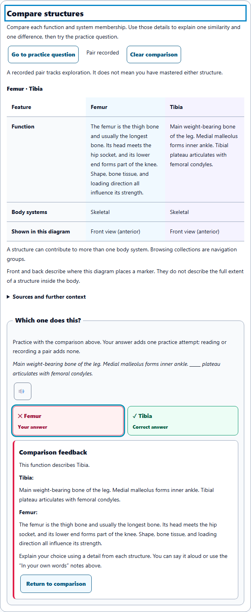

# Anatomy comparison: navigation, feedback and visual clarity

## What improved

- Comparison columns have distinct surfaces, clear structure names and stronger heading hierarchy. Phone layouts keep each feature and both named structures together.
- Practice uses a named question group, large answer controls, explicit answer labels and focusable feedback. Keyboard users can jump to the question, return to the comparison, or clear it and continue from the pin control.
- The pinned target explains where comparison is available in other activities. Its actions open Explore, preserve the selected comparison candidate, and raise the learning level when the target requires it.
- Delayed Pin, Clear, Open, Record and Answer actions check the latest comparison context. Recording a pair merges with fresh history and counts each added pair once. Opening Explore preserves current card work, notes and practice evidence.
- Seven new labels are translated in French, Latin American Spanish and Arabic. Both anatomy sources and the complete working locale mirrors match.

## Verification

**561 distinct unit checks across 13 suites passed after targeted corrections.** The initial 557-check run identified an invalid target fixture and outdated assertions for card headings, feedback headings, search status markup and navigation labels. The final affected-suite run passed all 263 checks, including 62 new comparison checks across both anatomy copies. Results are merged by test name in [verification.json](verification.json).

**One Chromium journey passed without retries.** It exercised question and feedback focus, return navigation, clearing and pinning, a real position swap of the same pair, Cards note editing and saved round continuity, and opening Tibia from level 1 at its required level 2.

**15 scoped accessibility scans found zero violations.** Comparison and the pinned tray were checked at 320, 390, 768 and 1440 pixels in light, dark and high contrast themes, plus Arabic with larger text at 320 pixels in all three themes. These scenarios had no horizontal overflow or browser errors. This is a focused comparison audit.

Larger text now measures 17px for body text, notes, buttons and tray controls, 20px for the question heading, and 22px for the comparison heading. The baseline measured 16px for body text and controls and 13px for comparison notes. Answering the baseline question left focus on the page body; the enhanced journey focuses the feedback.

## Visual review

The screenshots were inspected for text clarity, spacing, paired identity, feedback, responsive layout and theme contrast.

| Screenshot | Review |
| --- | --- |
| [Before: phone](before-phone.png) | Original comparison and compact question controls |
| [After: phone](after-phone.png) | Named paired sections and readable practice feedback |
| [After: dark](after-dark.png) | Distinct paired surfaces and readable answer states |
| [After: Arabic](after-arabic.png) | Right-to-left layout and larger text |
| [After: desktop](after-desktop.png) | Paired table columns and side-by-side choices |
| [Feedback focus](feedback-phone.png) | Visible keyboard destination after answering |
| [Pinned target in Cards](tray-phone.png) | Clear route to Explore while keeping saved card work |

