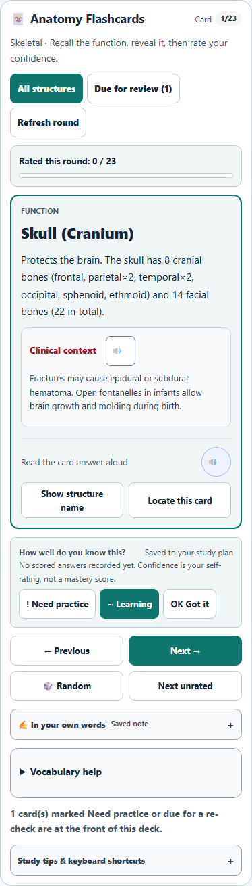
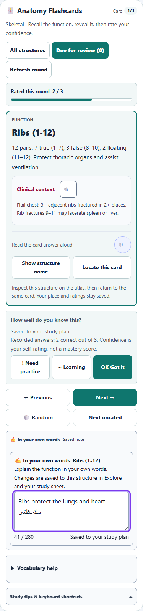
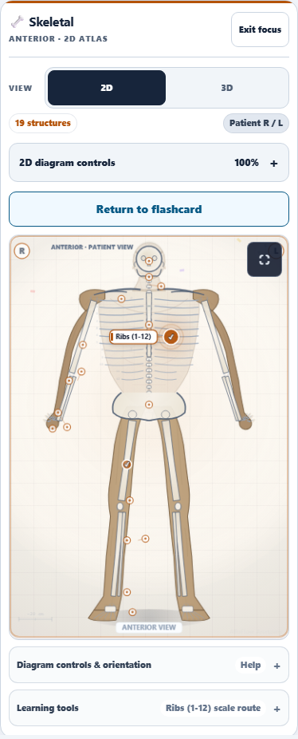
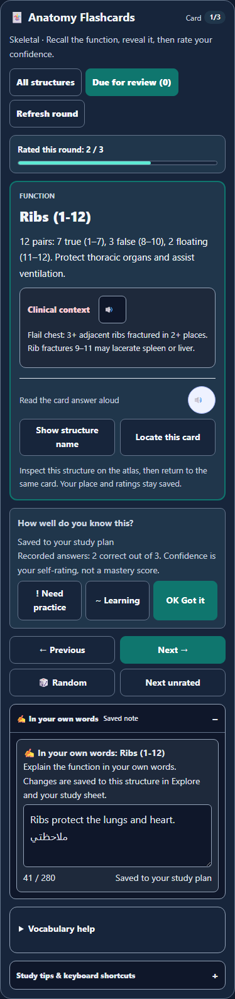
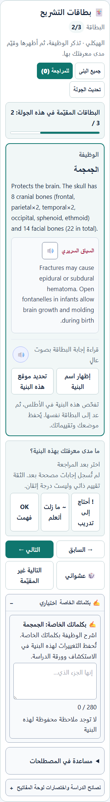
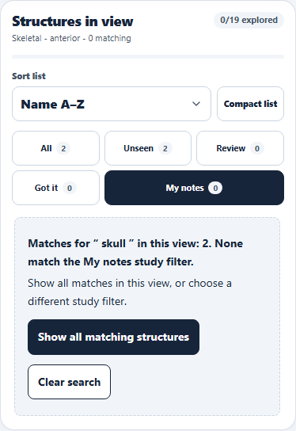
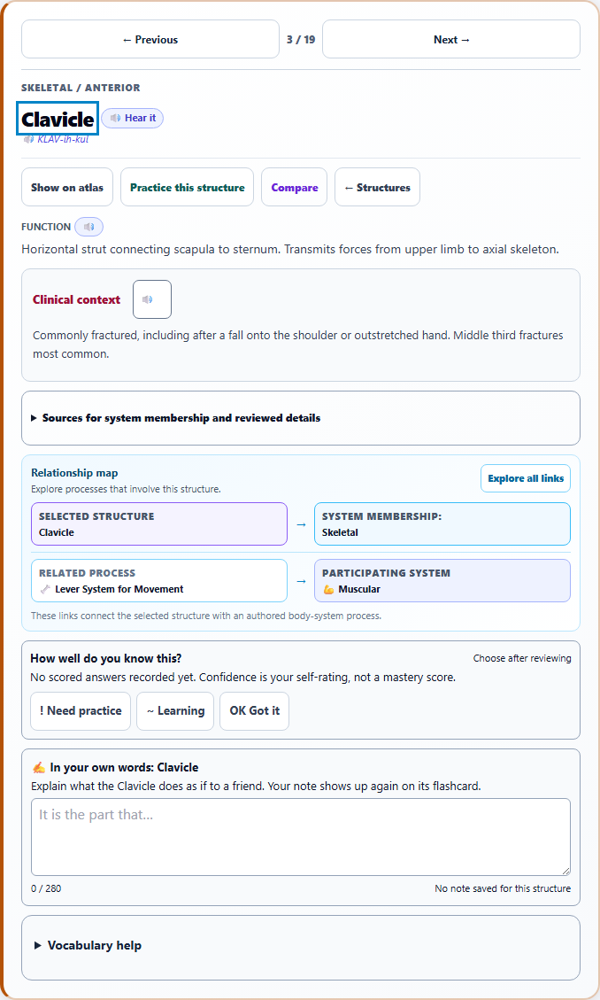

# Anatomy: flashcard continuity and Search recovery

September 30, 2026

This pass improves the connection between flashcards and the atlas, makes study controls easier to read, and gives Search a clear recovery path when a study filter hides valid matches.

## What changed

- **Inspect and return.** Locate this card focuses the atlas and reveals a Return to flashcard button above the diagram. Return restores focus to the same card, including when the atlas is in focus mode. Card position, reveal state, ratings, notes, retrieval evidence, and saved rounds stay intact.
- **Reliable card controls.** Next, Previous, Random, Next unrated, Reveal, and Refresh move focus to the current card. Changing decks focuses the new card or its empty-state heading. Delayed actions from an older card, face, deck, level, system, revision, or mode cannot overwrite the current round or announce an unaccepted change.
- **Readable study content.** Card controls use larger labels and wrapped confidence choices. Larger text raises card controls, explanations, disclosures, and notes to at least 17 px. Note editors and the detail confidence panel use explicit theme colors, correcting the low contrast found in dark mode. Card titles follow the panel's heading hierarchy.
- **Consistent keyboard behavior.** Space reveals or hides a function; ratings 1–3 require a revealed card. Left and Right follow the navigation direction in Arabic. Accepted ratings announce the same translated label shown on the button.
- **Useful Search recovery.** If a query has matches in the current view but a study filter hides them, Search explains the count and offers Show all matching structures. That action keeps the exact query, clears the study filter, and focuses the results heading. Recovery accepts older saves with missing or unknown mode values using the same defaults as rendering.
- **Fresh detail navigation.** A global Search result opens and focuses its explanation from any study mode. Opening a fresh result clears the prior filtered browsing sequence, so Previous and Next follow the full view. Ordinary navigation within a filtered sequence remains intact.
- **Current saved work.** Ratings and card actions merge current confidence timestamps, concept aliases, and round history. They preserve notes and evidence saved after the controls were rendered.

The seven new labels are translated into French, Latin American Spanish, and Arabic in both catalog copies.

## Validation

- 286 regression checks passed across 12 relevant suites and both shipped source copies. The new suites contain 54 flashcard checks and 56 Search checks.
- Two Chromium walkthroughs passed without retries. They exercise actual clicks, keyboard navigation, editable notes, atlas focus mode, cross-mode Search, and detail navigation.
- 30 scoped accessibility scans reported zero violations. Coverage includes widths 320, 390, 768, and 1440; light, dark, and contrast themes; and Arabic with larger text at 320 px. No horizontal overflow or browser page errors were recorded.
- Source copies are identical and syntax checked. The six language catalogs parse and their complete working mirrors match. Commit candidates contain only the seven labels owned by this pass.

These browser checks use the document-layout harness, application styles, and the 2D atlas. They cover the card and Search regions; other anatomy modes and 3D rendering have their existing test coverage.

Verification metrics and the normalized source hash are saved in [verification.json](verification.json). Translation ownership is recorded in [locale-commit-scope.json](locale-commit-scope.json).

## Visual review

### Phone study controls

Baseline:



Updated card, ratings, and open note editor:



### Atlas round trip

The return control stays above the diagram in focus mode:



### Dark mode and Arabic





### Search

The empty state distinguishes hidden matches and provides a recovery action:



A global result opens its explanation with fresh navigation:



## Reproduce

```powershell
npx vitest run tests/anatomy_flashcard_continuity.test.js tests/anatomy_search_continuity.test.js tests/anatomy_flashcard_notes.test.js tests/anatomy_flashcard_review_rounds.test.js tests/anatomy_card_flow.test.js tests/anatomy_structure_browser.test.js tests/anatomy_search_render_controls.test.js tests/anatomy_heading_structure.test.js tests/anatomy_tab_navigation.test.js tests/anatomy_spotter_practice.test.js tests/anatomy_study_portfolio.test.js tests/anatomy_quiz_flow.test.js --maxWorkers=1
npx playwright test tests/e2e/anatomy-study-continuity.spec.ts --project=chromium --workers=1 --retries=0
```
