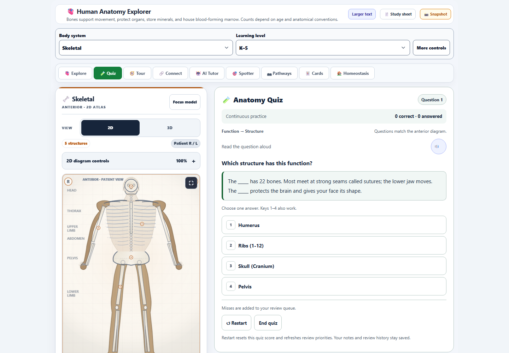
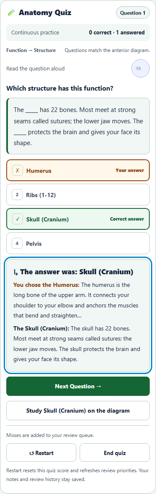
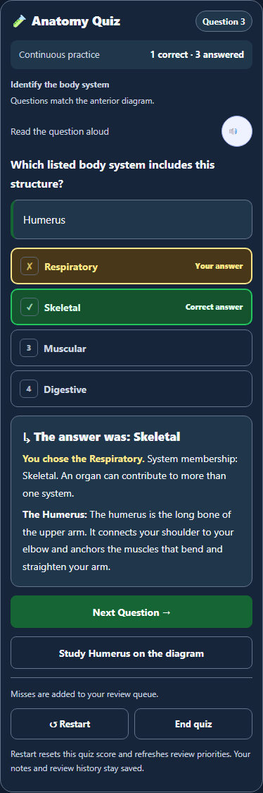
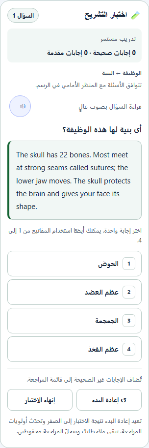
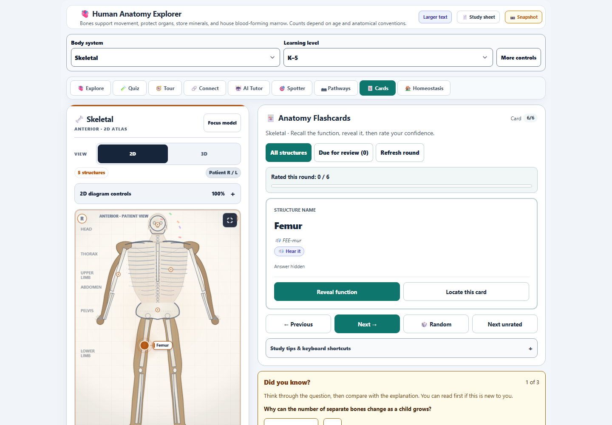
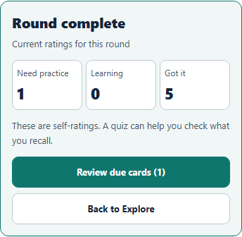

# Anatomy study interface and quiz coverage

## Improvements

- Cards and Quiz use compact system and learning-level controls on desktop and phones. Full settings remain available through More controls.
- Cards show readable prompts, rated progress, and a completion summary with clear next steps. Practice this structure opens the selected card while preserving notes and ratings.
- Quiz separates the question number from the score, labels correct and chosen answers, and moves keyboard focus to feedback. Learners can study a missed structure in Explore and return to the same answered question.
- Four-question blocks balance the question types. Each cycle covers every structure in every type once. Coverage holds for pool sizes from 1 to 128, including small posterior collections.
- The first four questions use the highest-priority structures. The cycle keeps its order when an answer changes confidence. The next cycle and Restart refresh review priorities.
- Saved questions record their structure, type, and scheduling version. Older questions retain their original grading until Next; malformed snapshots and unsafe question numbers recover to valid practice.
- Thirty anatomy interface labels are translated into French, Latin American Spanish, and Arabic. Only these labels are included in the locale changes for this commit.

## Visual review

## Verification

Final results are recorded in [verification.json](verification.json). Translation scope and candidate hashes are recorded in [locale-commit-scope.json](locale-commit-scope.json).

- The broad regression run passed 400 checks across ten anatomy suites.
- After the final quiz-index recovery change, 65 focused checks passed for rotation, saved questions, and study flow.
- Three browser walkthroughs passed. Fifteen accessibility scans across light, dark, and high-contrast themes found zero violations in the study panels and their controls.
- Cards and Quiz fit at 320, 390, 768, and 1440 pixels. Larger text and Arabic text direction were checked at 320 pixels. No browser errors were recorded.
- The canonical and desktop anatomy sources match. The three prepared locale packs also match their desktop mirrors, and source syntax checks passed.

The coverage checks execute the production scheduling helper and assert complete structure/type coverage. Integration checks exercise confidence changes, cycle boundaries, saved legacy grading, reloads, and malformed data. Browser checks exercise study flow, keyboard focus, small screens, themes, and Arabic text direction.
