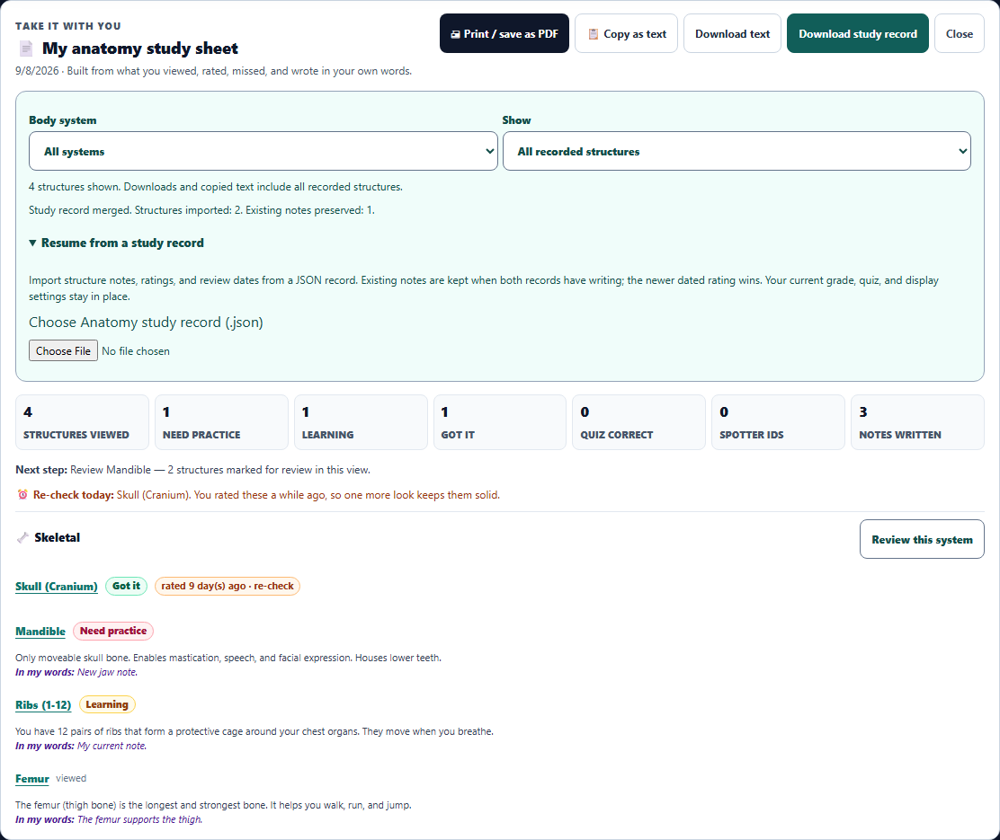
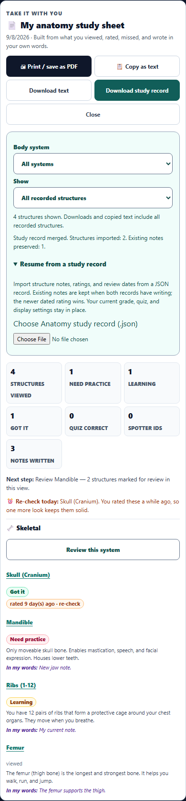

# Anatomy study workspace enhancement

The study sheet now supports continuing learning as well as exporting a summary.

- Filter recorded structures by body system, review need, notes, or Got it status. Empty results explain how to recover the full list.
- Open a structure on its appropriate diagram and detail level directly from the sheet. Start a fresh due-card review round for a system, with answers hidden and existing notes preserved.
- Download a readable text study sheet or a versioned JSON structure record containing viewed flags, confidence ratings, original rating dates, and notes.
- Preview imported records before merging. Existing notes win text conflicts; the newer dated rating wins rating conflicts; viewed flags combine. Active quiz, grade, and display settings are not part of the import.
- Reject malformed files, unsupported versions, duplicate IDs, invalid ratings, and oversized notes. Unknown catalog IDs are skipped and reported. Invalid or superseded file reads do not replace current evidence.
- Clipboard failure now reports failure and offers a downloadable alternative, while restoring focus. Modified, repeated, and composing quiz keystrokes no longer submit an answer.
- Responsive controls, visible focus indicators, and light/dark/high-contrast styling were added. New labels use the existing translation helper and English catalog.

Downloads and copied text contain all recorded structures even when the sheet is filtered. The printable sheet follows the visible filter. The portable record is intentionally limited to structure evidence; it is not a backup of quizzes, scores, tours, or clinical workspaces. Download the JSON file to retain and resume this evidence across sessions.

## Validation

- 72 existing tests passed: flashcard notes, due review and recap, learning reliability, and UI polish.
- 16 new portfolio tests passed: export normalization, merge conflicts, malformed imports, filters, diagram/view switching, focused review, clipboard failure, and quiz keyboard behavior.
- Real Chromium workflow passed: JSON/text downloads, invalid-file recovery, staged import, safe merge, desktop and 390px phone layouts, and keyboard navigation from the sheet into the atlas and review cards.
- Axe WCAG scans of the study sheet: no violations in light, dark, or high-contrast themes. This is a scoped scan, not a claim about the entire Anatomy tool.
- Desktop and phone screenshots visually inspected.
- Source syntax, diff whitespace, and source/deployment mirror equality verified.

The busy shared workspace caused initial JSDOM setup timeouts. The final new-test run passed all 16 checks in 14 seconds; the final command allowed a 120-second hook timeout without changing project-wide test settings.

Files: `stem_lab/stem_tool_anatomy.js`, its `desktop/web-app/public` mirror, `dev-tools/i18n/stem_anatomy_en.json`, `tests/anatomy_study_portfolio.test.js`, and `tests/e2e/anatomy-study-portfolio.spec.ts`.

