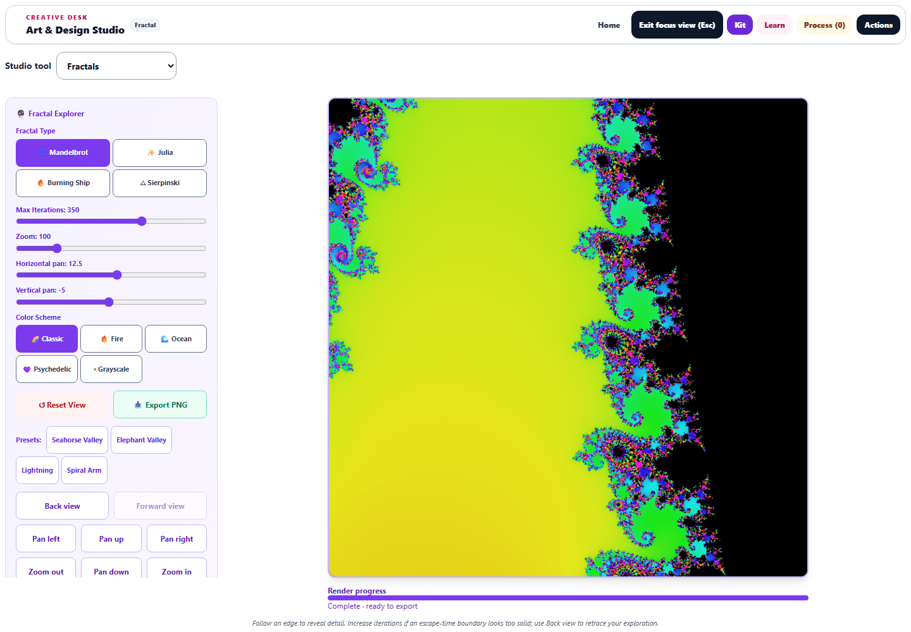
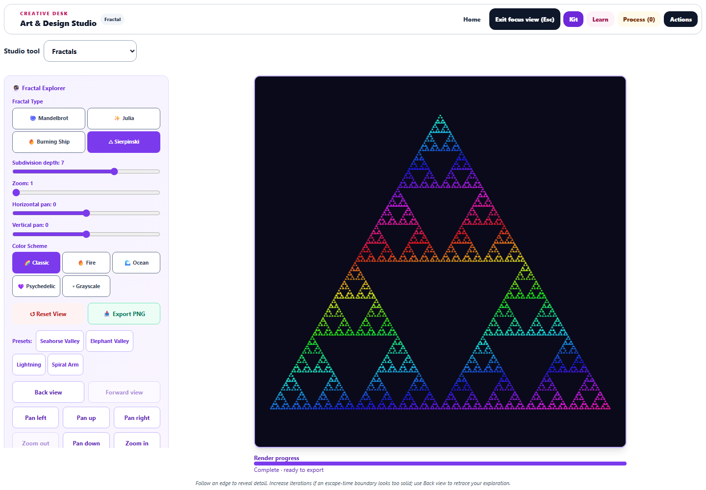

# Fractal Explorer: precise navigation and complete artwork

The September 29 continuation improves all four Fractal Explorer modes: Mandelbrot, Julia, Burning Ship, and Sierpinski.

## Navigation and history

Wheel zoom now starts smoothly from 1× and preserves the coordinate under the pointer. Double-clicking centers that coordinate and doubles magnification without rounding away the fractional pan values needed at deep zoom. View center and width are shown beside the controls.

The focused canvas supports arrow-key panning, Shift+arrow for larger steps, +/− for zoom, and Home to reset. Pan steps scale with magnification. Onscreen pan and zoom buttons provide the same exploration on touch devices.

**Back view** and **Forward view** retain up to 30 settings changes, including presets, colors, and geometry. Ctrl/Cmd+Z goes back, and Ctrl/Cmd+Shift+Z or Ctrl+Y goes forward. A new edit clears the forward branch. Restored studies and learner changes clear stale history. The canvas remains mounted and focused during navigation.

## Rendering and mathematical controls

Rendering runs in cancellable eight-row batches with a progress indicator. Changing settings or leaving the lab cancels obsolete work. Reduced-motion mode computes in batches but displays only the finished image.

Sierpinski now uses deterministic subdivision of an equilateral triangle. **Subdivision depth** ranges from 0 to 10, and its zoom and pan controls affect the actual geometry. Reopening the same settings reproduces the same artwork. Each subdivision removes the middle triangle from the remaining cells, as described in [Wolfram's SierpinskiMesh reference](https://reference.wolfram.com/language/ref/SierpinskiMesh.html).

Escape-time rendering distinguishes bounded samples from escaped samples, including Julia fixed points on the escape circle. Its Julia escape radius accounts for the selected constant. Smooth colors are bounded to avoid rendering distant escaped points as black. Saved values are validated and clamped before calculations. The learning panel explains that a finite iteration limit cannot prove a point remains bounded forever.

The Mandelbrot landmark presets now center on their intended regions: Seahorse Valley at −0.75 + 0.1i and Elephant Valley at 0.3 + 0i. Their former pan values centered elsewhere. Coordinate references: [Sea Horse Valley](https://mathworld.wolfram.com/SeaHorseValley.html) and [Elephant Valley](https://mathworld.wolfram.com/ElephantValley.html).

## Workspace and export

Focus view pairs a 760-pixel square canvas with scrollable controls at a 1440 × 1000 desktop viewport. On phones, the artwork appears first. Type and palette choices wrap into readable grids, and buttons provide at least 44-pixel touch targets.

PNG export, artwork handoffs, and saved-study thumbnails use a complete render, even while the onscreen preview is still computing. Export leaves preview progress unchanged and reuses the completed export until settings change. PNG output remains 512 × 512. Export failures show an error rather than a success message.

## Verification

**89 unique tests passed across 10 relevant files**, including 12 new Fractal Explorer regression cases. Coverage includes pointer-anchored zoom, deep double-click navigation, rapid keyboard input, history limits and branching, saved data and learner changes, deterministic subdivision, known bounded/escaping orbits, complete exports, missing canvas contexts, animation cleanup, snapshots, shared workspace behavior, accessible names, and translation boundaries. The full repository test suite was not run.

The browser run checked all four fractal types. Each complete canvas matched its exported PNG exactly and contained no transparent pixels. Exporting before the first render batch produced the same complete image as the eventual preview while leaving its progress at zero. Browser checks also covered keyboard focus, history, pointer navigation, deterministic reopening, landmark presets, actual PNG downloading, desktop focus, phone ordering, overflow, and touch targets. No browser page errors occurred. Desktop and phone screenshots were visually reviewed.

Source/public parity, JavaScript syntax, and scoped whitespace checks passed. Changes are saved locally; nothing was deployed.

- [Elephant Valley preview](fractal-elephant-focus.png) and [phone preview](fractal-phone-focus.png)
- [Downloaded PNG](fractal-browser-export.png)
- [Browser measurements](fractal-browser-results.json) and [structured validation](fractal-validation.json)
- [Fractal regression tests](fractal-editing-tests.log), [accessibility and saved-artwork tests](fractal-final-tests.log), and [shared workspace tests](fractal-shared-tests.log)

Reproduce browser checks with `node dev-tools/artstudio_fractal_qa.cjs` from the repository root.
