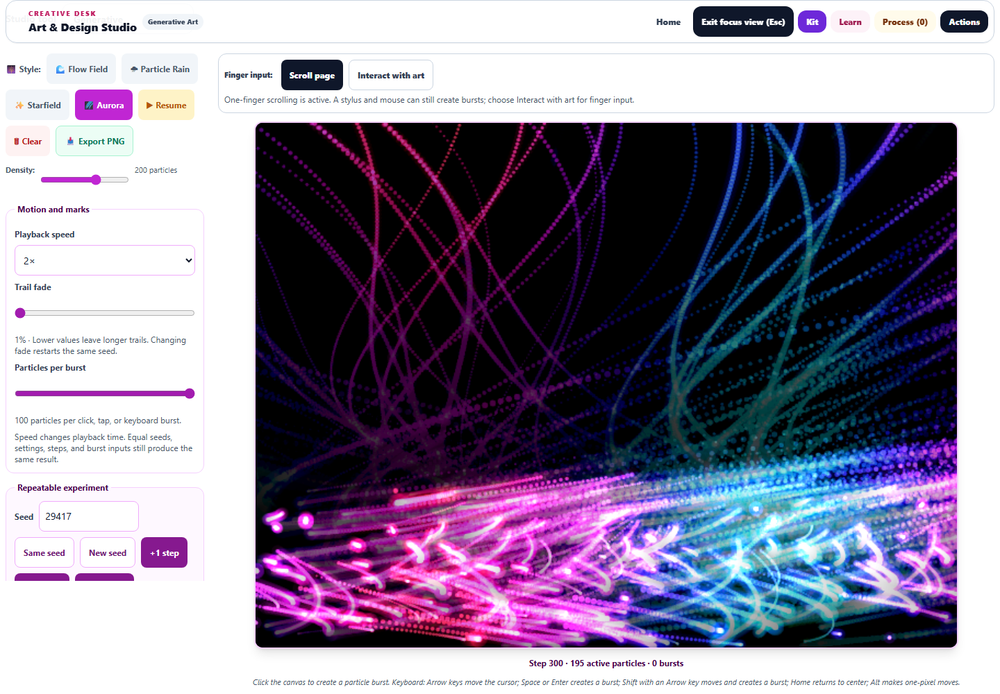
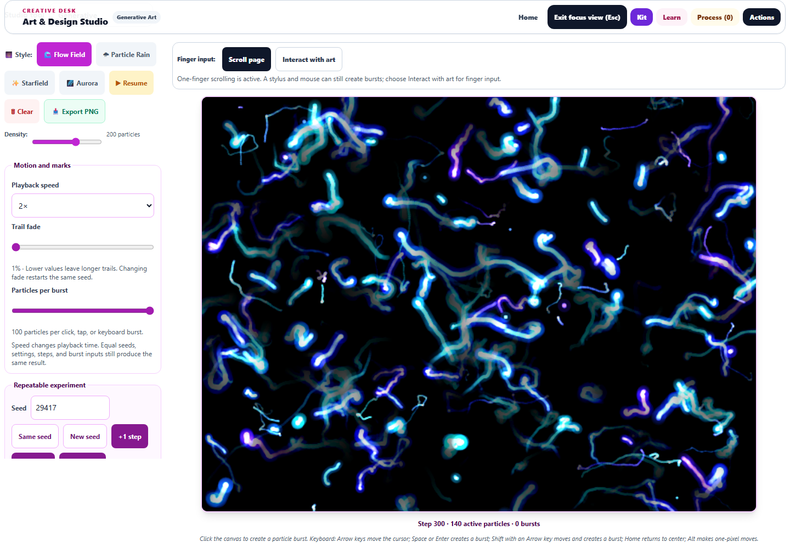
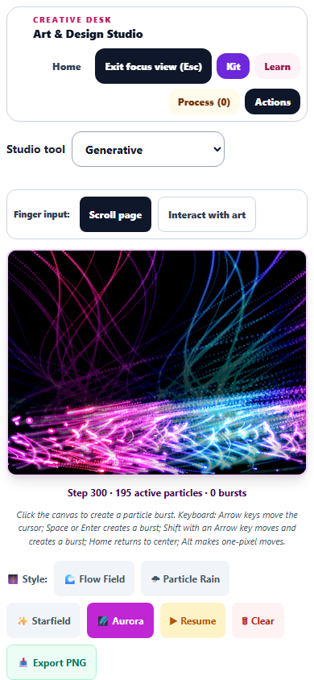

# Generative Art: workspace, motion, and repeatable experiments

Completed September 30, 2026. Saved in the canonical Art Studio source and its served public mirror.

## Changes

- A larger canvas with a separate controls column. In the 1440 × 1000 browser check, Focus view expanded the canvas from 638 to 1,013 pixels wide while preserving the live canvas. On a 390-pixel phone, the artwork appears before the controls, with no horizontal overflow and at least 44-pixel button targets.
- Playback at 0.25×, 0.5×, 1×, or 2×; exact advances of 1, 10, or 100 simulation steps; adjustable trail fade and 5–100 particles per burst. Speed and burst-size changes preserve existing artwork. Trail changes restart the same seed so experiments remain comparable.
- Fixed 60-step-per-second simulation timing at normal speed. All four styles produce identical particle states and drawing fingerprints at 60, 120, and 144 Hz. The seeded random generator and particle-motion rules are preserved.
- Paused, hidden, and restoring canvases stop requesting animation frames. Resuming establishes a fresh time anchor; a stalled foreground frame processes at most 100 milliseconds of elapsed time. Old callbacks, visibility listeners, pending image handlers, and resize observers are cleaned up when the runtime is replaced or removed.
- Pausing saves the exact live checkpoint. Legacy version-1 checkpoints without a trail setting retain their original 4% fade. Image decoding resumes playback without polling; a failed image retains usable particle state and announces that the old trails could not be loaded.
- Accurate pointer coordinates inside the enlarged canvas border; existing keyboard and finger-scroll behavior preserved. Live step, active-particle, and burst counts appear below the artwork. The keyboard cursor remains outside exported paint.
- Finite settings and bounded saved particle values prevent malformed saves from creating runaway work. Paused bursts stop at a 3,000-particle ceiling with an accessible explanation. Failed PNG exports no longer create empty downloads or claim success.

The drawing and PNG backing store remains 640 × 480 to preserve saved particle coordinates and existing studies. The larger workspace scales that canvas. This pass improves Generative Art; the earlier Pixel Art, Watercolor, Gradient, and other studio enhancements remain in place.

## Verification

**105 tests passed across 11 files**, including 18 new playback and input regressions. Coverage includes all four seeded styles, refresh-rate parity, playback speed, idle loops, visibility changes, bounded catch-up, image restoration and failures, stale callbacks, learner-scope changes, exact steps, legacy checkpoints, trail fade, burst limits, malformed state, scaled pointer input, PNG failure handling, touch controls, keyboard access, Focus mode, Thread Kit, study persistence, artwork round trips, and capture ownership.

The final run took 297.22 seconds on the busy host. Its only diagnostic was the existing jsdom canvas-export stub warning; all tests passed. The earlier focused run passed 39 tests before two additional recovery tests were added.

- Unit log: [generative-final-tests.log](generative-final-tests.log)
- Browser results: [generative-browser-results.json](generative-browser-results.json)
- Machine-readable validation: [generative-validation.json](generative-validation.json)
- Browser check: `node dev-tools/artstudio_generative_qa.cjs`
- New regression suite: `tests/artstudio_generative_playback.test.js`

Real Chromium checks confirm identical PNGs when repeating the same seed, stable artwork while changing speed, live play/pause and step controls, accurate mouse placement, paused bursts, keyboard drawing, exact tab round trips, and a downloaded PNG whose bytes match the canvas. Rain, Starfield, and Aurora also render populated artwork at step 300. Desktop and phone screenshots were visually reviewed. No browser page errors occurred.

JavaScript syntax and scoped diff-whitespace checks passed. Source and public mirror share SHA-256 `FD370CDB516844268FC28B6342834F7C5DA57D1009D821B5EAFD5F407DC408B4`. This was a scoped studio regression run, not the entire repository suite. No deployment was performed.

## Previews

