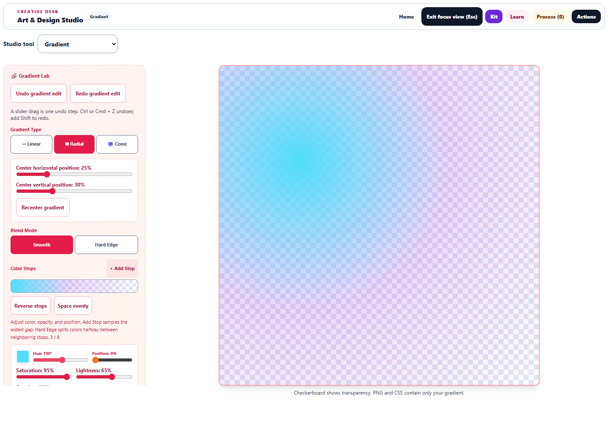

# Gradient Lab: transparent color and recoverable editing

This pass adds opacity, gradient positioning, deliberate stop arrangements, and undo/redo. The source and served copy are synchronized. Changes are saved locally; no deployment was performed.

## Editing

- Every stop supports **Opacity**, including fully transparent colors. Existing saved stops remain opaque by default, and zero values are preserved.
- Older one-stop saves reopen as a uniform two-stop ramp, preserving color and opacity while producing valid CSS.
- **Add Stop** samples the current ramp in its widest gap. For smooth gradients, this inserts a useful editing point without introducing a random color. **Duplicate**, **Reverse stops**, and **Space evenly** provide explicit ways to arrange colors and opacity.
- **Undo** and **Redo** retain up to 30 edits. A pointer drag or held keyboard adjustment counts as one edit, including when focus moves from another control. Presets and Thread Kit palette imports are also reversible. Ctrl/Cmd+Z, Ctrl/Cmd+Shift+Z, and Ctrl/Cmd+Y work within the editor.
- Radial and conic gradients have horizontal and vertical center controls. Conic gradients also have rotation, and **Recenter gradient** returns the center to 50%, 50%.
- Presets restore their complete intended configuration in one edit. A different learner, restored study, or external gradient replacement clears the previous editing history.

## Preview and export

The preview keeps the same canvas while settings change. A checkerboard reveals transparent areas but stays out of PNG exports, saved artwork, and exported CSS. At a 1440 × 1000 desktop viewport, Focus view shows a **760 × 760 pixel** preview beside a scrollable control column. On a 390-pixel-wide phone, the preview precedes the controls without horizontal overflow. Buttons retain 44-pixel minimum touch targets.

PNG exports retain alpha at 512 × 512 pixels. **Download gradient CSS** complements Copy, so the stylesheet can be saved when clipboard access is unavailable. Both export paths use the same gradient settings as the preview.

Transparent interpolation needs special treatment: CSS blends premultiplied color channels, while native Canvas gradients specify interpolation without premultiplication. The transparent renderer follows CSS's sRGB behavior, preventing a fully transparent stop's hidden hue from tinting a fade. Opaque gradients retain native rendering. [CSS gradient interpolation](https://www.w3.org/TR/css-images-3/#coloring-gradient-line), [Canvas gradient interpolation](https://html.spec.whatwg.org/multipage/canvas.html#canvasgradient).

Radial geometry uses the distance from the selected center to the farthest corner. Conic positioning and rotation follow the exported CSS conventions, including the pixel renderer used when native conic gradients are unavailable. [Radial geometry](https://www.w3.org/TR/css-images-3/#radial-gradients), [Conic gradients](https://www.w3.org/TR/css-images-4/#conic-gradients).

[Conic bands](gradient-conic-focus.png) · [Phone preview](gradient-phone-focus.png) · [Transparent PNG](gradient-browser-export.png) · [CSS file](gradient-browser-export.css)

## Validation

- 85 tests across eight relevant test files, including 15 new regression cases covering opacity, geometry, stop insertion, arrangement, history, focus changes, presets, and restored-state ownership.
- One Vitest worker timed out during startup. The other seven files passed 62 tests; the affected 23-test file passed on an isolated rerun.
- Browser comparisons cover 17 scenarios and 1,377 sampled pixels: smooth/hard edges, opaque/transparent stops, all three gradient types, moved centers, rotation, and conic fallback rendering. Comparisons composite both versions onto white so alpha blending is included.
- Actual browser input verifies whole-drag undo/redo, focus transfer, reverse recovery, navigation round trips, and canvas identity. Downloaded PNG bytes match the canvas export exactly; downloaded CSS matches the visible CSS.
- Desktop/phone layout, touch targets, and screenshots were checked. No browser page errors were reported.
- Source syntax, source/public parity, and diff whitespace checks pass. The full repository test suite was not run.

Evidence: [validation summary](gradient-validation.json), [browser measurements](gradient-browser-results.json), [regression log](gradient-final-tests.log), [isolated retry](gradient-stage-retry.log), and the reusable [browser check](../../dev-tools/artstudio_gradient_qa.cjs).
