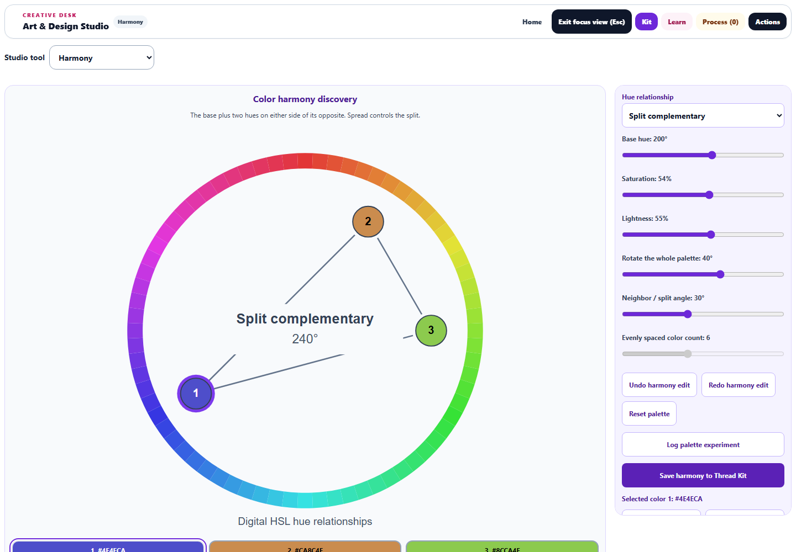
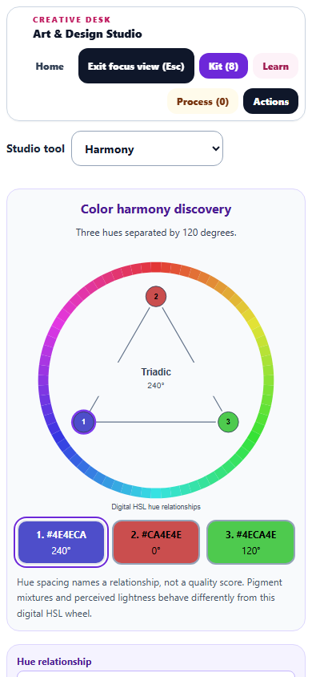
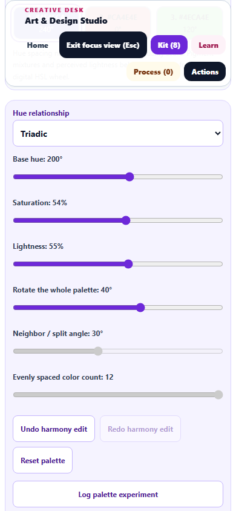
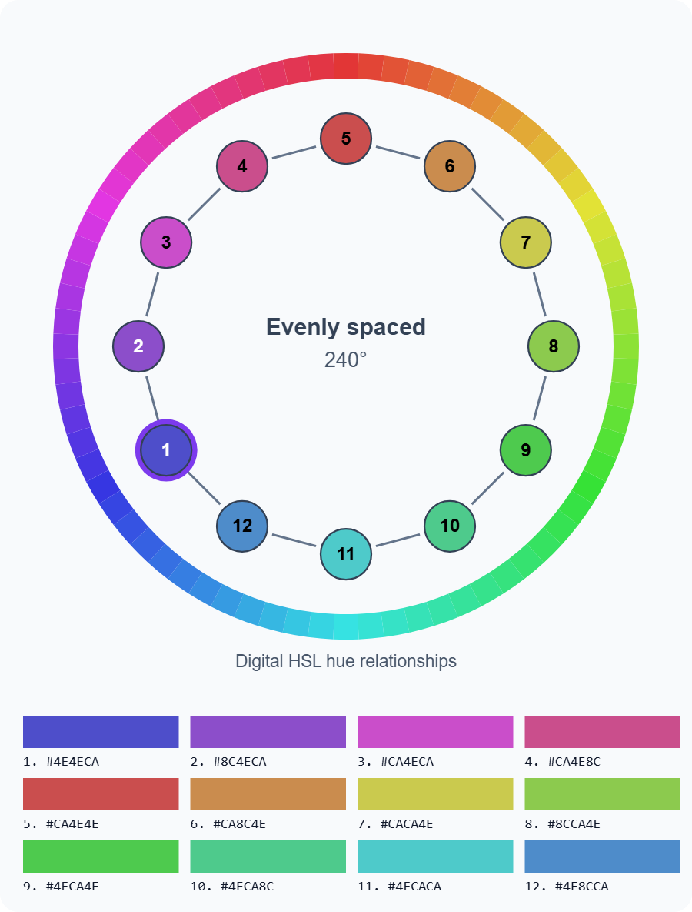

# Harmony Lab enhancements

Completed September 30, 2026. Changes remain uncommitted and undeployed.

Harmony Lab now supports deliberate color experiments and reuse in artwork. Previously every palette used equal hue steps, but some low-saturation palettes were labeled analogous. The lab now separates hue geometry from saturation and lightness, preserves legacy palette colors, and provides real neighboring, opposite, split-complementary, triadic, and tetradic arrangements.

## Workspace and editing

- The wheel grows from the previous 256px view to 760px in the tested 1440 × 1000 focus workspace. Controls remain beside the preview on wide screens and follow it on a phone.
- Numbered, selectable swatches show exact hex colors and hue angles. Marker and swatch text uses whichever of black or white has the greater contrast against its color.
- Saturation and lightness now display their actual 0–100% values. Whole-palette rotation and neighboring/split spread controls support controlled comparisons. Evenly spaced palettes support 2–12 colors.
- Thirty-step session undo/redo groups a pointer drag into one action, supports keyboard shortcuts, and keeps text editing independent. Reset changes only the palette; written observations and logged experiments remain.
- Up to eight experiments retain their complete recipe and can be restored, compared, and undone. Legacy experiment logs migrate using their actual settings instead of the old classification label.
- Study snapshots capture explicit normalized settings and notes. History clears when the learner, project, restored study, or externally supplied recipe changes.

## Drawing and exports

The selected swatch transfers to the Pixel Art brush or Watercolor pigment without replacing existing artwork. A palette can be saved to Thread Kit. When it exceeds the kit's eight-color capacity, the button explicitly says it saves the first eight colors.

SVG and CSS downloads include the full palette, up to twelve colors. The standalone SVG includes the wheel and numbered hex legend; the browser decoded it at 900 × 1185. Downloaded CSS custom properties matched every displayed swatch's computed color.

## Teaching accuracy and accessibility

Prompts now explore hue relationships and palette experiments instead of referring to sound frequencies that the lab does not model. Simple wording has corresponding translated keys. The definitions of neighboring analogous hues, opposite complementary hues, and evenly spaced triads were checked against [Adobe's color-wheel guide](https://www.adobe.com/uk/creativecloud/design/discover/color-wheel.html). The lab explicitly identifies its wheel as digital HSL; pigment behavior and perceived lightness are different, and a relationship name is not a quality score.

The scheme selector and written-response fields have stable accessible names. Preview descriptions announce the relationship, color count, and rotated base hue. All measured phone buttons, inputs, and selects were at least 44px in both dimensions, with no horizontal overflow. The wheel diagram is followed by keyboard-accessible swatch buttons.

All 59 Harmony keys match the source fallbacks in both English registries and the Art Studio English catalog, including 57 new strings. Non-English translations were not authored in this pass.

## Validation

- Initial compatibility check: 18/18 tests across four files.
- New model/workflow coverage: 27/27 tests across two files.
- Broader regression: 184/186 tests passed across 20 files. Two old test expectations referred to retired vocabulary keys and the checkbox's old source formatting. The tests were updated to check the revised translation keys and the rendered 44px checkbox.
- Final targeted run: 35/35 tests across four files, including both corrected tests and all new Harmony cases. Taking the latest result for each tested file gives **186 passing cases across 20 files, with no unresolved failures**.
- Chromium desktop and phone checks passed with zero page errors. Actual downloads, a native slider drag plus undo, experiment restoration, exact Pixel Art painted RGB, preservation of existing pixels, and the Watercolor pigment transfer were verified.
- Syntax, source/public mirror parity, pinned Spectral vendor parity, translation consistency, and scoped whitespace checks passed. The source diff against the pre-pass backup was reviewed to preserve earlier enhancements.

This was a scoped regression pass, not the entire repository suite. Undo history is session-local; logged experiments and saved-study settings persist through the existing state system. Thread Kit still holds eight colors; full-palette exports retain all colors. Browser checks used the real Art Studio module, React runtime, and workspace CSS in the existing QA harness, rather than a packaged desktop launch.

Evidence: [validation metadata](harmony-validation.json), [browser checks](harmony-browser-results.json), [broader regression](harmony-regression-results.json), and [final targeted tests](harmony-final-results.json).

## Previews

Downloads checked: [SVG palette](harmony-browser-export.svg) and [CSS palette](harmony-browser-export.css).
