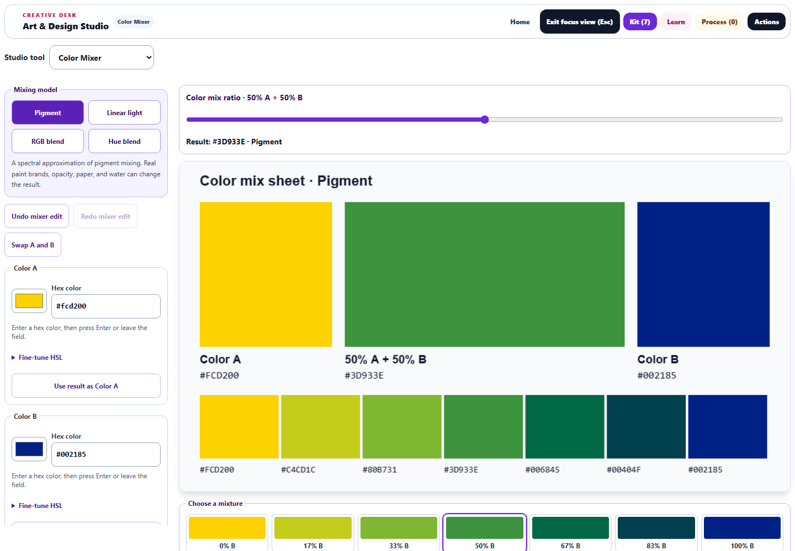
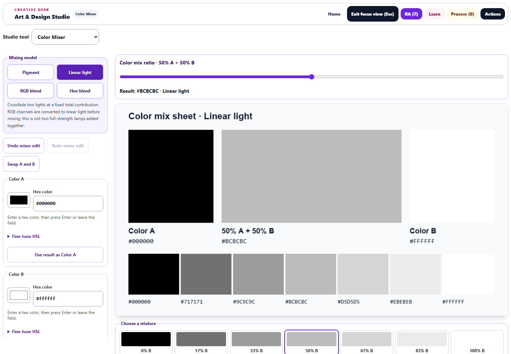
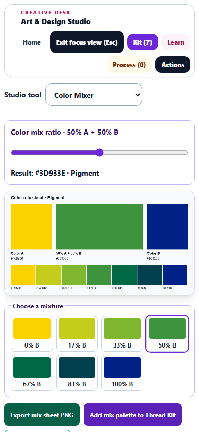

# Color Mixer: pigment, light, and reusable palettes

Completed September 30, 2026. Saved locally in the canonical Art Studio source and its served public mirror.

## What changed

Color Mixer now offers four explicit rules: **Pigment**, **Linear light**, **RGB blend**, and **Hue blend**. Previously it always interpolated HSL values while describing additive and subtractive mixing. It also treated zero as a missing value, so a pure-A ratio, black, gray, and a red second input could silently become defaults. Those endpoint and channel errors are fixed.

Pigment mode uses a locally embedded spectral approximation based on Kubelka–Munk mixing. The upstream reference pair `#002185` and `#FCD200` produces `#3D933E` at equal weights. Spectral.js reconstructs representative spectra from RGB colors; this is not a measured recipe for a particular paint brand, opacity, paper, or water content. The source and full MIT license are pinned and bundled locally. [Spectral.js model and reference](https://github.com/rvanwijnen/spectral.js/tree/bb2b05c9d1e65ae824d47e3b1cc17ea32c8ee68f)

Linear-light mode decodes sRGB before averaging and re-encodes the result. It represents a crossfade with a fixed total contribution, not the sum of two full-strength lamps. A 50/50 black–white mix produces `#BCBCBC`, compared with `#808080` from direct RGB interpolation. Hue blend retains the prior rule for older studies. [W3C sRGB conversion reference](https://www.w3.org/TR/css-color-4/#color-conversion-code)

- **Large mix sheet:** a 960 × 520 export canvas showing both input colors, the selected result and ratio, and seven mixture samples. It reaches 1,108 pixels wide in the tested desktop Focus view. Phones show the result before the controls.
- **Color editing:** native color pickers, exact three- or six-digit hex entry, labeled HSL controls, and starting pairs. Invalid hex drafts leave the current artwork intact.
- **Exploration:** choose a sample ratio, compare all four models at the same ratio, reuse a result as either source, or swap A and B with complementary proportions to preserve the mixture.
- **History:** 30 edits of undo/redo, including whole slider drags and keyboard gestures. New edits clear redo; learner changes and study forks start separate histories.
- **Reuse:** export the mix sheet as PNG, add seven colors to the project Thread Kit, send the sheet through the existing artwork handoff, or choose the result as Watercolor's next pigment color while preserving existing paint.
- **Saved studies:** normalized model settings, accurate percentage summaries, and canvas previews are captured. Older untouched studies that saved no mixer fields still restore the original red/blue hue blend.

The spectral model is used by Color Mixer. Selecting “Paint with this mix” transfers the resulting color; it does not replace Watercolor's painting physics. Thread Kit continues to use its existing rounded HSL palette format.

## Verification

**112 unique tests passed across 10 files**, including **30 new mixer regressions**. The broad run passed 111 tests. A final compatibility fix added one older-study case; the affected workflow, artwork round-trip, and study-persistence files then passed all 31 tests. The full repository suite was not run.

Coverage includes exact endpoints, zero-valued controls, the upstream pigment reference, linear-light and RGB reference results, hue wraparound, swap invariance, 1,000 deterministic hex/HSL round trips, malformed saved values, seven-color palettes, hex validation, mouse and keyboard history, exports, project palettes, Watercolor transfer, learner changes, artwork handoff, study forks, and legacy restoration. Existing Gradient, Color Wheel, studio workflow, accessibility, and learning-boundary checks also passed.

Real Chromium checks passed with **zero page errors**. Canvas samples matched the expected pigment/RGB/light colors. Actual slider dragging produced one undo entry and exact PNG restoration. The downloaded PNG matched the displayed canvas bytes, tab navigation retained the recipe, the project palette contained seven colors, and Watercolor received the chosen result. At 390 pixels wide, the preview comes first, no horizontal overflow occurs, and all visible mixer buttons meet the 44-pixel height check. Desktop pigment/light and phone screenshots were visually reviewed.

- [Broad test log](mixer-final-tests.log)
- [Final restoration checks](mixer-restore-final-tests.log)
- [Browser results](mixer-browser-results.json)
- [Validation record](mixer-validation.json)
- [Vendored source provenance](../../dev-tools/vendor/spectral-3.0.0.README.md)

Syntax, scoped diff-whitespace checks, vendored-source embedding, and source/public parity passed. The canonical source and public mirror have SHA-256 `577E99AA82251D5788EB4D3A7473D767F3306D2BAEFA763C09847391EDD1C441`. No deployment was performed.

Run the browser check with `node dev-tools/artstudio_mixer_qa.cjs` and verify the offline library embed with `node dev-tools/build_artstudio_spectral.cjs --check`.

## Previews

