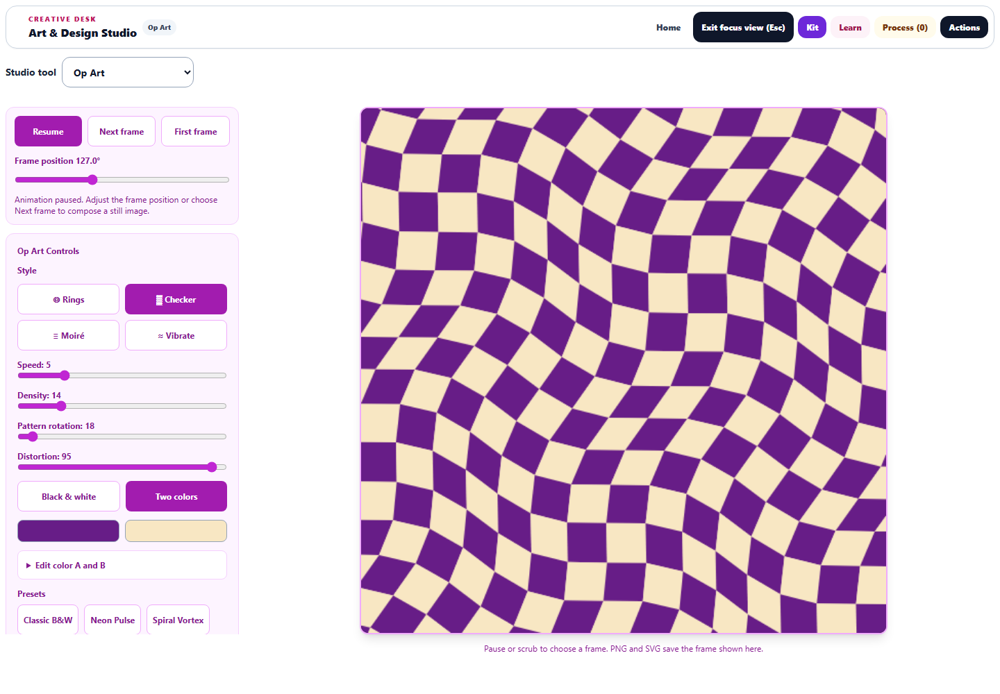
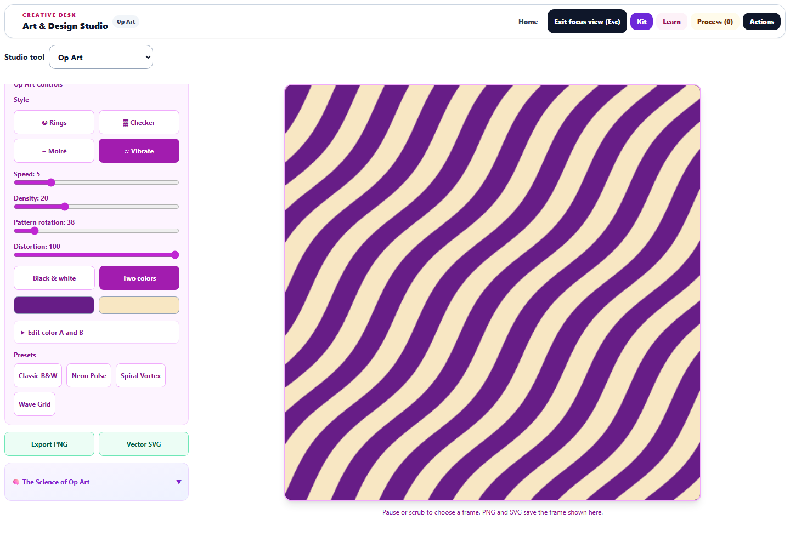

# Op Art: complete patterns and controllable still frames

The September 29 continuation improves all four Op Art styles: rings, warped checkerboards, moiré lines, and wavy stripes.

## Pattern and color controls

Checkerboard cells and neighboring stripes now share their boundaries, eliminating the old gaps between independently displaced shapes. Pattern generation extends beyond the canvas before rotation. Rings and line fields also render over an opaque paper color, so exports do not acquire transparent corners.

**Pattern rotation** works across all styles. **Distortion** changes ring proportions, checkerboard warping, and stripe curvature. Moiré has a **Line crossing angle** control. The shared geometry feeds both the canvas and SVG export.

Choose **Black & white** or **Two colors**. The color editor provides independent hue, saturation, and lightness for A and B, plus a swap button. Two red hues no longer force monochrome when Two colors is selected. Older saved patterns with both hues at zero still open in black and white. Presets restore their complete color and geometry settings.

## Playback and saved frames

Pausing now holds the exact displayed frame. Resuming, changing speed or density, adjusting colors, and opening other controls no longer restart animation at frame zero. Playback advances with elapsed time and limits drawing to approximately 30 updates per second. Timing tests cover 30, 60, and 120 animation callbacks per second. Hidden pages stop scheduling work and resume without a time jump.

The **Frame position** slider pauses and selects a still composition. **Next frame** advances it by five degrees; **First frame** returns to zero. Rapid consecutive steps remain distinct. Settings changes, saved studies, artwork handoffs, and leaving the mode capture the displayed phase. Restoring a study or changing learners creates a fresh canvas runtime. Reduced-motion preferences still start the view paused and allow explicit playback.

## Workspace and export

The shared focus view now targets the correct Op Art canvas ID. At 1440 × 1000, the preview measures 760 pixels square beside a scrollable settings column. On a 390-pixel phone, the artwork appears first and playback controls follow it. Buttons have at least 44-pixel touch targets, labels fit, and the page has no horizontal overflow.

PNG export, SVG export, handoffs, and Process Shelf previews capture the displayed frame without advancing playback. PNG remains 512 × 512; SVG preserves scalable shapes and lines. Export failures produce an error rather than a success message.

The learning panel now explains moiré as the geometry of overlapping repetitive patterns and includes still-frame and color-edge experiments. This interpretation follows the [Exploratorium's Moiré Patterns exhibit](https://annex.exploratorium.edu/xref/exhibits/moire_patterns_table.html).

## Verification

**101 unique tests passed across 11 relevant files**, including 11 new Op Art regression cases. Coverage includes timing, pause/resume, rapid stepping, scrubbing, color independence and legacy monochrome, saved phase and ownership, complete exports, missing contexts, hidden-page behavior, cleanup, motion preferences, snapshots, shared workspace behavior, translation boundaries, and accessible labels. The full repository suite was not run.

Browser checks covered 12 style/density/rotation/distortion/frame combinations. Every canvas was fully opaque, and every PNG matched the displayed canvas exactly. Rasterized SVG had mean RGB channel differences from 0 to 0.225 on a 0–255 scale. Checkerboard and stripe geometry covered all 5,400 sampled locations exactly once, with no sampled gaps or overlaps.

Browser checks also confirmed exact-frame pausing, speed changes, resuming, switching away and back, manual stepping, visible monochrome moiré, actual PNG/SVG downloads, desktop focus, and phone layout. No page errors occurred. Desktop and phone screenshots were visually reviewed. Source/public parity, JavaScript syntax, and scoped whitespace checks passed. Changes remain local; nothing was deployed.

- [Phone preview](op-phone-focus.png)
- [Downloaded SVG](op-browser-export.svg) and [PNG](op-browser-export.png)
- [Browser measurements](op-browser-results.json) and [structured validation](op-validation.json)
- [Initial workspace and motion tests](op-initial-tests.log) and [final editing, accessibility, and saved-artwork tests](op-final-tests.log)

Reproduce browser checks with `node dev-tools/artstudio_opart_qa.cjs` from the repository root.
