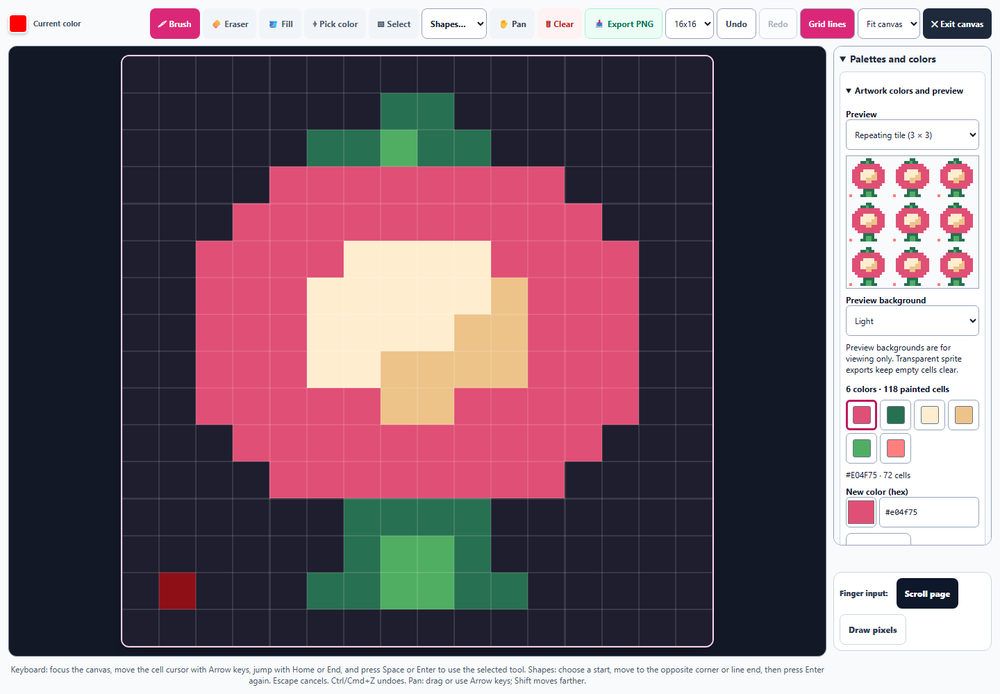
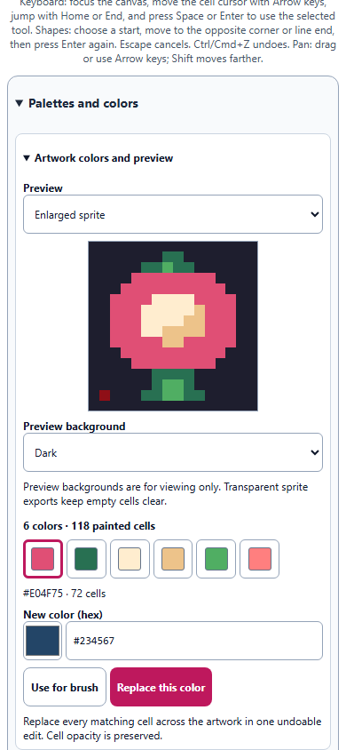

# Pixel Art: artwork colors and clean previews

September 30, 2026. All changes remain uncommitted.

The pixel workspace now includes an artwork palette with exact color editing and clean sprite previews. The expanded drawing grid remains 854 × 854 CSS pixels in the 1440 × 1000 browser check. The new controls live in the existing palette column and remain usable on a 390-pixel phone.

## Editing colors

- Colors already used in the artwork are grouped by their rendered RGB and opacity, sorted by cell count, and shown with accessible names and counts. Equivalent hex, RGB, HSL, and legacy named colors share an entry. Large palettes use pages of 24 swatches; the browser check reaches all 65 colors in its dense-palette fixture.
- Choose an artwork color, enter a three- or six-digit hex value or use the color picker, then choose **Use for brush** or **Replace this color**. Incomplete hex input disables both actions and shows a correction hint.
- Brush reuse retains enough HSL precision to reproduce the chosen RGB color without altering existing artwork. Replacement updates all matching cells, including disconnected regions, preserves cell opacity and empty cells, and creates one Undo step. Undo restores the original color strings exactly; Redo reapplies the edit.
- Switching learners or restoring another artwork clears the unfinished color draft. Replacement cancels unfinished shape/selection guides before applying its edit. A replacement with the same rendered color creates no history entry.
- Fill now follows connected cells of the same rendered color even when they use different hex, RGB, or HSL spellings. It continues to respect different colors, opacity, and disconnected regions.

## Previews

The palette panel offers an enlarged sprite, actual size at one CSS pixel per artwork cell, and a 3 × 3 repeating-tile view. A transparency checker, light background, or dark background helps inspect edges and gaps. These backgrounds are only display treatments; the underlying preview and transparent sprite export retain alpha.

The preview uses the artwork data without grid lines, cursor outlines, or uncommitted shape/selection guides. Drawing updates, recoloring, and Undo/Redo update it. Preview choices use the existing pixel settings and study-persistence path. The artwork format and main PNG export behavior are unchanged.

## Verification

**125 tests passed across 13 files** in `pixel-colors-regression-results.json`. This includes 14 color/preview helper cases, 39 pixel editing/accessibility cases, and coverage of study persistence, artwork round trips, profile ownership, hostile saved state, canvas context guards, hydration, translated accessible names, announcements, touch behavior, and snapshots.

The initial focused run exposed a test that assumed the last canvas context belonged to the main editor. With a second canvas now present, that assertion was updated to select the editor's context explicitly; the final regression run passes all its original drawing and export assertions.

The Chromium check uses the repository's React runtime, tool source, and compiled styles. It verifies real controls, a 72-cell recolor and exact Undo/Redo, equivalent legacy named colors, 16 × 16 actual-size display, identical repeated tiles, retained half-opacity cells, unchanged transparent sprite export, excluded shape guides, and exact brush-color reuse. All 12 visible phone controls in the panel meet the 44-pixel height floor; there is no horizontal overflow and no page error. The browser harness exits native fullscreen before resizing and opens the palette after the phone layout collapses it.

Evidence:

- [Browser results](pixel-colors-browser-results.json)
- [Regression results](pixel-colors-regression-results.json)
- [Validation and source hash](pixel-colors-validation.json)
- [Transparent sprite fixture](pixel-colors-sprite.png)
- [Changes against the pre-pass source](pixel-colors-preservation.diff)

Run `node dev-tools/artstudio_pixel_colors_qa.cjs` for the browser check. These checks exercise the standalone tool in Chromium; they do not launch the packaged desktop application.
