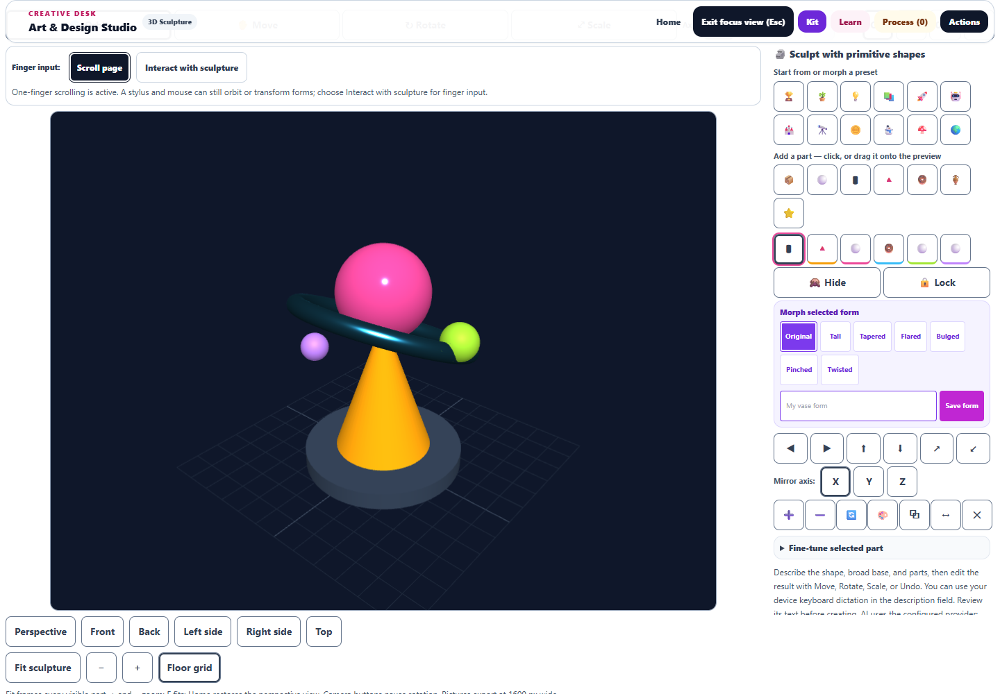
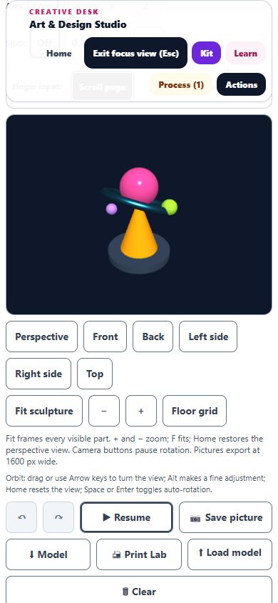
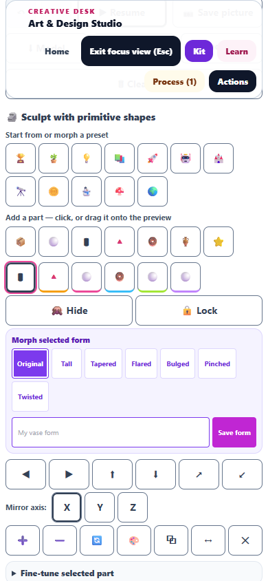
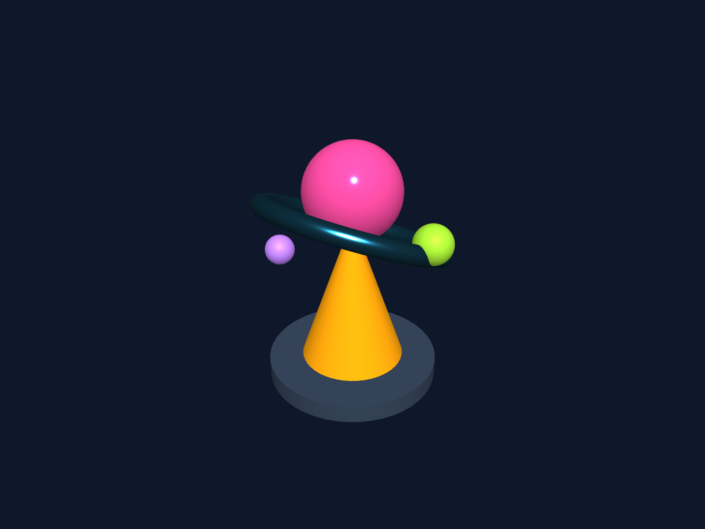

# 3D Sculpture: viewing workspace and image capture

This pass expands the sculpture preview and makes it easier to inspect, frame, save, and export a model. All changes remain uncommitted.

- The responsive preview measures **960 × 720 CSS pixels** in the tested 1440 × 1000 focus workspace. The editor occupies a separate 320px column; phone layouts place it beneath the preview. Rendering follows the display size and device pixel ratio, with a bounded backing buffer.
- **Fit sculpture** frames the actual visible geometry, including rotation, stretch, deformation, and whole-model transforms. Hidden parts do not affect framing. Initial models, presets, gallery loads, and imported models frame automatically; ordinary part edits preserve the camera.
- Perspective, Front, Back, Left side, Right side, and Top buttons offer six inspection angles. Zoom buttons and **+/−**, **F**, and **Home** keyboard commands work while the preview is focused. Manual orbit and camera commands pause automatic rotation. Camera changes do not consume model undo history.
- The camera position and floor-grid preference travel with saved studies. Navigation captures the live camera, including its current angle during automatic rotation. Later restored camera data also updates an already mounted preview.
- Curved primitives use the shared engine's smoother surface setting. Paused scenes skip repeated WebGL draws, and offscreen or hidden previews suspend automatic rendering. A lightweight animation-frame lifecycle check remains; mesh, renderer, and observer resources are released after the preview leaves the document.
- Picture downloads and artwork transfers capture a fresh **1600 × 1200 PNG** from the standard 4:3 view, independent of phone preview size. Study thumbnails use a freshly rendered canvas too. Capture restores the preview's rendering size even if copying fails.
- Sculpture controls have a minimum 44px height, keyboard help explains framing and zoom, and scroll targets account for the focus toolbar. Fourteen new English strings are present in the catalog and both runtime registries.

The browser harness uses the repository's React, compiled CSS, local Three.js r128, Prim3D, and Art Studio code in Chromium with software WebGL. It checks real rendering, all six camera angles, native pointer orbit, keyboard zoom, navigation recovery, paused rendering, PNG contents, study thumbnails, desktop sizing, and phone overflow and control height. It does not launch the packaged desktop application or invoke AI generation.

**148 regression tests passed across 16 files**, and desktop/phone browser checks passed with no page errors. The main run reported 139 checks; the aria-label file was absent from that report and was rechecked separately with all 9 checks passing.

The regression suite covers camera geometry and lifecycle, existing sculpture edits, custom profiles, AI-result recovery, Print Lab handoffs, accessibility strings, reduced motion and touch behavior, studies, capture ownership, saved-state handling, and Prim3D. See [validation](sculpt-view-validation.json), [test results](sculpt-view-final-results.json), and [browser results](sculpt-view-browser-results.json).

