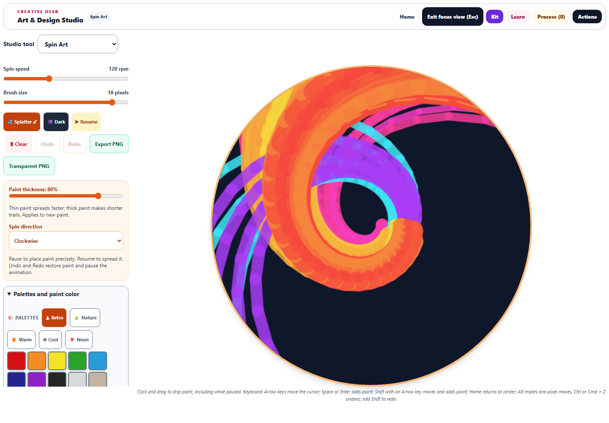

# Spin Art: painting, playback, and workspace

This pass makes Spin Art usable as a drawing tool while paused, adds recoverable editing, and gives the circular paper more room. The source and served copy are synchronized. Changes are saved locally; no deployment was performed.

## Painting and editing

- A click, tap, or keyboard action places visible paint immediately, including when reduced motion starts the tool paused. New paint lands under the pointer at every rotation angle.
- Dragging interpolates between samples and includes the release position. Pointer capture tracks one active pointer; unrelated fingers cannot move or finish its stroke. Finger scrolling remains the default until **Drip paint** is selected.
- **Undo** and **Redo** keep up to 20 edits and restore both the pixels and moving drops. Each drag is one edit. **Clear** can be undone. Undo/redo pause the animation so the recovered painting stays visible. Ctrl/Cmd+Z, Ctrl/Cmd+Shift+Z, and Ctrl/Cmd+Y are supported.
- Undo history belongs to the currently open canvas. Switching tools restores the saved painting and particles, but starts a fresh undo history.
- **Paint thickness** controls the spread of new drops, and **Spin direction** changes clockwise/counterclockwise motion. Existing paint keeps its own color and thickness. Full HSL colors, palettes, splatter, and paper colors remain available.

## Playback and saved work

The simulation advances in fixed 1/60-second steps, independent of screen refresh rate. A deterministic regression produces exactly the same paint and particle state at 60 Hz and 120 Hz. Higher RPM increases the outward spreading term quadratically. Connected trails avoid gaps between fast-moving samples.

Resume starts in one action. Paused, hidden, empty, and disposed canvases stop requesting animation frames. Returning from a hidden page resets the time anchor instead of catching up the elapsed time. Running artwork checkpoints periodically and when it settles; editing also checkpoints at completion.

Saved studies retain the paint, rotation phase, and moving drops. A small format marker records that the paint has already been clipped to the circular paper. Older square snapshots are clipped once on restoration; newer ones restore directly, preserving the translucent rim without repeatedly fading it. Malformed saved particles are filtered, and export waits for snapshot decoding.

This remains a stylized painting model, not a full rotating-fluid solver. The learning copy describes that limitation and invites comparisons of speed, drop position, and paint thickness.

## Workspace and export

The desktop layout places the controls beside the canvas, with a scrollable control column in Focus view. At a 1440 × 1000 viewport, the paper measures **760 × 760 pixels**. On a 390-pixel-wide phone, the preview comes first, controls follow, and the page has no horizontal overflow. Buttons and palette swatches have at least 44-pixel touch targets.

The standard **PNG** includes the selected paper color. **Transparent PNG** contains only paint. Browser checks verify that the transparent export matches every canvas pixel, has transparent corners, and contains no marks beyond the circular rim; the standard export is fully opaque. Both are 512 × 512 pixels, without the interface or keyboard cursor.

[Phone preview](spin-phone-focus.png) · [PNG example](spin-browser-export.png) · [Transparent PNG example](spin-browser-transparent.png)

## Validation

- 87 tests across nine relevant test files, including 12 new engine regressions.
- Browser checks cover actual pointer and keyboard painting, whole-stroke undo/redo, Clear recovery, pause/resume, navigation round trips, exact edge preservation, downloaded exports, paper changes, desktop sizing, and phone layout. No browser page errors were reported.
- Source syntax, source/public parity, and diff whitespace checks pass.
- The full repository test suite was not run.

Evidence: [validation summary](spin-validation.json), [browser measurements](spin-browser-results.json), [regression log](spin-final-tests.log), and the reusable [browser check](../../dev-tools/artstudio_spin_qa.cjs).
