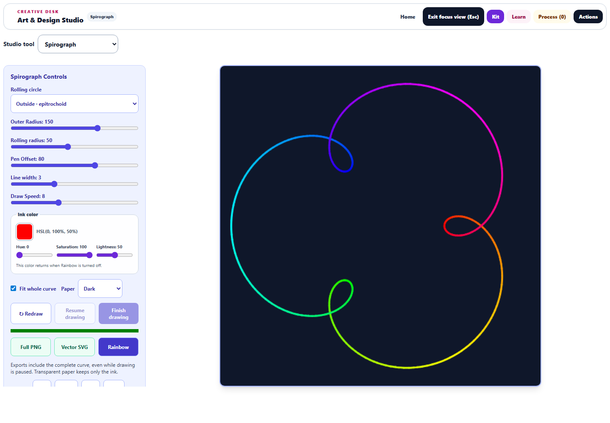

# Spirograph: drawing, playback, and vector export

The September 29 pass deepens the pattern-making workflow in Art & Design Studio.

## Creating patterns

- Choose inside rolling (hypotrochoid) or outside rolling (epitrochoid).
- Fit the entire curve within the paper, including thick strokes. Natural-size drawing remains available by clearing **Fit whole curve**.
- Adjust line width from 0.5 to 8 units and use dark, light, or transparent paper.
- Preserve independent HSL ink controls, rainbow progression, and the five familiar presets.
- See the reduced radius ratio and the number of trips in a complete cycle.

The desktop focus workspace uses a scrollable controls sidebar beside a 760-pixel preview at a 1440 × 1000 viewport. On a 390-pixel phone, the 374-pixel preview appears before the controls. All Spirograph buttons have at least 44-pixel touch targets.

## Playback and saved work

**Pause drawing**, **Resume drawing**, and **Finish drawing** give control over the animation. Changing speed retains the same canvas and drawing progress. Reduced-motion mode draws the completed curve immediately. Leaving the lab cancels its scheduled animation.

Pausing, finishing, leaving the workspace, and saving a Process Shelf study capture progress. Restored progress is accepted only for the matching geometric model and redraw revision; changing the curve cannot accidentally apply a stale checkpoint. This preserves the paused drawing while keeping the full curve available for export.

## Complete artwork exports

**Full PNG** exports the complete curve at 512 × 512 pixels. **Vector SVG** exports scalable paths for enlarging or editing elsewhere. Both work while the preview is paused and preserve the selected paper, ink, and line width. Transparent paper omits the background. Exports, artwork handoffs, and study thumbnails use the complete curve rather than an unfinished frame.

A shared bounded geometry model drives Canvas and SVG. Equal-color segments form paths, avoiding a separate stroke or SVG element for every sample. Rainbow SVGs use at most 360 paths. Saved radii and colors are normalized to finite values, and geometry is capped at 36,000 segments.

The rolling-circle equations were checked against [Eric Martin's UNSW notes on hypotrochoids and epitrochoids](https://webcms3.cse.unsw.edu.au/files/77a3632422040bb6f33386b1818982b7b9fc8fbe6de5f4f62eda4af9ee1fafd3). The learning text now correctly explains that whole-number radii produce closed curves.

## Verification

**73 tests passed across eight relevant files**, including seven new regressions for fitting, closure, playback, transparency, malformed saved state, cleanup, and checkpoint restoration. Initial thread-worker startup failures were recovered using Vitest's fork pool. No repository timeout configuration changed, and no full-repository test pass is claimed.

Browser checks on the final source verified both curve types, actual PNG/SVG downloads, preview preservation during export, playback controls, and responsive layouts. For two intricate fitted rainbow patterns, ink remained within pixels 16–495 and SVG/PNG mean channel differences were 0.0171 and 0.0152 on a 0–255 scale. There were no browser page errors. Screenshots were visually reviewed.

Source and public mirror hashes match; JavaScript syntax and scoped whitespace checks passed. Changes remain local.

- [Phone preview](spiro-phone-focus.png)
- [Downloaded SVG](spiro-browser-export.svg) and [PNG](spiro-browser-export.png)
- [Browser measurements](spiro-browser-results.json)
- [Structured validation](spiro-validation.json)
- [Workspace suite and initial worker failures](spiro-initial-tests.log), [geometry/context recovery](spiro-recovery-tests.log), and [final checkpoint, snapshot, ownership, and translation tests](spiro-final-tests.log)
