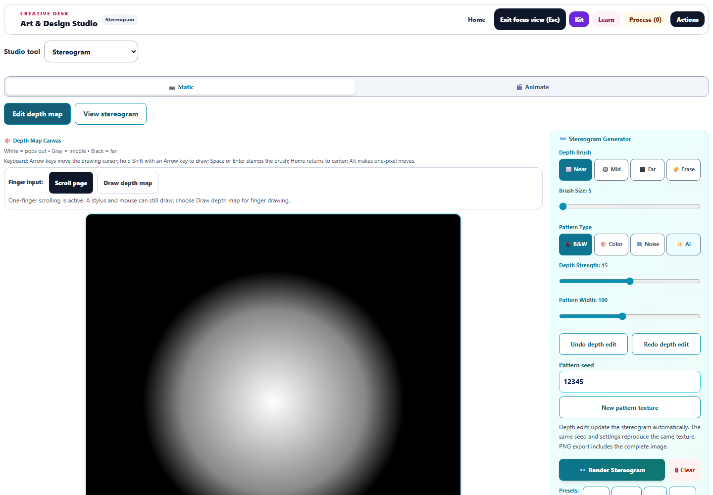
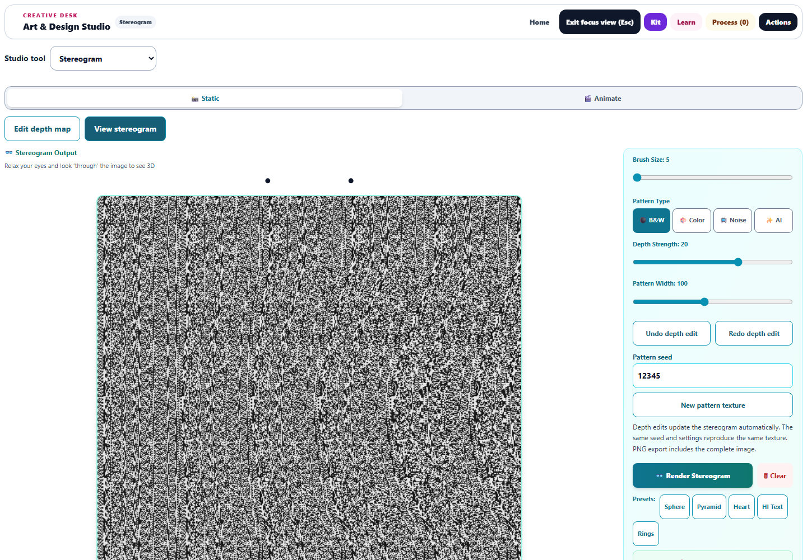
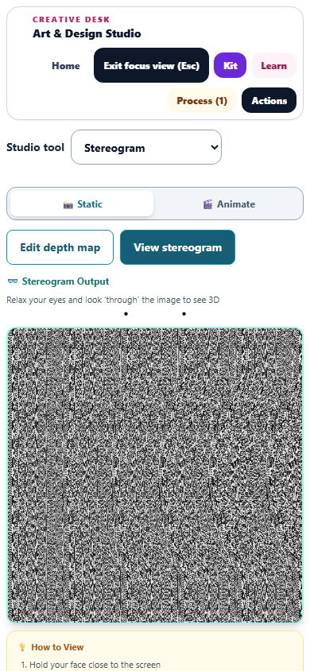
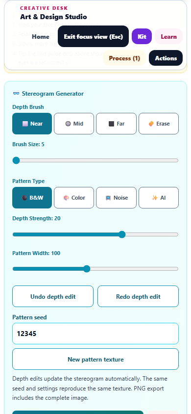

# Static Stereogram enhancements

Completed September 30, 2026. Changes remain uncommitted and undeployed.

The static stereogram workspace now combines a larger depth editor, recoverable drawing, repeatable texture experiments, and complete exports. Fast strokes previously stamped disconnected circles, navigation could discard the drawn depth map, and an export or study thumbnail could capture only the rows rendered so far.

## Workspace and drawing

- Switch between **Edit depth map** and **View stereogram** while keeping both canvases mounted. The tested desktop focus editor is 760px wide; controls sit beside it. On a phone, the active preview appears before the controls.
- Pointer strokes connect consecutive samples and include the release coordinate. Coalesced pen samples are included. Cancellation and lost capture finish at the last painted point; unrelated pointers cannot finish another stroke.
- Twenty-step undo/redo supports whole strokes, keyboard stamps, Clear, and presets. Keyboard drawing, fine cursor movement, and the explicit touch drawing mode remain available.
- Presets apply immediately and update the stereogram without the former delayed render timer. Clear and presets preserve the mounted depth canvas and can be undone.
- Viewing dots now appear above the output, separated by one background repeat. They match the existing viewing instructions and remain outside the exported image.

## Persistence and rendering

Depth artwork is captured as a PNG in the existing tool state and study payloads. Browser checks verified exact drawing preservation through lab changes and an animation-mode round trip. Legacy static depth buffers can also initialize the editor.

Restoration blocks drawing until the image is ready. Revision checks prevent an older image load from replacing newer artwork, including successive loads on the same canvas. Late-arriving hydrated state is applied without requiring a reload. Saved-study capture waits for restoration and cancels if its canvas or owner is replaced.

The preview renders progressively in 32-row chunks using a bounded, deterministic model. PNG exports, artwork handoffs, and saved-study thumbnails finish the current render before capture. Obsolete or detached rendering work is cancelled. Both rendering settings and depth edits update the preview automatically.

The pattern seed controls generated black-and-white, color, and noise textures. Returning to a previous seed reproduces that texture; zero depth strength provides a flat-plane comparison. Existing image-tile support remains. Malformed or oversized raster metadata is rejected, and missing image tiles use the existing grayscale-noise fallback.

## Validation

- Initial compatibility: **30/30 tests** across four files.
- New coverage: **24 tests**, comprising ten renderer/model cases and fourteen editing/persistence cases.
- Broader regression: **140/140 tests** across nineteen files, covering keyboard/touch behavior, animation compatibility, saved studies, hydration, capture ownership, prior artwork workflows, accessibility, and Harmony Lab.
- The final targeted accessibility/workflow run is recorded in [stereo-final-results.json](stereo-final-results.json).
- Chromium checks passed at 1440 × 1000 and 390 × 844, with zero page errors. Measured static controls were at least 44px in both dimensions, with no phone horizontal overflow.
- A browser test deliberately stopped animation callbacks after 32 rows. Export completed all 512 rows, every output pixel was opaque, and downloaded PNG bytes matched the completed canvas.
- Native fast strokes, whole-gesture undo/redo, Clear/preset recovery, navigation, study depth data, repeatable seeds, and viewing-dot spacing passed browser checks.
- Syntax, source/public parity, pinned Spectral vendor parity, and scoped whitespace checks passed. Fourteen new English strings match both runtime registries and the Art Studio English catalog.

An old grammar guard was updated to stop requiring two Harmony descriptions retired in the preceding pass; it still rejects their misspelled possessive form. The pre-pass source diff was reviewed to preserve earlier enhancements.

The broader suite is scoped to Art Studio, not the entire repository. Browser checks use the real tool module, React runtime, and workspace CSS in the existing QA harness rather than a packaged desktop launch. Drawing history is local to the mounted editor and resets on navigation, learner/project changes, or external restoration; saved depth artwork persists. Native depth maps remain 400 × 400 and stereogram PNGs remain 512 × 512. The underlying repeat-period depth algorithm is retained; these checks do not establish individual viewers' ability to perceive the illusion. Live AI image generation was not invoked.

Evidence: [validation metadata](stereo-validation.json), [browser checks](stereo-browser-results.json), [regression results](stereo-regression-results.json), and [exported PNG](stereo-export.png).

## Previews

