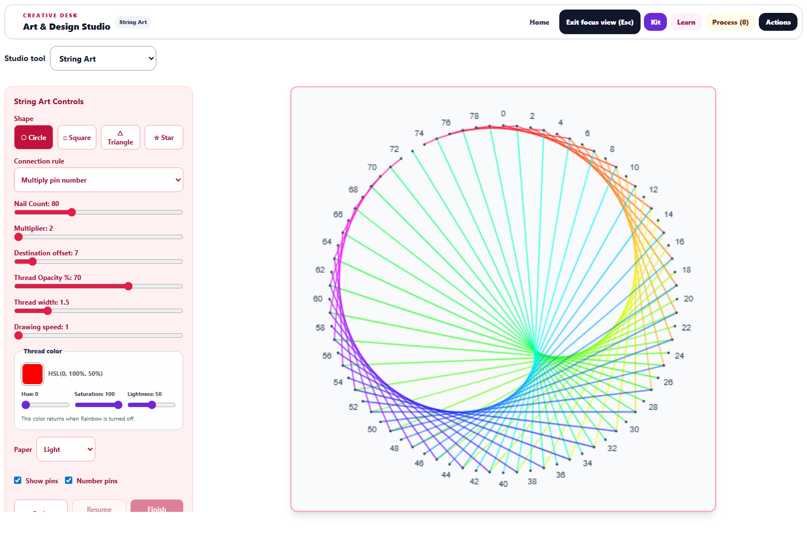
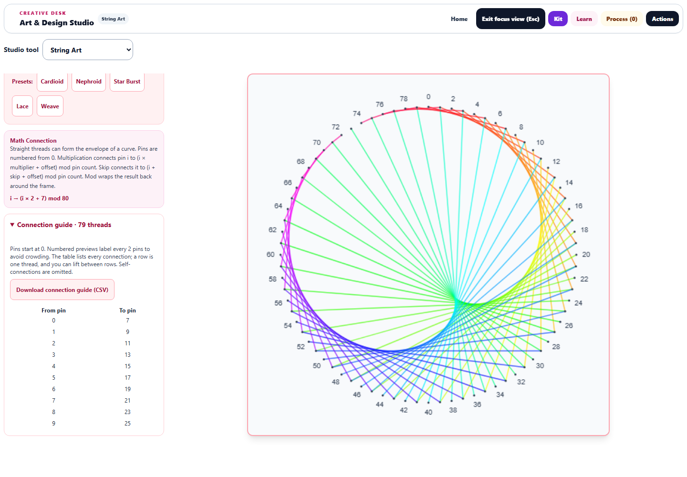

# String Art: patterns and construction guides

The September 29 continuation connects String Art's onscreen patterns to physical making.

## Pattern controls

All four frames—circle, square, triangle, and star—support multiplication or a fixed pin skip, plus a destination offset. Controls include thread width, opacity, independent HSL color, rainbow progression, and dark, light, or transparent paper. Pins can be hidden for an ink-only artwork or shown with sparse numbering for a construction template.

Pins start at 0. Multiplication connects pin `i` to `(i × multiplier + offset) mod pin count`; skip uses `(i + skip + offset) mod pin count`. Self-connections are omitted because they have no thread length. A rule with no nonzero connections explains how to adjust the skip or offset.

Named presets restore the circular multiplication rule and clear the offset so, for example, **Cardioid** produces its intended construction even after experimenting with a star-shaped skip pattern. Thread color remains available independently.

## Physical construction

The expandable **Connection guide** lists every from/to pin pair. Its CSV download contains the same rows. Each row represents one thread; lifting between rows is allowed. Duplicate connections in opposite directions remain separate passes, while self-connections are excluded.

Numbered previews label every `ceil(pin count / 40)` pins to avoid crowding. Every pin remains visible, and the table includes all connections. **Vector SVG** preserves scalable threads, pins, labels, and the chosen paper; **Full PNG** exports the completed 512 × 512 artwork. Hiding pins also omits their labels from both exports.

## Drawing and workspace

Pause, resume, finish, and speed controls manage progressive drawing. Speed changes preserve the same canvas and progress. Checkpoints captured when pausing, finishing, saving a study, or leaving the lab restore the matching pattern; stale progress is ignored after a geometry change. Leaving the lab cancels its scheduled frame. Reduced-motion mode completes the drawing immediately.

Exports, artwork handoffs, and Process Shelf thumbnails include the entire pattern without advancing a paused preview. Canvas and SVG use the same bounded geometry and ordinary opacity compositing, including on transparent and light backgrounds.

Focus view places the controls in a scrollable sidebar next to a 760-pixel preview at a 1440 × 1000 viewport. On a 390-pixel phone, the 374-pixel preview appears first. Buttons retain at least 44-pixel touch targets and the page has no horizontal overflow.

## Verification

**97 tests passed across 11 relevant files**, including 12 new String Art regression cases. Coverage includes all frame geometries, modular connections, empty rules, complete transparent exports, label density, playback, checkpoint restoration, preset restoration, corrupt saved data, animation cleanup, export failures, snapshots, ownership, translations, and shared workspace behavior. These are targeted checks; no full-repository test pass is claimed.

The final browser run checked all four frame shapes. Complete PNG and SVG renders had mean RGB channel differences between 0.44 and 0.55 on a 0–255 scale. Downloaded CSV rows matched the visible guide exactly. Actual PNG/SVG downloads, pause/resume, speed changes, completion, switching away and back, desktop focus layout, and phone layout passed. No page errors occurred. The desktop, phone, and guide screenshots were visually reviewed.

Source/public parity, JavaScript syntax, and scoped whitespace checks passed. Changes are saved locally; nothing was deployed.

- [Phone preview](string-phone-focus.png)
- [Downloaded SVG](string-browser-export.svg), [PNG](string-browser-export.png), and [connection CSV](string-browser-connections.csv)
- [Browser measurements](string-browser-results.json) and [structured validation](string-validation.json)
- [Workspace and saved-state tests](string-initial-tests.log), [construction and snapshot tests](string-construction-tests.log), and [accessibility/translation tests](string-accessibility-tests.log)

Reproduce browser checks with `node dev-tools/artstudio_string_qa.cjs` from the repository root.
