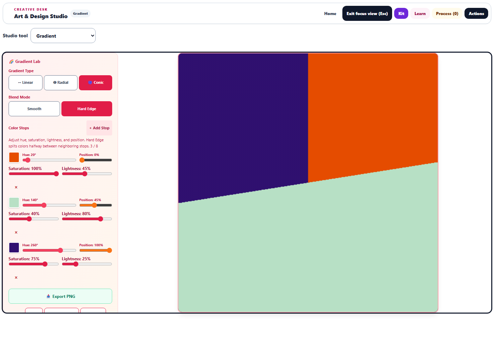

# Art & Design Studio: workspace and color workflow

This pass expands the improvements beyond Pixel Art and Watercolor.

## Focus workspace

Every one of the 18 studio modes now has **Focus workspace** in the shared toolbar. It hides the navigation, introductory panel, and inspector while retaining the mounted artwork canvas. A compact tool picker remains available. **Exit focus view (Esc)** restores the layout; opening Kit, Learn, or Process also brings the inspector back. Canvas-specific Escape actions and an active fullscreen workspace take precedence over leaving focus view.

The view preference stays in the current session rather than entering saved artwork. Changing learner profiles resets it. The pixel and watercolor canvas expansion controls remain available.

In Gradient Lab, desktop focus view puts controls in a scrollable sidebar and enlarges the preview to 760 pixels in the 1440 × 1000 browser check. On a 390-pixel phone, the 374-pixel preview comes before the controls. Gradient buttons have a 44-pixel minimum touch target.

## Gradient Lab and shared palettes

Each gradient stop now supports hue, saturation, lightness, and position, including black, white, and neutral colors. Legacy stops keep their original 85% saturation and 55% lightness defaults. Invalid saved values are bounded, and positions remain ordered without moving focused rows.

**Use Thread Kit colors in Gradient** preserves the palette's full HSL values. **Add gradient palette to Thread Kit** carries those colors into the existing Pixel Art, Contrast, and other palette-enabled lab workflows. Transfers only change the selected destination or the current project's kit.

The preview, PNG, displayed CSS, and copied CSS now share the same stop definitions. Linear gradients follow CSS's top-origin angle convention and cover the full diagonal of the drawing area. Radial gradients use the farthest corner. Conic gradients start at the top and interpolate in sRGB. Hard Edge divides the space halfway between neighboring stops, includes the final color, and exports those same boundaries.

Native Canvas gradients replace the previous per-pixel hard-band drawing and conic rendering where supported. A pixel renderer remains for browsers without native conic gradients. Clipboard errors are reported even when the clipboard implementation throws synchronously.

Geometry follows [CSS Images Level 3](https://www.w3.org/TR/css-images-3/); explicit sRGB interpolation follows [CSS Images Level 4](https://www.w3.org/TR/css-images-4/). These references inform the implementation; browser pixel comparisons verify its output.

## Browser verification

Run `node dev-tools/artstudio_studio_qa.cjs` from the repository root.

- All 18 modes enter and exit focus view with a wider stage. Canvas modes retain their mounted canvas.
- Eleven Canvas/CSS comparisons cover four linear angles, radial and conic gradients, all three Hard Edge types, and both conic fallback variants. Across 132 sampled pixels per case, the largest channel difference is 1 on the 0–255 RGB scale.
- Phone checks confirm the preview precedes controls, touch targets remain 44 pixels tall, there is no horizontal overflow, and Kit reopens its dialog correctly.
- The browser run reports no page errors.

See [browser measurements](studio-focus-gradient-browser.json), [desktop focus view](studio-focus-spirograph.png), and [phone focus view](studio-focus-phone.png). Changes are local; no deployment was performed.

## Regression verification

The focused Gradient, saved-state, and stage/Thread Kit suites passed **39 tests across three files**, including 13 new regressions. An initial stage-suite worker startup timeout was recovered by running that file separately; all 23 tests in that file passed. Source and served-copy hashes match, JavaScript syntax checks passed, and the scoped whitespace check passed.

The broader 58-file Art Studio run was stopped after about 30 minutes without a final result while the host was under heavy contention. That run is **incomplete**, and no full-suite pass is claimed. Only this task's verified Vitest process was stopped. Repository timeout settings were not changed.

The captured broader output exposed two existing checks that inspected only the first stylesheet. Focus workspace introduces an additional stylesheet, so the checks now inspect all rendered styles while preserving their contrast and translation assertions. Both affected suites then passed all 11 tests, bringing this pass to **50 verified tests across five files**. No production change was needed for those two failures.

Logs: [focused Gradient and saved-state run](studio-focus-gradient-focused.log), [stage-suite recovery](studio-focus-stage-recovery.log), [stylesheet-suite recovery](studio-stylesheet-recovery.log), and [incomplete broader run](studio-whole-suite.log). The structured record is [validation-summary.json](validation-summary.json).
