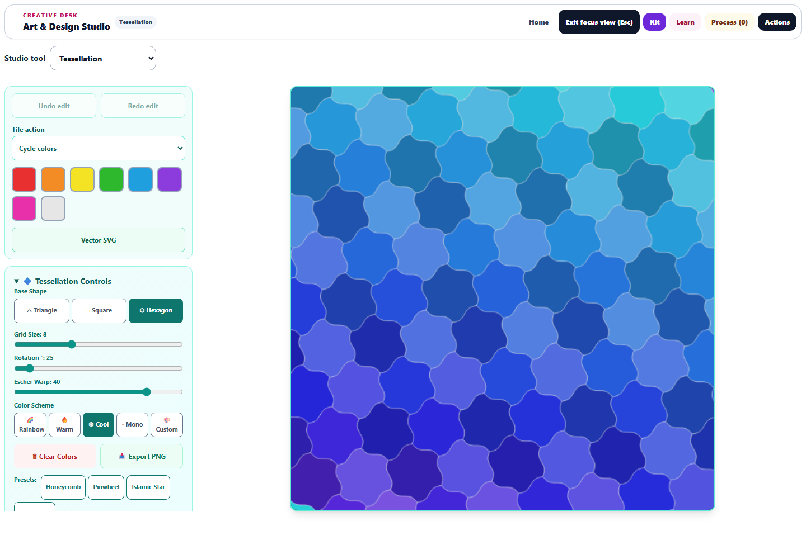

# Tessellation: accurate geometry and editable patterns

The September 29 continuation improves the Tessellation workspace, tile editing, and scalable artwork export.

## Geometry and selection

Triangles, squares, and hexagons now share one geometry calculation for canvas rendering, pointer selection, and SVG output. Warped edges meet their neighbors, including after rotation. The hexagon lattice now matches its vertex orientation, correcting the previous gaps and overlaps. Rotation generates enough surrounding tiles to cover the full artwork.

Pointer selection follows the visible warped outline. Each tile has a stable shape/row/column identity, so adjacent triangles with the same old coordinate key can be painted independently. Previously saved coordinate-based colors remain readable. Restoring one tile to its pattern color does not reset its neighbor.

## Editing and history

Choose **Cycle colors**, **Paint selected color**, or **Restore pattern color**. Eight named swatches support direct painting. Palette changes keep painted tiles, while shape changes and presets start a fresh pattern that can be undone.

Undo and redo retain up to 30 edits, including tile colors, palette changes, geometry adjustments, and clearing. Ctrl/Cmd+Z undoes an edit; Ctrl/Cmd+Shift+Z or Ctrl+Y redoes it while the canvas is focused. Rapid keyboard edits remain separate history steps. Restoring saved data or changing learners clears stale history.

The canvas remains mounted through edits and workspace changes. Arrow keys navigate visible tiles, Enter or Space applies the selected action, and Home returns to a central tile. Screen reader descriptions and announcements identify selection and color changes.

## Workspace and export

Focus view provides a large preview beside a scrollable settings column. The desktop browser check measured a 760-pixel square preview at a 1440 × 1000 viewport. On a 390-pixel phone, the preview appears before the controls with no horizontal overflow. Buttons have at least 44-pixel touch targets.

**Vector SVG** exports the actual warped and rotated polygons with their painted colors. The existing 512 × 512 PNG export remains available. Keyboard selection guides stay out of both exports.

## Verification

**85 unique tests passed across 10 relevant files**, including eight new Tessellation regression cases. Coverage includes warped selection at two rotations, independent triangle colors, undo/redo, rapid input, legacy colors, saved-state restoration, bounded history, malformed saved geometry, capture ownership, snapshots, shared workspace behavior, canvas guards, translations, and accessible labels. These are targeted checks; the full repository suite was not run.

Browser checks covered 12 shape/grid/rotation/warp combinations. At 2,116 sampled points per combination, no holes or overlapping interiors were detected. No uncovered background pixels were found in any of the 12 rendered canvases. Rasterized SVG and canvas output had mean RGB channel differences between 0 and 0.00086 on a 0–255 scale. A rotated, warped tile was painted correctly, and undo/redo restored the exact before/after canvas images.

Actual PNG and SVG downloads, desktop focus layout, phone ordering, overflow, and touch targets passed. No browser page errors occurred. Desktop and phone screenshots were visually reviewed. Source/public parity, JavaScript syntax, and scoped whitespace checks passed. Changes are saved locally; nothing was deployed.

- [Phone preview](tess-phone-focus.png)
- [Downloaded SVG](tess-browser-export.svg) and [PNG](tess-browser-export.png)
- [Browser measurements](tess-browser-results.json) and [structured validation](tess-validation.json)
- [Initial workspace tests](tess-initial-tests.log), [editing and saved-state tests](tess-editing-tests.log), and [accessibility and ownership tests](tess-accessibility-tests.log)

Reproduce browser checks with `node dev-tools/artstudio_tess_qa.cjs` from the repository root.
