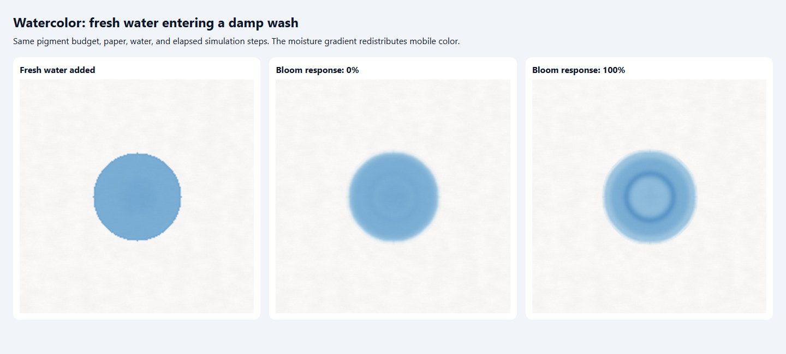
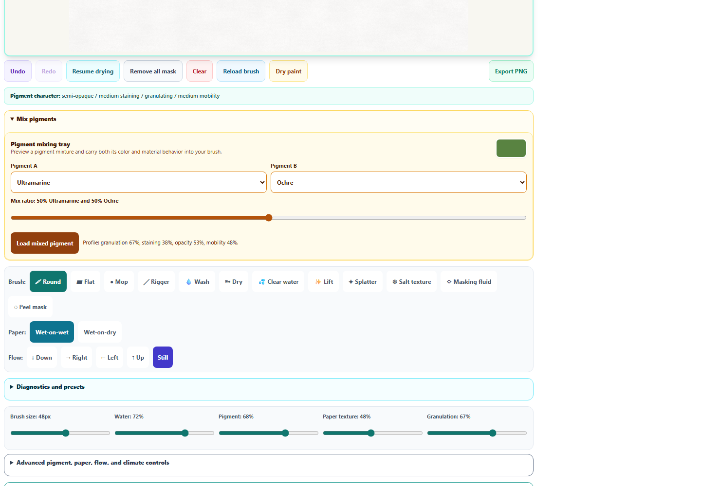
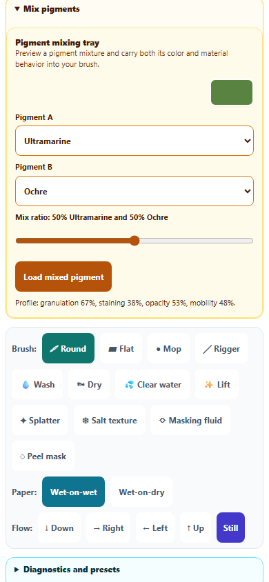

# Watercolor: moving backruns and pigment premixing

Fresh water now displaces mobile pigment through a damp wash, leaving a lighter center and a concentrated rim. Previously, the bloom setting primarily emphasized wet boundaries in the rendered color while diffusion pulled pigment back into a clear patch. The new moisture-gradient transport and reduced counterflow make the effect part of the evolving painting.

The existing **Bloom sensitivity** control adjusts the response. Paper sizing and granulation also influence movement. Masking fluid remains a barrier, settled dry paint stays still until rewetted, and the transport conserves pigment, RGB color, and carried material properties. No new saved-state format is needed.

In the controlled browser comparison below, after the same 45 simulation steps, the high-response wash has approximately **22% less pigment in its inner region** and **15% more in its rim** than the zero-response wash. Total pigment differs from the initial amount by less than 0.00001%. This is a diagnostic fixture with a smooth, circular wet patch; ordinary brushwork also carries the existing pressure, texture, and paper variation.

The **Pigment mixing tray** now shares Color Mixer's pinned Spectral.js pigment approximation. Exact endpoints and single-pigment colors remain exact; staining, granulation, opacity, and mobility follow the selected proportions. Loading the new color changes the next brush load without recoloring existing marks. This improves premixing; color transport on the paper still uses the existing RGB absorption approximation, not a complete spectral fluid solver.

The watercolor sliders and disclosure controls now have at least a 44px target height. Updated help explains how to try a backrun with the Clear water brush. Both runtime copies and the English catalog contain the revised text.

**125 scoped tests passed across 14 files**, plus desktop and phone browser checks with no page errors.

Validation covers backrun formation, evenly wetted paper, masking barriers, bounded transport at a paper corner, mass conservation, compact wet-state restoration, pigment premixing, unchanged existing paint, and phone layout. Existing engine regressions cover pressure and tilt, stroke continuity, paint load, salt, drying, lifting, wetting, granulation, flow, history, and diagnostics. Browser checks use the repository's React, compiled CSS, and Art Studio code in Chromium; they do not launch the packaged application.

See [validation](watercolor-backrun-validation.json), [engine and mixture tests](watercolor-backrun-engine-results.json), [broader regressions](watercolor-backrun-regression-results.json), and [browser results](watercolor-backrun-browser-results.json).

All changes remain uncommitted.
