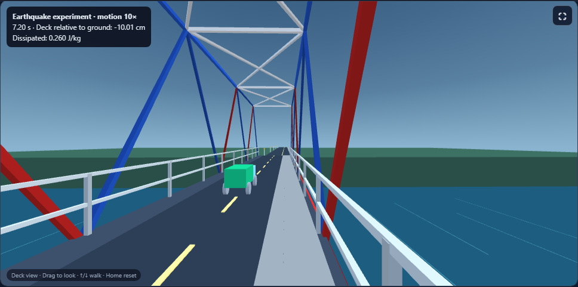
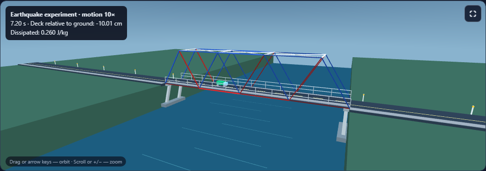
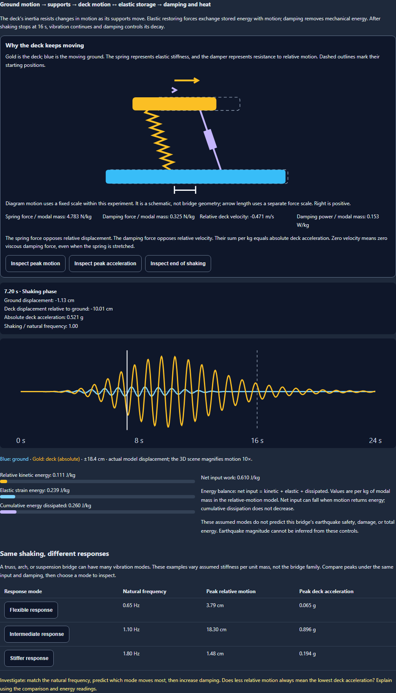

# Bridge Lab: stand on the bridge and explore earthquake response

## Experience the structure

Choose **On the bridge** in Stress Test to stand on the walkway at a 1.65 m eye height. Walk along the deck, turn around, or look up into the truss. Drag and labelled sliders work alongside keyboard controls: ↑/↓ walk, ←/→ turn, Page Up/Down tilt, and Home resets. The existing fullscreen control also works with this viewpoint.

The scene now includes a road, lane markings, walkway, railings, bearings, piers, river, and surrounding land. Orbit and deck views share the same structure. During the earthquake experiment, the camera follows the deck, while pier bases follow the ground and pier tops follow the deck.

## Teach resonance and energy transfer

Enable **Earthquake experiment** to explore a 24-second event: 16 seconds of smooth synthetic shaking followed by 8 seconds of free vibration.

- Set peak ground acceleration, shaking frequency, damping, and an assumed vibration mode.
- Run, pause, restart, step by 0.5 seconds, or scrub to any time.
- Watch ground and deck displacement together. Numerical readings use actual model units; the 3D scene magnifies displacement by a fixed **10×**.
- Follow relative kinetic energy, elastic strain energy, cumulative damping dissipation, and net input work, all per kilogram of modal mass.
- Compare flexible, intermediate, and stiffer modes under identical input and damping. Match the input to a mode’s natural frequency, then test higher damping.

The energy panel distinguishes absolute deck displacement/acceleration from deck movement relative to the ground. Input work can decrease when motion returns energy; cumulative damping dissipation stays nondecreasing.

### A useful classroom sequence

1. Predict which response mode will move most under the default 1.1 Hz shaking.
2. Run the experiment in orbit view, then inspect the same event from the walkway.
3. Compare the three modes’ peak relative motion and peak absolute acceleration.
4. Try 20% damping. Explain changes using the energy bars and the motion after shaking stops.

## Keep the model honest

This is one assumed, linear elastic vibration mode driven by a synthetic acceleration history. It illustrates response and energy; it does not predict this truss’s earthquake damage, capacity, or overall safety. The static load solver, member-force colors, cost calculations, and crossing tests continue to describe their static load case.

Bridge families such as truss, arch, and suspension can each have many periods and modes. The comparison varies assumed stiffness per unit mass; it does not rank real bridge families. Ground acceleration is an input, and earthquake magnitude is not inferred from it.

The older Forces-tab magnitude/distance calculator used an unsupported ground-motion formula. It has been replaced with a direct mass-and-acceleration inertia lesson, with explicit units and a link to the new experiment.

The numerical method, primary references, and limits are documented in [model notes](model-notes.md).

## Controls and implementation

- No restored session starts motion automatically. Earthquake and vehicle playback are mutually exclusive.
- Playback pauses when leaving Stress Test, selecting 2D, hiding the page, losing WebGL, or enabling reduced motion. Manual stepping and the time slider remain available.
- The viewer’s description stays stable during playback to avoid repeated screen-reader announcements.
- Response histories and chart curves are cached by experiment settings. Camera and shaking updates move existing geometry instead of rebuilding the bridge.
- A tested, opt-in camera hook extends the shared viewer. Tools without that hook keep their existing orbit behavior.

## Validation and previews

- **134 focused unit and interaction checks passed**, covering the solver, crossing evidence, inquiry, printing, seismic integration, direct inertia example, playback, accessibility, geometry, and shared camera behavior.
- **1 Bridge Lab render snapshot passed**, updated for the new viewpoint button and earthquake control. Other tools' snapshots were unchanged by this run.
- Both Bridge Lab and shared viewer copies are byte-identical. Both English registries match all **797** literal Bridge Lab fallbacks. JavaScript parsing and scoped whitespace checks passed.
- **25 distinct Chromium browser cases passed**, including desktop, 390 px, and 320 px workflows, real 3D rendering, failure recovery, immersive camera controls, earthquake motion, static-analysis preservation, and reduced motion. Together with the unit and snapshot checks, this gives **160 passing checks**.

The first unit process exited with code 1 after recording 120 passing assertions and no assertion failures; three selected files were absent from its JSON. Those files were rerun separately and all 14 checks passed with exit code 0. The verification script checks that every selected file has results. Unrelated tests skipped by the name filter are excluded from the totals.

The first browser run passed 16 cases, then timed out while closing the browser context after the desktop saved-report case. That case and the remaining eight cases all passed in a separate run with video recording disabled; failure screenshots and traces remained enabled. No product change was needed for this follow-up. The totals count each case once, using its final result. Final validation completed on September 29, 2026.

Results: [unit run](final-unit-results.json), [three-file follow-up](final-unit-followup-results.json), [render snapshot](final-snapshot-results.json), [browser run](final-browser-results.json), [browser follow-up](followup-browser-results.json), and [source verification](source-verification.json). Run `node reports/bridgelab-immersive-earthquake-2026-09-28/verify.cjs` from the project root to reproduce the source and report checks.

### Standing on the bridge

### Inspecting the structure

### Energy and response comparison

Phone previews: [deck view](bridge-390-on-deck-earthquake.png), [orbit view](bridge-390-orbit-earthquake.png), and [energy evidence](bridge-390-energy.png).
