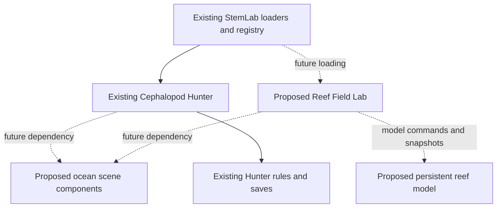

# Ocean reuse: a focused Hunter and a separate reef experience

Keep improving Cephalopod Hunter, extract a small set of shared ocean components incrementally, and build a separate Reef Field Lab when its learning questions are defined. Start with a bounded reef experience rather than promising an unrestricted ocean simulator. This note proposes a direction; **the proposed modules below are not implemented, and full extraction is not part of this pass**.

Hunter already offers a useful world, animal rigs, inspection, and readable interactions. Its `initHuntSim3D` closure also owns input, AI, meals, missions, scores, audio, persistence, and rendering. Turning that whole closure into a general ocean simulator would entangle different experiences before their requirements are known.

| Approach | Benefit | Cost and recommendation |
| --- | --- | --- |
| Broaden Hunter with more ocean modes | Quick access to its existing scene and controls. | Suitable for richer hunting habitats and field observation. Ecosystem management would overload its rules, HUD, and saves. |
| Copy Hunter into a separate tool | Immediate freedom to change the new experience. | Duplicates shaders, accessibility fixes, geometry, lifecycle bugs, and tests. Avoid maintaining two copies. |
| Share components; keep experiences separate | Visual improvements benefit both while each has clear rules and progress. | Requires deliberate interfaces and regression checks. Recommended, beginning with a small extraction. |

## Extract the smallest useful boundaries

A proposed `stem_lab/stem_sim_ocean.js` should initially contain procedural coral and fish geometry recipes, seabed surface utilities, and water/material helpers. Start with one unchanged component, such as the coral geometry recipe. Supply terrain, palette, time, and reduced-motion inputs explicitly. Return fresh arrays or resources owned by the calling scene. Share recipes, not live meshes, textures, renderers, cameras, or mutable random streams.

The existing [`stem_sim_meadow.js`](../../../stem_lab/stem_sim_meadow.js) is the precedent: its opening contract excludes shared DOM, GPU resources, live state, and randomness; `StemMeadow` exposes geometry and pose functions. Bee Lab and Butterfly Lab consume those functions while owning their own worlds. Ocean components should follow that discipline instead of beginning with a large generic engine.

Keep cephalopod anatomy and locomotion local initially. Keep target selection, capture thresholds and timing, ink, predator detection, camouflage effectiveness, shelter rules, hunger, stamina, achievements, missions, and save keys local permanently unless a concrete second consumer establishes a sound shared rule. A fish mesh can be reusable without exporting Hunter's school alarm or respawn policy.

Material appearance must stay separate from gameplay semantics. Hunter's `detectSubstrate` uses `SUBSTRATE_COLORS` and `coralHex`; changing a shared display palette must not silently change stealth. Preserve the current random-call sequence during extraction so the same seed still produces the same encounters.

## A reef model is a separate piece of work

Hunter's coral is static geometry and camouflage substrate. Its distant colonies move when scenery recycles, and empty fish schools respawn on a gameplay timer. Those are useful presentation and game mechanisms, not a persistent ecosystem model. Its `realDepthFor` also maps compressed scene coordinates onto displayed ocean depths; scene units cannot automatically become physical distances in another model.

A proposed `stem_lab/stem_model_reef.js` should hold stable habitat and organism identities, versioned state, explicit units, and deterministic model steps independently of Three.js. A proposed `stem_tool_reeflab.js` would own scenarios, observations, controls, reports, and separate saves. The renderer would display model snapshots; swimming animation and visual fish density would not themselves define population measurements.

Keep **model time** separate from **display time**. Ecological scenario steps may represent a declared interval, while visual interpolation runs at frame rate. Pause should stop model advancement consistently; inspection can move the camera without advancing the model. Reduced motion can simplify animation without changing scenario outcomes. Scientific mechanisms, parameters, calibration, and limits need a later scoped research and validation task.

The existing [`stem_tool_aquarium.js`](../../../stem_lab/stem_tool_aquarium.js) already provides `AquariumEcosystemCore`, chemistry budgets, and `AquariumInquiryCore` with paired trials and evidence exports. Reuse its investigation patterns where appropriate, and define a reef-specific purpose before adding another broadly named Ocean Lab. Its tank-specific assumptions and formulas require review before reuse in an open habitat.

## Incremental roadmap and acceptance gates

1. **Choose one boundary.** Extract an unchanged visual recipe; preserve Hunter controls, saves, geometry output, seeded layout, and resource ownership. Validate it before moving another subsystem.
2. **Prove two consumers.** Add a small reef observation prototype with an explicit purpose. Derive shared interfaces from what both experiences actually need; keep each scene's lifecycle independent.
3. **Model one question.** Implement one bounded, documented reef scenario with stable sites, baseline/intervention comparison, measurable outputs, and model limits. Add more mechanisms only after this loop works.
4. **Complete integration.** Follow `ensureMeadow` in [`stem_lab_module.js`](../../../stem_lab/stem_lab_module.js) for resilient dependency loading. Add actual prerequisites to `stemModuleDependencies` and the manifest in [`desktop/web-app/src/App.jsx`](../../../desktop/web-app/src/App.jsx), and verify local/offline packaging through [`build.js`](../../../build.js). A future tool also needs registry metadata and the host's plugin rendering path.

Test requirements include geometry/pose parity, independent resources, pause and reduced motion, context loss, repeated mount/unmount, and save isolation. Update the explicit dependency handling in [`stem_gl_harness.ts`](../../../tests/e2e/helpers/stem_gl_harness.ts) and [`stem_widgets_smoke_harness.js`](../../../tests/helpers/stem_widgets_smoke_harness.js). Preserve Hunter's capture, pursuit, inspection, and disposal regressions. Future reef model tests should verify deterministic replay, bounded state, time-step behavior, and any budgets the model claims to conserve.

Source anchors are intentionally stable names rather than shifting line numbers: [`stem_tool_cephalopodlab.js`](../../../stem_lab/stem_tool_cephalopodlab.js) contains `registerTool('cephalopodLab')`, `initHuntSim3D`, `createCLHuntAnimal`, `createCLHuntFish`, `createReefCoralGeometry`, `detectSubstrate`, `realDepthFor`, `Respawn empty schools`, and `_clCleanup`.
