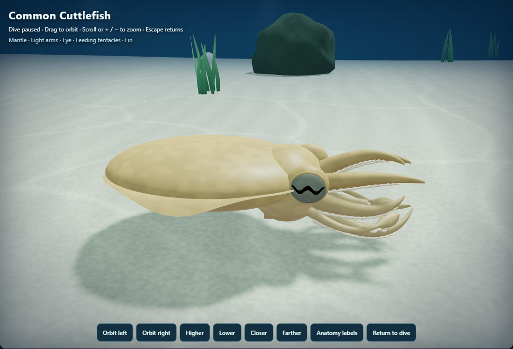
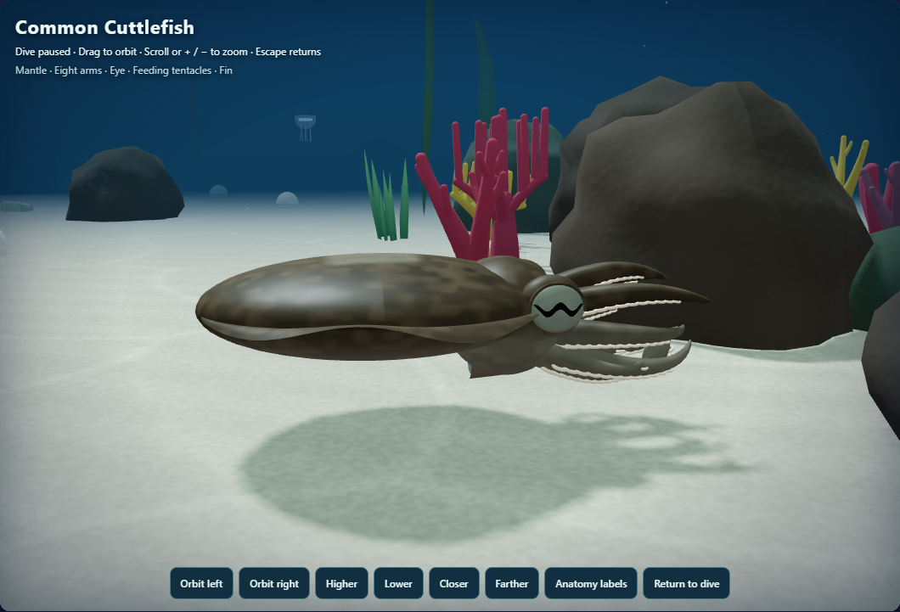
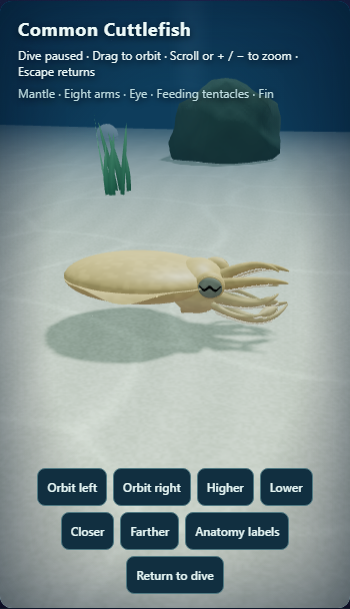
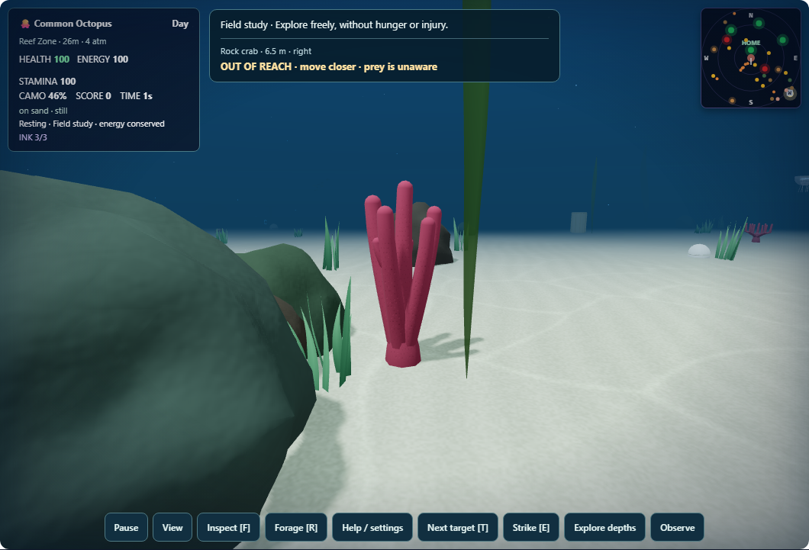
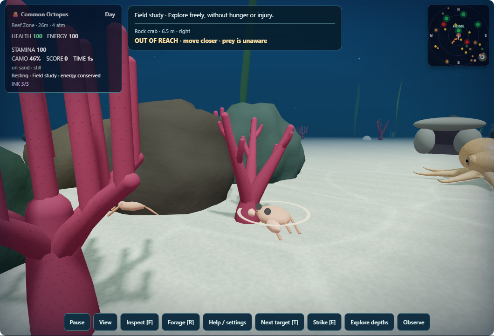
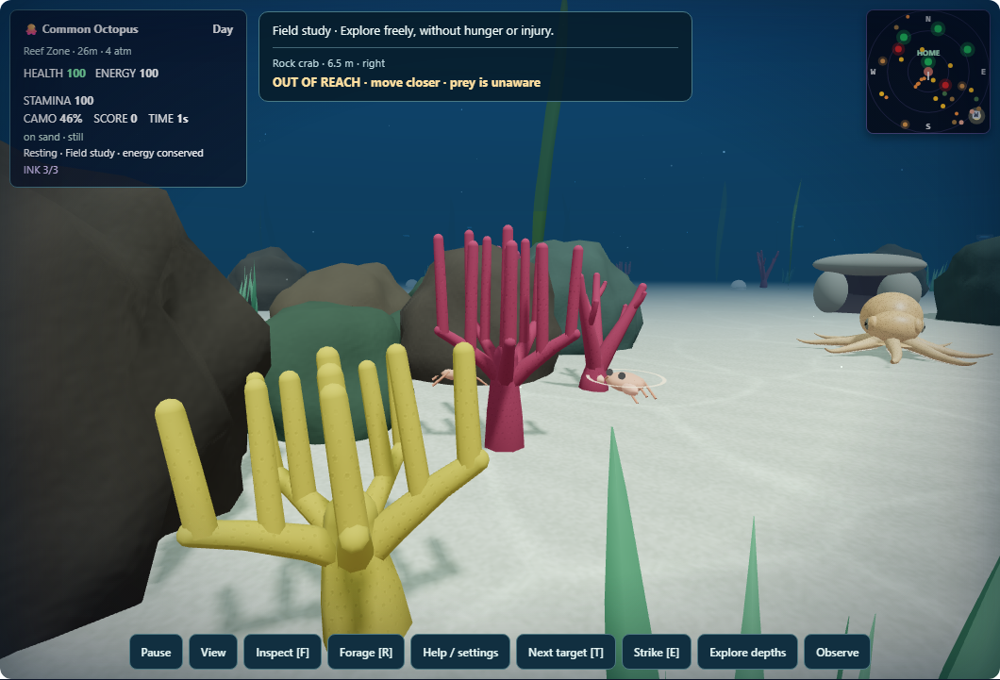

# Cephalopod Hunter — visual enhancement pass fourteen

This pass gives the cuttlefish a coherent camouflage pattern and adds shallow surface detail to the reef's coral colonies. The existing animal shapes, eye treatment, fin motion, camouflage scoring, prey behavior, reef placement and color categories are preserved.

The cuttlefish's mantle, head, arms and fins now sample one animal-relative pigment field. Quiet sand produces restrained mottling; rock and grass express stronger paired mantle patches and a soft central light component. Surface roughness varies subtly. The original passing-cloud phase and held-H display remain intact. This is an illustrative Sepia-like treatment, with the biological basis and implementation boundaries described in [model-notes.md](model-notes.md).

All three coral growth forms receive irregular, softly recessed corallite-like pits that follow each curved branch. They fade near basal joins and rounded tips, and filter out at small screen sizes. An explicit seam guard handles tiny Float32 interpolation errors around the branch circumference. Original position, normal, color and index arrays, geometry bounds, seeded transforms and camouflage metadata remain exact. [environment-notes.md](environment-notes.md) records the shader bounds and static attribute budget.

## Validation

- 58 current unit cases passed across ten focused files.
- Two native browser cases passed on low and balanced quality with one worker, no retries, no video and no trace. They check submitted shader compilation, shared frame uniforms, coral GPU attributes, display controls, pause, reduced motion, resource stability and disposal.
- All twelve species retained their geometry and pose fingerprints across four update states; the eleven other species retained their complete material/shader/uniform fingerprints.
- 54 coral geometry cases preserve the original arrays and bounds. Seeded construction preserves 18 colonies and all 108 random draws.
- Eight final desktop/phone images were visually reviewed. Coral comparisons retain exact colony identities, bounds and camera settings. The rock view uses ordinary A/D/W movement with counted clock steps, confirms the actual substrate pattern of 0.9, and preserves exact navigation, pose, tint and phase before/after.
- All four runtime copies have matching SHA-256 values. The twelve pre-existing screen-reader wrappers in each tracked copy remain outside this commit.

An initial test demanded more than 100 outputs from a bounded hash whose final mixer has exactly 75 attainable levels. That impossible expectation was corrected to cover the actual support, range and lack of short spatial repeats; production code did not change. Independent review also found the coral interpolation seam issue, which was fixed and covered with perturbed Float32 cases before the final browser run.

One final rock-only capture attempt timed out waiting for the application canvas. An unchanged retry passed the exact recorded route, pose, tint and tick fixture and returned no errors. The cause was not confirmed. The two separate functional browser cases passed without retries; future capture failures now save relevant context warnings and tool state for diagnosis.

The new material treatments add no meshes, vertices, triangles, textures, lights, passes or draw calls. Cuttlefish keeps three noise samples per fragment and reuses one matrix uniform. Coral adds a static vec4 attribute, at most 226,368 bytes across eighteen colonies. These are resource/source counts, not measured GPU timings. Unsupported derivative paths retain the original coral finish and use a restrained derivative-free cuttlefish detail branch.

## Final views

The remaining views are [cuttlefish-surface.png](cuttlefish-surface.png) and [humboldtSquid-surface.png](humboldtSquid-surface.png). [validation-summary.json](validation-summary.json) records final test totals, preserved contracts, fixture identities, costs and source hashes. [visual-review.cjs](visual-review.cjs) reproduces the capture procedure; local baseline snapshots and raw logs are ignored.

Still images and functional GPU checks do not establish frame rate or prove that every device is free of temporal shimmer. Coral detail remains a stylized generic surface treatment, not a calibrated polyp model. This pass has not been pushed or deployed.
