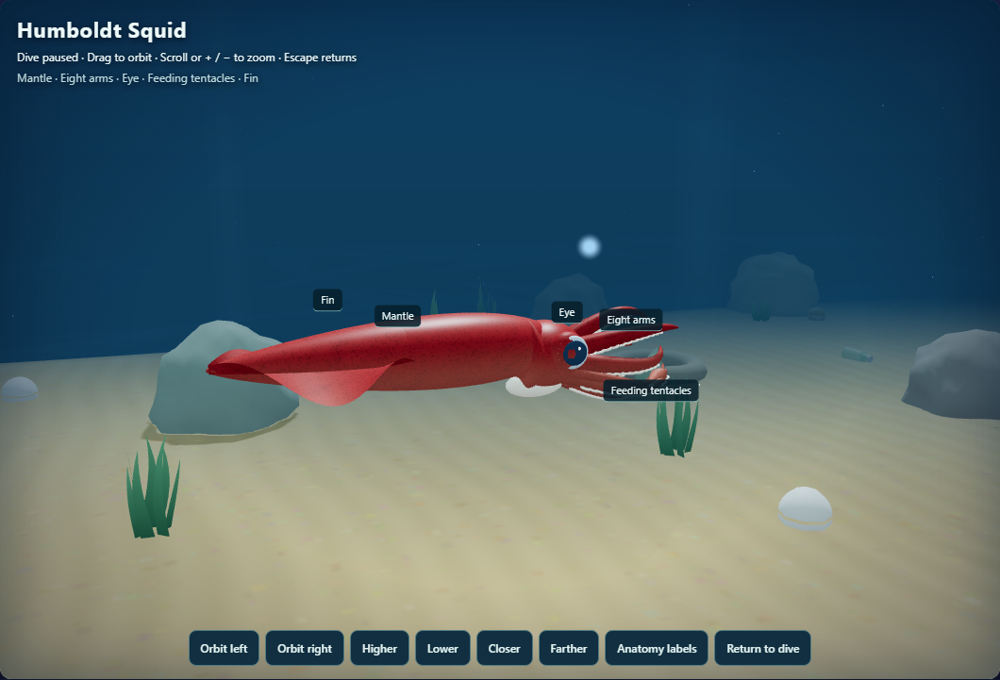
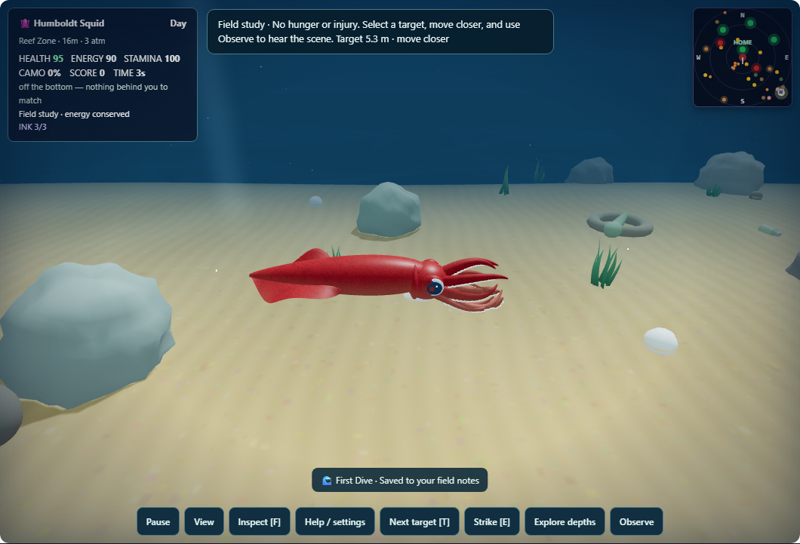
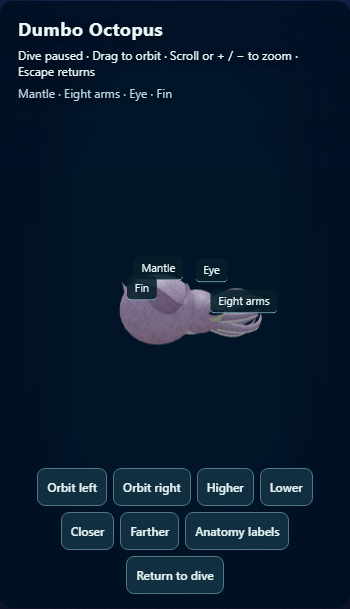

# Cephalopod Hunter: second enhancement pass

Work log (2026-09-26): COMPLETE. Implementation, focused validation and final visual review are complete. This continues the approved improvements, with emphasis on squid appearance. Ownership remains the canonical Cephalopod module and its exact desktop mirrors, focused Cephalopod tests, and this report directory. No deployment requested.

## What changed

- Refined the Humboldt squid's tapered mantle, collar, head and eye proportions. Fine irregular mottling replaces the large repeated spots. Skin color now stays consistent across the mantle, arms, web and fins.
- Curved swimming arms, folded feeding tentacles with smaller clubs, tangent-aligned suckers, traveling fin waves, mantle pulses and gentle banking/pitch give the model a less rigid silhouette. Reduced-motion settings suppress the extra motion.
- Added **Inspect [F]**: a paused orbit view with drag, touch, arrow-key and button controls; zoom; toggleable anatomy labels; and Escape/Return to dive. Hunger, prey, predators and time stay frozen. Returning preserves a previously paused dive and clears movement input.
- Softened both sets of light shafts and rounded the water particles. Added subtle seabed ripple shading and seven-blade grass clusters using instancing, retaining one draw call per existing grass patch.
- Corrected depth lighting that previously reset every frame. Grounded landmarks and their pearls on the sloping terrain, moved the wreck within the reachable depth range, and replaced accumulating pearl drift with a bounded bob.
- Made rocks block crab/fish captures and clam foraging. The target cue now distinguishes range, depth and blocked sight; misses explain how to reposition. Every strike animates, including a miss. Inspection hides distracting event notices.

## Validation

- Focused unit suite: **192/192 passed** in nine files (before the last environment-lighting polish).
- **23/23 WebGL scenarios passed**, with retries disabled and no skipped or flaky tests.
- Final behavior/biology contract rerun: **77/77 passed** after the environment-lighting polish.
- Final captures: seven body forms plus mobile inspection, with **zero browser or shader errors**. Reviewed the squid, common octopus, vampire and narrow inspection views.
- Source syntax and scoped whitespace checks passed. All four runtime copies have identical SHA-256 hashes (see `validation-summary.json`).
- Added browser scenarios for frozen inspection with active orbit/zoom, pause preservation and released movement, mobile inspection controls, and blocked/clear capture against the same prey.

## Practical limits

The models remain procedural art rather than scanned or authored production assets. Capture checks use a controlled local WebGL harness; they do not establish a classroom-device frame-rate target or validate natural encounter balance. Localization of new controls remains with the shared catalog owner. The broader roadmap (predator search behavior, authored biomes, remappable controls and alternatives to held actions) is still open.

## Review locally

Run `node reports/cephalopod-hunter-enhancement/serve-preview.cjs` and open the printed URL with `?species=humboldtSquid&mode=observe`. Press **V** for side view or **F** for inspection. `visual-review.cjs` in this directory captures the distinct body forms and mobile inspection layout against that server.

## Final screenshots

No deployment or installer build. Finished work is committed separately from the other active domains in this checkout.
