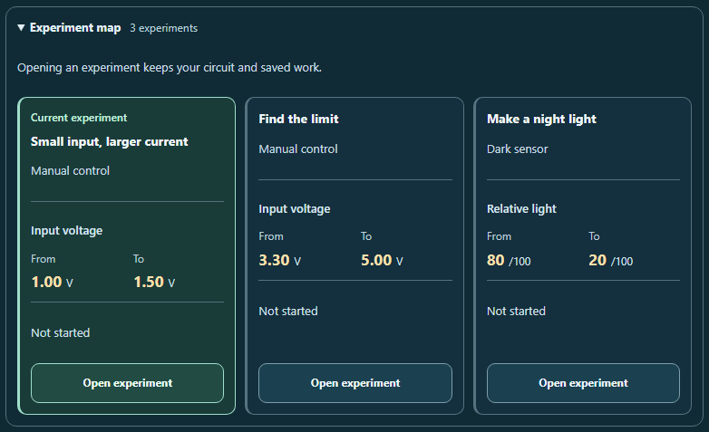

# CircuitTool: choose and resume an experiment

The Active guided lesson now includes an optional **Experiment map**. It shows all three planned experiments and their saved-work stages together, including explanations that still need attention after testing.

## Experiment map

A native disclosure below the existing experiment picker starts closed. Each card shows its experiment title, circuit type, planned **From** and **To** control values, and saved stage:

| Saved work | Card status | Action |
| --- | --- | --- |
| No record | Not started | Open experiment |
| Started, no prediction selected | Prediction needed | Resume prediction |
| Prediction selected | Prediction saved | Resume prediction |
| Tested, explanation blank | Result saved; explanation needed | Review result |
| Tested, explanation entered | Explanation saved | Review result |

The selected card is marked as the current experiment with text and a border. Selection reuses the existing lesson navigation: untested experiments open at their question, and tested experiments open at their saved result. Selecting the current experiment focuses that destination without a tool-data write or queued navigation request.

Opening the disclosure changes only the view. Selecting a card preserves live circuit settings, Undo, Redo, probes, view, notebook, reference, observations, predictions, results, and explanations. Starting and retrying remain explicit actions in the lesson itself.

The map derives only planned controls and saved stages from the existing plan and journey helpers. It performs no solver calculations and exposes no answers, solved readings, operating regions, or explanation text in its data contract. Plans remain fixed on a tuned bench. Incorrect predictions and live-bench changes do not affect saved stages; whitespace-only and pretest prose do not count as tested explanations.

Cards adapt to narrow screens and enlarged text. Numeric magnitudes and units use separate spans, with isolated left-to-right quantity order inside an inherited page direction. Summary and action controls retain visible focus and comfortable target sizes. Scoped styles support forced colors and reduced motion.

## Validation

**409 tests passed across 25 files**, including 20 new map cases. Source and desktop mirror stayed identical and unchanged: `ace6d2c2ef823d4ccff66efa60600ffdc260eada5d71af09ef8006fdc37b7572`.

The browser audit passed **16 accessibility scans and 17 reviewed screenshots**. It covered the closed map, fresh experiments, mixed saved stages, and tested results at 1280, 390, and 320 pixels, plus 200% text and forced colors. Nine keyboard selections preserved saved work; 16 visible-focus checks, 12 focus transitions, and two right-to-left quantity-order checks passed. All 128 enlarged-text measurements matched exactly twice their normal 320-pixel baseline.

All 14 ordinary accessibility scans included contrast checks. The two forced-color scans excluded axe-core 4.12.1's `color-contrast` rule because it reports authored colors despite the browser's system-color override. A reused diagnostic records that behavior and its original source; this update separately measured the used system colors and reviewed both forced-color images. These focused checks cover the changed workflows and do not establish full accessibility conformance.

Receipts record source, mirror, tested-file, browser-script, report, and screenshot hashes. The source and browser script stayed unchanged during their checks.

### Previews



- [Mixed saved stages on a narrow phone](map-mixed-progress-320.png)
- [Saved results at 200% text](map-saved-200pct-text-320.png)
- [Forced colors](forced-colors-map-saved-320.png)
- [Map and lesson in context](map-selection-context-320.png)

### Reproduce

From the repository root:

```powershell
node reports/circuit-experiment-map-2026-09-30/run-regression.cjs
node reports/circuit-experiment-map-2026-09-30/browser-check.cjs
node reports/circuit-experiment-map-2026-09-30/validate.cjs
```

The installed Vitest, Playwright, Chromium, React, Tailwind cache, and axe-core dependencies are required.
