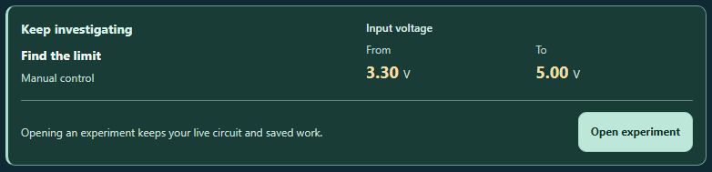

# CircuitTool: continue an experiment without losing saved work

The guided lesson ending now gives the next experiment a clear title, planned control change, and an explicit Open or Resume action. Opening preserves the live circuit and each experiment's saved writing and evidence.

After all three tests, **Review experiment map** opens the existing map and focuses its summary. Explanations remain optional to revise; progression is never graded or gated.

**Start this experiment again** is a native disclosure that starts closed. Opening it changes only the view. Its replacement warning and explicit Start action retain the existing restart behavior: replace only this experiment's saved prediction, result, and explanation; load its baseline; keep the investigation notebook; allow Undo to restore the previous circuit.

The map and restart disclosures retain the user's view choices while switching experiments. Imports, typing, locale changes, and live circuit edits do not open them or move focus automatically.

## Validation

**429 tests passed across 26 files**, including 20 new workflow cases, on identical, frozen source and desktop mirror: `524b5034918c848c5b5ecaa4f976a75feeccb3b6b23d288270ad3f672b568948`.

The first regression attempt passed 375 tests in 23 files, then three thread workers timed out before starting. The process-worker run passed 415 tests in 25 files; one worker again failed to start. No assertions failed in either run. The missing file then passed all 14 tests independently. The final result combines that complete 25-file process run with the one recovered file, checking exact file coverage, every assertion, and matching hashes. Both incomplete attempts and the raw recovery report are retained. Product and test hashes remained unchanged throughout.

The runner uses one isolated process worker with the original test and hook time limits. A fresh run tests all 26 files; if only worker-startup omissions remain, it reruns those files and verifies the combined coverage. `--recover` uses the saved process-run basis after checking every current file hash; this option produced the recorded recovery.

The browser audit passed **16 accessibility scans with 17 screenshots**. It covered fresh and resumable next experiments, all-tested results, and open restart controls at 1280, 390, and 320 pixels, plus 200% text and forced colors. Five keyboard navigation actions, three restart checks, 16 visible-focus checks, nine focus transitions, and four right-to-left quantity checks passed. All 28 enlarged-text measurements matched exactly twice their normal 320-pixel baseline.

All 14 ordinary scans included contrast checks. The two forced-color scans excluded axe-core 4.12.1's `color-contrast` rule because it reports authored colors despite the browser's system-color override. A reused diagnostic records that behavior and its original source; this update separately measured the used system colors and reviewed both forced-color images. These focused checks cover the changed workflows and do not establish full accessibility conformance.

Independent source and visual review found no material issues. Receipts record source, mirror, tested-file, browser-script, report, and screenshot hashes. Source and browser script stayed unchanged during their checks.

### Previews



- [Complete lesson ending on a narrow phone](lesson-ending-context-320.png)
- [Next experiment at 200% text](continuation-next-200pct-text-320.png)
- [Restart warning at 200% text](retry-200pct-text-320.png)
- [Restart in forced colors](forced-colors-retry-320.png)

### Reproduce

From the repository root:

```powershell
node reports/circuit-lesson-continuation-2026-09-30/run-regression.cjs
node reports/circuit-lesson-continuation-2026-09-30/browser-check.cjs
node reports/circuit-lesson-continuation-2026-09-30/validate.cjs
```

The installed Vitest, Playwright, Chromium, React, Tailwind cache, and axe-core dependencies are required.
