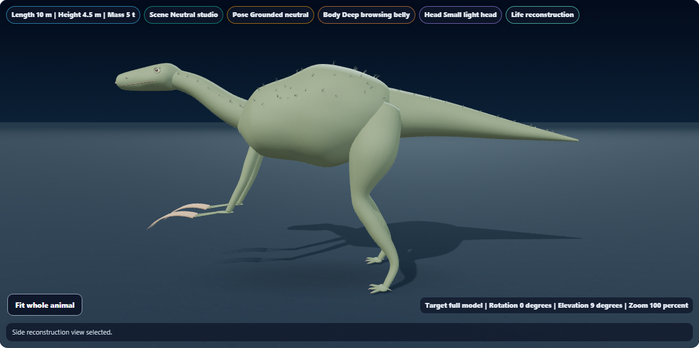
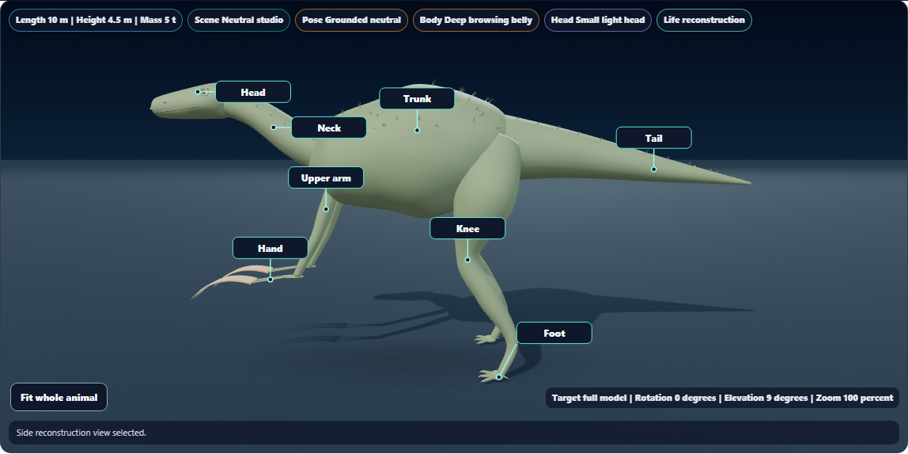

# Dino Lab anatomical accuracy and body-part labels

Use **Body-part labels** below the Study controls, or choose it from **Model labels**. Callouts identify ten regions: head, neck, trunk, tail, upper arm/foreleg, hand/front foot, thigh, knee, ankle and foot/hind foot. The terms adapt to the forelimb posture. The expandable **Body-part key** provides the corresponding anatomical terms and explanations, including the distinction between knee and ankle.

Labels follow model rotation and anatomical study views. The layout avoids overlapping labels and reserves room for viewer controls. It displays up to eight callouts on desktop and four on narrow screens; the text key retains every definition. The overlay does not intercept camera gestures or add WebGL textures or geometry. Size-reference views retain their measurement labels.

## Anatomy corrections

Therizinosaurs had six extra claw meshes attached near their shoulders in addition to the claws already modeled on their fingers. The duplicate shoulder geometry is removed. Therizinosaurus now has six long manual claws attached to the finger tips, fuller continuous forelimb surfaces, and curved bony cores that follow the outer sheaths in fossil and transparent views.

The long-claw placement is supported by the manual-ungual anatomy discussed in [Qin et al., 2023](https://www.nature.com/articles/s42003-023-04552-4). The catalog now describes claw function as debated: the interpretations differ between [Lautenschlager, 2014](https://pmc.ncbi.nlm.nih.gov/articles/PMC4024305/) and the later functional analysis. Feeding or display is not presented as observed behavior.

The rendered proportions, muscle volume, claw length and sheath thickness remain schematic. This is a correction to the procedural model, not a specimen scan or a measured soft-tissue reconstruction.

## Visual review

| Therizinosaurus before | Corrected anatomy |
| --- | --- |
|  |  |

Additional captures: [Triceratops](triceratops-labels.png), [T. rex](tyrannosaurus-labels.png), [Brachiosaurus](brachiosaurus-labels.png), [Microraptor](microraptor-labels.png), [phone and anatomy key](phone-key.png), [transparent reconstruction](therizinosaurus-transparent.png).

Reviewed the labeled Therizinosaurus, quadruped labels and phone key. Callouts use plain names on the model and explain technical terms in the key.

## Validation

**153 distinct focused checks passed across runs:** body labels (7), keratin/core geometry (10), study bounds (6), surface geometry (19), cranial geometry (9), shadows (14), accessibility (15) and golden coverage (73).

The initial broad run passed 150 checks. A source assertion needed the new label callback and removal of the obsolete shoulder-claw branch reflected in it. An unchanged multi-tab axe audit timed out in that run and passed in isolation. The final affected geometry run passed all 36 checks, including ray tests for the bony core inside the sheath. [Initial broad-run excerpt](focused-initial-excerpt.txt), [isolated recheck excerpt](focused-recheck-excerpt.txt), [updated contract](accessibility-contract-results.txt), [final geometry checks](core-geometry-results.txt)

The Field Station snapshot was deliberately updated for the new controls and overlay, also reconciling the existing fullscreen-wrapper attribute. Other snapshots were unchanged. [Snapshot update](snapshot-update.txt)

**Eight distinct browser scenarios passed**, covering five species, side/front/head/tail views, phone keyboard controls and fossil/life switching, saved observation preservation, evidence/measurement views, and bony-claw enclosure. The phone lifecycle case was repeated on the final renderer. [Main acceptance](browser-results.txt), [final core/phone acceptance](core-browser-results.txt), [core enclosure record](claw-core-enclosure.json)

The new phone controls and expanded key have zero automated axe violations. [Accessibility result](phone-accessibility.json)

Initial browser failures concerned the test's assumption that changing a display preference would not initialize the existing progress record. The corrected checks seed an observation and verify it survives label changes. Initial geometry checks also corrected an overly restrictive two-label expectation to the intended four-label phone limit. [Initial browser results](browser-initial-results.txt), [initial geometry results](geometry-results.txt)

The older keratin visual spec now makes comparison against historical report geometry opt-in with `DINO_KERATIN_COMPARE_BASELINE`; those historical measurements intentionally differ after an anatomical correction. Its current geometry and lifecycle assertions remain active.

## Rendering and scope

The opaque Therizinosaurus reference frame changed from 199 to 193 draw calls, 201 to 195 geometry resources, and 107,916 to 106,188 rendered triangles. It still uses seven textures. These are software-WebGL counters, not physical-device frame-rate measurements. [Before metrics](therizinosaurus-before.json), [after metrics](therizinosaurus.json), [phone lifecycle](phone-layers.json)

The comparison baseline is local revision `59d0f3638`. `DINO_ANATOMY_SOURCE` can point the browser spec at a restored copy for baseline capture. Temporary source copies are excluded from this report.

Canonical, public, existing web-build and app-build renderers are byte-identical. Syntax, scoped whitespace and report-link checks passed. Renderer SHA256: `a334a77cd0c991fc61897a5cdd9cad4156fae89b815c235562262274ec54a8e6`.

Local changes only; no push, deployment or packaged build. [Validation record](validation.json)

## Local commit status

Implementation and validation are complete and the scoped Dino Lab files are staged. The normal commit hook rejected the commit because the unrelated content_engine_source.jsx and desktop/web-app/src/content_engine_source.jsx copies differ (2856 versus 2838 lines). Those concurrent edits were preserved; no hooks were bypassed. The commit remains pending that source-pair correction.
