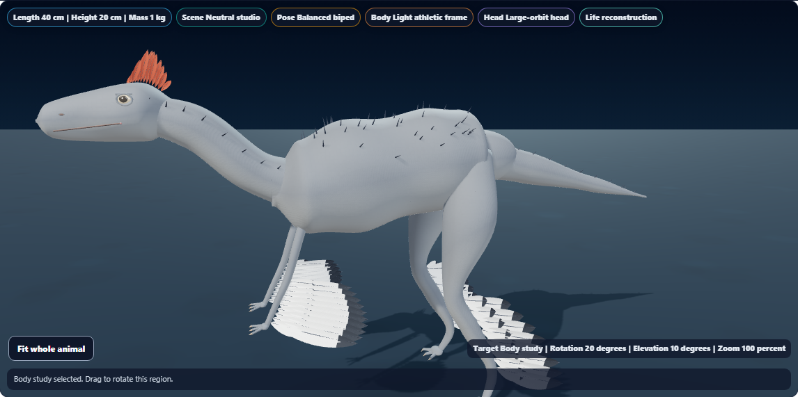
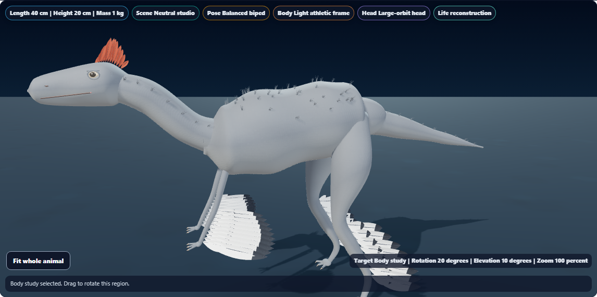

# Dino Lab filament-coat refinement

Filament-covered reconstructions now use small clusters of curved, tapered fibers instead of single rigid cones. Each cluster contains seven fibers in one mesh. The coat uses the species' existing base color, with darker roots and lighter tips.

The existing hypotheses still determine coverage. Torso, neck and tail attachments, motion phases, and the historical reconstruction remain in use. Dorsal tail bristles retain their separate geometry; the wing vanes and skin color patterns are unchanged.

## Visual comparison

The same fixture rendered Anchiornis before and after the change, with reduced motion, opaque life surfaces and a Body study.

| Before | After |
| --- | --- |
|  |  |

The review found finer, less rigid surface detail. This remains a simplified instructional reconstruction with sampled filament coverage.

| Additional review | Capture |
| --- | --- |
| Anchiornis under side lighting | [Surface detail](anchiornis-detail.png) |
| Small dark-coated model | [Microraptor body](microraptor-body.png) |
| Existing tail bands with new fibers | [Sinosauropteryx tail](sinosauropteryx-tail.png) |
| Larger filament-covered model | [Yutyrannus surface detail](yutyrannus-detail.png) |
| Preserved separate bristles | [Psittacosaurus tail](psittacosaurus-tail.png) |
| Unchanged scaled coverage | [T. rex body](tyrannosaurus-body.png) |
| Phone layout | [Anchiornis head and controls](anchiornis-mobile.png) |

Visually inspected Anchiornis before/after, Sinosauropteryx tail, Yutyrannus detail, Psittacosaurus bristles and the phone capture.

## Geometry and rendering cost

| Species | Coat meshes | Fibers | Separate dorsal bristles |
| --- | ---: | ---: | ---: |
| Anchiornis | 104 | 728 | 0 |
| Microraptor | 104 | 728 | 0 |
| Sinosauropteryx | 98 | 686 | 0 |
| Yutyrannus | 106 | 742 | 0 |
| Psittacosaurus | 0 | 0 | 12 |
| T. rex | 0 | 0 | 0 |

Each cluster has 154 vertices and 280 triangles, with closed bases, tapered tips and smooth normals. Seeded variation recreates the same fibers when returning from fossil view. One shared vertex-color material is added when a coat is present; the coat requires no texture.

In the tested opaque Anchiornis view:

| Measured frame | Before | After |
| --- | ---: | ---: |
| Draw calls | 369 | 369 |
| Geometry resources | 370 | 370 |
| Texture resources | 8 | 8 |
| Rendered triangles | 99,844 | 126,780 |

The change adds 26,936 triangles, approximately 27% for this frame. Resource counts describe objects, not allocated bytes. These software-WebGL results are not a physical-device performance benchmark.

## Validation

**138 distinct focused checks passed** across coat geometry (11), plumage (14), regional color (11), shadow fitting (14), accessibility (15), and golden coverage (73).

The first broad run passed 137/138; its only failure was an existing source assertion naming the old helper signature. Updating that assertion resolved the failure, and the complete accessibility file passed 15/15. The other five files had passed in the initial run. No golden snapshots changed. [Initial diagnostic excerpt](focused-initial-excerpt.txt), [accessibility rerun](accessibility-results.txt), [initial geometry check](geometry-first.txt).

**10 distinct browser scenarios passed**: six species, opacity/fossil return/phone behavior, live motion and pause, plus two existing camera/evidence regressions. [Browser result](browser-results.txt)

The browser checks verified attached roots, finite geometry, fitted shadow coverage, shader/context health, shared coat materials, saved-data preservation, in-place opacity changes, disposal of old coat geometries and deterministic recreation. Live motion changed coat world positions and rotations while keeping local roots fixed; pausing froze every recorded coat transform, including through a camera study and light change.

The initial Anchiornis review and the old-renderer baseline capture are excluded from the ten-case count. [Initial review](first-review-results.txt), [baseline capture](baseline-results.txt). The baseline came from the renderer at local revision `946099850`; its temporary source copy is excluded from the report. To repeat the optional baseline capture, restore that renderer to `reports/dinolab-3d-coat/renderer-before.js` before setting `DINO_COAT_BASELINE=1`.

Rendering used Chromium software WebGL with the application stylesheet; the phone viewport was emulated at 390 × 844. Syntax, scoped whitespace, report links and canonical/public/existing app-build byte parity passed. Renderer SHA256: `01AEC66BE6893350CF8E876C6E5FDBBF7F7884281F7953BB8B12625009DF8117`.

Raw results: [Anchiornis before](anchiornis-before.json), [Anchiornis after](anchiornis.json), [Microraptor](microraptor.json), [Sinosauropteryx](sinosauropteryx.json), [Yutyrannus](yutyrannus.json), [Psittacosaurus](psittacosaurus.json), [T. rex](tyrannosaurus.json), [lifecycle](lifecycle.json), [motion](motion.json), [validation record](validation.json).

Local changes only. No push, deployment or packaged build; the existing ignored app-build renderer is synchronized.
