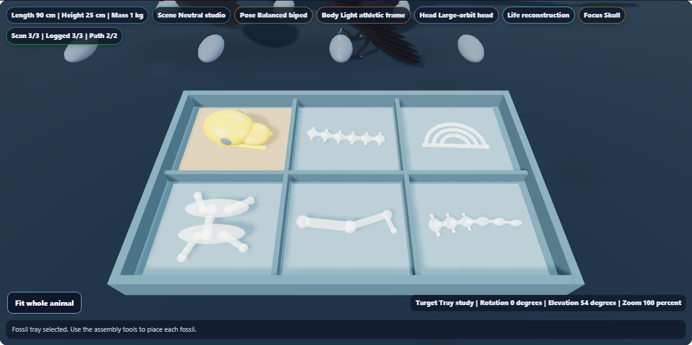
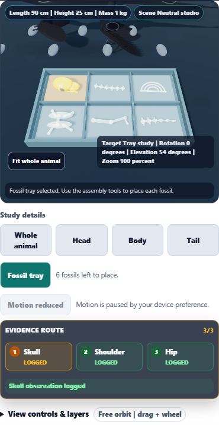

# Dino Lab: a grounded fossil assembly tray

Loose assembly fossils now sit in six compartments on a specimen-scaled tray. The tray has a raised rim, dividers and colored pads, with clearer instructional shapes for the skull, spine, ribs, pelvis, hindlimb and tail.

A keyboard-accessible Fossil tray button opens a fitted study view. Whole animal frames both the dinosaur and tray. Anatomy close-ups and focused evidence anchors hide the tray. Empty compartments show assembly progress, and completing all six pieces removes the tray and returns to the animal.

## Visual review





Additional captures:
- Whole animal with tray: [Microraptor](microraptor-whole.png), [Anchiornis](anchiornis-whole.png), [Sinosauropteryx](sinosauropteryx-whole.png), [T. rex](tyrannosaurus-whole.png), [Brachiosaurus](brachiosaurus-whole.png)
- Tray details: [Anchiornis](anchiornis-tray.png), [Sinosauropteryx](sinosauropteryx-tray.png), [T. rex](tyrannosaurus-tray.png), [Brachiosaurus](brachiosaurus-tray.png)
- [Partially completed tray](anchiornis-partial-tray.png)
- [Habitat tray on the excavation surface](microraptor-habitat-tray-mobile.png)

Reviewed the whole-animal and detail Microraptor captures, the refined fossil shapes, phone controls, partially completed Anchiornis tray and Habitat phone view. The tray uses simplified instructional fossil shapes.

## Behavior and geometry

- Tray scale follows the rendered specimen length; its width is approximately 51% of that length.
- Loose fossils are seated using their actual rotated geometry bounds. Rib arcs lie flat, limb ends have modeled joints, and vertebrae distinguish the spine and tapering tail.
- All six compartments remain visible while placed fossils leave their corresponding pads empty. The active unplaced fossil and pad use the existing focus colors.
- The tray joins the model's orbit, with its mesh bounds included in whole-view framing and shadow coverage. Anatomical study bounds remain separate.
- The default tray viewpoint uses an elevated camera angle; orbit, zoom, overhead view and Home remain available.
- In Studio, the tray rests at floor height. In Habitat, it uses the existing excavation-surface height; small-species placement was checked visually and numerically.
- The tray is available after all scan anchors are logged, while evidence markers are shown and fossils remain unplaced.
- Life view deliberately hides markers and the tray. Restoring markers makes the tray available again.
- Camera study controls leave saved observations and assembly progress unchanged. Actual assembly buttons remove fossils from the tray and persist the six placed pieces.

## Shadow resource cleanup

Lifecycle testing exposed retained shadow render targets during scene rebuilds. Scene replacement and viewer unmount now dispose lights' shadow targets as well as mesh resources.

The corrected repeated-layer test recorded geometry/texture counts of 300/10 initially, then 299/11 and 299/11 after equivalent round trips. The observed live shadow-target count stays at one while mounted and reaches zero after unmount. The real six-placement workflow also verifies shadow disposal during each scene replacement and on exit.

This is a resource-lifecycle check, not a hardware performance benchmark.

## Validation

**127 distinct focused checks across five files and 12 distinct browser scenarios passed after corrections.**

| Focused coverage | Checks |
| --- | ---: |
| Surface geometry | 19 |
| Anatomical study bounds | 6 |
| Shadow coverage and fitting | 14 |
| Accessibility and workflow contracts | 15 |
| Golden rendering and content | 73 |

Ten new browser scenarios cover five species, phone framing and visibility, partial completion, layer/resource lifecycle, real assembly-button completion and Habitat placement. Two existing browser scenarios cover keyboard study/species behavior and evidence-focus priority across layer changes.

The new assertions verify:
- Six compartments and the correct remaining fossil identities.
- Fossil bases within 0.000001 scene meters of their pads.
- Each fossil remains within its compartment.
- Whole and tray bounds fit the camera; tray casters fit the shadow camera.
- No context loss, shader failures or invalid projections.
- Phone layout has no horizontal overflow.
- Tray controls retain their pressed state through applicable updates.
- Saved observations remain unchanged by study selection.
- Correct final saved assembly state after using all six Place fossil actions.
- Resource counts stabilize, with shadow targets disposed on rebuild and unmount.

### Run history

- Initial Microraptor tray review: 1 passed before the fossil shapes were refined; not counted twice.
- Initial browser acceptance: 7/8 passed. The lifecycle test incorrectly expected Life view to keep evidence markers; its expectation was corrected.
- Workflow run: the real six-placement case passed. The corrected lifecycle sequence then exposed retained shadow textures.
- After adding shadow-target cleanup and disposal probes, both lifecycle and real-placement cases passed.
- Habitat and both existing camera regressions passed.
- Initial focused run: 126/127 passed. The remaining source assertion expected the old camera-target expression. It was updated for the combined specimen/tray overview and passed in a targeted recheck; the other 14 accessibility checks had already passed.
- All 73 golden checks passed without snapshot changes.

Logs: [initial review](first-review-results.txt), [initial browser run](browser-results.txt), [workflow run](workflow-results.txt), [resource correction](resource-results.txt), [Habitat and camera regressions](regression-results.txt), [focused checks](focused-results.txt), [camera contract recheck](contract-recheck-results.txt). The focused log omits the redundant full-renderer dump from its assertion failure while retaining the expected expression, error and location.

Measurements: [Microraptor](microraptor.json), [Anchiornis](anchiornis.json), [Sinosauropteryx](sinosauropteryx.json), [T. rex](tyrannosaurus.json), [Brachiosaurus](brachiosaurus.json), [saved assembly progression](assembly-workflow.json), [layer resource counts](layer-resources.json), [Habitat placement](habitat.json), [validation summary](validation.json).

## Reproduce

Run sequentially from the repository root:

```powershell
node node_modules/vitest/vitest.mjs run tests/dinolab_3d_geometry.test.js tests/dinolab_3d_studies.test.js tests/dinolab_3d_shadows.test.js tests/dinolab_3d_accessibility.test.js tests/dino_lab_golden.test.js --maxWorkers=1 --testTimeout=30000 --reporter=dot --silent
node node_modules/@playwright/test/cli.js test tests/e2e/dinolab-3d-fossil-tray.spec.ts --workers=1 --retries=0 --reporter=list --output=reports/dinolab-3d-fossil-tray/acceptance
node node_modules/@playwright/test/cli.js test tests/e2e/dinolab-3d-studies.spec.ts --workers=1 --retries=0 --reporter=list --grep "keyboard study selection|explicit scan target" --output=reports/dinolab-3d-fossil-tray/regression-acceptance
```

## Delivery

Canonical source, public web copy and existing generated app-build copy match SHA-256:

`71268550F80DB7D73D072A72365F4D911D466B5E93184DEAEDA06AE9BDCC11EB`

Syntax, scoped whitespace and report links passed. Browser checks use local Chromium, Three.js r128 and software WebGL. No packaged desktop or hardware benchmark was run. No push or deployment.

The previous evidence-overlay enhancement was saved normally as commit ba8028593 at the start of this pass, after the unrelated source drift cleared. No hook bypass was used.
