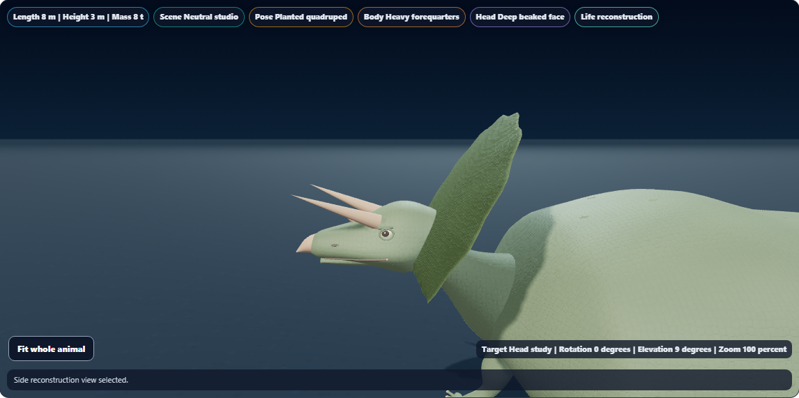
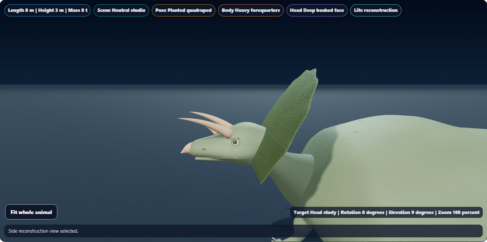
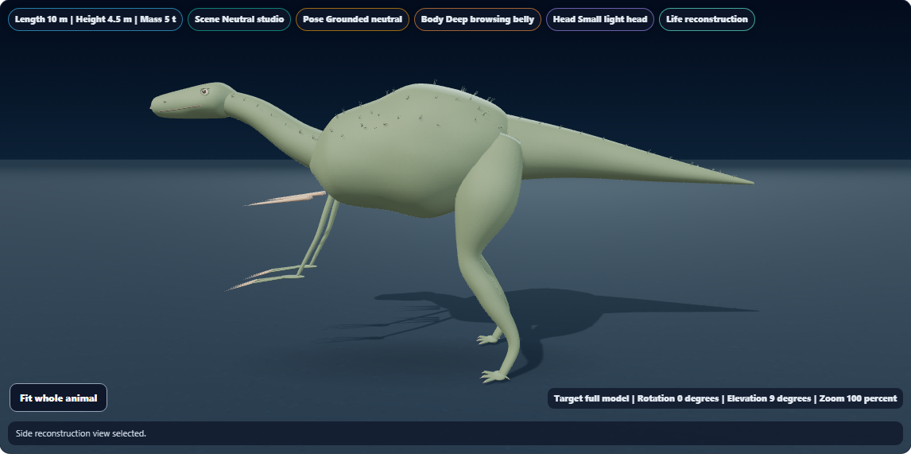
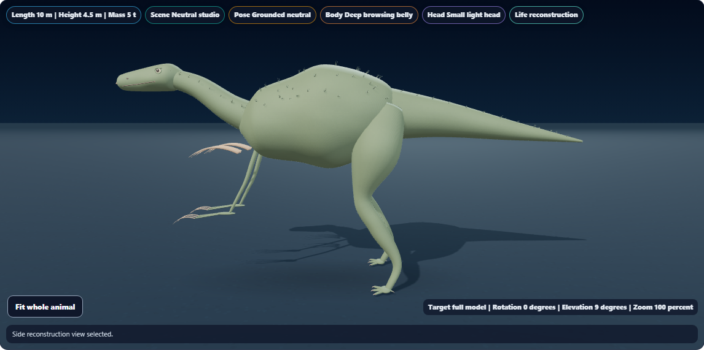
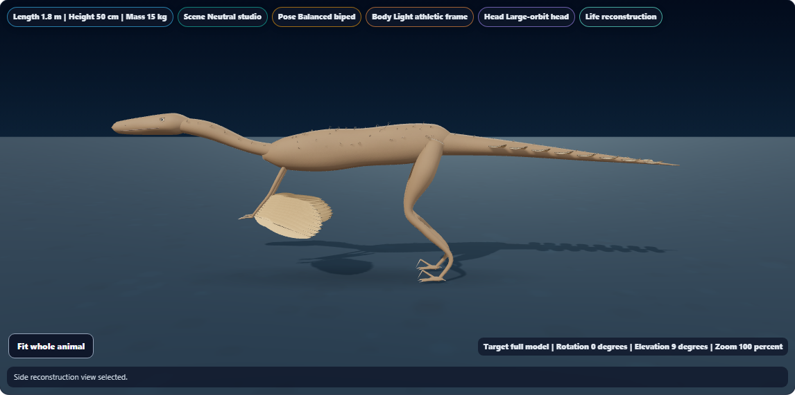

# Dino Lab curved horn and claw surfaces

Keratin horns and claws now use smoothly curved, tapered surfaces in place of straight cones. Horns retain a round cross-section; claws have a narrower cross-section and a stronger arch. Their original roots, tips, radii, coverage, material and shadow participation are preserved. Horns are explicitly included in Head study bounds.

The existing fossil cores, species data and saved investigation schema are unchanged. These are procedural visual refinements, not new claims about specimen-specific soft-tissue geometry.

## Visual comparison

Matching views with opaque life surfaces and reduced motion:

| Specimen | Before | After |
| --- | --- | --- |
| Triceratops head |  |  |
| Therizinosaurus |  |  |
| Velociraptor |  |  |

Additional views: [Styracosaurus head](styracosaurus-after.png), [Styracosaurus front](styracosaurus-front.png), [Triceratops front](triceratops-front.png), [Microraptor](microraptor-after.png), [Brachiosaurus](brachiosaurus-after.png), [phone head study](triceratops-phone.png).

Visually reviewed both Triceratops and Therizinosaurus comparisons, Styracosaurus from the front, Microraptor, and the 390 × 844 phone view. The curved outlines remain legible at small scales and horn tips fit in the selected study.

## Rendering cost

Each sheath remains one mesh using the existing shared material. Geometry-resource counts, texture counts and draw calls are unchanged in the three reference comparisons. Additional triangles supply the longitudinal curvature.

| Opaque reference frame | Sheaths | Rendered triangles | Draw calls | Textures |
| --- | ---: | ---: | ---: | ---: |
| Triceratops | 3 | 205,440 → 206,196 | 170 → 170 | 7 → 7 |
| Therizinosaurus | 20 | 102,876 → 107,916 | 199 → 199 | 7 → 7 |
| Velociraptor | 14 | 116,044 → 119,572 | 309 → 309 | 8 → 8 |

These are Chromium software-WebGL renderer counters, not measurements of frame rate on physical devices.

## Validation

**144 of 145 focused checks passed.** Keratin geometry (9), study bounds (6), surface geometry (19), cranial geometry (9), shadows (14), accessibility (15) and 72 of 73 golden checks passed. [Focused results](focused-results.txt)

The one golden snapshot mismatch predates this pass: the rendered Field Station wrapper contains `data-allo-fs-stage="dinolab-field"`, while the stored snapshot does not. The baseline and refined Field Station HTML are byte-identical. The unrelated snapshot was left untouched. [Markup comparison](markup-comparison.json), [comparison script](compare-markup.cjs)

**All seven browser scenarios passed:** six species spanning small and large animals, plus a phone lifecycle scenario. [Browser results](browser-results.txt)

Browser checks cover:

- Whole-animal framing, finite vertices, complete shadow-camera coverage, valid shaders and a healthy WebGL context.
- Side and front horn-study framing for Triceratops and Styracosaurus.
- Preserved root/tip landmarks and exact SHA256 matches for fossil geometry and transforms in all three before/after comparisons.
- Saved investigation data unchanged by camera and study selections.
- Geometry reuse when adjusting opacity, disposal when switching to fossil view, and stable geometry-resource counts after returning to life view.
- Horn framing, retained Head study selection and no horizontal page overflow on a 390 × 844 emulated phone.

The 15 initial geometry/study checks are included in the focused total; the three baseline browser captures are excluded from the seven new-renderer scenarios. [Initial geometry results](geometry-results.txt), [baseline results](baseline-results.txt)

The baseline renderer was copied before this pass from the local source at revision `946e0f8a8`; its SHA256 was `4182EB80A3E7EDD908B283ECABB2D54D3EE7658D491B41944628220A96F177C9`. To reproduce baseline captures, restore that renderer to a temporary local path and pass it through `DINO_KERATIN_SOURCE`. The comparison script accepts the same source path as its first argument. Temporary renderer copies are excluded from the report.

Raw records: [Triceratops](triceratops.json), [Therizinosaurus](therizinosaurus.json), [Velociraptor](velociraptor.json), [Styracosaurus](styracosaurus.json), [Microraptor](microraptor.json), [Brachiosaurus](brachiosaurus.json), [phone opacity and layers](phone-layers.json), [validation record](validation.json).

Syntax, scoped whitespace, report links and canonical/public/existing web-build/app-build parity passed. Renderer SHA256: `BFAC550FF93E9D7DB5E821F5BF9B02BB63400D3EC8997358F80053C3CB05ADE8`.

Local changes only. No push, deployment or packaged build. The existing ignored web-build and app-build renderers are synchronized. The pre-commit hook identified the additional web-build mirror; it was synchronized before retrying the normal commit.
