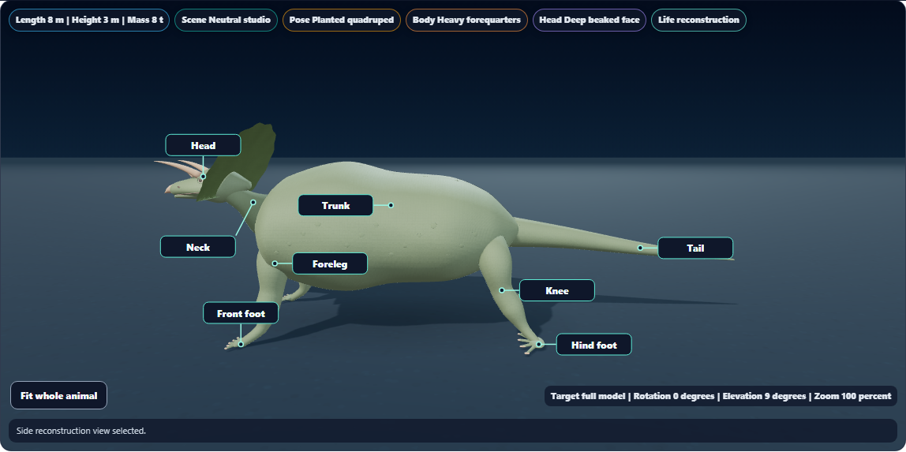

# Dino Lab callout readability

Body-part callouts now keep their anchor-relative placement when it remains clear during breathing and rotation. Selected parts still take priority. Placement rejects lines that cross another leader or pass through another label, and keeps the existing limits of eight desktop callouts and four phone callouts. The body-part key remains available when a label has no clear position.

Labels use measured text bounds instead of a fixed one-line box. Longer names wrap, and fractional widths round upward so the last word cannot be pushed into a clipped row. Measurements are cached by text, font and viewport width. Selected views use the lower canvas space freed when their readouts move below the model.

This pass changes label layout and styling. The anatomical landmarks, schematic model geometry and saved observations are preserved.

## Visual review

[Whole-animal callouts](triceratops-callouts.png) · [Rotated selected model](orbit-callouts.png) · [Wrapped phone label](phone-long-label.png) · [RTL phone label](phone-rtl-label.png)

All four captures were reviewed. The phone fixtures deliberately use longer Latin and Arabic strings to check fitting; they do not represent new translations of the app.

## Validation

**98 focused checks passed in the final run:** body labels (11), moving layout (8), study framing (6), and catalog/render goldens (73). Only the Field Station snapshot changed to include wrapping label styles. [Final results](final-focused-results.txt) · [Snapshot update](snapshot-update.txt)

**Three distinct browser scenarios passed across runs:** breathing and keyboard orbit; whole-animal camera/study transitions; long and RTL labels after resizing from 390 to 320 pixels. The first two passed in the full suite, and the text-fitting scenario passed after its corrections. [Full browser run](browser-results.txt) · [Final wrapping recheck](wrap-recheck-results.txt)

The selected breathing callout's relative-position variation was 0.083 pixels in the sampled frames, consistent with screen-coordinate rounding. Geometry and texture counts stayed unchanged (195 geometries, 7 textures in the reference scene). Saved observations were unchanged. New-control axe violations: 0. These are local software-WebGL checks, not physical-device frame-rate measurements. [Motion record](motion-checks.json) · [Phone checks](phone-checks.json) · [Actual label dimensions](phone-label-metrics.json)

The first phone run exposed excess reserved space after narrowing the viewer. The next run exposed fractional-width clipping for natural-width RTL text. Both were corrected. [Initial browser run](browser-initial-results.txt) · [Wrapping attempt](browser-wrap-attempt.txt)

An early moving-layout test spent too long asserting every sampled line point separately; assertions were aggregated without reducing frame coverage. A subsequent full unit run passed 25 cases but could not start the golden worker under load. The final isolated run passed all 98 cases. [Worker-startup record](focused-results.txt)

At completion of this standalone pass, canonical, public, existing web-build and app-build renderers were byte-identical. Renderer SHA256: `4803f10ee5c8b8cb467695b7dd16bd930fa18f7dd3df613934cf63e8d9e3b4f8`.

Local changes only; no push, deployment or packaged build.

## Local commit status

The original standalone commit attempt was blocked by concurrent games source-pair drift (7736 versus 7699 lines). Those unrelated edits were preserved and no hooks were bypassed. This pass is now included in the follow-up feather/evidence work; see [the current validation report](../dinolab-3d-feather-evidence/README.md).
