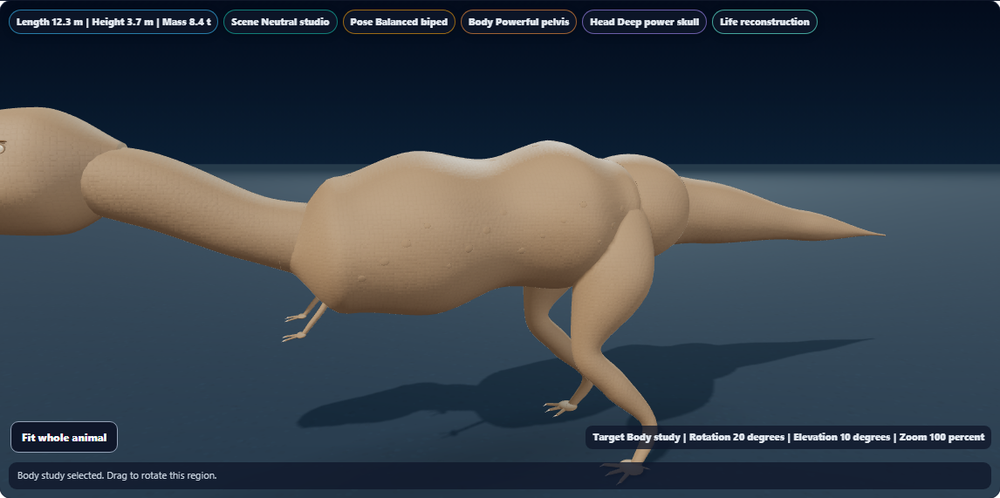
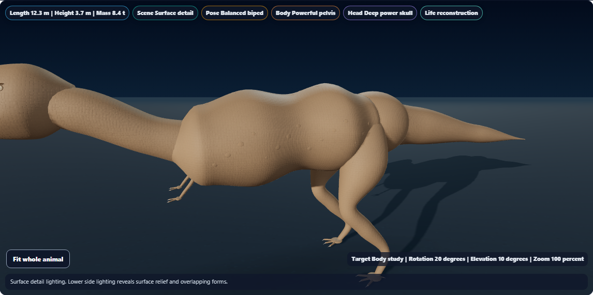
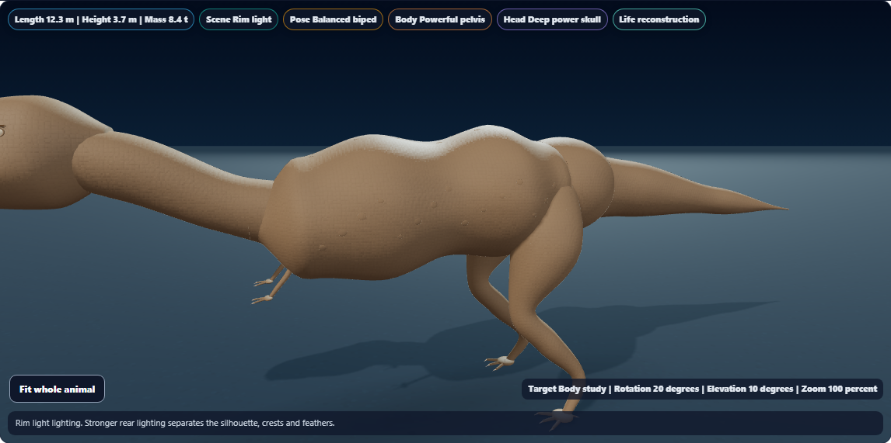
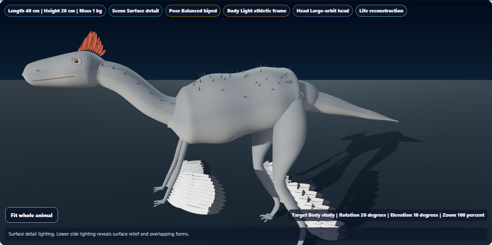
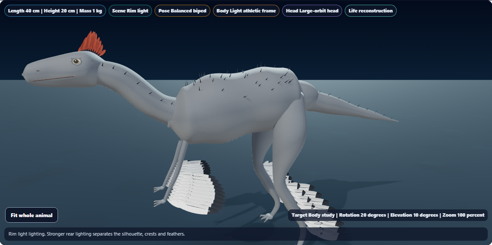
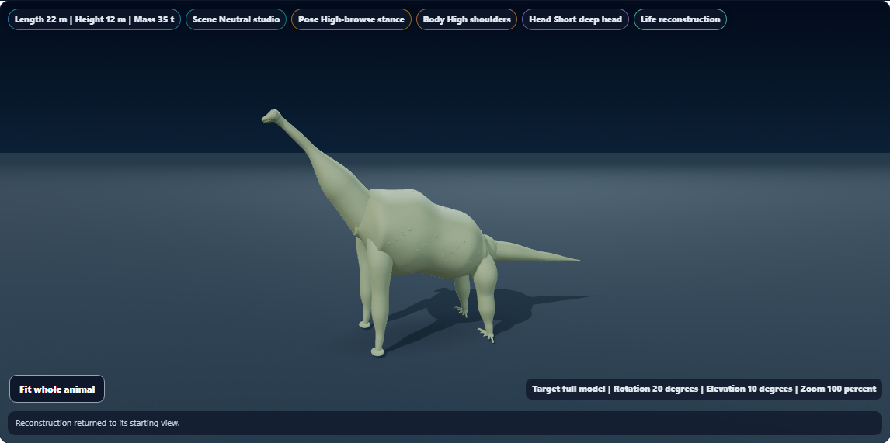
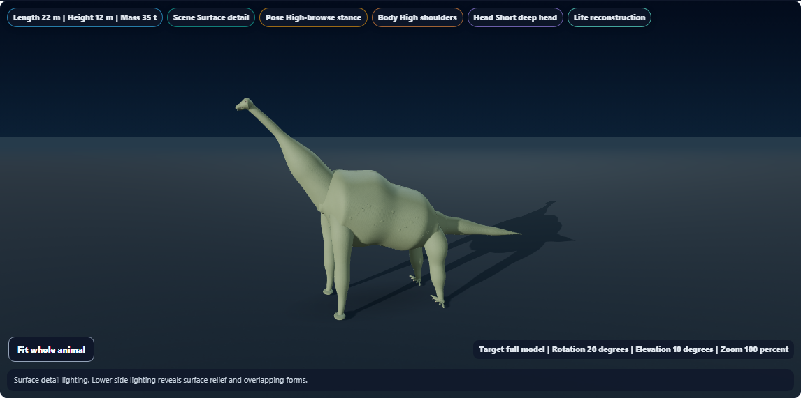
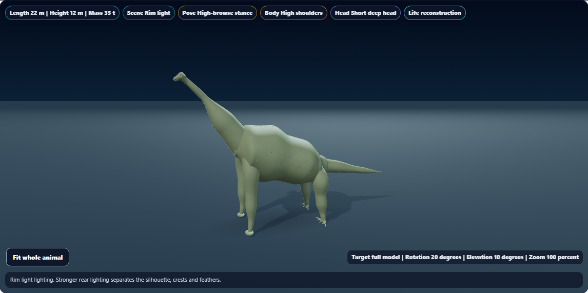

# Dino Lab studio-light studies

Dino Lab now offers three studio lighting presets under **View controls & layers → Studio light angle**.

| Preset | What it shows |
| --- | --- |
| Balanced | The existing neutral studio lighting for an overall view. |
| Surface detail | Lower side lighting to make surface relief and overlapping forms easier to inspect. |
| Rim light | Stronger rear lighting to define the silhouette, crests and feathers. |

Selecting a preset changes the existing lights in place and refits the directional shadow camera. The specimen, camera, materials, surface colors, texture resources and shadow texture are reused. The selected light remains available across life/fossil layers, species changes and a return from Habitat while the viewer is mounted. Habitat keeps its existing lighting. The preference does not change saved investigation data.

Native buttons expose their selected state, have at least 44 px height and work with a keyboard. A short explanation and the scene readout identify the active lighting. The mobile check retained the paused-motion setting and Head study when switching lights.

## Visual review

These captures use deterministic software WebGL with the application stylesheet. T. rex and Anchiornis show the Body study; Brachiosaurus shows the whole animal. This is a lighting refinement to the existing procedural reconstructions.

| Specimen | Balanced | Surface detail | Rim light |
| --- | --- | --- | --- |
| T. rex |  |  |  |
| Anchiornis |  |  |  |
| Brachiosaurus |  |  |  |

[Phone controls and paused Triceratops head study](triceratops-rim-mobile.png)

Reviewed T. rex in all three presets, Anchiornis in rim lighting, Brachiosaurus in surface-detail lighting, and the phone capture. The lower key light reveals relief; the rear light makes the upper silhouette clearer. The mobile controls fit without horizontal overflow and show keyboard focus.

## Validation

- **112 focused checks passed** across lighting geometry (10), existing shadow geometry (14), accessibility (15) and golden coverage (73). [Focused result](focused-results.txt)
- **7 distinct browser scenarios passed**: three complete preset cycles, layer/Habitat/species persistence, phone keyboard/pause behavior, and two existing camera/evidence regressions. [Browser result](browser-results.txt)
- Browser probes verified specimen/material identity, camera position/projection, root rotation, renderer resource counts, shadow-texture reuse, fitted caster coverage, shader validity, context health and saved-data preservation.
- Geometry checks covered all three light directions at three scales, including floor projections and shadow-matrix restoration.
- One expected field-station snapshot was updated; review confirmed only the new control markup was inserted. All golden tests then passed normally. [Snapshot update](snapshot-update.txt)
- JavaScript syntax, scoped whitespace and canonical/public/existing app-build byte parity passed. SHA256: `B005C19BB6463DAF70AAC8769732635A1BE394C1158A2FCE7791318A52156F30`.

Each 1146 × 570 render was compared with its Balanced baseline. A changed pixel has a combined RGB difference greater than 12; the counts include both specimen and ground lighting.

| Specimen | Surface-detail changed pixels | Rim-light changed pixels | Balanced return |
| --- | ---: | ---: | ---: |
| T. rex | 433,883 | 295,060 | 0 |
| Anchiornis | 435,562 | 323,704 | 0 |
| Brachiosaurus | 407,464 | 246,447 | 0 |

Raw results: [T. rex](tyrannosaurus.json), [Anchiornis](anchiornis.json), [Brachiosaurus](brachiosaurus.json), [persistence](persistence.json), [validation record](validation.json).

An initial T. rex review passed before the shadow-texture assertion was strengthened to require an actual texture UUID; the final seven-case run includes that stronger assertion. The repeated review and targeted snapshot update are excluded from the unique pass counts. [Initial review log](first-review-results.txt)

Phone dimensions were emulated at 390 × 844. The motion check confirms the pause control setting and root rotation; it is not a new exhaustive animated-mesh pose test. Rendering results establish visual changes and resource reuse, not a hardware performance benchmark.

Local change only; no push, deployment or packaged build. Existing ignored app-build copy is synchronized.
