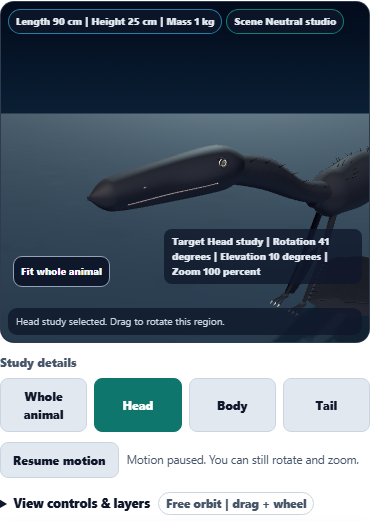

# Dino Lab: pause for close-up study

Dino Lab now has a Pause motion / Resume motion control beside the anatomical study controls. Pausing holds breathing, tail and feather movement, blinking, evidence pulses, logged evidence rings and auto spin in place. Manual orbit, zoom and Head / Body / Tail study controls remain available.

The pause stays active through surface-layer, evidence-marker and species changes while the viewer remains mounted. It is a local viewing preference and does not change saved project data or observations.

## Motion behavior

- All decorative animation shares an active-time clock. Paused or hidden time is excluded, so returning to the viewer or resuming motion does not jump to a later pose.
- Automatic rotation advances at 0.21 radians per second across tested frame rates of 15, 30, 60 and 120 fps.
- A stalled visible frame contributes at most 100 ms to the animation clock.
- The device's reduced-motion preference is respected on load and when changed live. The control displays “Motion reduced” while the device preference pauses motion.
- A manual pause choice survives device preference changes. Media-query listeners are removed when the viewer unmounts.
- The button supports native keyboard operation and exposes its pressed state; adjacent status text explains the current behavior.

The viewer continues rendering while paused so camera controls remain interactive. No rendering-performance or energy-saving claim is made. Idle motion remains illustrative.

## Visual review

A 390 px phone capture confirms readable controls without horizontal overflow. The head study below has evidence markers hidden to make the paused specimen easier to inspect.



Additional captures:
- [Phone view with evidence markers](paused-mobile-evidence.png)
- [Manual pause retained after device preference changes](reduced-motion.png)
- [Paused Brachiosaurus after changing species](paused-brachiosaurus.png)

## Validation

**121 focused checks across five files and seven distinct browser scenarios passed.** The first motion browser scenario was then extended and rechecked successfully to verify that hiding evidence markers also preserves the exact paused pose.

| Coverage | Passed |
| --- | ---: |
| Motion clock: frame rates, pause/resume, stalled frames, visibility reset and invalid timestamps | 8 |
| Existing geometry and anatomical study checks | 25 |
| Golden snapshots | 73 |
| Accessibility contracts | 15 |
| New browser scenarios | 4 |
| Existing browser regressions | 3 |

The browser checks verify:
- Exact local mesh transforms and opacity values stay frozen, including 178 feather/filament details and eight torus meshes in the Microraptor fixture.
- Keyboard orbit, zoom and Head study remain usable while paused, and saved tool data is unchanged.
- The first resumed frame preserves the paused pose, with motion advancing gently on the next frame.
- Live reduced-motion changes do not rebuild the model and preserve the manual pause choice.
- Pausing survives life/fossil layers, evidence visibility and species changes; Home restores Whole animal.
- Returning from a simulated 120-second hidden interval preserves both pose and orbit.
- Existing moving-tail pigment alignment, keyboard study selection and explicit scan-target priority still work.

Logs: [clock and geometry](clock-results.txt), [golden and accessibility](accessibility-results.txt), [snapshot update](snapshot-results.txt), [new browser scenarios](browser-results.txt), [existing browser scenarios](regression-browser-results.txt), [final phone recheck](visual-recheck-results.txt).

Structured evidence: [pause/resume](pause-resume.json), [device preference](reduced-motion.json), [hidden viewer](visibility.json), [moving tail](regional-regression/motion-metrics.json), [validation summary](validation.json).

The golden snapshot adds the motion-control row. Four source-contract assertions now reference the shared motion clock; runtime browser assertions verify actual frozen poses. These final runs had no test failures. The browser logs contain a Node color-environment warning.

## Reproduce

Run from the repository root:

```powershell
node node_modules/vitest/vitest.mjs run tests/dinolab_3d_motion.test.js tests/dinolab_3d_geometry.test.js tests/dinolab_3d_studies.test.js --reporter=dot
node node_modules/vitest/vitest.mjs run tests/dino_lab_golden.test.js tests/dinolab_3d_accessibility.test.js --reporter=dot
node node_modules/@playwright/test/cli.js test tests/e2e/dinolab-3d-motion.spec.ts --workers=1 --retries=0 --reporter=list --output=reports/dinolab-3d-motion/acceptance
$env:DINOLAB_REPORT_DIR='reports/dinolab-3d-motion/regional-regression'
node node_modules/@playwright/test/cli.js test tests/e2e/dinolab-3d-regional-color.spec.ts tests/e2e/dinolab-3d-studies.spec.ts --workers=1 --retries=0 --reporter=list --grep "tail pattern stays fixed|keyboard study selection|explicit scan target" --output=reports/dinolab-3d-motion/regression-acceptance
```

## Delivery

Canonical source, public web copy and existing generated app-build copy have identical SHA-256:

`321730971D9E8A07E1BD6C098FC1165F2AD244B4F12CAB9BEC018ADF219C90E6`

Syntax and scoped whitespace checks passed. Visual checks ran in local Chromium with Three.js r128 and software WebGL; packaged desktop hardware performance was not benchmarked. Changes are local; no push or deployment.
