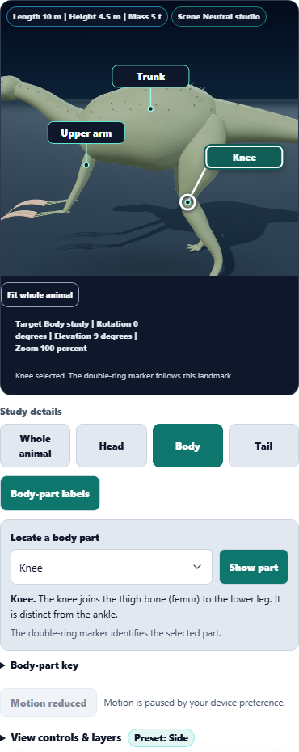

# Dino Lab body-part locator

Turn on **Body-part labels**, then use **Locate a body part**. Choosing a part frames its region and gives its label priority. A double-ring marker identifies the landmark, and a short explanation distinguishes parts such as the knee and ankle. **Show part** restores its view after rotating or zooming; **All parts** clears the selection.

The selector includes all ten regions even when only four callouts fit on a phone. Front-foot/hand terminology follows the species' forelimb posture. Selection is local to the viewer and leaves saved observations unchanged. Switching to another species clears the selected part.

## Visual improvements

- Selected callouts have a white outline, stronger leader and double-ring marker; other labels remain quieter.
- Camera framing includes the selected landmark on both sides of the animal. This fixes the small-species ankle falling outside the usual body close-up.
- Lower camera readouts and the fit button move below the canvas while a part is selected, so they cannot hide a knee or ankle marker.
- Labels continue to use the model's actual projected anchors. Offscreen landmarks are not given invented screen positions; the explanation offers Show part when the marker cannot be displayed.

The procedural models and soft-tissue outlines remain schematic. This pass improves locating and reading their anatomy; it does not add specimen measurements.

## Reviewed captures

[Phone knee](phone-knee.png) · [Triceratops front foot](triceratops-front-foot.png) · [Microraptor ankle](microraptor-ankle.png)

All three final captures were visually reviewed. The phone knee marker is clear of the camera readout, the quadruped label identifies the front foot, and the small-species ankle remains in the close-up.

## Validation

**90 distinct focused checks passed:** body-label layout and controls (11), study framing (6), and catalog/render golden coverage (73). Only the Field Station snapshot changed, to include the hidden landmark rings. [Focused results](focused-results.txt) · [Snapshot update](snapshot-update.txt)

**Three browser scenarios passed**, covering all ten part selections on a phone, native-select keyboard access, quadruped terminology and orbit, fossil/life transitions, selection visibility, species changes, and small-species anchor projection. Selected markers are checked against readout bounds. Saved observations remain byte-equivalent after selection; geometry and texture counts remain unchanged (195 geometries, seven textures in the reference scene). The locator controls have zero automated axe violations. [Browser results](browser-results.txt) · [Phone accessibility and resources](phone-checks.json) · [Additional species round-trip check](species-reset-results.txt)

The initial browser run passed two scenarios and exposed an ankle framing failure for Microraptor. Visual inspection also revealed a knee marker hidden behind the phone readout. Both were corrected before the passing run. [Initial browser results](browser-initial-results.txt)

Canonical, public, existing web-build and app-build renderers match. Syntax and scoped whitespace checks pass. SHA256: `1b7ade0a42f966ff0c84cbd7c1415409f19840f7a3a648052c576adbf4a2284a`.

Local changes only; no push, deployment or packaged build.

Implementation and the preceding anatomy-label pass were committed normally as `859240821`. All commit hooks passed.
