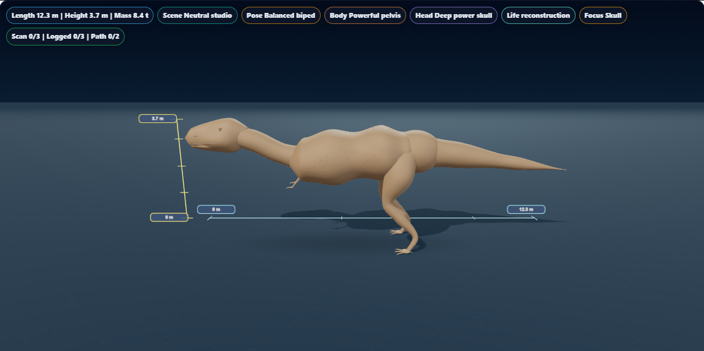
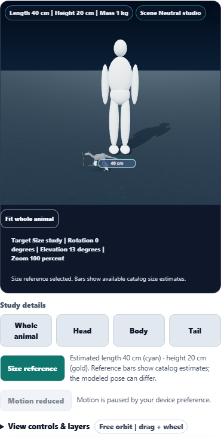

# Dino Lab: calibrated size references

The 3D Field Station now has a Size reference study with cyan length and gold height bars. The bars use catalog estimates in scene metres, rotate with the specimen, and adapt their ticks to small and large animals. Sub-metre estimates use centimetres.

The previous floor ruler used the snout-to-tail anchor distance while labelling its endpoint with the catalog length, and stayed fixed when the model rotated. The new reference bars have exact estimated spans and sit beside the reconstruction. The visible explanation distinguishes these estimates from the illustrated pose.

## Visual review





The desktop captures below come from initial geometry acceptance, before the size-view footer moved below the canvas. The main T. rex image and both phone captures show the final layout. Additional captures: [Anchiornis](anchiornis-size.png), [Microraptor](microraptor-size.png), [Brachiosaurus](brachiosaurus-size.png), [Mosasaurus with no catalog height](mosasaurus-size.png), and [320 px Habitat view](microraptor-habitat-mobile.png).

## Behavior

- Exact reference spans, bounded 1–2–5 tick spacing, no duplicate endpoint marks, and centimetre/metre labels.
- A native keyboard-accessible Size reference button with pressed state and a 44 px minimum height.
- Specimen-relative ruler placement, orbit and camera fitting; the enabled 1.7 m human comparison joins the fitted view.
- Survey decorations, evidence overlays and the fossil tray stay out of the size study. Anatomical, evidence and tray close-ups hide the reference bars.
- Phone size views put Fit whole animal, camera readout and status below the canvas so they cannot cover a small specimen.
- Key labels show endpoints, All labels adds collision-checked interior labels on larger screens, and Labels off hides them. Nonzero estimates take priority when labels compete for space. The text beside the button always provides the available estimates.
- Species with no catalog height receive no height bar; the adjacent text says that height is not listed.
- Camera study changes preserve saved investigation data. Removing the reference layers returns to Whole animal.

No catalog measurements, anatomical geometry, reconstructions or scientific claims were changed. Existing minimum rendering dimensions and the illustrated pose can differ from the catalog estimates; the reference bars are not measurements of the mesh bounds.

## Validation record

**139 distinct focused checks across six files and 10 distinct browser scenarios passed after corrections and isolated rechecks.**

Focused coverage: 12 tick checks, 19 surface geometry checks, 6 study-bounds checks, 14 shadow checks, 15 accessibility/workflow checks and 73 golden checks.

Browser coverage: five species (Anchiornis, Microraptor, T. rex, Brachiosaurus and Mosasaurus), keyboard orbit and Home, anatomical visibility, saved-state preservation, human comparison, phone layouts, tray separation, layer reset, label preferences, Habitat placement and two existing camera regressions.

Run history:

- First small-species render succeeded, then its new test used an incorrect canvas selector and timed out. The selector was corrected.
- Initial focused run: 135/139 passed. A catalog-wide test exposed missing height values; production handling was fixed. The other failures were the old ruler source assertion, old description assertion and expected field-station snapshot change.
- Initial browser acceptance: 7/7 passed.
- Phone/footer, label/Habitat and two existing camera checks: 4/4 passed. The phone case repeats an earlier scenario and is not counted twice.
- The single field-station snapshot was updated and reviewed: the Size reference control and explanation, two guide descriptions, and zero-margin defaults for the conditional footer. No other snapshots changed.
- Final broad focused run: 130/139 passed, including all five non-accessibility files. A workflow test timed out at 30 seconds, followed by DOM failures; the structural axe test later timed out at 180 seconds and subsequent axe calls reported an active run. All 15 accessibility checks subsequently passed in a fresh thread worker with a 120-second default timeout. Existing per-test limits remained in effect; no assertions were removed.

- Final phone rechecks: 2/2 passed, including nonzero endpoint priority and controls positioned below the canvas. These repeat existing scenarios.

Logs: [first review](first-review-results.txt), [initial focused run](focused-results.txt), [browser acceptance](browser-results.txt), [phone and camera regressions](regression-results.txt), [snapshot update](snapshot-update-results.txt), [broad focused run](focused-final-results.txt), [accessibility recheck](accessibility-recheck-results.txt), [final phone rechecks](phone-final-results.txt), [final desktop capture](desktop-final-results.txt). Redundant source and HTML dumps were removed from the initial focused log; expected values, failure locations and counts remain.

Measurements: [Anchiornis](anchiornis.json), [Microraptor](microraptor.json), [T. rex](tyrannosaurus.json), [Brachiosaurus](brachiosaurus.json), [Mosasaurus](mosasaurus.json), [human comparison](phone.json), [labels and Habitat](labels-habitat.json).

[Machine-readable validation summary](validation.json).

## Reproduce

Run sequentially from the repository root:

```powershell
node node_modules/vitest/vitest.mjs run tests/dinolab_3d_size_reference.test.js tests/dinolab_3d_geometry.test.js tests/dinolab_3d_studies.test.js tests/dinolab_3d_shadows.test.js tests/dinolab_3d_accessibility.test.js tests/dino_lab_golden.test.js --pool=threads --maxWorkers=1 --testTimeout=120000 --reporter=dot --silent
node node_modules/@playwright/test/cli.js test tests/e2e/dinolab-3d-size-reference.spec.ts --workers=1 --retries=0 --reporter=list --output=reports/dinolab-3d-size-reference/acceptance
node node_modules/@playwright/test/cli.js test tests/e2e/dinolab-3d-studies.spec.ts --workers=1 --retries=0 --reporter=list --grep "keyboard study selection|explicit scan target" --output=reports/dinolab-3d-size-reference/regression-acceptance
```

## Delivery

The canonical source, public web module and existing generated app-build module share SHA-256:

4A951DE0A0195D1D4A5E125910E9795187751F2F53A8BD31873026F99C321EA6

Syntax, scoped whitespace and all report links passed. Browser checks use local Chromium, Three.js r128 and software WebGL. No hardware performance benchmark, desktop package, push or deployment is included.

The unrelated source-pair drift cleared on the next refinement pass. The completed size-reference enhancement was saved with the normal commit hooks; no bypass was used.
