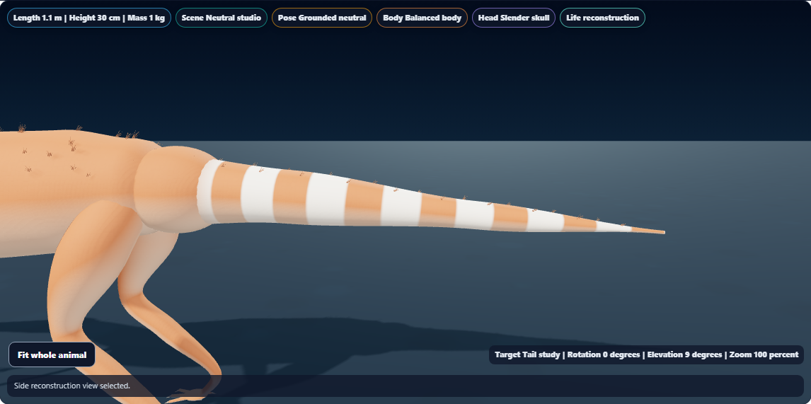
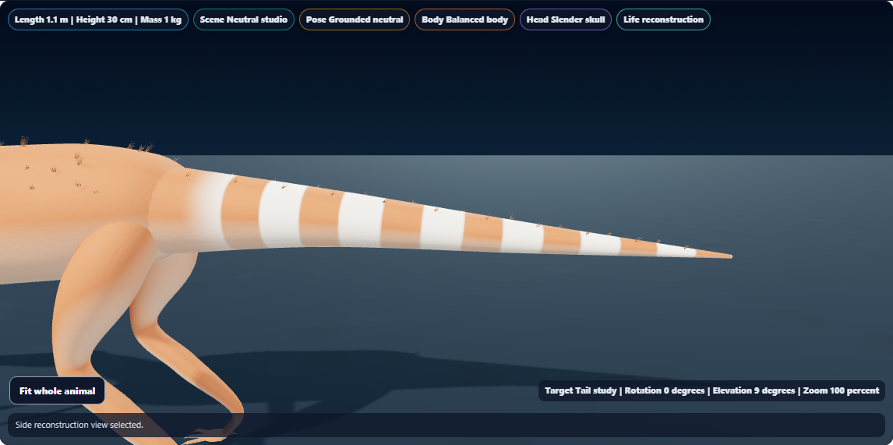
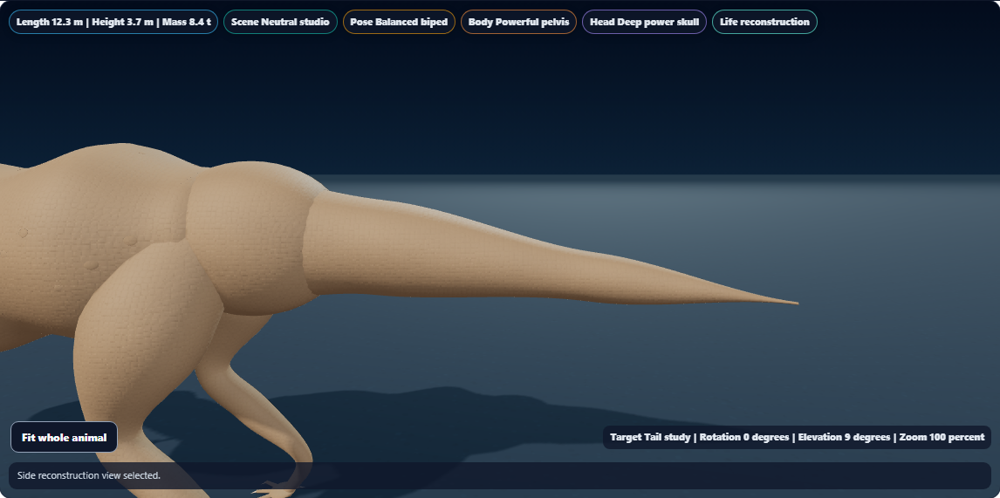
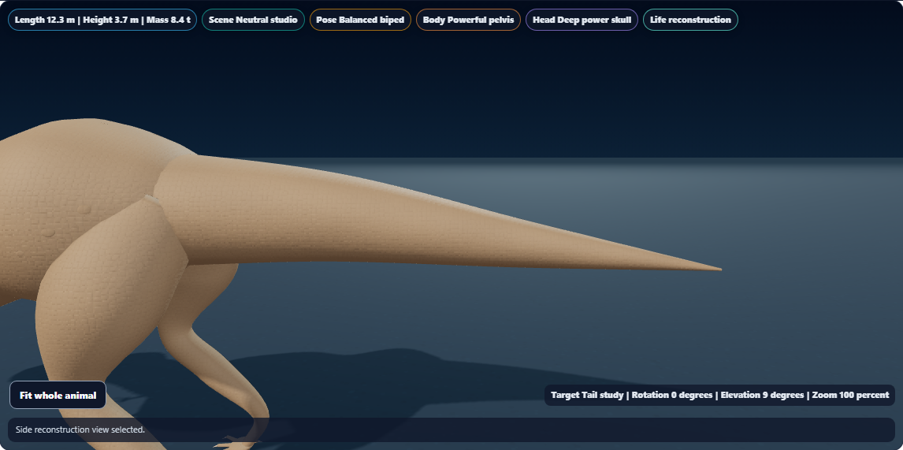

# Dino Lab smoother body and tail transitions

Continuous torso, neck, limb and tail skin now uses the smooth radius interpolation already used for cranial surfaces. Cross-section measurements and mesh resolution stay the same, while the transitions between those sections lose their flat ledges.

The separate rounded tail-base collar has been removed. The tail surface starts inside the pelvis and tapers outward, retaining its original hip pivot. Skin regions remain separate meshes for animation; this change refines their overlap and contours.

## Before and after

Matching side-view Tail studies, with opaque life surfaces and reduced motion:

| Specimen | Before | After |
| --- | --- | --- |
| Sinosauropteryx |  |  |
| T. rex |  |  |

Additional captures: [Brachiosaurus body](brachiosaurus-body.png), [Triceratops body](triceratops-body.png), [Microraptor tail](microraptor-tail.png), [Spinosaurus tail](spinosaurus-tail.png), [paused phone tail study](sinosauropteryx-mobile.png).

Visually reviewed the Sinosauropteryx comparison, refined T. rex tail, Brachiosaurus body, Spinosaurus tail and phone view. The tail base has a cleaner taper without the extra rounded collar.

## Rendering cost

The measured opaque reference frames use two fewer draw calls and one fewer geometry resource. No textures were added.

| Reference frame | Draw calls | Geometry resources | Textures | Rendered triangles |
| --- | ---: | ---: | ---: | ---: |
| Sinosauropteryx | 193 → 191 | 194 → 193 | 7 → 7 | 103,340 → 100,028 |
| T. rex | 133 → 131 | 138 → 137 | 7 → 7 | 148,340 → 145,028 |

The removed collar and contour account for 3,312 fewer rendered triangles in each reference frame. These are renderer counters from software WebGL, not physical-device frame-rate measurements.

## Validation

**144 distinct focused checks passed across seven files:** transitions (6), surface geometry (19), cranial geometry (9), attachments (8), shadows (14), accessibility (15) and golden coverage (73). [Focused results](focused-results.txt)

The new geometry tests verify preserved cross-sections, bounded taper, continuous seam normals and unchanged topology across three scales and two breadth profiles. An initial test accidentally doubled the expected index count; correcting the expectation to 7,056 made all six cases pass. Product geometry did not need correction. [Initial result](geometry-first.txt), [corrected result](geometry-corrected.txt)

The existing accessibility source assertion now names the new tail skin root. Golden snapshots are unchanged.

**10 distinct browser scenarios passed:** six dinosaur shapes, moving/paused tail coverage with a phone fossil-view round trip, and three existing camera/evidence/color regressions. [Browser results](browser-results.txt)

Browser checks covered:

- Whole-animal framing, shadow coverage, finite geometry, shader validity and WebGL context health.
- All sampled vertices on the proximal tail rim remaining inside the torso.
- Surface attachments staying rooted, the original hip pivot, and stable tail color coordinates through motion.
- Exact recorded mesh transforms remaining frozen while paused.
- Tail-study focus and pause state surviving fossil/life changes on a 390 × 844 emulated phone.
- Saved investigation data remaining unchanged by study and lighting selections.

The first two visual-review cases were repeated in final acceptance; the two old-renderer baseline captures are also excluded from the ten-case count. [First review](first-review-results.txt), [baseline capture](baseline-results.txt)

The baseline source was local revision `7b7f2aab9`. To repeat a baseline capture, set `DINO_TRANSITION_SOURCE` to a local copy of that renderer. Temporary renderer copies are excluded from this report.

Raw geometry and renderer records: [Sinosauropteryx before](sinosauropteryx-before.json), [Sinosauropteryx after](sinosauropteryx.json), [T. rex before](tyrannosaurus-before.json), [T. rex after](tyrannosaurus.json), [Brachiosaurus](brachiosaurus.json), [Triceratops](triceratops.json), [Microraptor](microraptor.json), [Spinosaurus](spinosaurus.json), [motion and layers](motion-layers.json), [existing color-motion regression](regional-regression/motion-metrics.json), [validation record](validation.json).

Syntax, scoped whitespace, report links and canonical/public/existing app-build parity passed. Renderer SHA256: `F8A5D24D143747FA007D8418D165A10B6A15BEFFFBD4B8AEFAC2E257C5BA7286`.

Local changes only; no push, deployment or packaged build. The existing ignored app-build renderer is synchronized.
