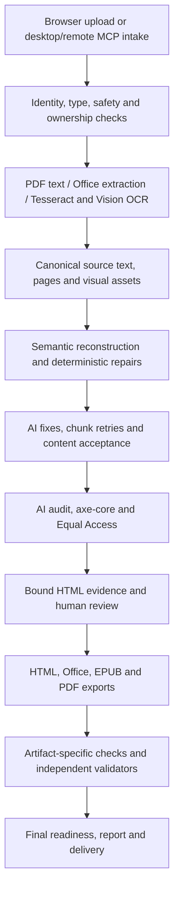

> Implementation update, September 7, 2026: the concrete correctness and reliability fixes have been implemented and validated. See the [implementation report](C:/Users/cabba/OneDrive/Desktop/UDL-Tool-Updated/reports/document-remediation-improvements-2026-09-07/README.md) for changes, final test results, and remaining follow-on work. The review below preserves the original findings and evidence.

# Document remediation deep dive — September 7, 2026

The remediation pipeline has substantial safeguards and a working end-to-end desktop MCP path. Its largest remaining weakness is inconsistent enforcement: an invariant checked in one path is sometimes absent from another. The next engineering investment should make content preservation, attempt ownership, and final artifact evidence consistent across paths.

This was a review and testing task. No application source was changed. Existing worktree changes were preserved. Review began at commit `c10b977dec6c21334158f3e16ba312b750ad9ebd`, with existing changes to the document pipeline source and built module. Source hashes are recorded in [source-hashes.json](C:/Users/cabba/OneDrive/Desktop/UDL-Tool-Updated/reports/document-remediation-review-2026-09-07/source-hashes.json); individual probes also record the source they exercised.

**How the system fits together**

Browser, desktop headless, and remote workflows reuse important core functions, including `fixAndVerifyPdf`, but have separate orchestration and final reporting. The portable skill is a separate repair-plan-based implementation; its assurances and test outcomes should remain distinct.

The current design already protects against many failure modes: strict audit response parsing, document ownership epochs, cancellation, bounded retries, original-content fallback, HTML verification hashes, active-content checks, table-position checks in the strict acceptance helper, durable jobs, digest-bound checkpoints, completion manifests, and independent PDF/EPUB checks. The desktop MCP applies conservative final PDF delivery decisions. The findings below concern gaps between these protections, not their wholesale absence.

**Highest-priority findings**

| Priority | Finding | Demonstrated consequence | Recommended action |
| --- | --- | --- | --- |
| P1 | Chunked fixes bypass the strict acceptance helper | The same swapped score table is rejected in a short document and accepted in a longer document | Use one content-acceptance contract for whole documents, chunks, half-chunks, and retries |
| P1 | OCR reconciliation can discard a recovered page | Tesseract page 2 survives in `pages` but disappears from canonical `fullText` | Validate physical-page coverage before establishing source truth |
| P1 | Image guards count placeholders without checking their identities | One image can replace another while the number of tokens remains unchanged | Preserve immutable asset identities and associations in every pass |
| P1 | Remote readiness does not incorporate independent PDF failure | A noncompliant PDF retains `ready` and `verified` summary labels | Compute final artifact readiness after validation using a shared reducer |
| P1 | Agent replies are not fenced across resume attempts | A response from an earlier attempt satisfies a different new request | Include a fresh attempt identity in requests and replies |

Priority expresses consequence and repair order; it does not imply that the synthetic provider responses occurred in production.

**1. Make content acceptance independent of document size and retry branch.**

Short documents call the strict acceptance helper, including table-position checks. Normal chunks and split retries instead use HTML-length and text-length floors. The actual-source probe placed scores 95 and 102 in a table, then supplied a response that swapped their rows. The 1,301-character document retained the original. The 39,871-character, three-chunk document accepted the swapped values despite retaining 100% of its text. A diagnostic reading-order warning is not an equivalent protection.

The image-recovery retry is weaker again: it immediately accepts enough HTML bytes plus enough placeholders without a text floor. In a nine-chunk fixture, an attribute-padded response removed a chunk's prose; the returned document retained 88.3% of the text, above the aggregate 85% rejection floor. These demonstrate acceptance of bad candidates, not a live model's behavior.

Locations: [normal chunk acceptance](C:/Users/cabba/OneDrive/Desktop/UDL-Tool-Updated/doc_pipeline_source.jsx:10801), [image retry](C:/Users/cabba/OneDrive/Desktop/UDL-Tool-Updated/doc_pipeline_source.jsx:10788), [strict table gate](C:/Users/cabba/OneDrive/Desktop/UDL-Tool-Updated/doc_pipeline_source.jsx:9989). [Reproduction results](C:/Users/cabba/OneDrive/Desktop/UDL-Tool-Updated/reports/document-remediation-review-2026-09-07/core/source-probe-results.json).

Use a fragment-aware acceptance function that checks typed values, table-cell associations, required structures, assets, growth and loss. Every accepted branch must pass it. Rejection should retain the exact source fragment and persist its reason into result/checkpoint evidence. Keep whole-document loss thresholds as a final backstop.

**2. Establish reliable page identity before choosing canonical OCR text.**

The one/two-page Vision route can return one pseudo-page. If Vision wins page 1, reconciliation can replace the whole document's `fullText` with that blob, even when Tesseract independently recovered page 2. The probe retained the second-page instruction in `rec.pages` but omitted it from `rec.fullText`, which the main pipeline subsequently uses as source truth. Later fidelity checks cannot reliably detect source text already excluded from their baseline.

A second fallback assigns physical page numbers to equal-character slices when Vision omits page-break markers. Uneven pages then compete with text from the wrong physical region. The probe expanded 1,044 source characters to 1,521 through duplication. A third probe changed scores 95/102 to 96/103 without changing text length; reconciliation emitted no disagreement or low-confidence record because its disagreement check is length-based.

Locations: [pseudo-page replacement](C:/Users/cabba/OneDrive/Desktop/UDL-Tool-Updated/doc_pipeline_source.jsx:15644), [canonical source assignment](C:/Users/cabba/OneDrive/Desktop/UDL-Tool-Updated/doc_pipeline_source.jsx:27118), [equal-character fallback](C:/Users/cabba/OneDrive/Desktop/UDL-Tool-Updated/doc_pipeline_source.jsx:27026), [disagreement detection](C:/Users/cabba/OneDrive/Desktop/UDL-Tool-Updated/doc_pipeline_source.jsx:15625). [OCR evidence](C:/Users/cabba/OneDrive/Desktop/UDL-Tool-Updated/reports/document-remediation-review-2026-09-07/core/ocr-probe-results.json).

Require page-scoped output or explicit, validated page ranges. Keep unsegmented chunk text unsegmented until alignment succeeds; retry individual pages when necessary. Retain both engines' readings and coordinates. Detect disagreement using aligned tokens and typed numbers, dates, units, signs, and negation, then send only the affected region to review.

**3. Preserve image identity, not just image count.**

The FINAL placeholder check accepts two copies of image 1 in place of images 1 and 2. Follow-up fixes turn data URLs into `__IMG_DATA_N__` tokens but do not enforce their survival. Probes accepted both substitutions with full text retention.

There is an important existing mitigation: the initial remediation flow recovers missing FINAL images into a disclosed recovery section. That reduces complete loss during the first pass, but does not repair wrong inline associations or protect all later data-image fixes.

Locations: [data URL tokenization](C:/Users/cabba/OneDrive/Desktop/UDL-Tool-Updated/doc_pipeline_source.jsx:10645), [count-only check](C:/Users/cabba/OneDrive/Desktop/UDL-Tool-Updated/doc_pipeline_source.jsx:10708), [initial recovery](C:/Users/cabba/OneDrive/Desktop/UDL-Tool-Updated/doc_pipeline_source.jsx:30441).

Maintain an immutable asset map outside model-authored HTML. Check the exact ID multiset and its containing figure/block association, then restore bytes from the map. An original inline figure is a better fallback than an appended recovered asset.

**4. Derive PDF readiness from final PDF evidence in every runtime.**

The remote runner computes quality before veraPDF, copies it into the report, and then appends independent validation. A valid noncompliant result with two failed rules and three failed checks still produced `distributionLevel: ready` and `taggedPdfDelivery: verified`. The real public sanitizer preserved the contradiction. HTML verification can remain complete, but the delivered PDF must carry its own conservative result.

Locations: [remote report construction](C:/Users/cabba/OneDrive/Desktop/UDL-Tool-Updated/services/alloflow-remote-mcp/runner/server.cjs:1589), [final validation/publication](C:/Users/cabba/OneDrive/Desktop/UDL-Tool-Updated/services/alloflow-remote-mcp/runner/server.cjs:1930). [Evidence](C:/Users/cabba/OneDrive/Desktop/UDL-Tool-Updated/reports/document-remediation-review-2026-09-07/verification/probe-results.json).

Reuse the desktop final-delivery reducer, distinguishing HTML verification from PDF artifact verification. Bind independent results to the exact output hash, byte length, profile, validator version, and timestamp. Remote normalization currently drops several of these fields.

The runner also emits a legitimate `attempt_finalization_reserve` unavailable reason near its time limit, while the gateway rejects that reason as `remediation_report_malformed`. Share the producer/consumer schema and round-trip every supported outcome through it. Locations: [producer](C:/Users/cabba/OneDrive/Desktop/UDL-Tool-Updated/services/alloflow-remote-mcp/runner/server.cjs:1924), [consumer](C:/Users/cabba/OneDrive/Desktop/UDL-Tool-Updated/services/alloflow-remote-mcp/src/remediation-report.ts:484).

**5. Fence keyless agent responses across resumed attempts.**

Resume preserves the run ID but resets the request sequence. The old and new attempts can both publish `mreq-1`; the response handler checks only that ID in the current pending map. Executing the current start/respond code with a stub pipeline demonstrated an earlier reply being accepted for a different new prompt. Source changes are not required for this risk: completed-file reuse or a different resumed execution path can also change what the first request means.

Locations: [sequence initialization](C:/Users/cabba/OneDrive/Desktop/UDL-Tool-Updated/desktop/mcp/alloflow-remediation-mcp-stdio.cjs:1417), [request ID](C:/Users/cabba/OneDrive/Desktop/UDL-Tool-Updated/desktop/mcp/alloflow-remediation-mcp-stdio.cjs:1475), [response lookup](C:/Users/cabba/OneDrive/Desktop/UDL-Tool-Updated/desktop/mcp/alloflow-remediation-mcp-stdio.cjs:4764). [Probe result](C:/Users/cabba/OneDrive/Desktop/UDL-Tool-Updated/reports/document-remediation-review-2026-09-07/mcp/stale-agent-reply-result.json).

Use an attempt nonce or unique request UUID, bind replies to the request digest, and explicitly reject earlier attempts. Add a cancel/resume test that delivers the stale answer after the new request is pending.

**Additional hardening and maintenance**

- Validator adapters should reject missing or contradictory evidence. An injected veraPDF response with `compliant:true`, empty counts, and process exit 1 became a pass; an injected Ace report with `assertions:[{}]` became passed with zero executed assertions. These are defensive boundary failures, not defects observed in real veraPDF or Ace output. Require valid counts, recognized executed checks, consistent summaries, and documented exit semantics. Details and exact references are in the [verification review](C:/Users/cabba/OneDrive/Desktop/UDL-Tool-Updated/reports/document-remediation-review-2026-09-07/verification/findings.md).
- Persist bounded numerical job diagnostics across restart. They are captured in memory but omitted from durable job records. Include phase duration, retries, throttle time, rejected candidates, extraction coverage, and validator status without document text.
- Make source-contract tests robust. Several inspect exact source strings or fixed character windows; one workflow-order assertion can pass with a missing marker because `indexOf` returns -1. Prefer behavior and producer/consumer contract tests. Fix remaining harness failures before treating the suite as a release gate.
- Correct standards copy consistently. The remediation view's Title II fallback says WCAG 2.2 AA, while the legal standard is WCAG 2.1 AA. The English ADA string has April 24, 2027 where the current larger-entity date is April 26, 2027. The separate statement that AlloFlow targets WCAG 2.2 is appropriate when distinguished from the rule. Sources: [DOJ fact sheet](https://www.ada.gov/resources/2024-03-08-web-rule/), [DOJ 2026 extension](https://www.ada.gov/assets/pdfs/2026-ifr.pdf). Code: [view wording](C:/Users/cabba/OneDrive/Desktop/UDL-Tool-Updated/view_pdf_audit_source.jsx:9095), [English strings](C:/Users/cabba/OneDrive/Desktop/UDL-Tool-Updated/ui_strings.js:7318).

**Recommended improvement sequence**

1. **Close the demonstrated correctness gaps.** Shared acceptance across chunks/retries; validated OCR page identity; exact asset preservation; attempt-specific request IDs; final PDF readiness and shared report reasons. These are bounded fixes with executable reproductions already available.
2. **Create a cross-path acceptance corpus.** Run the same source through short/chunked, first/follow-up, browser/MCP, and local/remote paths. Include score-table transposition, omitted second pages, uneven scans, same-length numeric conflicts, image duplication, malformed validators, stale replies, and validator-budget exhaustion. Compare content and artifact outcomes, not only accessibility scores.
3. **Introduce a small canonical document model incrementally.** Stable page/block/cell/asset IDs with coordinates, extraction provenance, confidence, and review state. Start with tables and figures; accept bounded edits against the model and derive exports from it. Keep prose-changing translation/simplification policies explicit and distinct from strict remediation.
4. **Improve efficiency using measured bottlenecks.** Cache extraction by source hash and engine version; reuse verified unchanged blocks by content hash; audit changed regions when safe, followed by a complete final check. Record p50/p95 phase times, calls per page, rejected-candidate rates, memory high-water marks, and review rates on a representative corpus before tuning concurrency or auditor count. This review did not establish a production speed benchmark.
5. **Make review work specific.** Show affected page, cell, value, or image; preserve the original and proposed content; retain the reason automation declined the change. Keep processing status, content fidelity, HTML checks, PDF/EPUB checks, and human attestation separate. A single headline score cannot express all of them.

**Validation and limits**

- Actual local MCP `remediation_selftest`: **passed**, 44.1 seconds, 11 scripted model calls, all 11 reported checks true. Real browser and pipeline; generated PDF and local scripted model. Evidence: [self-test JSON](C:/Users/cabba/OneDrive/Desktop/UDL-Tool-Updated/reports/document-remediation-review-2026-09-07/mcp-selftest.json).
- Focused browser/pipeline Vitest selection: **82 files, 1,083 passed assertions, 4 failed**, plus a worker termination timeout. The failed assertions concern expected host restore source strings and two 900-character epoch-handler slices. The epoch setter and guard are present in current code beyond that window, so those two failures are test fragility. The restore assertions need behavioral coverage for the current cache path; their failure alone does not establish loss of provenance or a sanitizer exploit. [Results](C:/Users/cabba/OneDrive/Desktop/UDL-Tool-Updated/reports/document-remediation-review-2026-09-07/focused-tests.json).
- Desktop durability/completion tests: **16/16 passed**.
- Remote runner tests: **44/45 passed**; the failure executes browser evaluation in a Node mock without `DOMParser`. Two additional focused runner cases also passed. This is not evidence of a real-browser failure.
- Remote gateway: **150 passed** in 18 files; two suites could not collect because installed workerd rejects Windows ARM64.
- Portable/verification selection: interrupted after portable core reported **11 tests with 4 failures**; assertion diagnostics were unavailable before interruption. Cause unresolved; this review cannot claim portable verification passed.
- Chromium corpus/render/fault-injection run: **10/10 passed** in 16.3 minutes. Covered real PDF fixtures, large-file slicing, active-content cleanup, tagged output invariants, refusal handling, quota/invalid-JSON/transient-timeout recovery, and visible verification evidence. Model responses were scripted. This elapsed time includes deliberately exercised retry behavior and is not a normal-document performance benchmark. [Browser log](C:/Users/cabba/OneDrive/Desktop/UDL-Tool-Updated/reports/document-remediation-review-2026-09-07/browser-tests.log).
- Eight core probes and the MCP/report/validator probes executed current source using controlled inputs. They demonstrate reachable acceptance/reconciliation/contract behavior, not incidence in a live model's output. No private documents were uploaded, no paid live model run was performed, and no remote deployment was changed. Screen-reader usability, live provider quality, production performance, and full regulatory conformance were not established by these tests.

Supporting reviews: [core fidelity](C:/Users/cabba/OneDrive/Desktop/UDL-Tool-Updated/reports/document-remediation-review-2026-09-07/core/findings.md), [MCP reliability](C:/Users/cabba/OneDrive/Desktop/UDL-Tool-Updated/reports/document-remediation-review-2026-09-07/mcp/review.md), [verification and exports](C:/Users/cabba/OneDrive/Desktop/UDL-Tool-Updated/reports/document-remediation-review-2026-09-07/verification/findings.md).
