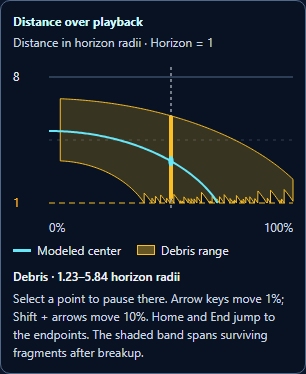

**Galaxy Black Hole Lab — distance chart and accumulated simulator improvements**

The object experiment now has a distance chart synchronized with playback. Its cyan line follows the modeled center, and its amber band spans surviving fragments after breakup. A circular orbit produces a flat line; inward capture falls toward the horizon reference at 1; outward escape rises. The center line stops at exact capture while fragments outside the horizon continue to appear in the band.

Select a point with a mouse or phone tap to pause at that moment. Keyboard users can focus the chart and move by 1% with arrow keys, by 10% with Shift + arrows, or to the endpoints with Home and End. The scene, timeline, chart cursor, and distance readout stay synchronized. Rewind reconstructs the same values, and switching to Light bending preserves the experiment.

The chart is sampled once per release from the same center and fragment trajectories used by the scene. Exact breakup and capture times are included. Captured fragments leave the range, which can cause steps along its lower boundary as the nearest surviving fragment changes. The chart uses playback percentage and horizon-radius units; it does not present the animation's compressed time as physical seconds.

This commit also includes the earlier improvements requested in this conversation:

- Adjustable placement and throws, with direct release beneath the scene, replay, steps, scrubbing, and event shortcuts.
- Independent fragment paths and a gradual transition from a stellar surface into glowing debris. Surviving fragments remain visible after center capture.
- Center-path predictions, a retained comparison trajectory, and restoring its release settings. Drag aiming adjusts the existing throw and supports cancellation.
- A follow camera that frames the object and debris on desktop and phones, restores the previous overview when disabled, and preserves zoom through view changes.
- A separate Schwarzschild light-bending view with disk visibility, a sky grid, and a frequency-shift map.
- Paused rendering that redraws when state changes, visible-fragment label placement, and scrolling fixes for tall stages.

The optical brightness slider also now announces its percentage to screen readers. The chart's time axis stays left to right in right-to-left interfaces, while its surrounding text follows the interface direction.

**Validation**

All **401 Galaxy checks passed** across 14 test files. The consolidated command passed 295 tests but timed out starting its lifecycle worker. A separate retry passed all 106 lifecycle tests with exit code 0; the combined record includes the original result and the retry. A final 80-test run passed after the chart direction adjustment.

The complete browser suite passed with no page or console errors. It checks distance-chart mouse, keyboard, and touch inspection; center capture; synchronization with surviving debris; exact rewind; view preservation; follow framing; comparison restoration; placement and aiming; playback; reduced motion; context recovery; and cleanup during a drag. Desktop, 390-pixel, and 320-pixel layouts have no horizontal overflow. The final chart browser run also passed right-to-left layouts at 1440 and 320 pixels.

The optical browser suite passed again. Its measured shadow radius was 70.5 pixels against a predicted 70.35 pixels. Both Galaxy source copies match, and the scoped whitespace check passed.

The first broad working-tree test run identified changes elsewhere in the shared catalogs: a UI-registry mirror mismatch and a literal escape in `geoq_you_said`. The commit candidate keeps the catalogs' existing committed contents and replaces only their Galaxy namespace. An isolated fixture checks that precise candidate without changing the shared working-tree catalogs. The result is recorded in [candidate Galaxy tests](./candidate-galaxy-tests.json).

Results: [validation summary](./validation-summary.json), [combined Galaxy tests](./candidate-galaxy-tests.json), [final layout tests](./final-layout-tests.json), [object browser checks](./browser-results.json), [distance checks](./distance-results.json), [final chart browser checks](./distance-browser-results.json), [follow checks](./follow-results.json), [comparison checks](./planning-results.json), and [optical checks](./optical-browser-results.json).

[Local preview](http://127.0.0.1:51574) is available while the preview process runs. Choose **Release here** to reveal the chart, then select a point or start playback.
