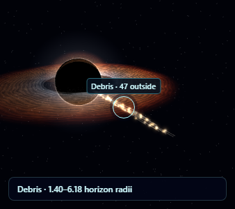
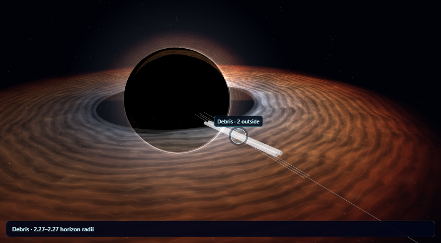

# Black Hole Lab: follow objects and debris

## Result

**Follow object** keeps the released object and its debris in view as the experiment advances. The camera fits their bounds to the narrower screen dimension, so long tidal streams remain visible on phones. Captured parcels retain their final horizon positions in the framing calculation to prevent sudden camera jumps as individual parts disappear.

Drag to look around the object, and use the wheel or + / − to zoom. Turning Follow object off restores the previous overview. Placing or aiming temporarily suspends tracking so the release plane stays usable. Switching to Light bending and back preserves the experiment and follow zoom. Rewinding reproduces the same camera target and position.

## Visual and rendering fixes

- The debris label falls back to a visible surviving fragment when the debris center is hidden behind the hole or outside the label area. Labels use the current camera matrices, avoiding a one-frame offset during camera movement.
- Surviving fragments stay inspectable after the modeled center reaches the horizon. The label disappears once all fragments are captured.
- An unchanged paused object scene skips rendering. Playback, camera movement, appearance changes, comparisons, resizing, and context recovery still refresh the image.
- The inspection camera stays outside the schematic horizon when rotated toward the hole.

## Verification

- **46 focused tests passed:** 28 object-dynamics and camera tests, 12 optics tests, and 6 Galaxy mode checks. The camera tests project elongated bounds through the bundled Three.js camera at several angles and screen shapes.
- The full Chromium/WebGL object suite passed with no page or console errors. It exercises placement, aiming, capture, orbit, escape, breakup, playback, rewind, touch input, reduced motion, context recovery, and cleanup during a drag.
- Follow checks passed at 1440, 390, and 320 pixels: surviving centers remain framed, rewind restores exact framing, and pages have no horizontal overflow. Checks also cover overview restoration, optical switching, follow zoom, and paused rendering.
- The planning suite passed again, including retained paths, restoring release settings, anchored aiming, and release controls on phones.
- The optical browser suite passed with no page or console errors, including state preservation and context recovery. Its measured shadow radius was 70.5 pixels against a predicted 70.35 pixels.
- Both Galaxy source copies match. All three English catalogs parse and contain the new follow labels. The scoped whitespace check passed.

The browser helper now waits for React effects after clicking controls before inspecting experiment state. The setting-reset assertion remains in place and passes.

Results: [validation summary](./validation-summary.json), [focused tests](./vitest-results.json), [object browser checks](./browser-results.json), [follow checks](./follow-results.json), [planning checks](./planning-results.json), and [optical browser checks](./optical-browser-results.json).

## Scope and preview

Follow object is an inspection aid in the geometric object view. This pass leaves the motion equations unchanged and does not add observer light-delay physics. Manual zoom can intentionally crop the automatic framing.

[Local preview](http://127.0.0.1:58914) is available while the preview process is running. Select **Follow object**, then release and play or step the experiment.

No commit was created.
